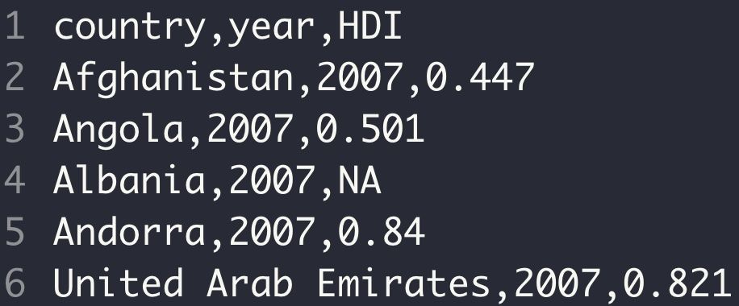

--- 
title: "R Programming: Zero to Pro"
author: "[Yang Feng](https://yangfengstat.github.io/)"
date: "`r Sys.Date()`"
site: bookdown::bookdown_site
output: bookdown::gitbook
documentclass: book
bibliography: [book.bib, packages.bib]
biblio-style: apalike
link-citations: yes
colorlinks: yes
description: "R Programming: Zero to Pro"
always_allow_html: true
---
```{r, include=FALSE}
knitr::opts_chunk$set(
  comment = "#>", echo = TRUE, eval = TRUE, results = FALSE, error = TRUE, fig.width = 6, warning = FALSE, collapse = TRUE, tidy =TRUE
)
```

# Preface {-}

```{r sheep, echo=FALSE, results = TRUE, fig.cap="", out.width = '25%'}
knitr::include_graphics("pics/sheep.jpg")
```


This book is for anyone who is interested in learning R and Data Science. It is designed for people with zero background in programming. 

We also have a companion R package named [**r02pro**](https://cran.rstudio.com/web/packages/r02pro/index.html), containing the data sets that are used throughout the book. 


# Contributing to the Book  {-}

To improve the book, we would like to ask for your help. With your permission, we will be happy to add your name in the Acknowledgment section to show our gratitude. 

### Typos or Grammar Issues {-}

If you find any typos or grammar issues, please feel free to directly click the 'edit' button. This allows you to fork the repository to your GitHub account, make the necessary changes, and then submit a pull request.

### General Questions or Feedback  {-}

If you have more general questions or feedback about any materials in the book, we greatly appreciate if you can write to us at yang.feng@nyu.edu. 


# Acknowledgement {-}


```{r, results = "asis", echo = FALSE, message = FALSE}
library(dplyr)
contributors <- readr::read_csv("contributors.csv", col_types = list())

contributors <- contributors %>% 
  mutate(
    link = glue::glue("[\\@{login}](https://github.com/{login})"),
    desc = ifelse(is.na(login), name, ifelse(is.na(name), link, glue::glue("{name} ({link})")))
  )

cat("This book represents the culmination of numerous collaborative efforts and the synthesis of diverse perspectives. We extend our heartfelt gratitude to Dr. Rebecca Betensky, Dr. Rumi Chunara, Dr. Hai Shu, and Ms. Jianan Zhu for their invaluable contributions. Their visionary guidance was pivotal in the conceptualization and development of the courses GPH-GU 2183: Introduction to Statistical Programming in R and GPH-GU 2184: Intermediate Statistical Programming in R. Notably, Ms. Jianan Zhu played a significant role in shaping an earlier version of this book. 

We are also deeply grateful to the dedicated students of GPH-GU 2183: Introduction to Statistical Programming in R, GPH-GU 2184: Intermediate Statistical Programming in R, and GPH-GU 2182: Statistical Programming in R at New York University. Their enthusiasm and commitment have greatly enriched the learning experience and inspired many of the ideas presented in this text.

The roster of contributors to this book is extensive, and each individual's unique perspective and expertise has helped shape its content in meaningful ways. This text truly stands as a testament to the power of collaboration and the spirit of learning. The list of people who made contributions include ")
cat(paste0(contributors$desc, collapse = ", "))
```

# Building Environment {-}

The R session information when compiling this book is shown below.
```{r, results=TRUE}
sessionInfo()
```


In the book, package names are in **bold** text (e.g., **r02pro**), and inline codes and functions are formatted in a typewriter font (e.g. `1 + 2`, `r02pro()`). We always add parentheses after a function name (e.g. `r02pro()`).

<!--chapter:end:index.Rmd-->

# Introduction {#introduction}

This chapter begins with the installation of R, RStudio, and R Packages in Section \@ref(Installation), shows how to use R as a fancy calculator in Section \@ref(Calculator), followed by object assignments in Section \@ref(Object-Assignment). 

<!--chapter:end:01.00_Introduction.Rmd-->

## Installation of R, RStudio and R Packages  {#Installation} 

### Download and Install

As the first step, you need to download R and RStudio, whose links are as follows. For both software, you need to choose the version that corresponds to your operating system.

Download R: <https://cloud.r-project.org/>

Download RStudio: <https://rstudio.com/products/rstudio/download/#download>

<!-- ::: {.infobox .caution data-latex="{caution}"} -->
<!-- For a step-by-step demonstration, you can refer to the YouTube video via the following **link**. -->
<!-- ::: -->

RStudio is an *Integrated Development Environment* for R, which is powerful yet easy to use. Throughout this book, you will use RStudio instead of R to learn R programming. Without further ado, let's start with a quick tour of RStudio.

### RStudio Interface {#rstudio-interface}

After opening RStudio for the first time, you may find that the font and button size is a bit small. Let's see how to customize the appearance.

***a. Customize appearance***

On the RStudio menu bar, you can click *Tools*, and then click on *Global Options* as shown below.

```{r font, results = TRUE, echo=FALSE, fig.align = 'center', fig.cap="Global Options", out.width = '90%'}
knitr::include_graphics("pics/1font.PNG")
```

Then, you will see a window popping up like Figure \@ref(fig:size). After clicking on *Appearance*, you can see several drop-down menus including *Zoom* and *Editor font size* among other choices shown.

- *Zoom* controls the overall scale for all elements in the RStudio interface, including the sizes of the menu, buttons, as well as fonts.

- *Editor font size* controls the size of the font only in the code editor.

Once finishing customizing the appearance, you need to click on *Apply* to save the adjustments.

```{r size, results=TRUE, echo=FALSE, fig.align = 'center', fig.cap="Zoom and Editor font size", out.width = '70%'}
knitr::include_graphics("pics/1size.PNG")
```

Here, we change the *Zoom* to 150% and set the *Editor font size* to 18.

***b.  Four panels of RStudio***

Although RStudio has four panels, some may be hidden initially (Figure \@ref(fig:open)).

```{r open, results=TRUE, echo=FALSE, fig.align = 'center', fig.cap="Unfold panels", out.width = '100%'}
knitr::include_graphics("pics/1open.PNG")
```

In Figure \@ref(fig:open), we have labeled three useful buttons as 1, 2, and 3. By clicking buttons 1 and 3, you can reveal the two hidden panels.

::: {.infobox .caution data-latex="{caution}"}
Note that you may see different panels hidden when you open RStudio for the first time, depending on the RStudio version. However, you can always reveal the hidden panels by clicking the corresponding buttons like Buttons 1 and 3 in Figure \@ref(fig:open).
::: 

By clicking button 2, we can clear the content in the bottom left panel (Panel 2 in Figure \@ref(fig:four)) as shown in the following figure. 

```{r four, results=TRUE, echo=FALSE, fig.align = 'center', fig.cap="Four panels", out.width = '100%'}
knitr::include_graphics("pics/1four.PNG")
```

Now, let's take a close look at all four panels, which are labeled as 1-4 in Figure \@ref(fig:four). You can change the size of each panel by dragging the two blue slides *up* or *down* and the green slide *left* or *right*.

-   Located to the left of the green line, Panels 1 and 2 together compose the **Code Area**. We will introduce them in the following parts of this section.

-   Located to the right of the green line, Panels 3 and 4 together make up the **R Support Area**. We will introduce these two panels in later sections. 

***c.  Console***

Firstly, we will introduce panel 2 in Figure \@ref(fig:four), which is usually called the **Console**. The console window is the place for you to type in codes (i.e. the things you want R to do) and you will get the results immediately once you run the codes.

By clicking the mouse on the line after the `>` symbol, you can see a blinking cursor, indicating that R is ready to accept codes. Let's type `1 + 2` and press *Return* (on Mac) or *Enter* (on Windows).

::: {.infobox .caution data-latex="{caution}"}
It is a good habit to add spaces around an operator to increase the readability of the code.
:::

```{r code, results=TRUE, echo=FALSE, fig.align = 'center', fig.cap="Writing code in the console", out.width = '70%'}
knitr::include_graphics("pics/1code.PNG")
```


```{r answer, results=TRUE, echo=FALSE, fig.align = 'center', fig.cap="R code(2)", out.width = '70%'}
knitr::include_graphics("pics/1answer.PNG")
```

Hooray! You have successfully run the first piece of R code and gotten the correct answer 3. Note that the blinking cursor now appears on the next line, ready to accept a new line of code.

::: {.infobox .caution data-latex="{caution}"}
The curious you may found that there is a `[1]` showing before the result `3`.  In fact, the `[1]` is an index indicator, showing the next element has an index of 1 in this particular object. We will revisit this point when we introduce vectors in  Chapter \@ref(r-objects) . 
:::


Although the console may work well for some quick calculations, you need to resort to panel 1 in Figure \@ref(fig:four) (known as the **Editor**) to save our work and run multiple lines of code at once.

***d. Editor***

The **Editor** panel is the go-to place to write complicated R codes, which you can save as R files for repeated use in the future. Several kinds of files are available in RStudio. In particular, **R script** and **R Markdown**  are the two most common file formats. We will start with R script since it is the simplest format. In Chapter \@ref(r-markdown), we will introduce R Markdown in detail.

In the editor panel, you may notice that RStudio has created a file by default (Figure \@ref(fig:P1)). The default file RStudio provided is **R script**.
 
```{r P1, results=TRUE, echo=FALSE, fig.align = 'center', fig.cap="R script", out.width = '70%'}
knitr::include_graphics("pics/1P1.png")
```


Next, we will introduce how to run codes in scripts. Let's go to the editor and type `1 + 2`. To run this line of code, you can select this line of code and click the *Run* button. The keyboard shortcut of running this line of code is Cmd+Return on Mac or Ctrl+Enter on Windows. RStudio will then send the line of code to the console and execute the code. 

```{r run, results=TRUE, echo=FALSE, fig.align = 'center', fig.cap="Run codes in script (I)", out.width = '70%'}
knitr::include_graphics("pics/1run.PNG")
```

You can also run multiple lines of code by selecting the corresponding lines and clicking the *Run* button or using the keyboard shortcut. (Figure \@ref(fig:mcodes))

```{r mcodes, results=TRUE, echo=FALSE, fig.align = 'center', fig.cap="Run codes in script (II)", out.width = '70%'}
knitr::include_graphics("pics/1mcodes.png")
```

Here, three lines of codes are selected. After running these three lines of code together, you can see that the console executes all three lines of code and you will get the corresponding outputs one by one. 

To save your work for later use, you can click the *Save* button as shown in Figure \@ref(fig:save1). The keyboard shortcut of saving files is Cmd+S on Mac or Ctrl+S on Windows.

```{r save1, results=TRUE, echo=FALSE, fig.align = 'center', fig.cap="Save (I)", out.width = '70%'}
knitr::include_graphics("pics/1save1.PNG")
```

Then you would see a pop-up file dialog box, asking you for a file name and location to save it to. Let's call it `lesson1.1` here.

```{r save2, results=TRUE, echo=FALSE, fig.align = 'center', fig.cap="Save (II)", out.width = '70%'}
knitr::include_graphics("pics/1save2.PNG")
```

After saving the file successfully, you can confirm the name of the R script on the top.

```{r save3, results=TRUE, echo=FALSE, fig.align = 'center', fig.cap="Save (III)", out.width = '70%'}
knitr::include_graphics("pics/1save3.PNG")
```

Now, when you close this script and open it again, you would directly see the previous three lines of codes.

Lastly, if you want to create a new R script, you can click the `+` button on the menu, then select *R Script*. Note that there are quite a few other options including *R Markdown*, which will be introduced in Chapter \@ref(r-markdown). 

```{r new, results=TRUE, echo=FALSE, fig.align = 'center', fig.cap="create a new script (I)", out.width = '70%'}
knitr::include_graphics("pics/1new.PNG")
```

Consequently, you will see a new file created. 

```{r new2, results=TRUE, echo=FALSE, fig.align = 'center', fig.cap="create a new script (II)", out.width = '70%'}
knitr::include_graphics("pics/1new2.PNG")
```


### Install and load R packages

Now, you have had a basic understanding of RStudio, it is time to meet **R packages**, which greatly extend the capabilities of base R. There are a large number of publicly available R packages. As of July 2021, there are more than 17K R packages on Comprehensive R Archive Network (CRAN), with many others located in Bioconductor, GitHub, and other repositories.  

To install an R package, you need to use a built-in R **function**, which is  `install.packages()`. A **function** takes in **arguments** (inputs) and performs a specific task accordingly. After the function name, we always need to put **a pair of parentheses** with the arguments inside. 

While there are many built-in R functions, R packages usually contain many useful functions as well, and we can also write our own functions, which will be introduced in Chapter \@ref(functions).  

With `install.packages()`, the argument is the package name with **a pair of quotation marks** around it. The task it performs is installing the specific package into R.  Here, you will install the companion package for this book, named `r02pro`, a.k.a. *R Zero to Pro*. The `r02pro` package contains several data sets that will be used throughout the book.

```{r, eval=FALSE}
install.packages("r02pro")
```

::: {.infobox .caution data-latex="{caution}"}
If you miss the right parenthesis, R will return a plus in the next line (as shown in Figure \@ref(fig:right1)), waiting for more input to complete the command. If this happens, you can either enter the right parenthesis, or press ESC to escape this command. When you see a blinking cursor after the `>` symbol, you can write new codes again.
:::

```{r right1, results=TRUE, echo=FALSE, fig.align = 'center', fig.cap="Miss the right parenthesis", out.width = '70%'}
knitr::include_graphics("pics/1right.PNG")
```

After a package is installed, you still need to load it into R before using it. To load a package, you can use the `library()` function with the package name as its argument. Here, quotation marks are not necessary.

```{r}
library(r02pro)
```

Note that once a package is installed, you **don't need to** install it again on the same machine. However, when starting a new R session, you would need to load the package again.

::: {.infobox .caution data-latex="{caution}"}
Quotation marks are necessary for installing R packages, but are not necessary for loading packages. When installing packages without quotation marks, you will see an error message, showing *object not found*.
```{r, eval=FALSE}
install.packages(r02pro)
```

:::


### Exercises

1. Which of the following code used to install packages into R will return an error?

- `install.packages("r02pro")`
- `install.packages(r02pro)`

2. Write R code to load the package **r02pro**

3. Write R code to calculate `2 + 3`.


<!--chapter:end:01.01_Installation.Rmd-->

## Use R as a Fancy Calculator {#Calculator}

After learning how to run codes in R, we will introduce how to use R as a fancy calculator.

### Add comments using "#"

Before we get started, the first item we will cover is adding comments for codes. In R, you can use the hash character `#` at any position of a given line to initiate a comment, and anything after `#` will be ignored by R. Let's see an example,

```{r results = TRUE}
6 - 1 / 2 # first calculate 1/2=0.5, then 6-0.5=5.5
```

By running this line of code (either in the console or in the editor), you will get a value of 5.5, which is the answer of `6 - 1 / 2`. As demonstrated, R will not run syntax after the hash character `#`. Comments after the `#` are typically added to make codes easier to understand. 

In general, adding comments to codes is a very good practice, as it greatly increases readability and make collaboration easier. We will also add necessary comments in our codes to help you learn R.

### Basic calculation

Now let's start to use R as a calculator. In the previous section, we introduced operations such as addition, subtraction, multiplication, division, as well as the combination of multiple basic operations. Additionally, you can also calculate the square root, absolute value and the sign of a number.

```{r results = TRUE, echo=FALSE}
Operation  <- c("1 + 2", "1 - 2", "2 * 4", "2 / 4", "6 - 1 / 2", "sqrt(100)", "abs(-3)", "sign(-3)")
Explanation <- c("addition", "subtraction", "multiplication", "division", "multiple operations", "square root", "absolute value", "sign")
d <- data.frame(Operation, Explanation)
knitr::kable(d)
```

### Get help in R {#get-help}

While the first seven operations in the above table look intuitive, you may be wondering, what does the `sign()` function mean there? Is that a stop sign?       


```{r stop, results=TRUE, echo=FALSE, fig.align = 'center', out.width = '16%'}
knitr::include_graphics("pics/1stop.jpg")
```


Sometimes, you may have no idea how a particular function works. Fortunately, R provides a detailed documentation for each function.

***a. Ask for help***

First, we will introduce how to ask for help in R, and below are three common ways to seek for more information.

- Use a question mark followed by the function name, e.g. `?sign`  
- Use help function, e.g. `help(sign)`
- Use the help window in RStudio, as shown in Figure \@ref(fig:help). The help window is the panel 4 of Figure \@ref(fig:four) in Section \@ref(Installation). You can type  the function name in the box to the right of the magnifying glass and press Return/Enter.

```{r help, results=TRUE, echo=FALSE, fig.align = 'center', fig.cap="Ask for help", out.width = '70%'}
knitr::include_graphics("pics/1help.PNG")
```

***b. Documentation for functions***

After asking for help in R, you will get the documentation of the function in the help window. The documentation consists of different parts, let's take the `sign()` function as an example (Figure \@ref(fig:d)),

```{r d, results=TRUE, echo=FALSE, fig.align = 'center', fig.cap="Documentation for function", out.width = '70%'}
knitr::include_graphics("pics/1d.PNG")
```

This documentation contains the following parts:

- *Description*: A text-format introduction of the function. The introduction describes the function's mechanism, the acceptable input and output types, and some notes of the function.
- *Usage*: The way the function looks like.
- *Arguments*: A detailed description of the input.
- *Details*: A detailed description of the function, including the background, some complicated usage, and special cases of the function.
- *See Also*: Some functions related or similar to the function.
- *Examples*: Sample codes and their corresponding answers. You can simply copy codes in the *Examples* part and run them in the editor or in the console. Note that all words after `#` are comments and will be ignored by R.

Here, from the documentation of the `sign()` function, you will know that the `sign()` function returns the signs of numbers, which means it will return 0 for zero, return 1 for positive numbers, and return -1 for negative numbers.

### Approximation

Next, let's move on to the approximation in R. When computing `7 / 3`, the answer is not a whole number as 7 is not divisible by 3. Approximation will come in handy under such circumstances. Let's take `7 / 3` as the example.

***a. Get the integer part and the remainder***

```{r results = TRUE, echo=FALSE}
Code  <- c("7%/%3","7%%3")
Pattern <- c("percent,divide,percent", "percent,percent")
Name <- c("integer division", "modulus")
d <- data.frame(Code, Name)
knitr::kable(d)
```

We all know that 7 = 3 * **2** + **1**. So the *integer division* will pick up the integer part, which is 2 here; and the *modulus* will get the remainder, which is 1.


***b. Get the nearby integer***
```{r results = TRUE}
floor(7 / 3)   
ceiling(7 / 3) 
```

Since **2** <= 7/3 <= **3**, you can use the `floor` function to find the *largest integer* <= 7/3, which is 2; and the `ceiling` function gives the *smallest integer* >= 7/3, which is 3.


***c. Round to the nearest number***
```{r results = TRUE}
round(7 / 3)   
round(7 / 3, digits = 3)
```

The `round()` function follows the **rounding principle**. By default, you will get the nearest integer to `7 / 3`, which is `2`. If you want to control the approximation accuracy, you can add a `digits` argument to specify how many digits you want after the decimal point. For example, you will get `2.333` after setting `digits = 3`.

### Power & logarithm

You can also use R to do *power* and *logarithmic* operations.  

Generally, you can use `^` to do power operations. For example, `10^5` will give us 10 to the power of 5. Here, 10 is the *base* value, and 5 is the *exponent*. The result is 100000, but it is shown as `1e+05` in R. That's because R uses the so-called *scientific notation*.

::: {.infobox .caution data-latex="{caution}"}
**scientific notation**: a common way to express numbers which are too large or too small to be conveniently written in decimal form.  Generally, it expresses numbers in forms of $m \times 10^n$ and R uses the **e notation**. Note that the **e notation** has nothing to do with the natural number $e$. Let's see some examples, 
\begin{align}
1 \times 10^5 &= \mbox{1e+05}\\
2 \times 10^4 &= \mbox{2e+04}\\
1.2 \times 10^{-3} &= \mbox{1.2e-03}
\end{align}

Another thing to note is that we don't use commas when writing a big number in R as we do in reports and essays. For example, we need to write 1000000 for a million instead of 1,000,000.
:::

In mathematics, the *logarithmic operations* are inverse to the power operations. If **$b^y = x$** and you only know *$b$* and *$x$*, you can do logarithmic operations to solve *$y$* using the general form **$y = \log(x, b)$**, which is called the logarithm of $x$ with base $b$. 

In R, logarithm functions with base value of 10, 2, or the mathematical constant $e$ have shortcuts `log10()`, `log2()`, and `log()`, respectively. Let's see an example of `log10()`, the logarithm function with base *10*. Here, we have added a comment to help you have a better understanding of `log10()`.

```{r results = TRUE}
10^6 
log10(1e6) #log10(x) = log(x, 10)
```

Next, let's see `log2()`, the logarithm function with base *2*. 

```{r results = TRUE}
2^10
log2(1024)  #log2(x) = log(x, 2)
```

Before moving on to the natural logarithm, note that the mathematical constant $e$ needs to be written as `exp(1)` in R. When you want to do power operations on $e$, you can simply set the exponent as the argument in the function `exp()`. For example, `exp(3)` is $e$ to the power of 3.  Here, `log()` without specifying the `base` argument represents the logarithm function with base $e$. You can see the general form of `log()` in the comment.

```{r results = TRUE}
exp(1)      
exp(3)
log(exp(3))  #log(x) = log(x, exp(1))
```

### Trigonometric function

R also provides the common trigonometric functions. 

```{r results = TRUE}
cos(pi)
acos(-1)
```

Here, `acos()` is the inverse function of `cos()`. If we set $cos(a) = b$, then we will get $acos(b) = a$.

```{r results = TRUE}
sin(pi/2)
asin(1)
```

Similarly, `asin()` is the inverse function of `sin()`. If we set $sin(a) = b$, then we will get $asin(b) = a$.

```{r results = TRUE}
tan(pi/4)
atan(1)
```

Also, `atan()` is the inverse function of `tan()`. If we set $tan(a) = b$, then we will get $atan(b) = a$.

### Exercises

1. Write R code to compute $\sqrt{5 \times 5}$.


2. Write R code to get help on the function `floor`.


3. Write R code to compute the square of $\pi$ and round it to 4 digits after the decimal point. 


4. Write R code to compute the logarithm of 1 billion with base 1000. 


5. Write R code to verify $sin^2(x) + cos^2(x) = 1$, for $x = 724$. 


<!--chapter:end:01.02_Fancy_Calculator.Rmd-->

## Object Assignment {#Object-Assignment}

```{r, echo=FALSE}
rm(list=ls())
```

```{r, include=FALSE}
knitr::opts_chunk$set(
  comment = "#>", echo = TRUE, eval = TRUE, results = FALSE, error = TRUE, fig.width = 6, warning = FALSE, collapse = TRUE)
```

In the last section, you have seen the power of R as a fancy calculator. However, in order to do more complicated and interesting tasks, it is often helpful to store intermediate results for future use.

Let's take a look at a concrete example. Say if you want to do the following three calculations, all involving `exp(3) / log(20,3) * 7`.

```{r}
(exp(3) / log(20, 3) * 7) + 3 #addition
(exp(3) / log(20, 3) * 7) - 3 #subtraction
(exp(3) / log(20, 3) * 7) / 3 #division
```

Here, you need to type the same expression `exp(3) / log(20,3) * 7` three times, which is a bit cumbersome. In this section, you will learn how to do **object assignment**, which avoid redundancy and make your code more concise.

### What is an R Object?

Before delving into the details, let's first introduce the concept of **object**, which is perhaps the most fundamental thing in R. In principle, **everything that exists in R is an object**. For example, the number `5` is an object, the expression `1 + 2` is an object, and the expression `exp(3) / log(20,3) * 7` is also an object.

If you run `5`, you will get one element of value 5 from the output. Similarly, if you run `1 + 2`, you will get one element of value 3 from the output. You can try to run `exp(3) / log(20,3) * 7` by yourself. In these three examples, you can see that there is only one **element** in each object.

However, an object can contain more than one elements, and each element has its own **value**, which is possibly different from that of another element. Naturally, different objects can contain different values. In the following sections, you will learn how to create objects and assign values to them.

### Assignment Operation with `<-` {#assignment}

With the importance of objects in mind, let's learn how to do **object assignments** in R. To do object assignments, you need to assign **value(s)** to a **name** via the **assignment operator**, which will create a new object with the name you specified. Once the object assignment operation is done, you can simply use the name in subsequent calculations without redundancy. Let's start with a simple example, assigning the value 5 to the name `x_num`.

```{r results = TRUE}
x_num <- 5
```

The assignment operation has three components. From left to right，they are:

-   the first component `x_num` is the **object name** of a new object, which has certain naming rules that will be discussed shortly in Section \@ref(Naming).
-   The second component is the **assignment operator** `<-`, which is a combination of the less than sign `<` immediately followed by the minus sign `-`, with **no space** in between.
-   The final component is the object name's assigned **value(s)**, which is 5 here.

::: {.infobox .caution data-latex="{caution}"}
There is no space between `<` and `-` in the assignment operator `<-`. Note that although `=` may also appear to be working as the assignment operator, it is not recommended as `=` is usually reserved for specifying the value(s) of arguments in a function call, which will be introduced in Section \@ref(intro-num-vector).
:::

After running the code above, you will see no output in the console, unlike the situation when we ran `1 + 2` which gives us the answer `3` (as shown in Figure \@ref(fig:noa)). You may be wondering, did we successfully make our first assignment operation?

```{r noa, results=TRUE, echo=FALSE, fig.align = 'center', fig.cap="No output", out.width = '70%'}
knitr::include_graphics("pics/2noa.PNG")
```

To verify it, you can run the code with just the object name to check its value. (For all named objects, you can get their value(s) by running codes with just their names.)

```{r results = TRUE}
x_num
```

Great! The output is 5, indicating that you have successfully assigned the value 5 to the name x_num, and you have created a new object `x_num`. From now on, you can use `x_num` instead of `5` to do the subsequent calculations because `x_num` and `5` have the same value.

Note that R object names are **case-sensitive**. For example, you have defined `x_num`, but if you type `X_num`, the console will return an error message as follow.

```{r, error = TRUE}
X_num
```

In addition, you can assign **value(s)** of an expression to a name. Let's try to simplify the three expressions we showed at the beginning of this section. It is easy to observe that the three expressions share a common term `exp(3) / log(20,3) * 7`. Let's assign the common term to a name.

```{r results = TRUE}
y_num <- exp(3) / log(20,3) * 7
y_num
```

Now you have successfully created an object `y_num` with value `r y_num`. Using the named object `y_num`, you can simplify the three calculations as follows.

```{r, eval=FALSE}
y_num + 3
y_num - 3
y_num / 3
```

::: {.infobox .caution data-latex="{caution}"}
Note that in the object assignment process, it is not the expression itself but rather the value(s) of the expression, that is assigned to a name. So you will not get the expression `exp(3) / log(20,3) * 7` by running `y_num`.
:::

You can also try the following examples by yourself.

```{r, eval=FALSE}
z_num1 <- floor(7 / 3) 
z_num1
z_num2 <- 7%/%3
z_num2
```

Clearly, using the object assignment, you can greatly simplify the code and avoid redundancy.

### Object naming rule {#Naming}

As you now see, the assignment operation in R is very straightforward. In general, R is very flexible in the name you can give to an object. However, there are three important rules you need to follow.

***a. Must start with a letter or . (period)***

In addition, if starting with period, the second character can't be a number.

***b. Can only contain letters, numbers, `_` (underscore), and `.` (period)***

One recommended naming style is to use lowercase letters and numbers, and use underscore to separate words within a name. So you can use relatively longer names that is more readable. For example, `this_is_name_6` and `super_rich_88` are great names.

***c. Can not use special keywords as names.***

For example, `TRUE <- 12` is not permitted as `TRUE` is a special keyword in R. You can see from the following that this assignment operation leads to an error message.

```{r error=TRUE}
TRUE <- 12
```

Some commonly used reserved keywords that cannot be used as names are listed as below.

```{r results = TRUE, echo=FALSE, warning=FALSE}
Keys  <- c("TRUE", "FALSE", "NA", "Inf", "NaN", "function", "if", "else", "for", "while", "break", "next", "repeat", "return")
key_mat <- matrix(Keys, 7, 2)
knitr::kable(key_mat)
```

To get a complete list of reserved words, you can run the following code.

```{r, eval = FALSE}
?Reserved
```

### Review objects in environment

At this point, we've introduced the rules of creating objects in R. Now, you can also confirm the success of object assignments by inspecting the **Environment**, located in the top right panel (**panel3 in Figure** \@ref(fig:four) **in Section** \@ref(Installation)).

If you exercised previous examples, you can find the newly assigned objects `x_num` and `y_num` (possibly also `z_num1` and `z_num2`) in your *Environment* Viewer. You may also notice that the name `TRUE`, which we tried but failed to assign the value 12 to, doesn't appear in the *Environment* (as shown in Figure \@ref(fig:en)). You can check all the **named objects** and their values in this area.

```{r en, results=TRUE, echo=FALSE, fig.align = 'center', fig.cap="The environment (I)", out.width = '70%'}
knitr::include_graphics("pics/1en.PNG")
```

From the picture above, you can see that the value of `x_num` is 5. In this case, let's try to assign the new value 6 to `x_num` and see what will happen next.

```{r results = TRUE}
x_num <- 6
x_num  #check its value
```

Now you can see that the value of `x_num` has changed from 5 to 6. Generally, when assigning a new value to an object, R will update the object's value, and the previous value will no longer be stored. You can verify the result by inspecting the Environment tab, where only the new value of the object will be displayed.

```{r en2, results=TRUE, echo=FALSE, fig.align = 'center', fig.cap="The environment (II)", out.width = '70%'}
knitr::include_graphics("pics/1en2.PNG")
```

So it is helpful to monitor the environment from time to time to make sure everything looks fine. Notice that objects without names will *not* be shown in the environment.

You can also see the list of all the named objects (just names without values) using the built-in R function `ls()`.

```{r, results = TRUE}
ls()
```

All the objects shown in the environment or on the list are stored in the memory, so they are available for us in subsequent codes. It is a good habit to do object assignments if you want to retrieve their values at a later time.

### Object types

So far in this section, you have learned how to do object assignments. The values you assigned are all numbers, i.e. of numeric type. Actually, an object may contain more than one values. Also, an object may contain values other than the numeric type, such like character and logical ones. Depending on the **composition of values**, the object belongs to one particular type.

```{r echo = FALSE, results = TRUE}
Type  <- c("Atomic Vector","Matrix","Array","Data Frame", "Tibble", "List")
Section <- c("\\@ref(r-objects)","\\@ref(matrix)","\\@ref(array)","\\@ref(dataframe)","\\@ref(tibble)","\\@ref(list)")
d <- data.frame(Type, Section)
knitr::kable(d)
```

We will focus on atomic vectors in Chapter \@ref(r-objects) and discuss other object types in Chapter \@ref(object-other-type).

While some of the object types look more intuitive than others, you have nothing to worry about since we have the next two chapters devoted to the details of R objects. Objects are the building blocks of R programming and it will be time well spent mastering every object type.

### Exercises

1.  Write the R code to assign the value 20 to the name `num_1`.

2.  Which of the following is a valid object name in R?

-   `2.True`
-   `else`
-   `I_am_not_a_valid_name`
-   `I_am_a_Pretty#_name`

3.  Write the R code to get the list of all objects in the environment.

<!--chapter:end:01.03_Object_Assignment.Rmd-->

# R Objects (I): Atomic Vectors {#r-objects}

In this chapter, we focus on the most fundamental R object type: **atomic vectors**. We will introduce different types of atomic vectors, creating vectors with patterns, applying different functions and operations on vectors, comparing and extracting vectors. We will also discuss data and times, factors, and how R represents unexpected results. 


<!--chapter:end:02.00_R_Objects_Vectors.Rmd-->

## Introduction to Numeric Vectors {#intro-num-vector} 

We will start off this chapter by learning **numeric vectors**. Numeric vectors are perhaps the most commonly used member of the **atomic vector** family, where all elements are of the same type. 

### Creation and class{#create-numeric-vector} 

```{r, include = FALSE, echo=FALSE}
rm(list=ls())
```


A **numeric vector** is an atomic vector containing only numbers. For example, `6` is a numeric vector with one element of value 6. 
 
 
By assigning the value 6 to the name x1, you can create a new numeric vector `x1` with value 6. As a result, you can refer to `x1` in subsequent calculations. For any vector, you can use the `length()` function to check the number of elements it contains. 
 
```{r, results = TRUE}
6                         #a numeric vector
x1 <- 6                   #x1 is also a numeric vector
x1                        #check the value of x1
length(6)                 #length of 6
length(x1)                #length of x1
```

Given the output, you can see that `6` is a numeric vector with length 1 and you have successfully created the numeric vector `x1` of length 1.

Moving on, you may wonder, can a numeric vector contain more than one value? The answer is a big YES! In R, you can use the `c()` function (`c` is short for combine) to store several elements into one single numeric vector. 

```{r, results = TRUE}
c(1, 3, 3, 5, 5)          #use c() to combine elements into a numeric vector of length 5
y1 <- c(1, 3, 3, 5, 5)    #y1 is a numeric vector of length 5
y1                        #check the value of y1
length(y1)                #length of y1
```

In this example, firstly you have created a length-5 object using the `c()` function with arguments being the five elements separated by **comma**. Since all elements are numbers, this object is still a numeric vector. Then after assigning the values to the name y1, you will get a new numeric vector `y1` with 5 elements. Among the five elements, although some of them have the same value, R still recognizes and stores them separately. This is the reason why the length of  `y1` is 5 instead of 3.

Similar to `x1`, you can verify the contents of `y1` and check the length of it via the `length()` function. 

::: {.infobox .caution data-latex="{caution}"}

When you assign several values to a name, the order of the values will not change after assignment. If you create two numeric vectors containing the same numbers but in different orders, the two vectors will be two different ones maintaining the specified orders. For example,

```{r, results = TRUE}
y2 <- c(1, 3, 5, 7, 9)    
y2                        
y3 <- c(9, 7, 5, 3, 1)    
y3
```

::: 

In addition to using numbers inside the `c()` function, you can also use numeric vectors as the arguments to create a longer vector. The new, longer vector will combine the input numeric vectors in the given order. 

```{r, results = TRUE}
c(x1, y1)          #use c() to combine several numeric vectors into one numeric vector
z1 <- c(x1, y1)
z1
length(z1)
```

Since `x1` contains 1 numeric value and `y1` contains 5 numeric values, `z1` is a numeric vector of length 6 after combination.

For any vector, you can use the function `class()` to check its **class**. A class can be thought of as a "type," providing a description about the vector and determining what functions can be applied to it. 

```{r, results = TRUE, collapse = TRUE}
class(x1)
class(y1)
class(z1)
```

From the results, you can see that `x1`, `y1`, and `z1` are all numeric, which is the reason why they are called *numeric vectors*. 

As introduced in Section \@ref(Object-Assignment), you can check the named objects via the environment panel as shown in Figure \@ref(fig:en11). 

```{r en11, results=TRUE, echo=FALSE, fig.align = 'center', fig.cap="The environment (I)", out.width = '70%'}
knitr::include_graphics("pics/2en1.PNG")
```

We can see that the environment panel has two columns, with the first column showing the list of object names and the second column showing the corresponding information for each object. The information includes the vector type (here *num* is short for numeric), the vector length, and the value(s) of the vector. Note that if the vector is of length 1 (for example `x1`), the environment will not show the type or the length.

In the last section, we have introduced how to change the value of an object by reassigning it. Similarly, you can also assign a new value, or new values, to `x1`. Notice that the values you are going to assign can have different length with the previous values. Let's see an example,

```{r, results = TRUE}
z1 <- c(6, 1, 3)
z1   #check the value of z1
```

Now, you can see that `z1` contains 3 numeric values, so `z1` is a numeric vector of length 3.

As expected, you can also view the newly assigned values of `z1` in the environment panel, as shown in Figure \@ref(fig:en12).

```{r en12, results=TRUE, echo=FALSE, fig.align = 'center', fig.cap="The environment (II)", out.width = '70%'}
knitr::include_graphics("pics/2en2.PNG")
```

Finally, you can use the `vector(mode, length)` function to create a vector of certain `mode` and `length`. 
```{r}
vector("numeric", 4)
```


### Operations and recycling rule {#operation-recycling}

Since numeric vectors are purely made of numbers, you can do **arithmetic operations** between them, just like the fancy calculator in Section \@ref(Calculator). If two or more vectors are of the **same length**, the operation is done **element-wisely**. In other words, R will perform the operation between elements in the same index of different vectors. First, let's create another vector `x2` of length 1 and compute the sum of `x1` and `x2`. Also recall that we've previously created a length-1 numeric vector `x1` with value 6.

```{r results=TRUE}
x1
x2 <- 3
x1 + x2
```

Then obviously you will get 9! If you assign this operation to a name, you will create a new numeric vector with the *result* of the operation as the value.

```{r results=TRUE}
s1 <- x1 + x2
s1 
```

Here, `s1` is a length-1 numeric vector with value 9.

Similarly, you can create another vector `y2` of the same length as vector `y1`. Then, you can do operations between `y1` and `y2`.

```{r results=TRUE}
y1
y2 <- c(2, 4, 1, 3, 2)
y1 * y2
```

The result is yet another length-5 vector. To check the calculation was indeed done element-wisely, you can verify that the value of the first element is $1 * 2 = 2$, and value of the second element is $3 * 4 = 12$, etc. 

You can also store the result of multiplication for future use by assigning it to a name.

```{r results=TRUE}
s2 <- y1 * y2
s2
```


To have the calculation done element-wisely, R requires two or more vectors to have the same length. However, there is an important **recycling** rule in R, which is quite useful and enables us to write simpler code. Specifically, if one vector is shorter than the other vector, R will **recycle** (repeat) the shorter vector until it matches in length with the longer one so that element-wise calculations can be done conveniently. This recycling is most often used for an operation between a **length>1** vector and a **length-1** vector. Let's see an example.

```{r results=TRUE}
y1 + x1
```

From the result, you can see that `x1` is recycled five times to match in length with `y1`, becoming a length-5 numeric vector with five sixes. Subsequently, each element in `y1` is added by 6.

::: {.infobox .caution data-latex="{caution}"}
By now you have created several objects, and you may find that objects will not be saved in R if you don’t assign their values to names, for example, the results of `y1 + x1` is not shown in the environment.
:::


The followings are a few additional examples you can try.

```{r, eval=FALSE}
y1 * x2
y1 / 5
y2 - x1
```


### Storage types (doubles and intergers) {#storage-type}

Now, it is time to learn how numeric vectors are stored in R. To find the **internal storage type** of an R object, you can use the `typeof()` function.

```{r, results=TRUE}
my_num <- c(1.5, 3, 4)
typeof(my_num)         #check the internal storage type
```

You can see that the internal storage type of `my_num` is **double**, meaning that `my_num` is stored as a **double precision** numeric value. In fact, R stores numeric vectors as double precision vectors by default. Let's see another example,

```{r, results=TRUE}
my_dbl <- c(3, 4)
typeof(my_dbl)         #check the internal storage type
```

Different from `my_num` which contains a non-integer (1.5), all elements in `my_dbl` are integers. However, the storage type of `my_dbl` is still double, same as `my_num`. When all values of a numeric vector are integers (such as `my_dbl`), you can store it as an **integer vector**, which is also a numeric vector. To do this, you only need to put an "L" after each integer in the vector. Let's create an integer vector and check its storage type as well as its class. 

```{r, results=TRUE}
my_int <- c(3L, 4L)
typeof(my_int)
class(my_int)
```

You can see that the internal storage type of `my_int` is indeed of `integer` type, with the `class` of it being `integer` as well. It is also worth noting that the displaying value of `my_dbl` and `my_int` are the same.

```{r, results=TRUE}
my_dbl
my_int
```

You can also check the vector type and values in the environment. (as shown in Figure \@ref(fig:en13))

```{r en13, results=TRUE, echo=FALSE, fig.align = 'center', fig.cap="Different storage types", out.width = '70%'}
knitr::include_graphics("pics/2en3.PNG")
```

From the picture above, you can see that the values of `my_int` are still 3 and 4, which are the same as those of `my_dbl`. The difference between these two vectors is that `my_int` is an integer vector since its internal storage type is integer, and such a storage type offers great *memory savings* compared to doubles.

Notice that a numeric vector's internal storage type is consistent. Say if you assign multiple numeric values to an object, even when you assign an "L" to most values, as long as the object obtains at least one decimal value, the vector will be stored in R as double. This rule also implies that any numeric vector containing at least one decimal value cannot be transformed to an integer vector.


```{r, results=TRUE}
my_num2 <- c(1.5, 3L, 4L)
typeof(my_num2) 
class(my_num2)
```

Moreover, as you can see by running the code below, whenever you put an "L" after an decimal value, you will get the warning and the storage type will remain `double`.

```{r, results=TRUE, warning=TRUE}
my_num3 <- c(1.5L, 3L, 4L)
typeof(my_num3)
class(my_num3)
```

In conclusion, all the numeric vectors will be stored as `double` by default. If all values in a numeric vector are integers, you can convert this numeric vector into an integer vector, and the storage type of this vector will be `integer`, which can save memories compared to doubles. That being said, don't get confused: both double and integer vectors belong to numeric vectors.


::: {.infobox .caution data-latex="{caution}"}
Despite the differences between integers and doubles, you can usually ignore their differences unless you are working on a very big data set. R will automatically convert objects between integers and doubles when necessary. 
:::

### Printing {#printing}

Now, you have learned numeric vectors along with their possible storage types. In this part, let's discuss how you can customize the output digit of a number via printing. Let's start with `pi`, which is a mathematical constant you may be familiar with. `pi` is also an internal numeric vector available for use in R, meaning that it will appear in the environment panel without requiring you to assign it to a name. 

```{r, results=TRUE}
pi
```

As you can see from the output, R prints out 7 **significant digits** by default, though in fact we need infinitely many digits to faithfully represent `pi`. To print out an object with a customized significant digit number, you can use the `print()` function that contains useful argument called `digits`, which controls the number of significant digits to be printed. Let's see the following examples.

You can try the following examples.

```{r, results = TRUE}
print(pi, digits = 20)          #print pi for 20 significant digits
print(pi, digits = 4)           #print pi for 4 significant digits
```


::: {.infobox .caution data-latex="{caution}"}
Note that the `round()` function also has an argument `digits`, which has a **different** meaning, representing the number of digits after the decimal point. 
```{r, results = TRUE}
print(pi, digits = 4)           #print pi for 4 significant digits
round(pi, digits = 4)           #round pi to 4 decimal places
```
::: 


You may be wondering whether happens if `digits` is larger than the number of the actual significant digits of a number. Let's try the following example.

```{r, results = TRUE}
print(1.2, digits = 5)
```

Clearly, the `print()` function will print out at most the significant digits of the number. 

When you print a vector with more than one element, the same number of decimal places is printed for all elements. In this case, the `digits` parameter represents the **minimum** number of significant digits,  and that at least one element will be encoded with that minimum number.

```{r, results = TRUE}
print(c(pi, exp(1), log(2)), digits = 4)
print(c(pi, exp(1), log(2), exp(-5)), digits = 4)
print(c(20000, 1.2, 2.34), digits = 3)
```


As you can imagine, the `print()` function will be very useful in creating tables that look more streamlined.


### Exercises

Write the R code to complete the following tasks.

1. Create a numeric vector named `vec_1` with values $(2, 4, 6, 8)$, get its length,  find out its class, and get its storage type.

2. For the numeric vector `vec_2 <- c(1, 3, 7, 10)`, get the value of the 3rd element, multiple the 3rd element by 5, and verify the change. 

3. Create a vector `vec_3` where each element is twice the corresponding element  in `vec_1` minus half the corresponding element in `vec_2`. 

4. Create an integer vector `int_1` that contains integers $(2, 4, 6, 8)$. Check its class and storage type.

5. Print out the vector $(e, e^2, e^3)$ with 5 significant digits. 


<!--chapter:end:02.01_Introduction_to_Numeric_Vectors.Rmd-->

## Introduction to Character Vectors {#intro-char-vector} 

After familiarizing yourself with the numeric vectors in Section \@ref(intro-num-vector), we will introduce another member of the atomic vector family: character vectors. 

### Creation, class and storage type{#create-character-vector} 

```{r, include = FALSE, echo=FALSE}
rm(list=ls())
```

```{r, include=FALSE}
knitr::opts_chunk$set(
  comment = "#>", echo = TRUE, eval = TRUE, results = TRUE, error = TRUE, fig.width = 6, warning = FALSE, collapse = TRUE)
```

A **character vector** is another type of atomic vector (where all elements are of the same type). In a character vector, the value of each element is of character type, which means each element is a string. A string is a sequence of characters (including letters, numbers, or symbols) surrounded by the double quotes ("") or single quotes (\'\'). For consistency, we will stick with double quotes in this book.

The first example: if the word book is surrounded by a pair of double quotes, then it is a string, and `"book"` is a character vector with length 1. The value of `"book"` is the string itself. Notice that here `"book"` is a vector **without** a name since we have not assigned its value to a name, which will be introduced shortly. You can then verify the number of strings in this vector by using `length()` and verify the vector type by using `class()`.

```{r}
"book" 
length("book")
class("book")
```

Now the `class()` function will return `character`, which shows that `"book"` is a character vector.

After assigning the value to the name r02pro, you have created a new character vector `r02pro` with "book" as the value.

```{r}
r02pro <- "book" 
r02pro
class(r02pro)
```


::: {.infobox .caution data-latex="{caution}"}
Double quotes need to be paired in strings. If you miss the right double quote, R will show a plus on the next line, waiting for you to finish the command. If this happens, you can either enter the matching double quote, or press ESC to escape this command.

```{r quo, results=TRUE, echo=FALSE, fig.align = 'center', fig.cap="Miss the right quotation mark", out.width = '70%'}
knitr::include_graphics("pics/2quo.PNG")
```
:::

Next, let's create a numeric vector `num_vec` with number 708. After adding a pair of double quotes around the number 708, "708" has converted to a string now. You can assign the value "708" to a name (say char_vec), which will create a new character vector named `char_vec`. Don't forget to check the vector type by using `class()` if you are not sure.

```{r}
num_vec <- 708
char_vec <- "708" 
class(num_vec)
class(char_vec)
```

Also, strings can contain symbols. For example, you can create a character vector with "gph&708".

```{r}
char_vec2 <- "gph&708"
class(char_vec2)
```

In conclusion, if characters (including letters, numbers, and symbols) are surrounded by double quotes, it will be interpreted as a string by the R language. 

Similar to a numeric vector, you can have multiple elements in a character vector, using the `c()` function to combine several strings into a single vector. You can verify the number of elements in a vector by using the  `length()` function. 

Now we know how to obtain the length of a vector, but what about the length of a single element within a given vector? Function `nchar()` can help us with that, as you will get the number of **characters** in a string.

```{r}
animals <- c("sheep%29", "bear$11", "monkey@66")
animals
length(animals)
nchar(animals)
```

As shown in the example, we can see that there are three elements in the `animals` vector, and string "sheep%29" has a length of 8 (including 5 characters, 1 symbol, and 2 numbers). Similarly, "bear$11" and "monkey@66" have a length of 7 and 9, and you can check it by yourself with the `nchar()` function. 

Same as the numeric vector, you can use the `typeof()` function to find the internal storage type of a character vector. All the character vectors will be stored as the **character** in R. You can check the storage type of some character vectors we created before.

```{r}
typeof(char_vec)
typeof(animals)
```

Finally, you can use the `vector(mode, length)` function to create a character vector of certain length. 
```{r}
vector("character", 6)
```

Note that the default value is an empty string for all elements.

### Change case{#case}

In character vectors, each string can contain both uppercase and lowercase letters. You can unify the cases of all letters inside a vector. Let's review the character vector `four_strings` first,

```{r results=TRUE}
four_strings <- c("This", "is", "R02#", "$Pro")
four_strings
```

As one could observe, the vector `four_strings` contains a mix of uppercase, lowercase, numbers, and symbols. In order to convert all convertible characters in each string to lowercase, you can use the `tolower()` function. 

The converted result can be shown directly, or saved as a new vector with your name of preference. For example, after `four_strings` is passed to `tolower()`, the returned result was saved to `lower_strings`. 

```{r results=TRUE}
lower_strings <- tolower(four_strings)
lower_strings
```

One should also notice that, numbers and symbols within a string will not be changed, as they are non-alphabetic characters. 
The opposite operation of `tolower()` is `toupper()`, which converts all characters in the vector to uppercase.

```{r results=TRUE}
upper_strings <- toupper(four_strings)
upper_strings
```

### Review of getting help in R

In Section \@ref(get-help), we introduced three common ways to get help in R, which can help you know more about a particular function. In this section, we will review these methods by taking `toupper` and `tolower` as examples.

- Use a question mark followed by the function name `?tolower`
- Use help function `help(tolower)` 
- Use the help window in RStudio 

Use any of the methods listed above to get the documentation for the function `tolower()`, and let's take a detailed look at it. 

Different from the documentation of the `sign()` function, you will the title is named "Character Translation and Casefolding" (Figure \@ref(fig:help1)).

```{r help1, results=TRUE, echo=FALSE, fig.align = 'center', fig.cap="Help (I)", out.width = '70%'}
knitr::include_graphics("pics/2help1.PNG")
```

- The *Description* part describes the general purpose of this function. In this example, all functions introduced in this documentation translate characters in a character vector (from upper to lower case or vice versa).
- The *Usage* part shows the expected syntax. This section may contain multiple functions that share similar usage, but with different number and format of input. For example, `chartr` is expecting three arguments, which is `old`,`new` and `x`, respectively, but `tolower` and `toupper` functions is only taking one argument `x`. 
- The *Arguments* part provides detailed explanation for argument. Depending on the function, argument could be different from data type to input length, and it is best to read them individually. For our example, you can focus on the explanation of `x` for `tolower` and `toupper` functions for now, as this is the only required input for both of them. 

Next, let's move to the *Details* part,

```{r help2, results=TRUE, echo=FALSE, fig.align = 'center', fig.cap="Help (II)", out.width = '70%'}
knitr::include_graphics("pics/2help2.PNG")
```

- The *Details* part explains the mechanism of the functions, as well as what each of them could achieve. 
- The *Value* part shows the result that the function would return, with specified data attributes and types. For `tolower` and `toupper`, since we only covert the cases of characters, the returned character vector will share the same `length()` as the input vector. 

```{r help3, results=TRUE, echo=FALSE, fig.align = 'center', fig.cap="Help (III)", out.width = '70%'}
knitr::include_graphics("pics/2help3.PNG")
```

In the last part of the documentation, you can see the notes in the *Note* part and some functions related to functions introduced in the *See Also* part. Remember to try some sample codes in the *Examples* part, and implement your own codes with the help of the examples.


At the end of this section, let us review the environment panel. You can see all the character vectors **with names** in this section. Notice that now the vector type has been changed to *chr* (here *chr* is short for character). 

```{r char, results=TRUE, echo=FALSE, fig.align = 'center', fig.cap="Character vectors", out.width = '70%'}
knitr::include_graphics("pics/2char.PNG")
```

You can also see the list of all the named objects by using `ls()` function.

```{r, results = TRUE}
ls()
```

### Exercises

1. Write R code to create a numeric vector named `vec_1` with values `7 24 8 26`, get its length, and find out its type.

2. Write R code to create a character vector named `char_1` with values `"I"`, `"am"`, `"learning"`, `"R!"`, get its length, find out its type, and concatenate the vector into a single string with space as the separator.

3. For the `char_1` defined in Q2, find the number of characters in each string, and convert each string to upper case.

4. Create a length-2 logical vector representing whether `vec_1` and `char_1` are of character type.


<!--chapter:end:02.02_Introduction_to_Character_Vectors.Rmd-->

## Introduction to Logical Vectors {#intro-logi-vector} 

Having learning numeric vectors (Section \@ref(intro-num-vector)) and character vectors (Section \@ref(intro-char-vector)), it is time to master **logical vectors**, which is another important type of atomic vectors, containing only logical values. 

### Logical vectors: creation by comparisons, class, and storage type{#create-logical-vector} 


```{r, include=FALSE}
knitr::opts_chunk$set(
  comment = "#>", echo = TRUE, eval = TRUE, results = FALSE, error = TRUE, fig.width = 6, warning = FALSE, collapse = TRUE)
```

A **logical vector** is an atomic vector containing only **logical values**, mostly `TRUE` and `FALSE`. Logical vectors are most omnipresent when we check whether a comparison statement is true or false. Generally,  comparisons are more common between numeric vectors since it is easy to compare numbers so that we will take the comparisons between numeric vectors as examples in this section. 

For two length-1 vectors, the comparison is simply done between the only element of each vector. Let's create a numeric vector `x` with value `3`, and then compare it with `2` and `1`. (Here `2` and `1` are both length-1 numeric vectors) 

```{r results=TRUE}
x <- 3
x < 2
x > 1
```

The value of `x < 2` is `FALSE` since 3 is not smaller than 2, and the value of `x > 1` is `TRUE` since 3 is larger than 1. So `x < 2` and `x > 1` are both vectors of length 1. Just like numeric and character vectors, you can check the class, length, and storage type of the result of this comparison. Let's take `x > 1` for example.

```{r, results = TRUE}
class(x > 1)
length(x > 1)
typeof(x > 1)
```

In addition, you can assign values of logical vectors to names for future use.

```{r}
big_1 <- x > 1
big_1
class(big_1)
typeof(big_1)
```

Now, it is clear that `x > 1` and `big_1` are both logical vectors with length of 1.


There are a few other commonly used operators for doing comparisons, which all result in `TRUE` when the statement is correct, and `FALSE` otherwise.

```{r, results = TRUE}
x < 2      #less than
x <= 2     #less than or equal to
x > 1      #bigger than
x >= 1     #bigger than or equal to
x == 3     #equal to
#x = 3     #another assignment operator in addition to `<-`, NOT comparison
x != 3     #not equal to
```

Note that if you want to check whether two vectors are equal, you have to use **two equal signs** (with no space in-between) as a single operator, which is `==`, to do comparisons. If only one equal sign is used, it would work as an assignment operator.  In addition, you can use an exclamation mark together with one equal sign, which is `!=`, to find out whether two vectors are not equal.
 

In addition to making comparisons involving vectors of length 1, you can also do it with vectors containing more than one elements. When we make comparisons between two vectors that contain more than one elements, R will make an **element-wise** comparison just like the arithmetic operations between two numeric vectors in Section \@ref(operation-recycling).

```{r, results = TRUE}
x2 <- c(1, 2, 6)
x3 <- c(2, 2, 4)
logi_1 <- x2 <= x3
logi_1 
```

As `x2` and `x3` are of the same length, **element-wise** comparison will be applied. The result of this comparison `logi_1` will be a logical vector of the same length, and only contain `TRUE` and `FALSE.` You can also manually check that the values of `logi_1` agree with the comparisons `1 <= 2`, `2 <= 2`, and `6 <= 4`.

Similar to the arithmetic operations on numeric vectors, the **recycling rule** (introduced in Section \@ref(operation-recycling)) also applies to the comparison when the two vectors do not have the same length.  This recycling is most often used for a comparison between a vector **with length greater than 1** and a vector **with length of 1**. Let's see an example.

```{r, results = TRUE}
x3 <- c(2, 2, 4)
x3 != 2 
```

Here, `x3` is a numeric vector with length of 3, and `2` is a numeric vector of length 1. From the result, you can see that `2` is compared with each element in `x3`, producing a length-3 logical vector. You can simply check the values by doing the following comparisons: `2 != 2`, `2 != 2` and `4 != 2`.

Now you must be familiar with logical vectors. Similar to numeric vectors and character vector, you can also use the `c()` function along with the logical values `TRUE` (or `T` for short) and `FALSE` (or `F` for short) as elements. 

```{r, results = TRUE}
logi_2 <- c(TRUE, FALSE, TRUE)
logi_2
class(logi_2)
```

The values of logical vectors can also be `T` or `F`. You can check the class of `logi_3` by using `class()`.

```{r}
logi_3 <- c(F, T, F, T)
logi_3
class(logi_3)
typeof(logi_3)
```


::: {.infobox .caution data-latex="{caution}"}
It is worth emphasizing that, in creating numeric vectors and logical vectors, quotation marks aren't necessary like they are in creating character vectors. If you put quotation marks around `TRUE` or `FALSE`, you will create a character vector instead. 
```{r, results = TRUE}
char_1 <- c("TRUE", "FALSE", "TRUE")
char_1
class(char_1)
```
:::


It is worth mentioning that, R is case-sensitive in terms of the expression of `TRUE` and `FALSE`. Any expression other than `TRUE`, `FALSE`, `T`, or `F` will be recognized as character values or name of an object in R, not logical values. Please see the example below. 

```{r, error = TRUE, results = TRUE}
# Valid Expression 
class(c(TRUE, T))

# Invalid Expression
class(true)
class(True)
class("true")
```

Finally, you can use the `vector(mode, length)` function to create a logical vector of certain length. 
```{r}
vector("logical", 2)
```

Note that the default value is `FALSE`.


### Logical vectors: creation when testing for types

In addition to comparison operations, another situation that you will encounter logical vectors is when we test whether an object belongs to certain type.

First of all, you can use `is.numeric()` to check whether an object is numeric, i.e. can be interpreted as numbers. It will return  `TRUE` if the object is numeric, and will otherwise return `FALSE`. Note that both double vectors and integer vectors (Section \@ref(storage-type)) are numeric since they can both be interpreted as numbers. To further differentiate between double vectors and integer vectors, you can use `is.double()` and `is.integer()`. 

```{r, results = TRUE}
x1 <- c(1, 2)
x2 <- c(1L, 2L)
c(is.numeric(x1), is.double(x1), is.integer(x1))
c(is.numeric(x2), is.double(x2), is.integer(x2))
```

From the result, you can see that both `x1` and `x2` are numeric, only `x1` is of double type, and only `x2` is of integer type.

Similarly, you can use `is.character()` to check whether an object is character, and `is.logical()` to check whether an object is logical.

Let's look at some examples.

```{r, results = TRUE}
x1 <- c(1, 2)
x2 <- c("this", "is", "great")
x3 <- c(TRUE, FALSE)
c(is.numeric(x1), is.character(x1), is.logical(x1))
c(is.numeric(x2), is.character(x2), is.logical(x2))
c(is.numeric(x3), is.character(x3), is.logical(x3))
```

We can see that all results from those check functions are logical values and they agree with the corresponding object types. 


### Exercises

Write the R code to complete the following tasks.

1. Suppose we have `x1 <- c(1, 2, 3)`, create a logical vector with name `logi_1` that represents whether each element of `x1` is less than or equal to its square.

2. Suppose we have `logi_2 <- c(TRUE, TRUE, FALSE)`. Create a logical vector of length 4 with name `logi_3` with elements representing whether `logi_2` is of integer type, double type, character type, and logical type, respectively.


<!--chapter:end:02.03_Introduction_to_Logical_Vectors.Rmd-->

## Coercion Rule {#coercion-rule}


```{r setup, include=FALSE}
knitr::opts_chunk$set(echo = TRUE, results = TRUE, collapse = TRUE)
```

At this point,  we have introduced three types of atomic vectors: numeric (Section \@ref(intro-num-vector)) (containing double and integer types), character (Section \@ref(intro-char-vector)), and logical vectors (Section \@ref(intro-logi-vector)). Recall that by definition, the **atomic vectors** always contain elements of a single type. You may wonder what will happen if we try to create a vector with values of **mixed types** and that is exactly what we are going to answer in this section. 

### Coercion with `c()`

When we supply arguments of different types in the `c()` function, R will *unify* all elements into the **most complex type**, which is usually called the **coercion rule**. Specifically, R uses the following order of complexity (from simple to complex). 
$$\mbox{logical} < \mbox{numeric} < \mbox{character}$$

Let's see a few examples to learn how the coercion works. The first example mixes logical values with numbers. 

```{r, results = TRUE}
mix_1 <- c(TRUE, 7, 4, FALSE)
mix_1 
typeof(mix_1)
class(mix_1)
```

You can see that the logical values are converted to numbers, in particular, `TRUE` is converted to 1 and `FALSE` is converted to 0, when they mix with numbers. At the end, you can see `mix_1` is a numeric vector with four numbers. The result of coercion can be confirmed with the `typeof()` and `class()` function. 


The second example mixes numbers with strings. 

```{r, results = TRUE}
mix_2 <- c("today", "is", "Jan", 15, "2022")
mix_2 
class(mix_2)
typeof(mix_2)
```

You can see that both `15` and `2022` are converted into strings since strings are more complex than numbers. Then, `mix_2` will be a character vector.


The next example mixes  logical values, numbers and strings. 

```{r, results=TRUE}
mix_3 <- c(16, TRUE, "pig")
mix_3
class(mix_3)

```

You can see in both `mix_3` and `mix_4`, both `16` and `TRUE` are converted to strings! That's because values of character type are the most complex among all values. 


Next, let's see an interesting example in which we have two layers of coercion. 

```{r, results=TRUE}
mix_4 <- c(c(16, TRUE), "pig")
mix_4
```

Nested `c()` will collapse into a single vector recursively and during the process, the coercion rule will apply whenever needed. First, `c(16, TRUE)` will be converted to `c(16, 1)` since numbers are more complex than logical values. Then, the expression becomes `c(c(16, 1), "pig")`. Since characters are more complex than numbers, `c(16, 1)` will be converted to `c("16", "1")` when you combine it with `"pig"`, leading to the results of `mix_5`. To help you understand the process, let's look at another example. 

```{r, results=TRUE}
mix_5 <- c(16, c(TRUE, "pig"))
mix_5
```

Here, the first layer is `c(TRUE, "pig")` which is coerced to `c("TRUE", "pig")`. Then, 16 will be coerced to `"16"` in `c(16, c("TRUE", "pig"))`, leading to the final result. The difference between `mix_4` and `mix_5` reflects the sequential coercion process.

Lastly, let's talk about the coercion within numeric values. In particular, we have learned that there are two kinds of types numeric values are stored: namely **integers** and **doubles**. In the coercion rule, we have 
$$\mbox{integer} < \mbox{double}.$$

Let's see the following examples.

```{r, results=TRUE}
typeof(c(1, 5L))
typeof(c(TRUE, 5L))
```

Let's now summarize the coercion rule of all types we have learned.
$$\mbox{logical} < \mbox{integer} < \mbox{double} < \mbox{character}$$


### Cocercion in operators


In addition to appearing in the vector creation using the `c()` function, the coercion rule also applies when we apply operators with different types. 

```{r}
typeof(1L + 3)
2 + TRUE + FALSE + TRUE
(TRUE * 30 + FALSE * 29)/2
```
::: {.infobox .caution data-latex="{caution}"}
R is very smart in whether to apply the coercion. 
```{r}
typeof(1L + 5L)
typeof(1L * 5L)
typeof(1L / 5L)
```
::: 


When comparing vectors of different types, the coercion rule also will apply. Take the following vectors as example:

```{r}
a <- c(-1, 0, 1)
b <- c(TRUE, FALSE, TRUE)
a == b
#> [1] FALSE  TRUE  TRUE
```

When we are trying to figure out if `a` is equal to `b`, we get a length-3 logical vector. Elements in `b` is first converted into 1 and 0 based on the coercion rule we previously introduced, which is `TRUE = 1` and `FALSE = 0`, and the result will be `c(1, 0, 1)`. Thus, a comparison between a logical and a numeric vector is changed into comparing two numeric vectors. 

You can make comparisons between vectors of other types, the following example shows that the classic transitive property in math ($a = b$ and $b = c$ imply $a = c$) doesn't hold in R. 

```{r}
1 == TRUE
TRUE == "TRUE"   
1 == "TRUE"
```


### Explicit Coercion

Besides the coercion rule which automatically converts all elements into the most complex type, you can also use functions to do the conversion **manually**. In particular, 
`as.numeric()`, `as.integer()`, `as.character()`, and `as.logical()` convert its argument into numeric, integer, character, and logical, respectively.
```{r, results=TRUE}
as.numeric(c(TRUE, FALSE))
as.character(c(TRUE, FALSE))
as.integer(c(TRUE, FALSE))
as.logical(c(1, 0))
as.logical(c("TRUE", "FALSE"))
```

### Exercises

1. Looking at the following codes without running in R, what are the storage types of `mix_1`, `mix_2`, `mix_3`, `mix_4`, `mix_5`, and `mix_6`? Verify your answers by running the code in R and explain the reason.
```{r, eval=FALSE}
int_1 <- 5L
int_2 <- 6L
num_1 <- 2
char_1 <- "pig"
logi_1 <- TRUE
mix_1 <- int_1 + int_2 
mix_2 <- int_1 + num_1
mix_3 <- int_1/int_2
mix_4 <- c(num_1, char_1)
mix_5 <- c(num_1, logi_1)
mix_6 <- c(num_1, char_1, logi_1)
```

2. If `logi_2 <- c(TRUE, FALSE, TRUE)` and `logi_3 <- TRUE`,
what are the values of `3 * logi_2 + logi_3` and `logi_2 - logi_3`? 

<!--chapter:end:02.04_Coercion_Rule.Rmd-->

## Vector Subsetting and Modifying Values {#subsetting-and-modify-values}

So far, we've learned fundamental knowledge of \@ref(intro-num-vector), \@ref(intro-char-vector), and \@ref(intro-logi-vector). In this section, we'll start with how to create named vectors. Heads up, the process of creating a named vector is different from object assignment, and you'll see the difference immediately.

### Named Vectors

Remember in Section \@ref(Object-Assignment), we learned to give a name to an object by using the **assignment operator** `<-`. Depending on what name you assign to an object, it may provide a broad but unspecified explanation of the element(s) the object contains. When necessary, we need a way to label each element of an object to have a concrete idea on what each element refers to. To do so, We can turn an vector into an **named vector**, and there are two ways to complete this task. 

***a. Using the equal sign whilst creating the vector***

If you have an object with a short length, you can consider using the form `name = value` inside the `c()` to create a named vector in one step.

```{r}
x_w_name <- c(height = 165, weight = 60, BMI = 22)
x_w_name
```

In this example, we can see that the output includes a label for every arbitrary numeric value so that we know what these numbers mean in real life. For a named vector, you can also access its elements via the names, and update the values via the assignment operator.

```{r}
x_w_name["height"]
x_w_name["weight"] <- x_w_name["weight"] + 10
x_w_name
```


***b. Using the Names Function `names()` afterwards***

While the equal sign method is straightforward, it is less effective when the object contains a few elements. In such cases, we can apply the Function `names()` after the vector is created. For example, if we want to represent whether it snows on each day using a logical vector during a ten-day time period.

```{r}
y <- c(TRUE, FALSE, TRUE, TRUE, FALSE, TRUE, TRUE, FALSE, TRUE, TRUE)
y
names(y) <- c("Jan 1", "Jan 2", "Jan 3", "Jan 4", "Jan 5", "Jan 6", "Jan 7", "Jan 8", "Jan 9", "Jan 10")
y
```

Again, the output after applying `names()` provides more information than before. You can also access element(s) and update their values via their names as we introduced just now. Reflectively, we can create an named vector whenever we want the vector itself to include more information, and the specific way to do that is really contingent upon our preferences and what we are given in each case. 

Now, it's important to be aware that the value for an element's name need to be a character vector. Actually, an element's name is also a type of attributes of R Objects. We will introduce other types of attributes as we encounter them. The name attribute provides additional information regarding the meaning of each element, and enables us to extract values using the names.

```{r}
attributes(x_w_name)
str(x_w_name)

x_wo_name <- c(165, 60, 22)
str(x_wo_name)
```

You can see that `x_w_name` is a named numeric vector, with the names attribute. In contrast, str() function tells us `x_wo_name` is a plain numeric vector with no attributes. To directly extract certain attributes of an R object, you can use the attr() function on it with the second argument being the specific attribute you wish to extract.

```{r}
attr(x_w_name, "names")
```


### Vector subsetting

Now, let's delve into this section's main focus: vector subsetting. At some point of your analysis of a vector with more than 1 element, you may want to extract particular elements to constitute a new vector. In R, the new vector is considered as a **subvector** of the original vector. This process is called **vector subsetting**, and the subvector will be of the **same type** as the original one. 

In this part, we will introduce two common ways to do vector subsetting in R. Before we get started, let's create a vector which will be used throughout this part. 

```{r}
h <- c(3,1,4,2,90)
```


***a. Use logical vectors to do vector subsetting***

Firstly, let's see how we can apply logical vectors to do vector subsettings. Following the original vector's name, a pair of square brackets `[ ]` is used to include a logical vector of the **same length** as the original vector. Here is an example,

```{r}
h[c(TRUE, FALSE, TRUE, FALSE, TRUE)]
```

From the result, you can see that the values from `h` with the same positions of `TRUE`s are extracted. Since `3`, `4` and `90` are parts of the values of `h`, the vector composed of `3 4 90` is a subvector of `h`. When assigning these three values to a name, you will get a named subvector `sub1`. While `sub1` is developed from `h`, they are now stored as two different vectors.

```{r}
sub1 <- h[c(TRUE, FALSE, TRUE, FALSE, TRUE)]
sub1
```

In addition to writing the logical vector in an explicit form, you can also use a named logical vector or an expression whose result is a logical vector. Let's say we want to find the subvector of `h` for all elements in `h` that are larger than 2.  Then, you can first compare  `h` with `2`, getting a logical vector, which is named `big3` here. 

```{r}
h > 2
big3 <- h > 2
big3
```

Then you may notice that both `big3` and `h > 2` are identical to `c(TRUE, FALSE, TRUE, FALSE, TRUE)`. So, you can clearly put either `big3` or `h > 2` into `[ ]`, which generates the same subvector with `3 4 90` as its elements. 

```{r}
h[c(TRUE, FALSE, TRUE, FALSE, TRUE)]
h[big3]
h[h > 2]
```

Don't restrict yourself in thinking that only numeric vectors can be subsetted. If you create a character vector `home` and compare it to `"pig"`, you will get another logical vector `same3`. Let's try to use `same3` to do vector subsetting on `h`.

```{r}
home <- c("pig", "monkey", "pig", "monkey", "pig")
same3 <- home == "pig"
sub2 <- h[same3]
sub2
```

Awesome! You still get the result of `3 4 90`! As a result, as long as the logical vector you apply in subsetting have the same logical values, you will get the same result after doing vector subsetting. 

Of course, you can do vector subsetting on character vectors or logical vectors. Keep in mind that the result will be the same type as the original one. Try the following code by yourself.

```{r}
home[same3]
home[big3]
lg <- c(TRUE, FALSE, FALSE, FALSE, TRUE)
lg[same3]
lg[big3]
```

***b. Use indices to do vector subsetting***

Next, we will introduce how to use indices to do vector subsetting. To achieve this goal, you need to put a numeric vector inside `[ ]`, for example,

```{r}
h #let's refresh ourself with what elements h contains
h[c(2,4)]  #return values of the 2nd and 4th elements of h
```

As it shows, the values of the 2nd and 4th elements in `h` are returned. Notice that, in R, the first element in a vector has index 1, whereas other programming languages may have different indexing fashion. In that sense, the numeric vector inside the `[ ]` represents relative indices instead of actual numeric values. If you add a minus sign `-` before the numeric vector, you will get all elements except the 2nd and 4th ones in `h`.

```{r}
h[-c(2,4)]  #return values except the 2nd and 4th elements of h
```

Similar to using a named logical vectors, you can also use a named numeric vector to do vector subsetting.

```{r, eval=TRUE}
ind <- c(2,4)
sub3 <- h[ind]
sub3
```

The first line of this example looks like a new object assignment that assigns two numeric values, 2 and 4, to the name `ind`. However, what we really attempt is to restrict `ind`, a random name, to represent the 2nd and the 4th index.

Also, you can get subvectors of character vectors or logical vectors via indices.

```{r}
home[ind]
lg[ind]
```

::: {.infobox .caution data-latex="{caution}"}
In conclusion, there are two ways to get a subvector of `h` with values bigger than 2.
```{r}
h <- c(3,1,4,2,90)
h[h > 2]      #h > 2 will return TRUE if the element in h has value bigger than 2
h[c(1,3,5)]   #It's clear to see that the first, third and fifth elements have values bigger than 2
```
::: 

***c. using names to do vector subsetting***

For a named vector, we can also use character vectors consisting of the names as indices to do vector subsetting. The elements' names and their corresponding indices are fungible.
```{r, results=TRUE}
x_w_name <- c(height = 165, weight = 60, BMI = 22)
x_w_name["height"]
x_w_name[c("weight", "BMI")]
x_w_name[c(2,3)] # c("weight", "BMI") and c(2, 3) refer to the same elements, so the last two lines lead to the same output
```


### Access and modify values in vectors and sub-vectors

We'll end this section by learning the way to access and modify values in a vector. This is a fairly basic data manipulation, and the reason we wait until now to introduce it is because we use the same ways to access and modify values in atomic vectors that we presented in previous sections.

Let's begin with extracting one element from a vector. To access a specific element, you can apply vector indexing by using the index of the element with a pair of square brackets `[ ]` surrounding it following by the vector name. After accessing an element, you can also update its value by using the assignment operator with the extraction expression on the left and the new value on the right. Let's say you want to access the third element of `y1`  and update its value to 100.

```{r}
y1 <- c(1, 3, 3, 5, 5)
y1
y1[3]
y1[3] <- 100
y1
```


It is as straightforward as it looks like! From the result, you can see that you've updated the third element's value is updated to 100. Now, if you did look through the first half of this section, at this point you may find that accessing a vector's element(s) is completed similarly compared to vector subsetting. It turns out we can update the values of multiple elements of a vector in a similarly way. 

***a. Change all values in subsets of vectors***

Firstly, let's review values of vector `h` and get a subset of it. 

```{r}
h <- c(3,1,4,2,90)
h[c(2,4)]
```

Obviously, you will get a numeric vector with `1` and `2` as the values. Let's see how to change values for a subset of `h`. You just need to assign new values to the subset, then you can verify the values of `h`. Let's see an example,

```{r}
h[c(2,4)] <- c(10, 20)
h
h[c(2,4)] <- 10         #recycling rule applies
h
```

In the first two lines, you can see that you have changed `1` and `2` to `10` and `20`, respectively. In the last two lines, however, since you assign multiple values to one new value, R will apply recycling rule to complete the value updating process. In both cases, you have successfully change parts of `h`!

***b. Define the vector again***

Another way to change values in vectors is to do object assignment again using the same name, then you can change any values of it.

Let's first reset the values of `h`.
```{r}
h <- c(3,1,4,2,90)
```


From Section \@ref(Object-Assignment), you learned that you can check all objects you assigned and their values in the **environment panel**. So let's review values of vector `h` from this panel together.

```{r h1, results=TRUE, echo=FALSE, fig.align = 'center', fig.cap="Values of h (1)", out.width = '70%'}
knitr::include_graphics("pics/2h1.PNG")
```

We should agree that `h` is a numeric vector with 5 values Then let's try to do an object assignment again, this time you can assign different values to `h` and see what will happen to `h`.  

```{r}
h <- c(1,2,3,4,5)
h
```

Then you can see that the values of `h` have been changed to the new ones! Another easier way to verify values of `h` is from the environment, so it is a good habit to monitor the environment from time to time to make sure everything looks fine.

```{r h2, results=TRUE, echo=FALSE, fig.align = 'center', fig.cap="Values of h (2)", out.width = '70%'}
knitr::include_graphics("pics/2h2.PNG")
```

You can assign any values to `h` as you want, then `h` may change the vector type or even the object type according to the values assigned. By running the following code, `h` will be a character vector with three strings.

```{r}
h <- c("pig", "monkey", "panda")
```

```{r h3, results=TRUE, echo=FALSE, fig.align = 'center', fig.cap="Values of h (3)", out.width = '70%'}
knitr::include_graphics("pics/2h3.PNG")
```

::: {.infobox .caution data-latex="{caution}"}

If you assign values of a subvector to a name, you will create a new vector. Now `hs` is not the subset of `h`, it is a vector with the same value as the subset. If you assign different value(s) to `hs`, there will be no change on `h`.

```{r, eval=FALSE }
h <- c(3,1,4,2,90)
hs <- h[c(2,4)]
hs <- 10
h
```

::: 


### Exercises

Consider the vector `v1 <- c(7, 2, 4, 9, 7)`, `v2 <- c(6, 2, 8, 7, 9)`, and `v3 <- 1:50`. 


1. Find the locations in `v1` where the corresponding value is smaller than `v2`.

2. Find the subvector of `v2` such that the corresponding location in `v1` is larger than 5. 

3. Find the subvector of `v3` such that it is divisible by 7. (Hint: the result of `7%%7` is equal to 0 since 7 is divisible by 7)

4. For all elements of `v3` that is divisible by 8, replace it by 100. 


<!--chapter:end:02.05_Vector_Subsetting_and_Modifying_Values.Rmd-->

## Numeric Vectors: Creating numeric vectors with patterns {#patterned_numeric_vectors_creation} 

In Section \@ref(intro-num-vector), you learned how to create numeric vectors with length more than 1 by using the `c()` function. When the number of elements become too big, you may feel redundant manually typing in all those elements. Luckily, as long as the assigned elements have certain patterns, R allows you to create the desired numeric vectors more efficiently.

### The colon operator `:` -- Equally-spaced numeric vectors with increment of 1 or -1

An equally-spaced numeric vector is a numeric vector with the same distance between adjacent elements. Suppose you want to assign consecutive integers from 1 to 5 to the name pattern1. Coming from Section \@ref(intro-num-vector), you may do the following:

```{r}
pattern1 <- c(1, 2, 3, 4, 5)
```

However, when the number of elements changes from 5 consecutive integers to 100 consecutive integers, manually typing in would be really time-consuming and inefficient. In R, you can use the colon operator `:` to create equally-spaced numeric vectors. Note that you don't need to use `:` together with `c()`.

```{r}
pattern2 <- 1:5
```

If you compare `pattern1` and `pattern2`, you will realize that they are both numeric vectors with elements of consecutive integers from 1 to 5. Let's experiement `:` with more attempts.

```{r}
pattern3 <- 1:100
pattern3
pattern4 <- 5:1
pattern4
pattern5 <- 1.2:5.2
pattern5

```

With `pattern3`, you can see how powerful and convenient the colon operator is. In addition to create ascending equally-spaced numeric vectors, you can also use it to create descending ones, like `pattern4`. Eventually, you can use the colon operator to assign equally-spaced decimals to numeric vectors. 

However, as you can see below, R will store numeric vectors with equally-spaced integers as **type integer** and those with equally-spaced decimals as **type double**.

```{r}
class(pattern4)
class(pattern5)
```


### The `seq()` function -- Equally-spaced numeric vectors with any increment

As powerful as the colon operator `:` is, it is really restricted to creating equally-spaced numeric vectors with an increment 1 or -1. By contrast, the `seq()` function don't have such a restriction, and it will come into play when you want to create equally-spaced numeric vectors with increments other than 1 or -1.

***a. Create sequences with the `by` argument*** 

The `seq()` function can include three arguments: `from`, `to`, and `by`. The `from` and `to` arguments specify the start and limited end values, respectively, while the `by` argument specifies the increment of the sequence. 

```{r}
seq(from = 1, to = 5, by = 1)
seq(to = 5)
```

You can interpret the above example as "an equally-spaced numeric vector starting at 1 and ending at 5, with the increment between adjacent elements of 1". If you don’t specify the optional `from` and `by` arguments, `seq()` will use the default value 1 for both arguments.

::: {.infobox .caution data-latex="{caution}"}
Now you have had four methods to create vectors with consecutive integers. 
```{r, eval = F}
c(1,2,3,4,5,6)                #write all numbers down
1:6                           #use colon operator
seq(from = 1, to = 6, by = 1) #use seq()
seq(to = 6)                   #use seq()
```
:::

Next, let's assign a different value to the `by` argument in the `seq()` function. What you will get a numeric vector with `1 3 5` as its values.

```{r}
seq(from = 1, to = 5, by = 2)
```

Note that the ending value of the sequence doesn’t always equal the value assigned to the `to` argument. If you change the limit end value to 6, you still get the same sequence. This is because the next value in the sequence would be 7, which is larger than the limit end value 6. This is the reason why `to` denotes the limited end value, not the end value.

```{r}
seq(from = 1, to = 6, by = 2)
```

Of course, you can assign decimal numbers to arguments in the `seq()` function. Below, you will first get a sequence which starts with 1, increases by 0.5 each time until it is larger than 6. Subsequently, you will get a numeric vector with `1.1 1.8 2.5 3.2` as its values.

```{r}
seq(from = 1, to = 6, by = 0.5) 
seq(from = 1.1, to = 3.2, by = 0.7) 
```

Besides ascending sequences, you can also create descending sequences via `seq()`. Similarly, you can assign positive numbers as well as negative ones to arguments in the `seq()` function. Try out some examples like below:

```{r, error=TRUE}
seq(from = 1.5, to = -1, by = -0.5) 
seq(from = -3.5, to = -3, by = 0.1)
seq(from = 1.5, to = -1, by = 0.5) 
```

It's worth-noting that the arguments in `seq()` function should make algebraic sense. For example, in the last example above, it doesn't make sense to use a positive value in the `by`argument when the start value is bigger than the limited end value, which implies a decreasing sequence. In such cases, You should expect to see an error message.


***b. Create sequences with the `length.out` argument*** 

In `seq()`, instead of setting the increment via the `by` argument, you can also specify the `length.out` argument, which creates a equally-spaced sequence with the assigned length (a.k.a. the number of elements in the numeric vector). R will automatically calculate the difference between two neighboring elements according to values of three arguments in `seq()`.

```{r}
seq(from = 1, to = 5, length.out = 9) 
```

Here, you will get an equally-spaced sequence of length 9 from 1 to 5. You can also create a decreasing sequence by using the `length.out` argument.

```{r}
seq(from = 5, to = -5, length.out = 9) 
seq(from = 5, to = -5, length.out = 8.9) 
```

What will happen if you assign a decimal number to the `length.out` argument? In such a case, R will round up the decimal to the nearest integer when carrying out the `length.out` argument. In the last example above, the value `8.9` is rounded up to `9`.

::: {.infobox .caution data-latex="{caution}"}
Unlike creating sequences with `by` argument, if you specify the `length.out` argument in `seq()`, the start value and limited end value of the sequence you get will be exactly match the input arguments. 
::: 

***c. Create sequences with both the `by` and `length.out` arguments*** 

Lastly, if you provide both the `by` and `length.out` arguments, only one of the `from` and `to` arguments is necessary. With one value (the start value or the limit end value) fixed, seq() will create a vector with specified increment and length.

If you only have the `from` argument, you will get a sequence starting from the value you set, with the increment in the `by` argument, until you get a sequence with a length specified in the `length.out` argument.

If you only have the `to` argument, you will get a sequence ending with the value you set, with the increment in the `by` argument, until you get a sequence with a length specified in the `length.out` argument.

```{r}
seq(from = 1, by = 2, length.out = 5)
seq(to = 1, by = 2, length.out = 5)
```

Before leaving the `seq()` function, you should be aware that you can **at most** provide three arguments. For example, you will see an error when running the following example since all four arguments are specified.

```{r, error=TRUE}
seq(from = 1, to = 3, by = 1, length.out = 3)
```


### The sequence generator `seq_along()` -- Matching numeric vectors

Now, we will introduce one function derived from the `seq()` function. Let’s first create a numeric vector `extend`.

```{r}
extend <- seq(from = 2, to = 8, length.out = 7) 
extend
```

By the value assigned to the `length.out` argument, you know that the length of `extend` is 7. You also know that `2 3 4 5 6 7 8` are the elements of `extend`. Next, let’s put `extend` in `seq_along()`.

```{r}
seq_along(extend)
```

As you can tell from the result, `seq_along()` takes a numeric vector as its argument, generating consecutive integers from 1 to the length of the input vector. The `seq_along()` function is commonly used when writing loops, which will be covered at a later time.

::: {.infobox .caution data-latex="{caution}"}
You can also use `1:length(extend)` to get the same result as `seq_along(extend)`. 
```{r}
1:length(extend)
```
:::

### The `rep()` Function -- Numeric vectors with repeated values

The `rep()` function is designed for another type of patterned numeric vectors, which are with replicated values as their elements. To do repetition, you can use the `rep()` function, which works by repeating the first argument for the number of times indicated in the second argument. Suppose you want to assign four 2s to the name num1. You can use the `rep()` function here:

```{r}
num1 <- rep(2, 4)
num1
```

You can interpret the function as "creating a numeric vector in which 2 is repeated four times". The resulting vector is a length-4 numeric vector with all elements of value 2. In addition to one single value, a numeric vector with several values can be assigned in the first argument.

```{r}
num2 <- rep(c(1, 4, 2), 3)
num2
```

Here, the `rep()` will repeat the whole vector c(1, 4, 2) three times. Note that the vector is **repeated as a whole**, not elementwisely. Reflectively, you may be wondering what happens the second argument also has several numbers? Let’s try together.

```{r}
num3 <- rep(c(1,5,7), c(3,2,1))
num3
```

In `rep()`, when the second argument is also a numeric vector, R will do an element-repeat-operation by repeating each element in the first argument the number of times indicated in the corresponding index of the second argument and combine the repeated vectors to a single numeric vector. In this example, 1 is repeated 3 times, 4 is repeated twice, and 7 is repeated once. It is equivalent to

```{r}
c(rep(1,3), rep(4,2), rep(7,1))
```

It is important that, to assign two numeric vectors as the two arguments in `rep()`, the two numeric vectors should have the same length. Otherwise, you will see an error message telling you the second argument (a.k.a. the `times` argument) is invalid.

```{r, error=TRUE}
num4 <- rep(c(1,5,7), c(3,2))
```

Last but not least, you can also apply `each` and `times` arguments in the `rep()` command. The former implies how many times each element in the vector of interest will be repeated per round, while the latter determines how many rounds the repeating will include.

```{r}
rep(c(1,2), each = 3, times = 3)
```

### The `unique()` and `table()` Functions -- Getting unique elements and their frequencies

So far, you have learned how to create vectors with specific patterns. Sometimes, you may want to inspect the unique elements (elements with different values) in a numeric vector and their corresponding frequencies. Let’s use num3 as an example. **(Don’t forget to use ls() or check the environment panel to find all objects you have defined)**,

```{r}
num3
```

You can use `unique()` to show all unique elements in vectors.

```{r}
unique(num3)
```

From the result, you know the unique elements in `num3` are `1`, `5`, and `7`. To get the frequency of each element, you can use the `table()` function.

```{r}
table(num3)
```

Here, the first row is the numeric vector's name. The second row shows all unique elements, and the third row is their corresponding frequencies. In num3, there are three 1s, two 5s and one 7.


### Exercises


1. Use five different ways to create an equally-spaced sequence with `2 4 6 8 10` as result.

2. Use two different ways to create the patterned sequence with `2 2 6 6 8 8 2 2 6 6 8 8` as result.

3. Use two different ways to create a numeric vector with `1 2 3 1 2 3 4 5 1 2 3 4 5 6 7` as result. Show the unique elements and their corresponding frequency.


<!--chapter:end:02.06_Creating_Patterned_Numeric_Vectors.Rmd-->

## Numeric Vectors: Sort, Rank, Order {#numeric-sort-rank-order}

After creating a numeric vector, we usually need to arrange (sort) the elements in either ascending or descending order. In this section, we will introduce how to sort numeric vectors and two other measures related to sorting. 


First, let's create a numeric vector to be used throughout this section.

```{r}
x <- c(2, 3, 2, 0, 4, 7) 
x #check the value of x
```

### Sort vectors with `sort()`

The first function we will introduce is `sort()`. By default, the `sort()` function **sort** elements in vector in the **ascending** order, namely from the smallest to largest.

```{r, results = TRUE}
sort(x)
```

If you want to sort the vector in the **descending** order, namely from the largest to smallest, you can add a second argument `decreasing = TRUE`.

```{r}
sort(x, decreasing = TRUE)
```

### Get ranks in vectors with `rank()`

Next, let's talk about ranks in a vector. The `rank()` function gives the **ranks** for each element of the vector, namely the corresponding positions in the **ascending order**. It is worth mentioning that, in R, indexes start at 1 - the 1st element of is at index 1, and the following indexes will count as normal.

```{r results = TRUE}
rank(x)
```

If you check the values of `x`, you can see that the smallest value of `x` is 0, which corresponds to the  element at the fourth position of the original `x` vector. Thus, a rank of 1 will be assigned to the fourth position of the rank vector. 

The second smallest value of `x` is 2, which appears twice at the first and the third positions, resulting a **tie** (elements with the same value will result in a tie). Normally, these two elements would have ranks 2 and 3, respectively. To break the tie, the `rank()` function assigns the **average** of the ranks for all elements within a tie situation, by default. For our example, the average of 2 and 3 is 2.5, and will be assigned to the first and the third position of the rank vector. In addition to this default behavior for handling ties, `rank()` also provides other options by setting the `ties.method` argument. 

The third smallest value of `x` is 3, with a rank of 4 at the second position, thus a 4.0 will appear at the second position in the rank vector. The rest of the ranks is assigned in the same fashion. 

If you set `ties.method = "min"`, all the tied elements will have the *minimum rank* instead of the average rank. In this case, the minimum rank is 2. 

```{r results = TRUE}
rank(x, ties.method = "min")
```

If you want to break the ties by the locations of the tied elements appear in the vector, you can set `ties.method = "first"`. Then, the earlier-appearing elements will have smaller ranks than the later-appearing ones. In this example, the first element will have rank 2 and the third element has rank 3, since the first element appears earlier than the third element. There are other options for handling ties, which you can look up in the documentation of `rank()` if interested. 

```{r results = TRUE}
rank(x, ties.method = "first")
```

::: {.infobox .caution data-latex="{caution}"}
Unlike `sort()`, you can't get positions in the descending order from the `rank()` function by adding `decreasing = TRUE` in `rank()`. However, you can achieve this goal by using `sort(-x)` if you want to get the positions in the descending order for vector `x`.
```{r}
sort(-x)
```
:::


### Get the ordering permutation via `order()

The next item we want to introduce is the `order()` function. Note that the function name **order** could be a bit misleading since ordering elements also has the same meaning of sorting. However, although it is related to sorting, `order()` is a very *different* function from `sort()`.  

Let's recall the values of `x` and apply `order()` on `x`.

```{r results = TRUE}
x
order(x)
sort(x)
```

From the result, you can see that the `order()` function returns **indices** for the elements in the **ascending** order, namely from the smallest to the largest. For example, the first output is 4, since the 4th element in `x` is the smallest. The second output is 1, since the 1st element in `x` is the second smallest. In other words, `order()` returns a **permutation** which rearranges the vector `x` into ascending order, which is shown in the following example.

```{r}
x[order(x)]
```


::: {.infobox .caution data-latex="{caution}"}
Unlike `rank()`, the `order()` function breaks the ties by the appearing order by default.
:::

If you want the indices corresponding to the descending order, then you can set `decreasing = TRUE` just like what we did in the `sort()` function. 

```{r}
order(x, decreasing = TRUE)  
```

In this section, we have covered `sort()`, `rank()`, and `order()` functions for numeric vectors. It is helpful to provide a brief summary. 

- The `sort()` function sorts elements in vectors in ascending/descending order. 
- The `rank()` function produces ranks for each element of the vector.
- The `order()` function returns the corresponding indices in ascending/descending order for the elements.


### Exercises

Write R codes to solve the following problems.

1. Create a numeric vector named `exe` with values `2, 0, -3, 0, 5, 6` and sort `exe` from the largest to the smallest.

2. In `exe`, what's the ranks of `2` and the first `0`? 

3. For `exe`, get indices for the elements in the ascending order.


<!--chapter:end:02.07_Numeric_Vectors_Sort_Rank_Order.Rmd-->

## Numeric vector: Summary Statistics {#numeric-vector-statistics}

We've spent several sections learning the features of numeric vectors. In this section, we will introduce statistical functions on numeric vectors. 

Let's first create a numeric vector. 

```{r}
h <- c(3, 2, 75, 0, 100)
h #check the value of h
```

Next, we will divide statistical functions into several groups, and introduce them one by one.

### Minimum and Maximum

```{r}
min(h) 
max(h) 
range(h)
```

First, you can get the **minimum** and **maximum** values of a numeric vector by calling the `min()` and `max()` functions, respectively. To get these two values at one time, you can call the `range()` function, which returns a length-2 vector with the minimum value(the first element) and maximum value(the second element).


```{r}
which.min(h) 
which.max(h) 
```

In addition to getting the minimum and the maximum values, it is often useful to get the corresponding locations of them. In `h`, the minimum value 0 is located in the fourth place, and this is why you will get a result of `4` from `which.min()`. If multiple elements are assigned with the same minimum value, `which.min()` will return the first location. Similarly, `which.max()` tells you the location of the maximum value.

::: {.infobox .caution data-latex="{caution}"}
```{r}
g <- c(2, 2, 1, 1)
which.min(g)
which.max(g)
```

The third and fourth elements in `g` both have the minimum value, but `which.min(g)` returns a result of 3 since the minimum value firstly appears in the third element. Similarly, `which.max()` gives you a result of `1`.
:::


```{r}
cummin(h) 
cummax(h) 
```

In addition to calculating the minimum value of all elements, you can also use the **cumulative minimum** function, called `cummin()`. It returns a vector of the same length as the input vector, with the value at each location being the minimum of all preceding elements until that location in the original vector. For example, the first element of `cummin(h)` is `3` because the minimum of the first element in the original vector is always itself. The second element of `cummin(h)` is `2`, since the minimum of the first two elements (`3` and `2`) in `h`is 2, and so on. 

Note that once we reach the minimum value of the original vector, the remaining elements of the cumulative minimum function will always equal to the minimum value. There is also a corresponding function for computing the cumulative maximums, called `cummax()`.

### Sum and Product

```{r}
sum(h)
cumsum(h)
```

Next, let's look at the `sum()` function, which produces the **sum** of all elements in the vector. For the numeric vector `h`, the sum is `3+2+75+0+100`, which is `180`. Similar to `cummin()`, you can use the `cumsum()` function to compute the *cumulative sums*, which works by summing up the elements of the original vector cumulatively up to each location. In `cumsum(h)`, the first element is `3` since there is only one element (`3`) to do summation, and the second element is `5` since the summation of the first two elements (`3` and `2`) in `h` is 5. You can easily verify the values of the remaining elements by yourself.


```{r}
prod(h)
cumprod(h)
```

As long as we can calculate the sum and cumulative sum of a numeric vector, we can also compute the **product** of a numeric vector's elements by the `prod()` function. In `h`, since there is `0` in `h`, the result is `0`. Similarly, we have the *cumulative product* function `cumprod()` working by multiplying the elements of the original vector cumulatively up to each location. 

```{r}
h
diff(h)
```

It is worth noting that the `diff()` function doesn't work the same way as the `sum()` function. Specifically, `diff()` returns the **difference between consecutive elements** in a numeric vector. In `h`, the difference between the first and the second elements (`3` and `2`) is `-1`, whereas that between the second and the third elements (`2` and `75`) is `73`. In other words, the computations in done by subtracting the former element from the latter one in a consecutive pair.  


### Mean and median


```{r}
mean(h)
median(h)
```

The  **arithmetic mean** of a numeric vector's elements can be easily computed via the `mean()` function. To get the median of a numeric vector's elements, we would need to place them in value order and find the middle. The `sort()` function introduced previously can list elements in order from the smallest to the largest. Comparatively, the `median()` function first places the elements in value order and then returns the middle number. 

If the vector length is odd, the middle number is the value of the element in the central location. In `sort(h)`, we can see that the median corresponds to the third number out of five numbers since there are two numbers larger than 3 and two numbers smaller than 3. If the vector length is even, the middle number is the average of the two middle elements after sorting.

::: {.infobox .caution data-latex="{caution}"}

```{r}
sort(g)
median(g)
```
Recall `g` with values of `2`, `2`, `1`, `1`. After sorting, you will see that `1` and `2` are in the middle. The median is then defined as the average of these two elements, namely 1.5.
::: 

### Quantiles

```{r results=TRUE}
quantile(h)
```

`quantile()` produces **sample quantiles** of a given numeric vector. By default, it generates 2 rows and 5 numbers. The top row represents the different percentiles, which are always the 0 percentile, 25th percentile (0.25 quantile), 50th percentile (0.5 quantile), 75th percentile (0.75 quantile), and 100th percentile. The second row consists of the corresponding values of each quantile. We next go over all five quantile values. 

First of all, 0 percentile and 100th percentile are always the minimum and the maximum values, respectively. The 50th percentile (0.5 quantile) is the same as the median.

The 25-th percentile (0.25 quantile), also called the **first quartile**, is the value such that there are 25 percent (or a quarter) of the remaining data (all elements without this number) smaller than it. For vector `h`, the value is 2 since there is exactly 1 number, which is 25 percent of the remaining 4 numbers, smaller than 2. 

Similarly, the 75-th percentile, also called the **third quartile**, is the value such that 75 percent of the remaining data is smaller than this number. For vector `h`, the value is 75 since there are 3 numbers, which are 75 percent of the remaining 4 numbers, smaller than 75. 

You also have an important concept called **interquartile range** (IQR), defined as the difference between the 3rd quartile (75-th percentile) and the 1st quartile (25-th percentile). The interquartile range of `h` is 73, which is `75 - 2`.

```{r}
IQR(h)
```

In addition to the default five percentiles, the `quantile()` function can also compute a specific quantile between 0 and 1. To do this, you just need to specify the second argument `probs`. Let's try to find the 95th quantile.

```{r}
quantile(h, probs = 0.95)
```

As before, this asks R to compute the 95th percentile, meaning 95 percent of the remaining data is smaller than this value. Because you only have 5 values in this vector, it may not be very intuitive. However, if you have more elements in a vector, say 1001, you can count the number of the remaining data that is smaller than this value, which should be 950 (the number of remaining data is 1000, and 95 percent of 1000 is 950).

In addition, the second argument can be a vector of probabilities, which will produce a numeric vector of the corresponding quantiles.

```{r}
quantile(h, probs = c(0.1, 0.2, 0.99))
```

### Summary statistics {#vector-summary}

```{r results=TRUE}
summary(h)
```

Compared with `quantile()`, the `summary` function produces a more comprehensive picture of a numeric vector. Applying `summary()`, you can get the 5 percentiles and the arithmetic mean at one time.    
(Min: 0 percentile, 1st Qu: 25-th percentile, Median: 50-th percentile, 3rd Qu: 75-th percentile, Max: 100-th percentile)

***Group F: variance and standard deviation***

```{r}
var(h)
sd(h)
```

The last group of functions are `var()` and `sd()`, which compute the **sample variance** and **sample standard deviation** of a numeric vector, respectively. The formula of sample variance of vector $h$ is $$var(h) = \frac{1}{n-1}\sum_{i=1}^n (h_i-\bar h)^2,$$ where $n$ is the length of $h$ and $\bar h$ is the average of all elements. By definition, the sample standard deviation is the square root of sample variance, which you can verify by `sqrt(var(h))`.


For your convenience, we would like to provide a summary of all the functions introduced in the following table. 
```{r summaryFuns, results = TRUE, echo=FALSE}
Operation  <- c("min(h)", "max(h)", "range(h)", "which.min(h)", "which.max(h)", "cummin(h)", "cummax(h)", "sum(h)", "cumsum(h)", "prod(h)", "cumprod(h)", "mean(h)", "median(h)", "quantile(h)", "IQR(h)", "quantile(h, probs = 0.95)", "quantile(h, probs = c(0.1, 0.2, 0.99))", "summary(h)", "var(h)", "sd(h)")
Explanation <- c("the minimum value", "the maximum value", "both the minimum value and the maximum value", "the (first) location of the minimum value", "the (first) location of the maximum value", "the cumulative minimum values", "the cumulative maximum values", "the sum of all elements","the cumulative sum","the product of all elements","the cumulative products","the average of all elements","the middle number in sort(h)","the 0 percentile, 25-th percentile, 50-th percentile, 75-th percentile, and 100-th percentile","the difference between the 3rd quartile and the 1st quartile","the 95-th percentile","several quantiles at a time","5 percentiles and the mean","the sample variance","the sample standard deviation")
Length <- c(1, 1, 2, 1, 1, "same as the original numeric vector", "same as the original numeric vector", 1, "same as the original numeric vector", 1, "same as the original numeric vector", 1, 1, 5, 1, 1, "same as the argument numeric vector", 6, 1, 1)
d <- data.frame(Operation, Explanation, Length)
knitr::kable(d)
```


### Exercises

Suppose `x <- c(5, 2, 4, 1, 2, 1)`

1. Write the R code to reproduce each element of the summary vector `summary(x)`

2. Write the R code to generate the cumulative sum, cumulative product, cumulative minimum, and cumulative maximum of `x`.

3. Write R code to generate a vector consisting of the 0.1, 0.2, 0.6, 0.8, 0.9 quantiles of `x`.

4. Write R code to calculate the sample variance and sample standard deviation of `x`.


<!--chapter:end:02.08_Numeric_vector_Summary_Statistics.Rmd-->

## Character Vectors: Create with Repetition and Concatenate {#char-concatenate} 

From this section, we will dive deep into **character vectors**.

### Create character vectors with repetition

Just like numeric vectors, you can also create character vectors with **repetition** via the `rep()` function. 

```{r}
rep("sheep", 5)
```

If the first argument is of length larger than 1, and the second argument is a single integer, the `rep()` function will **repeat** the first vector the corresponding times that is specified by the integer. 

```{r}
rep(c("sheep", "monkey"), 3)
```

Another option is to specify the second argument as a numeric vector of the same length as the vector to be repeated. In this case, each element of the character vector will be sequentially repeated the corresponding number of times. Please see the following examples. 

```{r}
rep(c("sheep", "monkey"), rep(3, 2))
rep(c("sheep", "monkey"), c(3,4))
```

### Concatenate strings with `paste()`

Next, we will introduce how to **concatenate** several strings into a single string. To do this, you can use the `paste()` function. First, let's create a character vector with four elements,       

```{r}
four_strings <- c("I", "love", "r02pro", "!")
four_strings
length(four_strings) #verify the number of strings
```

To concatenate the four strings in to a single string, you can use `paste()` instead of `c()`:

```{r results=TRUE}
one_long_string <- paste("I", "love", "r02pro", "!")
one_long_string
```

You can verify the class and length of the new object. 

```{r}
class(one_long_string)
length(one_long_string) #verify the number of strings
```

From the results, you can see that `one_long_string` is a character vector with length 1, and the value of `one_long_string` is a single string with spaces between the individual strings.

In `paste()`, the default **separator** between the individual strings is space. Take a look at the documentation of the `paste()` function with any form of getting help (Section \@ref(Calculator)) that we previously introduced. What does the `sep = " "` argument mean? In fact, you can change the separator by setting the `sep` argument as a string in `paste()`. For example, you can separate the individual strings with comma or `!&!`.

```{r results=TRUE}
comma <- paste("I", "love", "r02pro", "!", sep = ",") 
comma
paste("I", "love", "r02pro", "!", sep = "!&!") 
```

If you don't want to use a separator, you can set `sep = ""` or use the `paste0()` function. 

```{r results=TRUE}
paste("I", "love", "r02pro", "!", sep = "")
paste0("I", "love", "r02pro", "!") 
```

You may noticed the next argument for `paste()` is `collapse = NULL` in the documentation. If you would like to concatenate the elements of a vector into a longer string, you need to specify the `collapse` argument as the separator instead of `sep` in the `paste()` function. 

```{r, results=TRUE}
paste(four_strings, collapse = "")
paste(four_strings, collapse = ",")
paste(four_strings)                 ##doesn't work without the collapse argument
```


In addition to paste several strings into one long string, you can also use the `paste()` function to concatenate two or more character vectors, where the pair of strings will be pasted elementwisely. 
```{r, results=TRUE}
paste(c("July", "August"),  c("2007", "2008"))
```

Note that you can take advantage of the **recycling rule** by using single strings in the character vectors.
```{r}
paste("Do", c("I", "you", "they"), "love r02pro?")
paste("Yes!", c("I", "You", "They"), "love r02pro!")
```

By default, the arguments in the `paste()` function are all character vectors. However, if you mix vectors of different types, all elements will be converted to characters based on the coercion rule (Section \@ref(coercion-rule)) before being concatenated.
```{r}
paste(c("Peter", "James", "Mary"), "has been learning R for", 2:4, "years.")
paste("The statement is", c(T, F))
```


### Output via `cat()`

Another commonly used function related to character vectors is the `cat()` function, which converts its arguments to character vectors, concatenates them to a single character vector, appends the given **separator** specified in the optional argument `sep` to each element, and then outputs them. The default separator is space. 

```{r, results = TRUE}
cat("I", "am", "a", "long", "string")
```

Let's try to specify the separator `sep = "$"`. 
```{r, results = TRUE}
cat("I", "am", "a", "long", "string", sep = "$")
```

The `cat()` function is super useful when one wants to print a message in user-defined functions. Some important characters are the **newline character** `\n`, and the **tab character** `\t`. Let's try it in action. Please pay special attention to the effects of `\n` and `\t` characters.

```{r, results = TRUE}
cat("I", "am", "\n", "starting \t line 2....", 
    "a", "long", "\n", "starting line 3....", "string")
```

Similar to the `paste()` function, implicit coercion will also apply before the concatenate process.
```{r}
cat(c("Peter", "James", "and Mary"),"\n", 
    "have been learning R for\n", 2:4, "years,\n",
    "respectively.")
```

### Exercises
1. Write R codes using the  `rep()` function to reproduce the following three vectors with alphabetic letter values. Avoid repeating the same letters in your code.

- a b c d a b c d a b c d
- a a a b b b c c c d d d 
- a a a a b b b c c d

2. Please use the `paste()` function to reproduce the following sentences. Avoid repeating the same words in your code.

Alice has been playing tennis for 4 years in London.
Bob has been playing soccer for 3 years in New York.
Charlie has been playing baseball for 2 years in Berlin.

3. Please use the `paste()` and `cat()` functions to reproduce the following message. Avoid repeating the same words in your code.

```{r, echo = FALSE, results = TRUE}
cat(paste("Starting i = ", 1:10, "\n", sep=""))
```


<!--chapter:end:02.09_Character_Vectors_Create_with_Repetitions_and_Concatenate.Rmd-->

## Character Vectors: Sort, Rank, Order {#character-sort-rank-order}

In Section \@ref(numeric-sort-rank-order), you learned `sort()`, `rank()``, and `order()` to sort numeric vectors and get their elements' ranks and indices. These three functions can be used in a similar manner for character vectors. Similar to numeric vectors, let's first prepare a character vector. 

```{r}
char_vec <- c("a", "A", "B", "b", "aB","ac", "1c", ".a", "1a","2a",".a","&u","3","_4")
```


### Ordering rules {#ordering-rules}

For character vectors, R uses the **lexicographical ordering**, which is sometimes called dictionary order since it is the order used in a dictionary. Note that the strings in character vectors can contain letters, numbers, or symbols. There are a few important ordering rules as follows.

- symbols < digits < letters: symbols appear first, followed by digits, and letters appear last.

- symbols are ordered in a specific way as shown below.

```{r, results = TRUE}
syms <- c(" ",",",";","_","(",")","!","[","]","{","}","-","*","/","#","$","%","^",
          "&","`","@","+","=","|","?","<",">",".")
sort(syms)
```

- digits are ordered ascendingly: the smaller digits appear earlier than the bigger ones.

```{r, results = TRUE}
nums <- 0:9
sort(nums)
```

- Letters have two sorting rules. In R, `letters` is a pre-created character vector with all 26 lower-cased letters in the alphabet, and `LETTERS` is another character vector with all 26 upper-cased letters in the alphabet. Case-wise, lower cases go before upper cases. Letter-wise, letters are sorted alphabetically. 


```{r, results = TRUE}
all_letters <- c(letters,LETTERS)
sort(all_letters)
```

From the example below, you will find out that the letter-wise rule is prioritized over the case-wise rule. 

```{r}
x <- c("d", "c")
sort(x)
y <- c("d", "C")
sort(y)
```


### Sort vectors with `sort()`

You can surely apply `sort()` on character vectors. A character vector's elements (i.e., strings) are sorted by their first character. If two elements have the same first character, they will be sorted by their second character. The rule applies until the indexed ties between two strings' characters are broken, or two strings run out of characters.

Let's try to sort the character vector `char_vec`.

```{r results = TRUE}
sort(char_vec)
```

We have the following observations.

- Symbols appear first, followed by digits, and letters appear last.
- According to the ordering rule of symbols, `_4` goes first, `.a` (two of them) and `&u` follow subsequently.
- `1a` and `1c` have the same first character. Between their second character, a goes before c, therefore `1a` goes before `1c`.
- `aB` and `ac` have the same first character, since b goes before C (although B is an upper case while c is a lower case), `aB` goes before `ac`.

Of course, we can also have the order reversed by adding the argument `decreasing = TRUE` inside `sort()`. 

```{r}
sort(char_vec, decreasing = TRUE)
```

### Get ranks in vectors with `rank()`

The same ordering rules introduced in subsection \@ref(ordering-rules) do apply when R ranks a character vector's strings. Here, the element with rank 1 is `_4` and `.a` has rank 2. Just like numeric vectors, if you have strings with the same value (i.e., characters) in character vectors, these elements' ranks will be the same (the average of the corresponding ranks) by default. 

```{r results = TRUE}
rank(char_vec)
```

As expected, you can set the `ties.method` argument in `rank()` to use other methods for breaking ties. 

```{r}
rank(char_vec, ties.method = "min")
rank(char_vec, ties.method = "first")
```

### Get the ordering permutation via `order()`

Again, you can use the same `order()` function to get the corresponding indices of a character vector's strings. Also, the `order()` function breaks the ties by the appearing order by default. 

```{r results = TRUE}
order(char_vec)
```

The `decreasing` argument still works for `order()`:

```{r results = TRUE}
order(char_vec, decreasing = TRUE)
```

### Summary and comparisons

Let's put all sort-related functions together to clarify their functions.

```{r}
char_vec
```

```{r}
sort(char_vec)
```

The `sort()` function **sort** `char_vec` according to previously introduced ordering rules. `_4` goes first because its first character is a symbol (symbols < digits < letters), and `_` goes before "." and "&".

```{r}
rank(char_vec)
```

The `rank()` function gives the **ranks** of strings inside `char_vec`. The first returned rank is `9.0` because the first string in `char_vec`, namely "a", is sorted in the 9th place in `char_vec`. The second returned rank is `10.0` because the second string in `char_vec`, namely "A", is sorted in the 10th place in `char_vec`.

```{r}
order(char_vec)
```

The `order()` function gives the **ordering permutation** of `char_vec`. The first returned order is 14 because sorting `char_vec` will put this character vector's 14th string, namely "_4", in the first place. Similarly, the second returned order is 8 because sorting `char_vec` will put this character vector's 8th string, namely ".a", in the second place.

### Exercises

Suppose `exercise <- c("&5", "Nd", "9iC", "3df", "df", "nd", "_5", "9ic")`

1. Sort `exercise` in the  ascending order. Explain why 1) `3df` goes before `9ic`; 2) `&5` goes before `3df`; 3) `9ic` goes before `9iC`.

2. Apply both `rank()` and `order()` to the character vector `exercise`. Within the two returned vectors, explain how does the element `7` means differently in two vectors. 


<!--chapter:end:02.10_Character_Vectors_Sort_Rank_Order.Rmd-->

## Character Vectors, Factors & Ordered Factors {#factors}

Having learned various aspects of character vectors, we will introduce a very important class of objects in this section, named **factors**. First, let's create a character vector to be used in this section. 

```{r}
animals <- c("sheep", "pig", "monkey", "sheep", "sheep", "pig")
```

### Create a factor from a vector

So, what is exactly a **factor**? It can be viewed as a special type of vector whose elements take on a **fixed and known** set of different values. You can create a factor from a vector using the `factor()` function. To understand the output of a factor, it is helpful to compare the results with the original vector `animals`. 
```{r, results = TRUE}
animals_fac <- factor(animals)  
animals_fac
animals
```

First, note that the strings in the character vector all have quotation marks around the elements, while the corresponding factor doesn't have them. Second, we see an additional row in the factor, starting with "Levels:". This shows the unique elements of `animals` ordered alphabetically. 


If you use the `class()` function on `animals_fac`, you will see it is indeed a factor. 
```{r}
class(animals_fac)
class(animals)
```

To retrieve the levels of a factor, you can use the function `levels()` on it.
```{r, results=TRUE}
levels(animals_fac)
```

To have a deeper understanding on factors, it is helpful to check its internal storage type using `typeof()`. 

```{r, results=TRUE}
typeof(animals_fac)
as.numeric(animals_fac)
```

Perhaps a bit surprisingly, a factor is stored as integers. The integers represent the corresponding locations of each element in the levels. For example, the first value of `as.numeric(animals_fac)` is 3, since the first element of `animals_fac` is `"sheep"`, which is the third element in the levels. The particular storage mechanism for factors is very appealing in the sense that storing integers takes much less space than storing all the same levels repeatedly in the original character vector. As the same time, you can easily reproduce the original character vector using the integers and the factor levels using vector subsetting via indices. 
```{r, results=TRUE}
levels(animals_fac)[as.numeric(animals_fac)]
```

::: {.infobox .caution data-latex="{caution}"}
To show that factors indeed could take less memory than the corresponding character vectors when the levels are repeated many times, let's see the following example where we use the `object.size()` function to check the estimate of memory used to store the corresponding object.
```{r, results=TRUE}
many_animals <- rep(c("sheep", "pig", "monkey"), c(100,200,300))
many_animals_fac <- factor(many_animals)
object.size(many_animals)
object.size(many_animals_fac)
```

From this example, we can see that storing the information as a factor could offer substantial memory savings (about 40% in this example) compare to storing it as a character vector.
::: 


Another advantage of factors over vectors is that it will detect any input that is outside of the levels. Let's try to assign the string "Tiger" to the first element of both `animals_fac` and `animals`.
```{r, results = TRUE}
animals_fac_new <- animals_fac
animals_fac_new[1] <- "Tiger"
animals_fac_new
animals_new <- animals
animals_new[1] <- "Tiger"
animals_new
```

Since `"Tiger"` is not inside the levels set, we see a warning in the assignment process and the value of the first element is modified to `<NA>`, indicating it is "Not Available". We will cover `NA` in detail in Section \@ref(missing-values). When the same assignment is done on the vector `animals`, there is no warning and the first element of `animals` is changed to "Tigers" as instructed. This is an attractive feature of factors that can prevent input errors. 

In addition to creating factors from character vectors, you can also create them from numeric vectors as well as logical vectors.
```{r}
x <- rep(3:1, 1:3)
x_fac <- factor(x)
y <- rep(c(T, F), c(5, 3))
y_fac <- factor(y)
```

It is worth noting that after converting a numeric vector into a factor, the usual arithmetic operation can no longer be applied since the numbers become levels. 
```{r, results=TRUE, warning=TRUE}
x_fac[1] + 1
```

The result is `NA` with a warning message that `+` is not meaningful for factors.

### Set the factor levels and labels

As we have seen, the `factor()` function extracts the unique elements from a vector and sort them as its levels. To manually specify the levels and their order, you can set the `levels` argument. For example, if you only want `"sheep"` and `"pig"` in the level, you can use the following code.

```{r, results=TRUE}
factor(animals_fac, levels = c("pig", "sheep"))
```

As you can see, the third element is now `NA`, since the corresponding value `"monkey"` is not in the set of levels. 

You can also create labels to represent each level of the factor by setting the `labels` argument in the `factor()` function.
```{r, results=TRUE}
factor(animals_fac, levels = c("pig", "sheep"), labels = c("pretty_pig", "smart_sheep"))
```

An alternative way to modify the levels of the factor is to assign the desired level vector to the `levels()` function with the factor as its argument. For example, if you want to translate the animals names into Spanish, you can use

```{r, results = TRUE}
levels(animals_fac) <- c("mona", "cerda", "oveja")
animals_fac
```


### Ordered factors

By default, the function `factor()` creates an **unordered factor**, which is usually used when there are no natural ordering among the levels. Sometimes, there may be a natural ordering among the levels. Let's see an example. 

```{r}
conditions <- c("excellent", "good", "excellent", "good", "average")
factor(conditions)
```

Different from the animals in `animals`, the conditions have a natural ordering. We know average < good < excellent. To encode this information in a factor, you can create a so-called **ordered factor** by setting `ordered = TRUE` in the `factor()` function and specify the levels in the ascending order of the desired ordering. 
```{r, results = TRUE}
condition_ordered_fac <- factor(conditions, 
                                ordered = TRUE, 
                                levels = c("average", "good", "excellent"))
condition_ordered_fac
```

We can see that there is an ordering shown in the "Levels". You can also make comparisons on ordered factors.
```{r, results = TRUE}
condition_ordered_fac[1] < condition_ordered_fac[2]
```

The result is `FALSE` since excellent > good. Let's check what would be the result if we don't specify `order = TRUE`.
```{r, warning=TRUE}
condition_fac <- factor(conditions, 
                        levels = c("average", "good", "excellent"))
condition_fac[1] < condition_fac[2]
```

The result is again `NA`, since the comparison `<` is not meaningful for **unordered** factors.

We will revisit the topic of factor ordering when generating bar charts in Section \@ref(reordering-bar-chart). 


### Exercises

1. What are the advantages of factors over vectors?
2. Suppose we define `x <- factor(1:5)`, what is the result of `x[1] < x[2]`? Please try to answer this question without R. 
- (a): `TRUE`
- (b): `FALSE`
- (c): `NA`
3. Suppose we define `x <- factor(1:5, ordered = TRUE)`, what is the result of `x[1] < x[2]`? Please try to answer this question without R. 
- (a): `TRUE`
- (b): `FALSE`
- (c): `NA`
4. Suppose we define `x <- factor(1:5, ordered = TRUE, levels = 5:1)`, what is the result of `x[1] < x[2]`? Please try to answer this question without R. 
- (a): `TRUE`
- (b): `FALSE`
- (c): `NA`
5. Suppose `size <- rep(c("big", "small", "medium"), 3:1)`, convert it to an ordered factor with levels small < medium < big. 

<!--chapter:end:02.11_Character_Vectors_vs_Factors.Rmd-->

## Logical Vectors: Create with Repetitions and Summary Functions {#logical-patterns}

Whenever you need to create repeated vectors that are of logical type, you can conveniently achieve such tasks through methods you learned in \@ref(patterned_numeric_vectors_creation) and \@ref(char-concatenate).

### Create logical vectors with repetitions

Let's start by recalling how we create numeric and character vectors with repetitions. The function we use is the `rep()` function, inside of which the first argument refers to elements to be repeated, and the second argument indicates the number of repetitions. 

```{r}
num1 <- rep(1, 3)
cha1 <- rep("sheep", 2)
```

Remember that, the first argument can be 1) a number, 2) a character, 3) colon operator `:` (for numeric vectors), 4) a numeric vector with several values, and 5) a character vector with several values; the second argument can be 1) a number, 2) colon operator `:`, and 3) a numeric vector with several values. When only the first argument is a vector with several values, it is **repeated as a whole**, not elementwisely. When both arguments are vectors with several values, R will do an **element repeat** operation.

```{r}
num2 <- rep(c(1, 0), 3)
num3 <- rep(1:3, 3:1)
num4 <- rep(c(1, 0), c(2, 2))
char2 <- rep(c("apple", "chocolate"), 2)
char3 <- rep(c("apple", "chocolate"), 1:2)
char4 <- rep(c("apple", "chocolate"), c(3, 3))
```

If you feel confident creating numeric and character vectors with repetitions, the ways of creating logical vectors with repetitions are basically at your fingertips:

```{r eval=FALSE}
logic <- rep(c(TRUE, FALSE, NA), c(3,2,1))
logic
```


### Statistical Functions on Logical Vectors {#functions-logi}

Before we end our study of logical vectors with logical operators in next section, we will take a look at how some previously introduced summary functions can be used on logical vectors.

***Group A: summary statistics***

What if we apply `summary()` on logical vectors?

```{r}
logic <- rep(c(T,F,T,NA), 4:1)
summary(logic)
```

Similar to character vectors, you can get the vector type, which is `logical` here. You also get a frequency table for the times `FALSE`, `TRUE`, and missing values `NA` appear in the vector.

***Group B: arithmetic operations***

Different from character vectors, logical vectors can be used in ordinary arithmetic, meaning you can apply almost all the functions summarized in Table \@ref(tab:summaryFuns) to logical vectors. In such cases, the **coercion rule** introduced in Section \@ref(coercion-rule) will convert every `TRUE` to 1 and `FALSE` to 0. Let's take a look at an example,

```{r}
a <- c(TRUE, TRUE, FALSE, FALSE, TRUE)
sum(a)
mean(a)
```

Clearly, to proceed calculations, R considers `a` having three 1s and two 0s, given there are three `TRUE` and two `FALSE`. Therefore, sum(a)` equals 3 and `mean(a)` equals 0.6. You are welcome to try other functions on a logical vector. 

However, as much as `TRUE` and `FLASE` will be coerced into specific numeric values, missing values `NA` won't be coerced to an assigned value. Therefore, ordinary arithmetic involving `NA` will return `NA` as well, meaning the result is **not available**.

```{r}
b <- c(TRUE, FALSE, TRUE, NA)
sum(b)
mean(b)
```

```{r}
d <- c(1:5, NA)
sum(d)
e <- c(1:5, NaN)
sum(e)
f <- c(1:5, NA, NaN)
is.na(d)
is.nan(d)
```


### Exercises

1. Write the R code to create logical vectors with the following results, then show the unique elements and their corresponding frequencies in each vector:

a).`FALSE TRUE NA FALSE TRUE NA`
b). `FALSE FALSE TRUE TRUE TRUE NA`


2. Write two different R codes using `rep()` function to create a logical vector with values `TRUE FALSE TRUE FLASE`. The two codes should have at least one argument different from each other.


<!--chapter:end:02.12_Logical_Vectors_with_Patterns.Rmd-->

## Logical Vectors: Logical Operators{#logical_operators}

In Section \@ref(subsetting-and-modify-values), you learned how to do vector subsetting, which yields a subvector of the original vector. Let's take a numeric vector `x <- 1:5` as an example. To get a subvector of `x` with values greater than 3, you can create a **logical vector**, and then use it as the index to do vector subsetting. 

```{r results=TRUE}
x <- 1:5
xb3 <- x > 3
set1 <- x[xb3]
set1
```

Here, the numeric vector `set1` has values `4 5`. You can get another subvector of `x` by running the following codes.

```{r}
xs4 <- x <= 4
set2 <- x[xs4]
set2
```

Sometimes, you may want to get a subvector containing elements that satisfy more than one conditions. For example, how can we find the subvector of `x` with values larger than 3 and less than or equal to 4? In this section, we will introduce several **logical operators** and use them to get subvectors. Here, we will focusing on applying logical operators on logical vectors, but keep in mind that many of the example here could be used to express complex arguments in R.

Before we get started, let's create another numeric vector `y`, and compare it to `8` and `9`, separately. Then you will get two logical vectors with the same values as `xb3` and `xs4`.

```{r}
y <- 6:10
yb8 <- y > 8           #xb3 is the same as yb8
ys9 <- y <= 9          #xs4 is the same as ys9
```
 
### NOT operator by `!`

The first operator we want to introduce is `!`, often called the **NOT operator**. The NOT operator returns the **opposite** of the input logical values. It is intuitive to understand since if something is NOT FALSE, then it is TRUE; and if it is NOT TRUE, then it has to be FALSE. The effect of `!` is summarized in the following table. 

```{r, echo=FALSE}
Operation  <- c("! TRUE", "! FALSE")
Result <- c("FALSE", "TRUE")
d <- data.frame(Operation, Result)
knitr::kable(d)
```

Let's see what happens if you apply the NOT operator on a logical vector with more than one element.

```{r}
!c(FALSE, FALSE, FALSE, TRUE, TRUE)  #the opposite of a logical vector
```

Here, you get another logical vector with the same length as the original one. The value of each element in the output is the **opposite** of the corresponding value in the original vector. 


Since `xb3` is also a logical vector, you can apply `!` on `xb3` and use `!xb3` (which is also a logical vector) to do vector subsetting. Guess what you will get?

```{r}
!xb3
set3 <- x[!xb3]
set3
```

Of course, the resulting numeric vector `set3` will have `1 2 3` as values! As a result, `set1` and `set3` are complements of each other from the whole vector `x`. We can actually get back `x` with `xb3` alone, with some help of vector subsetting and vector concatenation introduced in previous sections.

```{r}
c(x[!xb3], x[xb3]) == x
```


### AND operator by `&`

Now, we will introduce the AND operator `&`. For two logical vectors of **the same length**, `&` performs comparisons elementwisely. For each location of the resulting vector, the value will be `TRUE` if the values in the same location of the input two vectors are **both `TRUE`**, and will be `FALSE` otherwise. In particular, for each element, we have the following summary. 

```{r, echo=FALSE}
Operation  <- c("TRUE & TRUE", "TRUE & FALSE", "FALSE & TRUE", "FALSE & FALSE")
Result <- c("TRUE", "FALSE", "FALSE", "FALSE")
d <- data.frame(Operation, Result)
knitr::kable(d)
```


Let's see an example of the AND operation between two logical vectors of the same length. 

```{r}
c(FALSE, FALSE, FALSE, TRUE, TRUE) & c(TRUE, TRUE, FALSE, TRUE, FALSE)

```

As explained before, the AND operator works elementwisely, and the intermediate step is as below. 

```{r}
c(FALSE & TRUE, FALSE & TRUE, FALSE & FALSE, TRUE & TRUE, TRUE & FALSE)
```

As you can see from the result, only the fourth element is `TRUE` since the fourth element of both input logical vectors is `TRUE`.  

Since the AND operator makes comparisons elementwisely, the *recycling rule* also works here. As in the arithmetic operations, normally, we mix one vector with length > 1 and another one with length 1.
```{r}
c(FALSE, FALSE, FALSE, TRUE, TRUE) & FALSE
```


Using the AND operator, you can now easily get a subvector of `x` with value(s) > 3 and <= 4. Recall that at the beginning of this section, you have created two logical vectors `xb3` and `xs4`, then let's apply `&` on them,

```{r}
xb3 & xs4  
```
 
From the result, you know that both `xb3` and `xs4` have value `TRUE` for the fourth element, which means the statement that *the value is > 3 and <= 4* is TRUE for the fourth element in `x`. Then, you can use `xb3 & xs4` (a logical vector) to do vector subsetting. 

```{r}
x[xb3 & xs4]                                      
```

Here, you get a subvector of `x` with the value `4`.

Since `xs4` and `ys9` have the same values, you will get the same result if you include `ys9` to get a subvector. Therefore, you can try the following codes by yourself.

```{r, eval=FALSE}
x[xb3 & ys9]
x[yb8 & ys9]
```

Note that the logical vector used to do vector subsetting needs to be of the **same length** as the original vector. Since `x` and `y` have the same length, the logical vectors from above can also be used to get subvectors of `y`. For example, you will get the same result from the following four codes.

```{r, eval=FALSE}
y[xb3 & xs4]
y[yb8 & ys9]
y[xb3 & ys9]
y[yb8 & xs4]
```


### OR operator by `|`

The OR operator `|` works similarly to the AND operator `&`, but the difference is that `|` returns `TRUE` if there is **at least one** `TRUE` among the two elements at the same location in the two vectors. The working mechanism of `|` is summarized below.

```{r, echo=FALSE}
Operation  <- c("TRUE | TRUE", "TRUE | FALSE", "FALSE | TRUE", "FALSE | FALSE")
Result <- c("TRUE", "TRUE", "TRUE", "FALSE")
d <- data.frame(Operation, Result)
knitr::kable(d)
```

Let's try another example on length > 1 vectors and compare the result with that when we use the AND operator `&`. 

```{r}
c(FALSE, FALSE, FALSE, TRUE, TRUE) | c(TRUE, TRUE, FALSE, TRUE, FALSE)
c(FALSE, FALSE, FALSE, TRUE, TRUE) & c(TRUE, TRUE, FALSE, TRUE, FALSE)
```

You also get a length-5 logical vector with an elementwise OR operation `|`, which is very different from the result with AND operation `&`.

Naturally, you can also use `xb3 | xs4` to do vector subsetting, leading to another length-5 logical vector. 

```{r}
xb3 | xs4
x[xb3 | xs4]
```

Wow! You get all five elements of `x`! That's because the statement "the value is either > 3 or <= 4" is TRUE for all elements in `x`.

### Exclusive OR by `xor`

Last but not least, we introduce the **exclusive OR** operator `xor`. From the name, it's easy to know that `xor` is an extended form of `|`. Here are some examples,

```{r, echo=FALSE}
Operation  <- c("xor(TRUE, TRUE)", "xor(TRUE, FALSE)", "xor(FALSE, TRUE)", "xor(FALSE, FALSE)")
Result <- c("FALSE", "TRUE", "TRUE", "FALSE")
d <- data.frame(Operation, Result)
knitr::kable(d)
```

Unlike the OR operator, `xor()` returns `TRUE` when there is **one and only one** `TRUE` among values of these two logical vectors. If these two vectors have the same value, both `TRUE` or both `FALSE`, you will get the value `FALSE`.

For two length > 1 vectors, `xor()` again performs comparisons elementwisely. You can check the result by yourself!
```{r}
xor(c(FALSE, FALSE, FALSE, TRUE, TRUE), c(TRUE, TRUE, TRUE, TRUE, FALSE))
```

Since you also get a logical vector after applying `xor()`, you can use it to do vector subsetting. Using different combinations to do vector subsetting is interesting. Try them!

```{r, eval=FALSE}
x[xor(xb3, xs4)]
y[xor(!xb3, ys9)]
y[xor(yb8, !ys9)]
```

### Summary of Logical Operators

Let's summarize the logical operators between two vectors. 

- The NOT operator `!` returns the opposite of each value.
- The AND operator `&` returns `TRUE` if both are `TRUE`.
- The OR operator `|` returns `TRUE` if at least one is `TRUE`.
- The exclusive OR operator `xor()` returns `TRUE` if one and only one is `TRUE`.


### Exercises

Consider the vector `v1 <- seq(from = 1, to = 100, by = 3)`, and `v2 <-  sqrt(v1)`. 


1. Find the subvector of `v1` with values bigger than 30 and less than 60. And assign the subvector to name v1s. 

2. Find the subvector of `v2` such that the corresponding value of `v1` is less than 20 or larger than 50.

3. Use an example to verify $$xor(a, b) = (!a & b) | (a & !b)$$


<!--chapter:end:02.13_Logical_Vectors_Logical_Operators.Rmd-->

## Set Operations on Vectors {#set-operations-vectors}

### Set operations on vectors
We've spent a couple sections introducing numeric, character, and logical vectors separately. In this section, we'll continue discussing set operations between two vectors of the **same type**. However, all set operators in this section are applicable to all three types off vectors. For later convenience, let's create some numeric, character, and logical vectors now.

```{r}
num1 <- c(1, 2, 1, 3, 1)
num2 <- c(1, 1, 3, 4, 4, 5)

char1 <- c("sheep", "monkey", "sheep", "chicken")
char2 <- c("sheep", "pig", "pig")

log1 <- c(TRUE, FALSE, FALSE, TRUE)
log2 <- c(TRUE, TRUE, TRUE)
```


***a. Intersection*** 

When attempting to inspect values appeared in **both** vectors, you can use the `intersect()` function. Such values can be anything that can be put inside numeric vectors, character vectors, or logical vectors. 


```{r}
intersect(num1,num2)
intersect(char1,char2)
intersect(log1,log2)
```

Taking a closer look at the outputs, you will notice that the intersection procedure discards duplicate values in two vectors of the same type. In other words, only the **unique elements** are retained in the output. 


***b. Union***           

While `intersect()` gives values appeared in both vectors of interest, the `union()` function outputs all values that appear in at least one vector in the arguments.

```{r, results=TRUE}
union(num1, num2)
union(char1,char2)
union(log1,log2)
```

Again, only one copy of each value is retained in the output.


***c. Set difference***               
To get values that are only included in one of the two vectors of interest, you can use the `setdiff()` function. Now, it's important to keep in mind that, inside the function, the first argument will be the one you'd like to inspect its unique values. 

Let's start with `num1` and `num2`, two numeric vectors we created at the beginning of this section. To get values that only appear in `num1` but not `num2`, `num1` will become the first argument and `num2` will be the second/last argument.

```{r, results=TRUE}
setdiff(num1, num2)
```

Then you will get the result of `2`! Reflecting on the output, you should realize that the `setdiff()` function only cares whether a value only appears, not if a value appears more or less frequently, in the specific vector of interest (in our case, `num1`). The rationale is that the `setdiff()` function will get unique elements in the arguments before setting the difference between them.

Similarly, if you want to get values in `num2` but not in `num1`, `num2` should be in the first argument and `num1` is in the second. These rules also apply to character vectors and logical vectors.

```{r, results=TRUE}
setdiff(num2, num1)
setdiff(char1, char2)
setdiff(log2, log1)
```

***d. Set equality***                              
To check whether two vectors are the same, you can use the `setequal()` function. Similar to the `setdiff()` function, the `setequal()` function works by looking at whether the two vectors have same set of unique values. 

```{r, results=TRUE}
setequal(num1, num2)
setequal(char1, char2)
setequal(log1, log2)
```

Of course you will get `FALSE` in each operation: `num1` has a unique value `2`, `char1` and `char1` each have their unique values, and `"F"` only appears in `log1`. However, you will get get `TRUE` in the following examples,

```{r, results=TRUE}
setequal(c(1, 1, 2), c(1, 2))
setequal(c("apple", "apple", "peach"), c("apple", "peach"))
setequal(c("TRUE", "TRUE", "FALSE", "FALSE"), c("TRUE", "FALSE"))
```

***e. Membership determination***

Finally, to check whether each element of one vector is inside the other vector in the arguments, you can use the `is.element()` function or the `%in%` operator. They are identical to each other. The order of vectors is also important for membership determination.

```{r, results=TRUE}
is.element(num1, num2)
char2 %in% char1
log1 %in% log2
```

For `is.element()` and `%in%`, the output will be a logical vector and its length will be the same as the first argument. 

In the first example above, the output is a logical vector of length-5, the same length as `num1`. The first element of `num1` is `1`, and `num2` also has elements with value 1, so the first element of the logical vector is `TRUE`. The second element of `num1` is `2`, but `num2` doesn't have any elements with value 2, hence the result is `FALSE`. You can verify the other elements by yourself.

Even if the first value of `num2` is not `1`, as long as `1` appears somewhere in `num2`, the first element of the output would still be `TRUE`. In other words, `is.element()` and `%in%` don't take the values' indices into consideration.  

### Applicance of the coercion rule

At the beginning of this section, we've stressed that set operations are performed on two vectors of the **same type**. What about set operations on two vectors of different types? Are such operations achievable?

The answer is Yes! Remember in Section \@ref(coercion-rule), you learned the **coercion rule**, which basically indicates that R will *unify* all elements into the **most complex type**. When you apply set operations on two vectors of different types, R will coerce the simpler vector to the more complex vector's type and subsequently perform set operations of the same type. Below is how R recognize each vector type's complexity, from the simplest to the most complex.
$$\mbox{logical} < \mbox{numeric} < \mbox{character}$$
Let's try some examples.

```{r}
x <- 1:6
y <- c(TRUE, TRUE, FALSE, TRUE)
intersect(x, y)
union(x, y)
setdiff(x, y)
setequal(x, y)
is.element(x, y)
```

In the example above, `x` and `y` are a numeric vector and a logical vector, respectively. When they become the arguments of set operations, the vector of the simpler type, `y`, is coerced to the more complex type, numeric type in this case. Specifically, `TRUE` is coerced to `1` and `FALSE` is coerced to `0`. This is why you get a value of `0` when performing `intersect()`, when `0` doesn't look like extant in either `x` or `y`. From there, set operations are basically performed on two numeric vectors.


### Summary
Please find a summary of the set operations between `x` and `y` in the following table. `x` and `y` are two vectors of the **same type**. If two vectors are of different vector types, the coercion rule will be applied as introduced above.

```{r results = TRUE, echo=FALSE}
Operation  <- c("Intersection", "Union", "Set Difference", "Set Equality", "Membership Determination")
Code <- c("`intersect(x, y)`", "`union(x, y)`", "`setdiff(x, y)`", "`setequal(x, y)`", "`is.element(x, y)`")
Argument_Order <- c("insensitive", "insensitive", "sensitive", "insensitive", "sensitive")
d <- data.frame(Operation, Code, Argument_Order)
knitr::kable(d)
```


### Exercises

Consider the vector `s1 <- seq(from = 1, to = 100, length.out = 7)`.

1. Compare `s1` to 50 to see whether the values of `s1` are bigger than 50, then assign the result to name s2. Compare `s1` to 80 to see whether the values of `s1` are less or equal to 80, then assign the result to name s3.

2. Use two methods (logical operators and set operations) to find the subvector of `s1` with values bigger than 50 and less or equal to 80. 

3. For `x <- 1:200`, use two methods (logical operators and set operations) to find the subvector of `x` that is divisible by 7, but not divisible by 2.


<!--chapter:end:02.14_Set_Operations.Rmd-->

## Missing Values (`NA`) {#missing-values}

So far, we have been working with the ideal case that the vector is fully observed without any missing values. However, in most applications, you may encounter the situation, where some values like `NA` or a large value `999`, which represent **missingness** in the data set for certain variables, and such values can be resulted from one of the below situations:

a) the observer fails to record the data, meaning the value is not available at the given position of a vector or a data frame, or 
b) the data is impossible or undefined, meaning the value is resulted from an error or logical contradiction, such as dividing by 0.

In two scenarios, R uses a) `NA`, indicating they are **not available**, and b) `NaN`, indicating they are **not a number** to present those values, respectively. Let's see the following example. 

```{r, results = TRUE}
a <- 1:10
a[11]
```

Here, you have defined `a` as a length-10 numeric vector with 10 values in it. If you try to access the 11-th element of `a`, it is not available, hence you will see `NA` as the result. 


Sometimes, the values of some elements in a vector are missing, then you can use `NA` for these elements. Here is an example containing `NA`s as some values. If you want to get values of the 2nd and 4th elements in `b`, you will get `NA NA` as the result.

```{r, results = TRUE}
b <- c(1, NA, 2, NA, 3)
b
b[c(2,4)]
```

Let's see another example.

```{r}
b <- 0/0
```

If you look at the environment panel, you will see that `b` has a value of `NaN`, because arithmetically you cannot divide a number by 0.

```{r}
c <- c(NA, NA)
class(b)
typeof(b)
class(c)
typeof(c)
```

By running the above codes, you can notice that `NA` is stored as a logical type, whereas `NaN` is stored as a numeric type.

Now you have had a basic understanding of `NA` and `NaN`. In the following parts of this section, we want to introduce several properties of them. Let's start with the fact that `NA` is **contagious**. 

### `NA` and `NaN` are contagious

***a. `NA` ***

`NA` implies that the underlying value is not available, in other words, there is uncertainty with the value. As a result, for most operations associated with `NA`, the results will also be `NA`, showing that `NA` is **contagious**. 

```{r, results=TRUE}
y <- NA
y + 3
y == 3
```

As you can see here, `y` is `NA`, indicating the value of `y` is not available. When you try to do operations like `y + 3` or `y == 3`, the answers are clearly not available as well, hence both taking the value `NA`. 

How about we create another `NA` object and compare it with `y`? 
```{r, results=TRUE}
z <- NA 
y == z 
NA == NA
```

It is again `NA`, which may be confusing at a first thought. However, keep in mind that since both `y` and `z` are not available, there is no way to tell whether they are the same. Hence `y == z` is also `NA`.

::: {.infobox .caution data-latex="{caution}"}
1. Think about what is the value of 1^NA^ in R. Try to run it in R. Does it agree with your thoughts? 

2. Think about what is the value of 0^NA^ in R. Try to run it in R. Does it agree with your thoughts? 

- Answer 1. For any $x$, we have $1^x = \exp(\log (1^x)) = \exp(x \log 1) = \exp(x \cdot 0) = 1$. Since there is no uncertainty regarding the expression, the value of 1^NA^ is 1 
- Answer 2. We have $0^0 = \lim_{x\to 0}x^x =\exp[\lim_{x\to 0} x\log(x)]=\exp[0] = 1$, and $0^1 = 0$. Since `NA` represents uncertainty values, it can be 0 or 1 or other numbers. So 0^NA^ is not deterministic because it can take different values according to the exponent. Hence, the value of 0^NA^ is also `NA`.
::: 


Now, let's talk about what impact the `NA` values make when we apply statistical functions. Let's create a vector containing `NA` values, and apply some functions on it.
```{r, results=TRUE}
x <- c(1, NA, 3, 4, NA, 2)
x
sum(x) 
mean(x)
sd(x)
```

As you can see, for many statistical functions on vectors, as long as there exists at least one `NA` values in vectors, the results are often impossible to determine, hence resulting an `NA` value as well. 

As a result, you may want to ignore the `NA` values during the function evaluation. Fortunately, most statistical functions on vectors provide an optional argument `na.rm`, which takes a logical value, indicating whether to remove `NA` before applying the functions. Let's see the following examples.
```{r, results=TRUE}
sum(x, na.rm = TRUE) 
mean(x, na.rm = TRUE)
sd(x, na.rm = TRUE)
```

It is easy to verify that the results are what we expect to get if the `NA` values are removed. Feel free to try the following codes which apply the same functions on the subvector with the non-missing values.
```{r, eval = FALSE}
x_no_na <- c(1, 3, 4, 2)
sum(x_no_na) 
mean(x_no_na)
sd(x_no_na)
```

Interesting, the `summary()` function will deal with the `NA` values automatically by removing them before computing the five percentiles and the mean. In addition, the `summary()` function provides a column which shows the number of `NA`s in `x`.
```{r, results=TRUE}
summary(x) 
```

***b. `NaN` ***

```{r}
b * 3
b + 3
```

Similar to `NA`, `NaN` is also contagious, because numeric calculations on undefined values are also undefined.

```{r}
d <- c(1, 2, 3, 0/0)
d
sum(d) 
mean(d)
sd(d)
sum(d, na.rm = TRUE) 
mean(d, na.rm = TRUE)
sd(d, na.rm = TRUE)
```

Moreover, if a vector consists undefined values, applying statistical functions on it will also result in `NaN`, and you can still use `na.rm` to remove `NaN` before applying the functions.

### Work with `NA` values

Since `NA` is far more common in real-life applications, we'll focus this section on `NA` values. When there are `NA` values in our vector, there is nothing to be afraid of as there are many useful tools we can use. 

Let's use `x <- c(1, NA, 3, 4, NA, 2)` throughout this part. 

***a. Find indices with missing values***

Firstly, we will introduce how to find indices with missing values. To find the indices, you may be tempted to use the comparison operator introduced in Section \@ref(create-logical-vector). Let's try to compare `x` with `NA` as the following code.
```{r}
x == NA
```

You get a vector of all values equaling `NA`! This is actually not surprising for the following reason. Given that the `NA` you are comparing can take any unknown value, any comparison with it will result in an `NA` value due to the lack of information.

Instead of using `==` for finding missing values, the correct way is to use the `is.na()` function, which returns a logical vector representing whether the value of each element is missing or not. Then, you can use the `which()` function which can return the locations of all `TRUE` values to find the indices for the `NA` values. Here, the `sum()` function on the logical vector `x_na` returns the number of `NA` values in the vector, following the coercion rule described in Section \@ref(functions-logi). 
```{r, results=TRUE}
x_na <- is.na(x)        #logical vector     
x_na
which(x_na)             #numeric vector
sum(x_na)               #the number of NAs in x 
sum(!x_na)              #the number of non-NAs in x
```

If you only want to detect whether there is any `NA` values in the vector, you can use the `anyNA()` function.
```{r, results=TRUE}
anyNA(c(NA, 1))
anyNA(1:3)
```


***b. Remove missing values***

Sometimes, you may want to simply remove the missing values. To do that, you can use a logical vector to do vector subsetting as introduced in Section \@ref(vector-subsetting). The specific logical vector you want to use is the opposite (`!`) of the logical vector that represents missing values. Then you will get a subvector of `x` which keeps all values except `NA`. You can also use the `na.omit()` function to achieve the same result.
```{r, results=TRUE}
x2 <- x[!x_na]
x2
na.omit(x)
```

***c. Impute missing values***

In many applications, naively removing the missing values before doing the analysis may lead to incorrect inference. Usually, it is useful to make the data complete by **imputing** the missing values. For example, you can use mean imputing or median imputing, which replaces the missing values with the mean or median of the non-missing values. 

```{r, results=TRUE}
x_impute <- x
mean(x, na.rm = TRUE)
x_impute[x_na] <- mean(x, na.rm = TRUE)
x_impute
x
```

::: {.infobox .caution data-latex="{caution}"}
If you want to compare the values of an object before and after some operations, you can create a new object with the same value as the original object (here, we create `x_impute` which has the same value as `x`), then make operations on `x_impute` without changing the value of `x`. 
::: 
In `x_impute`, values of the 2nd and 5th elements are replaced by 2.5, the average of the non-missing values of `x`. 

***d. Replace non-standard missing values with `NA` in the vector***

Sometimes, the data we collected may not use `NA` to indicate that a value is missing. For example, in the following vector `x3`, the value `999` represents the corresponding element that is missing.

```{r}
x3 <- c(4, 999, 1, 999, 3, 999, 999)
```

It is highly recommended to convert these values into `NA` before carrying out any analysis. 
```{r, results=TRUE}
x3[x3 == 999] <- NA
x3
```

Let's see another example where both `999` and `-999` represent the value is missing. You can convert all `999` and `-999` into `NA` by using operations introduced in Section \@ref(set-operations-vectors).
```{r, results=TRUE}
x4 <- c(4, 999, 1, -999, 3, -999, 999)
##999 and -999 are the values indicating missingness
x4[x4 %in% c(999, -999)] <- NA
x4
```


### Exercises
1. For the vector `x <- rep(c(1, 2, NA), 3:5)`, 
a. verify each value of `summary(x)` by using other functions.
b. find the indices with missing values;
c. create a vector x_no_na containing the non-missing values in `x`;
d. replace those missing values by the median of the non-missing values in `x`.

2. For the vector `y <- rep(c("N", 2, "A"), 5:3)`, the values of both `"N"` and `"A"` indicate missingness. Convert non-standard missing values to `NA`, then find the indices of `y` that correspond to missing values. 


<!--chapter:end:02.15_Missing_Values.Rmd-->

## Dates and Times {#date-time}

Now you have learned numeric vectors, character vectors and logical vectors which are quite intuitive. In this section, we want to introduce two special formats of vectors in R which are **dates** and **times**. Dates and times belong to vectors because they only contain values of the same type.

### Dates

***a. Date class***

Let's first look at a vector in the date format. First, to get today's date, you can use the `Sys.Date()` function. Similarly, you can verify its class by using the `class()` function.

```{r, results=TRUE}
today <- Sys.Date()
today
class(today)
```

Looking at the output, we know that `today` is a vector of the **Date** class. You may be wondering how are the dates stored in R. To get this information, you can use the `typeof()` function on a date object. 

```{r, results = TRUE}
typeof(today)
```

This may look a bit surprising to you. Indeed, dates objects are stored as numeric values (in "double" to be precise), representing the (signed) number of days that has passed since Jan 1, 1970 (The reference date in R). To get this information, you can convert it to a number by `as.numeric()`.  
```{r, results = TRUE}
as.numeric(today)
```

Storing the dates as numbers makes it handy to perform additions and subtractions. For example, you can use `today - 1` to get the date of yesterday, and use `today + 1` to get the date of tomorrow. 
```{r, results=TRUE}
today - 1
today + 1
```

The computation in R is done by adding or subtracting one to the number of days since Jan 1, 1970. 

::: {.infobox .caution data-latex="{caution}"}
Although the output of `today` looks similar to a string, you will get a character vector if you assign value(s) like `"2021-09-09"` to a name. You you can verify its class by using `class()`.
Of course, an error will show up if you try to do addition or subtraction operations on a character vector. 

```{r, error=TRUE}
date_char <- "2021-09-09"
class(date_char)
date_char - 1
```
::: 


You can also get the days of week, months, and quarters for a date using the functions `weekdays()`, `months()`, and `quarters()`.
```{r, eval=FALSE}
weekdays(today)
months(today)
quarters(today)
```


***b. Converting between dates and strings***

Now, you may be wondering what information we can extract out of an object of the date class. We can use the `format()` function to convert a date class object into a string that contains various information about the date. First, let's introduce a list of commonly used elements of dates and the corresponding **conversion specification**.  A conversion specification is usually formed by `%` followed by a single letter. The following table shows a list of common conversion specifications.

```{r echo = FALSE, results = TRUE}
Code  <- c("%m", "%d", "%y","%Y", "%a", "%A", "%b", "%B")
Name <- c("2-digit month", "2-digit day", "2-digit year", "4-digit year", "abbreviated weekday", "full weekday", "abbreviated month", "full month")
Example <- c(format(today, Code))
d <- data.frame(Code, Name, Example)
knitr::kable(d)
```

Then, for a Date class object, we can create a **format string** that contains any number of the **conversion specifications** in the previous table. The working mechanism of `format()` is that, it will scan through the **format string**, look for all the conversion specifications, and convert the conversion specifications into their corresponding values for the given date. Any character in the format string that is not part of a conversion specification is interpreted literally (and `%%` gives `%`).  Let's see an example.
```{r, results = TRUE}
format(today, "Today is %A (%a for short), %b %d, %Y. It is also %m/%d/%Y")
```

On the other hand, we can also convert a string back into a Date class object. To do that, you can use the `as.Date()` function with the string along with the corresponding format string in the `fomat` argument.  

You can also specify the `tryFormats` argument, which contains a character vector with all possible formats to try.
```{r, results=TRUE}
Aug <- as.Date("08-01-2021", format = "%m-%d-%Y")
Aug
class(Aug)
```

Here, the value of `format` corresponds to each part in string. `%m` corresponds to `08`, which is the month of the date. `%d` corresponds to `01`, which is the day of the date. `%Y` corresponds to `2021`, which is the year of the date. Now you have successfully converted the string into a vector of the Date class!

The `as.Date()` function can be viewed as the inverse function of `format()` when we use the same format string.
```{r, eval=FALSE}
as.Date(format(today, format = "%m-%d-%Y"), format = "%m-%d-%Y")
```


Notice that the correspondence of the string and supplied format should follow the above table, otherwise you may get some unexpected result.
```{r, results=TRUE}
as.Date("08-01-2021", format = "%B-%d-%Y")        #wrong
as.Date("August-01-2021", format = "%B-%d-%Y")    #correct
```

Here, you should use `August` rather than `08` in string because `%B` corresponds to full month, so you get `NA` as the result.

In addition to use `-` as the separator, you can also use `/` as the separator. If the separators used in the string and the format doesn't match in `as.Date()`, you will also get `NA` as the result.

```{r, results=TRUE}
as.Date("08/01/2021", format = "%m/%d/%Y")
as.Date("08/01/2021", format = "%m-%d-%Y")
as.Date("08/01/2021", format = "%m-%d/%Y")
```

You can try different combinations by yourself. Here are some examples！ 
```{r, results=TRUE}
as.Date("01-03-2021", format = "%m-%d-%Y")
as.Date("01-03-2021", format = "%d-%m-%Y")
as.Date("Apr-03-2021", format = "%b-%d-%Y")
as.Date("09/October/97", format = "%d/%B/%y")
as.Date("2010-02-29", format = "%Y-%m-%d")
```

It is worth noting that the last output is `NA`, indicating that Feb 29, 2010 is not a valid date. That's because only **leap years** have 29 days in February!

In addition to manually specifying a single `format` for the conversion, the `as.Date()` function also has a parameter `tryFormats` which could include multiple formats, for which the functions will try sequentially until the supplied string matches with a particular format. The default value of `tryFormats` is `c("%Y-%m-%d", "%Y/%m/%d")`. Note that the first format `%Y-%m-%d` is the ISO 8601 international standard.

```{r}
as.Date("2010-02-28")
as.Date("2010/03/28")
```

Although this may work well when you are certain the default formats match the character vector provided, all elements have to be of the same format. 

```{r}
as.Date(c("2010-02-28", "2010/03/28"))
```

As a precaution, it is recommended that you manually supply the format via the `format` argument and make sure all the elements follow the format.

We can also construct date using the number of days since a reference date using the `origin` argument in the `as_date()` function.
```{r, results=TRUE}
as.Date(10, origin = "2021-01-01")      #10 days after 2021-01-01
```


***c. `difftime` class***

Now, let's introduce a very useful class named `difftime`. From the name, you may be able to tell it is designed to represent **time differences**. Let's see an example when we subtract between two dates objects.

```{r, results=TRUE}
ref_date <- as.Date("1970/01/01", format = "%Y/%m/%d")
days_diff <- today - ref_date           #the time difference between two dates
days_diff
class(days_diff)
```

To learn more about the `difftime` class, let's look at its structure.
```{r, results=TRUE}
str(days_diff)
```

You can see that it is stored as a number, with an attribute named `"units"` and the value `"days"`. This attribute shows the units of the difference. To create a time difference in other units, you can use the `difftime()` function and specify the `units` argument to the desired units. 
```{r, results = TRUE}
hours_diff <- difftime(today, ref_date, units = "hours")
weeks_diff <- difftime(today, ref_date, units = "weeks")
```

You can also use the `as.difftime()` function to help getting date. For example, to get the date of 10 weeks and 3 days from `today`, you can use the following code.
```{r, results=TRUE}
ten_week <- as.difftime(10, units = "weeks")
today + ten_week + 3
```

### Times

After talking about dates, it is natural to introduce how **times** are represented in R. Just like dates, let's first get the time at the current moment using the `Sys.time()` function. You can also check its class, internal storage type, and structure by the `class()`, `typeof()`, and `str()` functions.
```{r, results=TRUE}
now <- Sys.time()
now
class(now)
typeof(now)
str(now)
```


The object `now` is of class `POSIXct`. The second element of `class(now)` is `POSIXt`, which is a parent class for class `POSIXct` and class `PISIXlt`. This parent class `POSIXt` is used to allow operations such as subtraction to mix the two classes. 

From the result of `typeof(now)`, we know that similar to dates, the `POSIXct` class used to represent times is also stored as `double`. Indeed, the class `POSIXct` represents the (signed) number of seconds since the beginning of 1970 as a numeric vector.

You can also get the time of an hour ago or a minute later. Now, here the difference is in the unit of seconds instead of days for the date class.
```{r, results=TRUE}
now - 3600
now + 60
```


Besides all the elements for dates you can use for the time class object, a list of other commonly used elements of times and the corresponding conversion specifications is summarized in the following table. 

```{r echo = FALSE, results = TRUE}
Code  <- c("%H", "%M", "%S", "%Z")
Name <- c("hours", "minutes", "seconds","time zone")
Example <- c(format(now, Code))
d <- data.frame(Code, Name, Example)
knitr::kable(d)
```


Just like dates, you can format the time into characters via the `format()` function. 

```{r, results=TRUE}
format(now, "Hi! The current time in %Z (Time Zone) is %A (weekday), year %Y, month %m, day %d, hour %H, min %M, second %S. ")
```


You can also display the time in a different time zone by setting the `tz` argument in the `format()` function.
```{r, results=TRUE}
format(now, tz = "UTC")                 #Coordinated Universal Time
format(now, tz = "America/Los_Angeles") #Pacific Standard Time
format(now, tz = "America/New_York")    #Eastern Standard Time
format(now, tz = "Europe/London")       #Greenwich Mean Time 
```

To create a time object from a character, you can use the `as.POSIXlt()` function with the optional `format` argument. 
```{r, results=TRUE}
as.POSIXct("2021-09-21 13:14:15", format = "%Y-%m-%d %H:%M:%S")
as.POSIXct("13:14:15, Sep 21, 2021", format = "%H:%M:%S, %b %d, %Y")
```

Similar as the difference of dates, the difference of two times is also an object of class `difftime`. You can again use the `as.difftime()` function to help with getting a time difference object in the given unit. For example, to get the time 2 days 3 hours and 4 minutes later, you can use the following.
```{r, results=TRUE}
now + as.difftime(2, units = "days") + as.difftime(3, units = "hours") + as.difftime(4, units = "mins") 
```

### Exercises

1. From year 1900 to year 2021 (inclusive), calculate the number of leap years. (Hint: for a leap year, February has 29 days instead of 28. The value of `as.Date("2010-02-29", format = "%Y-%m-%d")` is `NA`)

2. If `x <- as.Date("69-01-01", format = "%y-%m-%d")` and `y <- as.Date("68-12-31", format = "%y-%m-%d")`, what is `x - y`? Please think about the answer first, then try it in R. 

3. What's the date of the day that is 1000 days later than Feb 14, 2021.

4. What's the time that is 1 year, 2 days, 3 hours, 4 minutes, and 5 seconds past 8:15pm on July 4, 2021. 


<!--chapter:end:02.16_Dates_and_Times.Rmd-->

## Other Atomic Vector Types {#other-atomic-vector}

So far, we have covered the most commonly used  atomic vector types, including logical, integer, numeric, and character, which we order by complexity. In this section, we will introduce two more atomic vector types: **complex** vectors and **raw** vectors.

### Complex Vectors

Another atomic vector type in R is **complex**, which stores complex numbers. Let's create a complex vector using the `c()` function.
```{r, results=TRUE}
my_complex <- c(1 + 2i, 3 + 4i, -3 - 4i)
my_complex
class(my_complex)
typeof(my_complex)
str(my_complex)
```

You can do operations on complex vectors. Like integers and doubles, the operations are performed componentwisely. Keep in mind that $i \times i = -1$.
```{r}
my_complex_2 <- c(2 + 1i,   2i, 2 + 3i)
my_complex + my_complex_2
my_complex * my_complex_2
my_complex / my_complex_2
```

It is worth to emphasize that for complex vectors, `is.numeric()` returns `FALSE` and `is.complex()` returns `TRUE`.
```{r, results=TRUE}
is.numeric(my_complex)
is.complex(my_complex)
```

For a complex vector $z = x + i y$ with real $x$ and $y$, we have the following table for variable components along with the functions in R.
```{r summaryFunsComplex, results = TRUE, echo=FALSE}
Operation  <- c("Re(z)", "Im(z)", "Mod(z)", 
                "Arg(z)", "Conj(z)")
Explanation <- c("the real part", "the imaginary part", "the modulus", "the argument", "the conjugate vector")
Values <- c("$x$", "$y$", "$\\sqrt{x^2 + y^2}$",
            "$arccos(\\frac{x}{\\sqrt{x^2 + y^2}})$", "$x - i y$")
d <- data.frame(Operation, Explanation, Values)
knitr::kable(d)
```

Here, the modulus and argument are also called the **polar coordinates**. For $r = Mod(z)$, and $\phi = Arg(z)$, we have $x = r*\cos(\phi)$ and $y = r*\sin(\phi)$. 

Now, let's try these functions on our complex vector `my_complex`.

```{r, results=TRUE}
Re(my_complex)
Im(my_complex)
Mod(my_complex)
Arg(my_complex)
Conj(my_complex)
```


Another way to create complex vectors is to use the `complex()` function where you can specify two out of the four arguments, namely the real part, the imaginary part, the modulus, and the argument. Usually, we use a combination of `real` and `imaginary`, or `modulus` and `argument`.
```{r}
complex(real = 1:5, imaginary = 5:1)
complex(modulus = 1:5, argument = 1:5)
```

Finally, you can use the `vector(mode, length)` function to create a complex vector of certain length. 
```{r}
vector("complex", 4)
```

Note that the default value is `0+0i`.

### Raw Vectors

The **raw** type of vector holds raw bytes. To create a raw vector, you can use the `raw()` function with the desired length as its argument, which will be initialized as a zero vector. You can check the class and storage type of the created object are indeed raw.
```{r, results=TRUE}
my_raw <- raw(2)
my_raw
class(my_raw)
typeof(my_raw)
```

Working with the raw vector type is not as easy as the other types we have covered so far. In particular, the implicit coercion doesn't work here and leads to an error if you try to assign a number to a raw type vector.
```{r, error=TRUE}
my_raw[1] <- 20
```

You may be wondering, how do we modify the values of a raw type vector? To do that, you can use the `as.raw()` function with an integer vector as its argument. 
```{r, results=TRUE}
as.raw(c(0:20, 135, 255))
```

It is worth to explain the mechanism of this explicit coercion. The input integer is converted to a length-two string-like value, taking the numeric values 0-9, and the lower case letters a-f. In fact, the representation can be viewed as a **Hexadecimal System**, which is the numbering system with base 16. The numeric values 0-9 coincide with the corresponding numbers 0-9, while the lower case letters a-f correspond to numbers 10-15. Let's look at a few examples.
\begin{align}
0b &= 0*16 + 11 = 11\\
87 &= 8*16 + 7 = 135\\
ff &= 15*16 + 15 = 255
\end{align}

Note that when the input is less than 0 or larger than 255, the output will be always `00` with a warning displayed.
```{r, results=TRUE, warning=TRUE}
as.raw(-1)
as.raw(256)
```


Once you have a raw vector, you can use `as.integer()` to coerce it to an integer vector. In addition, you can use `is.raw()` to check whether the input is a raw vector.
```{r, results=TRUE}
my_raw[1] <- as.raw(200)
as.integer(my_raw)
is.raw(my_raw)
is.raw(200)
```

Interesting, the integer values 0-255 has a correspondence with the **ASCII characters**. However, note that the first 32 values correspond to ASCII control characters, which are not printable. Therefore, the most useful ones are values 32-255. For more details, you can find the corresponding table of the ASCII code and the characters via https://www.ascii-code.com/.

You can use the function `charToRaw()` to convert a string to a raw vector. And its inverse function `rawToChar()` will decode a raw vector into the corresponding string. This pair of operations can be viewed as an interesting example of **encryption** and **decryption**. 
```{r, results=TRUE}
r02pro_str <- "I love r02pro!"
r02pro_raw <- charToRaw(r02pro_str)
r02pro_raw
rawToChar(r02pro_raw)
```

For example, the character `I` corresponds to raw value 49, and number 111, the space corresponds to raw value 20, and number 32, and the `!` corresponds to raw value 21, and number 33. 

Now, let's try something interesting.
```{r, results=TRUE}
rawToChar(as.raw(32:126))
```

You can see that the numbers, lower and upper case letters, and commonly used symbols correspond to values from 32 to 126.

### Full Coercion Ordering

In Section \@ref(coercion-rule), we learned the following coercion rule:
$$\mbox{logical} < \mbox{integer} < \mbox{double} < \mbox{character}$$

You may be wondering where do the complex and raw vectors lie in this sequence. Let's first present the rule and show some examples.

$$\mbox{raw} < \mbox{logical} < \mbox{integer} < 
\mbox{double} < \mbox{complex} < \mbox{character}$$

Let's mix `my_raw` with logical, integer, and character values, respectively.
```{r}
c(my_raw, TRUE)
c(my_raw, 2L)
c(my_raw, "test")
```

Now, let's mix `my_complex` with raw, logical, integer, and character, respectively.
```{r}
c(my_complex, my_raw)
c(my_complex, TRUE)
c(my_complex, 8L)
c(my_complex, 3.14)
c(my_complex, "test")
```

### Exercises
1. Use complex vectors to verify Euler's formula:
$$e^{iy} = \cos(y) + i sin(y).$$
Hint: for a sequence of `y` values (eg. `y_seq <- pi *seq(from = -2, to = 2, by = 0.1)`), compute the left hand side and right hand side respectively, and compare them.
<!--
```{r}
y_seq <- pi *seq(from = -2, to = 2, by = 0.1)
left_side <- exp(complex(real = 0, imaginary = y_seq))
right_side <- complex(real = cos(y_seq), imaginary = sin(y_seq))
left_side - right_side
```
-->

2. Tom wants to send out a message and he want to encypt it using raw vectors. He first convert the message into raw vectors, and then convert the raw vector into an integer vector. Suppose he got the following integer vector: `r as.integer(charToRaw("Have a nice day!"))`, please write R code to recover the message. 

3. Suppose we have the following vectors of different types. 
```{r}
my_raw <- as.raw(62)
my_logi <- TRUE
my_int <- 6L
my_complex <- 3 + 14i
my_char <- "Good luck!"
```

Guess the values of the following operations and confirm them in R.
```{r, eval=FALSE}
c(c(my_raw, my_logi), my_int)
c(my_raw, c(my_logi, my_int))
c(c(my_raw, my_logi), my_char)
c(my_raw, c(my_logi, my_char))
c(c(my_raw, my_complex), my_char)
c(my_raw, my_complex, my_char)
c(c(my_raw, my_logi), c(my_int, my_complex), my_char)
c(c(my_raw, my_logi), my_int, my_complex, my_char)
c(my_raw, my_logi, my_int, my_complex, my_char)
c(my_raw, my_logi, c(my_int, my_complex), my_char)
```


<!--chapter:end:02.17_Other_Atomic_Vector_Types.Rmd-->

# R Objects (II): Other Types {#object-other-type}

In Chapter \@ref(r-objects), we introduced **atomic vectors**. In a typical application, we usually need a more complex object type to represent the data. In this chapter, we will introduce a few commonly used object types including matrix in Section \@ref(matrix), array in Section \@ref(array), data frame in Section \@ref(dataframe), tibble in Section \@ref(tibble), and list in Section \@ref(list). 

<!--chapter:end:03.00_R_Objects_Other_Types.Rmd-->

## Matrix {#matrix}

Having mastered atomic vectors, which are an 1-dimensional objects containing elements of the same type, we now introduce another object type, called **matrix**, which is a rectangular array (2-dimensional) that contains elements of the **same type**, arranged in rows and columns.

### Create a matrix from a vector

One of most common ways to create a matrix from a vector is to use the function `matrix()`. In the `matrix()` function, the first argument is the data vector,  and the following arguments of `nrow` and `ncol` represent the desired numbers of rows and columns of the matrix.

```{r, results = TRUE}
matrix(data = 1:12, nrow = 3, ncol = 4)
```

Note that when we supply the arguments in the default order of an R function, we can omit the argument names. As a result, the following expression generates the same matrix.

```{r, eval=FALSE}
matrix(1:12, 3, 4)
```

Typically, the length of the supplied vector **equals** the number of rows multiplied by the number of columns. Otherwise, R will use the recycling rule we learned in Section \@ref(operation-recycling) on the vector to fill in the matrix. This recycling rule is particularly useful to create matrix consisting elements of the same value. 

```{r, results = TRUE}
matrix(6, 3, 3)
```

As mentioned before, some arguments of the function could be omitted for simpler expression and cleaner coding. In this case, you can just specify `nrow` or `ncol` if the value of the other one can be implied, and still get the exact same matrices as shown below. 

```{r, eval=FALSE}
matrix(1:12, nrow = 3)
matrix(1:12, ncol = 4)
```

Looking at the resulting matrix, you may notice that the matrix is created by filling the columns sequentially with the elements from the input vector. That is, it first fills the first column, then the second column, and so on. If you want to fill by rows instead, you can add the argument `byrow = TRUE`.

```{r}
matrix(1:12, nrow = 4, byrow = TRUE)
```

After defining a matrix, we can apply various functions to it.

```{r, results=TRUE}
x <- matrix(1:12, nrow = 4)
dim(x)            #the dimension        
nrow(x)           #the number of rows
ncol(x)           #the number of columns
t(x)              #the transpose
```

Now, let's check its class using `class()`, internal storage type using `typeof()`, structure using `str()`, and attributes using `attributes()`. 

```{r, results = TRUE}
class(x)
typeof(x)
str(x)
attributes(x)
```

We can see that `x` is of `matrix` class, and the storage type is integer. The reason is that when creating consecutive integers using the `:` operator, R will interpret it as integers. `x` has one attribute named `dim` with value `4 3`. 


::: {.infobox .caution data-latex="{caution}"}
Attributes are very critical in determining the class as well as the structure of an R object. You can completely change the class and structure of an R object by specifying/changing its attributes.

```{r, eval=FALSE}
v <- rep(1:3, 2)
class(v)
str(v)
attr(v, "dim") <- c(2, 3)
v
class(v)
str(v)
```

In this example, you will convert a length-6 vector into a 2-by-3 matrix by setting the `"dim"` attributes. 
:::


To set the names of a matrix, you can use `rownames()` and `colnames()` to set the row names and column names, respectively.

```{r, results = TRUE}
rownames(x) <- c("a","b","c","d")     #row names
colnames(x) <- c("x","y","z")         #column names
```

In addition, you can use the same functions `rownames()` and `colnames()` to extract the row and column names. 

```{r, eval=FALSE}
rownames(x)
colnames(x)
```

We can also convert a matrix to a vector, which will arrange the elements of the matrix column by column.

```{r, results=TRUE}
as.vector(x)      #convert matrix to a vector
```

In addition to numeric matrices, you can also create character matrices from a character vector.

```{r, results = TRUE}
char_mat <- matrix(letters[1:6], 2, 3)
char_mat
```

Another way of creating matrix from a vector is to specify the desired dimensions (length-2 integer vector) to the `dim()` function. 

```{r, results = TRUE}
my_vec <- 1:6
my_vec
dim(my_vec) <- c(2, 3)
my_vec
```

You can see here, `my_vec` becomes a matrix after we set its dimensions.

### Combine vectors or matrices into a matrix {#combine-vectors}

To combine two vectors into a matrix, you can use the `rbind()` or `cbind()` function to stack the vectors together by row or by column, respectively.

```{r, results=TRUE}
z <- 1:4
w <- 5:8
rbind(z, w)
cbind(z, w)
```

In addition to combine two vectors, you can also use `rbind()` and `cbind()` to combine two matrices. 

```{r, results=TRUE}
m1 <- matrix(1:6, 2, 3)
m2 <- matrix(5:10, 2, 3)
rbind(m1, m2)
cbind(m1, m2)
```

### Matrix subsetting {#matrix-subsetting}

Like vector subsetting introduced in \@ref(vector-subsetting), we can do matrix subsetting as well. 

***a. using indices to do matrix subsetting***

The first method for matrix subsetting is to specify the desired row indices and column indices, separated by `,`. For example, we can extract the (1, 1) and (2, 3) element of `x` using the following codes. 

```{r, results=TRUE}
x[1, 1]      #the element on the first row and first column
x[2, 3]      #the element on the second row and third column
```

To get a submatrix with multiple rows and columns, you just need to supply the row and column indices separated by `,`. 

```{r}
x[1:2, 2:3]   #the elements on the first & second row and second & third column
```

To keep all the rows or columns, you can leave the corresponding index location empty. 

```{r}
x[2, ]       #all elements on the second row
x[, 3]       #all elements on the third column
x[, c(2,3)]  #all elements on the second and third columns
```

As you can see from the first two results, if the result is only one-dimensional, R will drop the other index and return a vector instead of a matrix. If you need to keep the result as a matrix, you can add a `third` "dimension", `drop = FALSE` in the subsetting operation.

```{r, results=TRUE}
x[2, , drop = FALSE]
x[, 3, drop = FALSE]
```

Similar to vectors, you can use **negative indices** to get all the rows or columns except the specified one(s). 

```{r}
x[-2, 3]       #all rows except the 2nd row, the 3rd column
x[-1, -c(2,3)] #all rows except the 1st row, except the 2nd and the 3rd column
```

***b. using row and column names to do matrix subsetting***

Just like vector subsetting for named vectors (Section \@ref(vector-subsetting)), we can extract a submatrix using the row and columns names. 

```{r, eval=FALSE}
x["a", "z"]
x[c("a", "c"), c("x", "y")]
x["b",]
```

***c. using logical vectors to do matrix subsetting***

Similar to vector subsetting, you can also use logical vectors to do matrix subsetting. Note that different from vector subsetting, you can supply two logical vectors, one for rows and another for columns. Let's see some examples.

```{r, eval=FALSE}
x[c(T, F, T, F), c(F, T, T)]
x[c(F, T, F, T), ]
x[, c(T, F, F)]
```

In addition to using the logical values directly, you can also create a logical vector and use it on the fly to do matrix subsetting. Let's say we want to keep the rows with the value on the `y` column that are greater than 6. To do that, you can create a logical vector `x[, "y"] > 6`, then use it to subset the corresponding rows. 

```{r, results=TRUE}
x[, "y"] > 6       #logical vector for the rows such that the `y` column > 6
x[x[, "y"] > 6, ]  #extract the corresponding rows
```

Similarly, if we want to keep the columns with the value on the `b` row less than 7. To do that, you can create a logical vector `x["b", ] < 7`, then use it to subset the corresponding columns. 
```{r, results=TRUE}
x["b", ] < 7       #logical vector for the columns such that the `b` row < 7
x[, x["b", ] < 7]  #extract the corresponding columns
```

Of course, you can combine the two requirements, namely, keep the rows with the value on the `y` column greater than 6 and the columns with the value on the `b` row less than 7.
```{r, eval=FALSE}
x[x[, "y"] > 6, x["b", ] < 7] 
```

### Modify values in sub-matrices

Just as modifying values on sub-vectors (Section \@ref(subsetting-and-modify-values)), we can use the same technique for modifying values in sub-matrices. To avoid the changing the original matrix, we will modify the values on an copy of the original matrix.

```{r, results=TRUE}
x_copy <- x
x_copy[1, 2] <- 10      #update the (1, 2) element
x_copy
x_copy[1:2, 3] <- c(20, 30)  #update the (1:2, 3) submatrix
x_copy
x_copy[, 2] <- 40     #update the 2nd column to 40
x_copy
x_copy[c(2, 4), c(1, 3)] <- 50
x_copy
```

### Operators and functions on matrices

Now, let's introduce some commonly used operators and functions on matrices. First of all, if you use arithmetic operators between two matrices, the specified operation will be performed elementwisely, similar to the operation between two vectors. 

```{r, results=TRUE}
m1 <- matrix(c(2, 1, 1, 2), 2, 2)
m2 <- matrix(c(1, 2, 2, 1), 2, 2)
m1 + m2
m1 * m2
m1 / m2
```

You can also apply operations between a matrix and a number (a vector of length 1), where the recycling rule introduced in Section \@ref(operation-recycling) will apply. 

```{r, eval=FALSE}
m1 * 2
```

To perform the actual matrix multiplication, you can use the operator `%*%` between two matrices. 

```{r, results=TRUE}
m1 %*% m2
```

We will next introduce some functions for creating special matrices. 

To create a diagonal matrix, you can use the `diag()` function on a vector. 

```{r, results=TRUE}
diag(1:5)
```

The `diag()` function can also be used to extract the diagonal elements of a square matrix.

```{r, results=TRUE}
diag(m1)
```

For a squared matrix $A_{n\times n} = [A_{ij}]$, you can also calculate its determinant $det(A)$ using `det(A)`. If $A$ is invertible, you can compute its inverse matrix $A^{-1}$ using `solve(A)`. 

```{r, results=TRUE}
det(m1)
solve(m1)
m1 %*% solve(m1)   ##verify we are getting the inverse of m1
```

To apply a function on all elements of a matrix, you can directly use the function on the matrix object as if it is a vector. The result is equivalent to first convert the matrix into a vector using `as.vector()` and then apply the function on the vector. 

```{r, results=TRUE}
sum(x)
mean(x)
quantile(x, c(0.25, 0.5, 0.75))
cumsum(x)
```

### Apply functions on each row or each column {#apply-matrix}

In many applications, we may want to apply certain function on each row or column. To do this, you can use the `apply()` function, which takes three arguments by default. 

- The first argument is the **matrix**.
- The second argument is the **dimension(s)** to apply the function on.
- The third argument is the **function** to be applied. 

For example, if you want to calculate the mean and sum of each row for `x`, you can use 

```{r, results=TRUE}
apply(x, 1, mean)   #calculate the mean of each row
rowMeans(x)         #calculate the mean of each row
apply(x, 1, sum)    #calculate the sum of each row
rowSums(x)          #calculate the sum of each row 
```

Here, `1` means the first dimension, i.e. the row. You can see that the mean for the row `a` is (1 + 5 + 9)/3 = 5, and the sum is 1 + 5 + 9 = 15. To get the mean and sum of each row, you can also use `rowMeans()` and `rowSums()`. To calculate the mean and sum of each column for `x`, you can use 

```{r, results=TRUE}
apply(x, 2, mean)   #calculate the mean of each column
colMeans(x)
apply(x, 2, sum)
colSums(x)
```

Here, `2` means the second dimension, i.e. the column. You can see that the mean for the column `y` is (5 + 6 + 7 + 8)/4 = 6.5, and the sum is 5 + 6 + 7 + 8 = 26. 

In addition to the mean and sum functions, you can use any function defined on a vector. Following are some other examples.

```{r, results=TRUE}
apply(x, 2, sd)     #calculate the standard deviation of each column
apply(x, 1, max)    #calculate the max of each row
```

In addition to the three default arguments for the `apply()` function, you can add more arguments that will be passed when applying the specified function, i.e. the original third argument. For example, to calculate the first quantile of each column, 

```{r, results=TRUE}
apply(x, 2, quantile, 0.25)
```

If the function you apply returns a vector with more than one elements, the `apply()` function will create a higher dimensional object. Let's see an example of calculate the cumulative sum of each row. 

```{r, results=TRUE}
apply(x, 1, cumsum) #calculate the cumulative sum of each row
```

The mechanism of the `cumsum()` function is applied on each row of `x` and the resulting vectors are combined into a matrix. The following reproduces the results using the `cbind()` function on the cumulative sum results. 

```{r, eval=FALSE}
cbind(cumsum(x[1,]), cumsum(x[2,]), cumsum(x[3,]), cumsum(x[4,]))
```

As another example, you can use the following code to calculate the (0.25, 0.5, 0.75) quantiles for each column of `x`.

```{r, results=TRUE}
apply(x, 2, quantile, c(0.25, 0.5, 0.75))
```

Finally, let's see an example of the `apply()` function on a character matrix. We want to combine the strings in each column of the matrix with separator `_`.

```{r, results=TRUE}
apply(char_mat, 2, paste, collapse = "_")
```

### Exercises

1. Use R to create the following matrix 
```{r, echo=FALSE, results=TRUE}
matrix(1, 6, 6) + diag(rep(1,6))
```

For matrix `X <- matrix(1:16, 4, 4) + diag(4)`, compute the following questions using R.

2. Compute the column means of `X`.

3. Create a matrix that contains the 0.4 and 0.7 quantiles for each row of `X`.

4. Compute the cumulative sum of each row of `X`. What type of object is the result? And explain the result of the first column.

5. If `b <- 1:4`, solve `a` such that $Xa = b$. 


<!--chapter:end:03.01_Matrix.Rmd-->

## Array {#array}

Having learned the 1-dimensional atomic vectors in Chapter \@ref(r-objects) and 2-dimensional matrix in Section \@ref(matrix), we will now take a look in higher dimensional space, namely **array**. Array can be viewed as an generalization of vector and matrix to a higher dimensional ($>=3$) space, and still only contains elements of the same type. 

### Create an array from a vector

To create an array from a vector, you can use the function `array()`. Let's see an example and use `dim()` to get its dimension. 

```{r, results = TRUE}
x <- array(1:24, c(2,3,4))
x
dim(x)
```

You can see from the result, array has more than two dimensions. To display all elements, R will slice the array into many matrices by fixing the indices except the first two, then display one matrix at a time. 

As usual, we can learn more about an array by using the `str()`, `class()`, `typeof()`, and `attributes()` functions.

```{r, results=TRUE}
str(x)
class(x)
typeof(x)
attributes(x)
```

We can see that `x` is a three-dimensional array with integers as its elements. Similarly, you can create a higher-dimensional array. The following example creates a four-dimensional array with all elements equal to 6.  

```{r, eval = FALSE}
y <- array(6, 2:5)
y
dim(y)
```

### Array subsetting

Like vector subsetting in Section \@ref(vector-subsetting) and matrix subsetting in Section \@ref(matrix-subsetting), we can do array subsetting as well. 

To do array subsetting, you can specify the indices for each dimension separated by `,`. Since `x` is a three-dimensional array, you can specify at most 3 indices. If you leave the indices for certain dimensions empty, everything will be kept along the corresponding dimensions. You can also use negative index to dropping  specified elements. Let's see a few examples.

```{r, results=TRUE}
x[1, 2, 3]     #the (1, 2, 3)-th element of x
x[, , 2]       #the matrix where the index of the 3rd dimension equals 2
x[2, , 4]      #the vector whether the indices of the 1st and 3rd dimension equal 2 and 4.
x[-2, 3, -3]   
```

Just like subsetting matrices, you can also use logical vectors on each dimension, as well as using names as the indices on a named array. 

```{r}
x[x[, 1, 2] == 7,,]
```

### Operators and functions on arrays

Similar to vectors and matrices, arithmetic operations between arrays are performed elementwisely, with the recycling rule applying when the two arrays are of different dimensions. Let's see the following example.

```{r}
array_1 <- array(1:8, c(2, 2, 2))
array_2 <- array(8:1, c(2, 2, 2))
array_1 + array_2
array_1 * array_2
array_1 * 3
```

To apply a function on all elements of an array, you can directly use the function on the array object as if it is a vector, as we did with a matrix. The result is equivalent to first convert the array into a vector using `as.vector()` and apply the function on the vector. 

```{r, results=TRUE}
sum(array_2)
mean(array_2)
quantile(array_2, c(0.25, 0.5, 0.75))
cumsum(array_2)
```

### Apply functions along certain dimension(s)

Just like when we work with matrices, it is of interest to apply functions not on the whole array, but along certain dimension(s). To do this, you can use the same function `apply()` as we did in matrices. 

```{r, results=TRUE}
apply(array_1, 1, mean)      #calculate the mean along the first dim
mean(array_1[1, , ])         #verify the first element
mean(array_1[2, , ])         #verify the second element
apply(array_1, 2, sum)       #calculate the sum along the second dim
apply(array_1, 3, sd)        #calculate the sd along the third dim
```

In the second argument of `apply()`, in addition to specifying one dimension, you can also supply a vector of dimensions that the function will be applied upon. For example, the following code computes the sum along the first two dimensions. 

```{r, results = TRUE}
apply(array_1, 1:2, sum) 
sum(array_1[1, 1, ])      #verify the [1, 1] element
sum(array_1[1, 2, ])      #verify the [1, 2] element
sum(array_1[2, 1, ])      #verify the [2, 1] element
sum(array_1[2, 2, ])      #verify the [2, 2] element
```

In addition to the three arguments, you can add additional arguments that will be passed when applying the specified function as we did in Section \@ref(apply-matrix). For example, the follow code generates the 0.75 quantile along the third dimension. 

```{r, results=TRUE}
apply(array_1, 3, quantile, 0.75) 
```

### Exercises

First use R to create the following array 

```{r, echo=TRUE}
a <- array(1:24, c(2, 3, 4))
```

1. Compute the mean along the second dimension of `a`. (Hint: the result will be a vector of length 3.)
2. Compute the first quartile along the first and third dimension of `a`. (Hint: the result will be a matrix of dimension $2\times 4$)
3. Compute the first and third quartile along the first and third dimension of `a`. (Hint: the result will be an array of dimension $(2, 2, 4)$)


<!--chapter:end:03.02_Array.Rmd-->

## Data Frame {#dataframe}

So far, we have learned atomic vectors (Chapter \@ref(r-objects)), matrices (Section \@ref(matrix)), and arrays (Section \@ref(array)). Regardless of their dimensionality, the three different object types share an important features: they all contain elements of the **same** type (i.e., numeric, character, or logical). In real applications, it is common to have mixed variable types. To accommodate this, let's introduce a new two-dimensional object type: **data frame**. 

### Introduction to Data Frames

To create a data frame, you can use the `data.frame()` function to combine several vectors of the same length into a single object. Let's see an example of some health conditions of a sheep and a pig over the years 2019, 2020 and 2021. 
```{r, results=TRUE}
animal <- rep(c("sheep", "pig"), c(3,3))
year <- rep(2019:2021, 2)
weight <- c(110, 120, 140, NA, 300, 800)
height <- c(2.2, 2.4, 2.7, 2, 2.1, 2.3)
condition <- c("excellent", "good", NA, "excellent", "good", "average")
condition <- factor(condition, ordered = TRUE, levels = c("average", "good", "excellent"))
healthy <- c(rep(TRUE, 5), FALSE)
my_data_frame <- data.frame(animal, year, weight, height, condition, healthy)
my_data_frame
```

Looking at the data frame `my_data_frame`, it has 6 columns, each of which represents one variable. The variables are of different types. The `animal` is factor, `year` is integer, both `weight` and `height` are doubles, `condition` is ordered factor, and `healthy` is logical. 

After creating the data frame, it is useful to examine its class using the `class()` function and structure using the `str()` function. 

```{r, results=TRUE}
class(my_data_frame)
str(my_data_frame)
```

The `str()` tells us the data frame has 6 observations and 6 variables, along with the type and the first few values of each variable. From the output, you may be puzzled by the `$` symbol before each variable name. In fact, you can easily extract a certain column corresponding to a variable with the `$` following by its name. 

```{r, results=TRUE}
my_data_frame$animal
my_data_frame$weight
```


::: {.infobox .caution data-latex="{caution}"}
This kind of data representation is impossible using matrices since the coercion rule will apply, converting everything into characters. Let's combine everything into a matrix and check its value. 
```{r, results=TRUE}
my_mat <- cbind(animal, year, weight, height, condition, healthy)
my_mat
```
::: 

In the process of creating data frames, you can also name each column.
```{r, eval=FALSE}
my_data_frame2 <- data.frame(ani = animal, y = year, w = weight, h = height, con = condition, hea = healthy)
```


In Section \@ref(numeric-vector-statistics), we introduced the very useful function `summary()`, which returns important summary statistics for a vector. Using `summary()` on a data frame, you get the summary statistics for each variable. 

```{r, results=TRUE}
summary(my_data_frame)
```

From the results, you can see that depending on the variable type, you get different forms of summary. 

In real world, it is very common to encounter missing values, and you may want to discard the observations with them. In the object `my_data_frame`, there are two missing values represented by `NA`. To remove the observations (rows) with `NA` values, you can use the `na.omit()` on the data frame.
```{r, results=TRUE}
my_df_nona <- na.omit(my_data_frame)
my_df_nona
```

You can see that the 3rd and 4th row are removed since they both have a missing observation. 

An alternative approach to remove all rows with missing observations is to first use the `complete.cases()` function to get a logical vector of whether a row has missing elements, and then use data frame subsetting. 
```{r}
complete_ind <- complete.cases(my_data_frame)
my_data_frame[complete_ind, ]
```


### Adding Observations or Variables in Data Frames

Sometimes, you may want to add additional entries to the 1st dimension (i.e., rows/observations) or the 2nd dimension (i.e., columns/variables) to an existing data frame. 

To add additional observations, you need to put the additional observations or variables into a new data frame, and use the `rbind()` function. 

```{r, results = TRUE}
new_obs <- data.frame(animal = "pig", year = 2018, weight = 200, height = 1.9, condition = "excellent", healthy = TRUE)
rbind(my_data_frame, new_obs)
```

To add an additional variable to the existing data frame, you just need to use the `$` operator to name the new variable and use the `<-` operator to assign values to the new variable.


```{r}
my_data_frame$age <- my_data_frame$year - 2015
my_data_frame
```

### Subsetting and Modifying Data Frames {#subset-df}

As a two-dimensional object type, subsetting and modifying data frames is very similar to the operations on matrices. 

***a. using indices to do data frame subsetting and modifying***

The first method for data frame subsetting is to specify the desired row indices and column indices, separated by `,`. For example, we can extract the (1, 3) and (2, 4) element of `x` using the following codes. 
```{r, results=TRUE}
my_data_frame[1, 3]
my_data_frame[2, 4]
```

To modify a specific element of `x`, we can assign the desired value to it.
```{r}
my_data_frame[1, 3] <- 115
```

You can check the correponding value of the data frame is modified.

```{r, eval=FALSE}
my_data_frame
```


Similar to a matrix subsetting, if you omit the indices of one dimension, R will keep everything along that dimension. You can also use negative indices to keep everything except the provides indices. Let's see some examples. 
```{r, results=TRUE}
my_data_frame[2, ]
my_data_frame[, 3]
my_data_frame[3]       #a single index corresponds to the columns
my_data_frame[c(1,3), -c(2, 3, 4)]
```

Similarly, we can modify multiple values at the same time.
```{r}
my_data_frame[1:3, 3] <- c(120, 123, 141)
my_data_frame
```

Note that you generally want to supply a vector with the same length as the number of elements to be modified, or the recycling rule will apply.

***b. using column names to do data frame subsetting and modifying***

Since data frames usually have column names, you can do subsetting using multiple column names. 
```{r, results = TRUE}
my_data_frame[1:2, c("animal", "weight")]
```

Let's try to modify this sub data frame.

```{r}
my_data_frame[1:2, c("animal", "weight")] <-
  data.frame(animal = c("monkey", "bear"),
             weight = c(110, 300))
my_data_frame
```


***c. using logical vectors to do data frame subsetting and modifying***

Using logical vectors to do data frame subsetting can come in handy. Suppose we want to find the condition of the pig in year 2021. 
```{r, results=TRUE}
is_2021 <- my_data_frame$year == 2021
is_pig <- my_data_frame$animal == "pig"
my_data_frame[is_2021 & is_pig, "condition"]
```

Now, let's say we want to extract all the observations with an excellent condition. 
```{r, results=TRUE}
my_data_frame[my_data_frame$condition == "excellent", ]
my_data_frame[which(my_data_frame$condition == "excellent"), ]    #remove the NA row
```

Let's try to modify the condition of the pig in year 2021 to "excellent".
```{r}
my_data_frame[is_2021 & is_pig, "condition"] <- "excellent"
```

### Exercises
Consider the following data frame,
```{r, results=TRUE}
animal <- rep(c("sheep", "pig"), c(3,3))
weight <- c(110, NA, 140, NA, 300, 800)
condition <- c("excellent", "good", NA, "excellent", "good", "average")
healthy <- c(rep(TRUE, 5), FALSE)
my_data_frame <- data.frame(animal, weight, condition, healthy)
my_data_frame
```

1. Generate a data frame with rows of `my_data_frame` containing complete observations.
2. In `my_data_frame`, fill in the missing values in `weight` by the median of its non-missing values. 
3. Add the following observation to `my_data_frame`: `animal = "pig"`, `weight = 900`, `condition = average`, and `healthy = FALSE`. 
4. Extract the sub-data-frame of `my_data_frame` that contains the columns of `animal` and `healthy` and the rows that has `weight` less than 400 and condition is `"good"` or `"excellent"`.

<!--chapter:end:03.03_Data_Frame.Rmd-->

## Tibble {#tibble}

Having learned data frames in Section \@ref(dataframe), we would like to introduce a modern version of data frame, named **tibbles**. Tibbles **are** data frames with modifications for easier coding. To use the tibble class, you need to install the **tibble** package, which is part of the **tidyverse** package. 

```{r, eval=FALSE}
install.packages("tibble")
```


### Introduction to tibbles

After installing the **tibble** package, you can load the package and create a tibble using the `tibble()` function using all vectors as its argument, a process similar to how you create a data frame.
```{r, results=TRUE}
library(tibble)
animal <- rep(c("sheep", "pig"), c(3,3))
year <- rep(2019:2021, 2)
healthy <- c(rep(TRUE, 5), FALSE)
my_tibble <- tibble(animal, year, healthy)
my_tibble
```

Another way to create a tibble is using the `as_tibble()` function on an already-created data frame.
```{r}
my_data_frame <- data.frame(animal, year, healthy)
as_tibble(my_data_frame)
```

From the output, we can see that, under the columns' names, their types are also shown, which is very helpful. Another useful feature of tibble compare to data frame is that when you check its value, the output only shows at most the first 10 rows and the number of columns that can fit the output window, which avoids the console to be overcrowded. 
```{r, results = TRUE}
x <- 1:1e5
tibble(id = x, value = sin(x))
```

Be prepared that your console output will be flooded with numbers before running the following code. 
```{r, eval=FALSE}
data.frame(id = x, value = sin(x)) 
```

Once we have a tibble, let's learn its class and structure.
```{r, results=TRUE}
class(my_tibble)
str(my_tibble)
```

From the result, you can see that in addition to `"data.frame"`, the tibble also has classes of `"tbl_df"` and `"tbl"`, which contain many useful functions. We will be using tibbles extensively throughout the rest of book due to its advantages over the original data frames.

For your convenience, we've summarized below the different variables types a tibble can include.

```{r echo = FALSE, results = TRUE}
Type  <- c("`<chr>`","`<int>`","`<dbl>`","`<ord>`", "`<fct>`","`<lgl>`","`<date>`","`<dttm>`")
Section <- c("character vector","integer","double","ordered factor","unordered factor", "logical vector", "dates", "date-times")
d <- data.frame(Type, Section)
knitr::kable(d)
```

Since tibble belongs to data frame, all the functions we learned for data frames including adding observations or variables, and subsetting operations can be used in the exact same format. However, the `tibble` class offers additional functions which makes some tasks easier.

### Adding Observations or Variables in Tibbles

In a tibble, adding observations has an easier method than that in a data frame, via the `add_row()` function in the **tibble** package. 
```{r, results = TRUE}
add_row(my_tibble, animal = "pig", year = c(2017, 2018), healthy = TRUE)
```

From the results, we can see that multiple rows can be added at the same time by specifying the corresponding values for each variable name. Note the recycling rule applies for other variables with only one value specified. 

To add an additional variable, in addition to using the `$` operator followed by a name as in data frames, you can also use the function `add_column()`. 

```{r}
add_column(my_tibble, 
           weight = c(110, 120, 140, NA, 300, 800),
           height = c(2.2, 2.4, 2.7, 2, 2.1, 2.3)
           )
```

### Tibble subsetting and modifying

While the tibble subsetting and modifying is very similar to those for data frame, we would like to point out a key difference. 

First of all, when you use the `[` and  `]` to do tibble subsetting, it always returns a tibble by default, even if only one column is selected. This behavior is different from subsetting data frames using `[` and `]`. If you are particularly interested in selecting only one column and returning it as a vector, you need to add `drop = TRUE` in the subsetting process. You can also subset a single row and convert it into a vector by adding the same argument.
```{r, results = TRUE}
my_tibble[, 1]               #6*1 tibble
my_data_frame[, 1]           #vector
my_tibble[, 1, drop = TRUE]  #vector
```


### Exercises
Consider the following tibble,
```{r, results=TRUE}
animal <- rep(c("sheep", "pig"), c(3,3))
weight <- c(110, NA, 140, NA, 300, 800)
condition <- c("excellent", "good", NA, "excellent", "good", "average")
healthy <- c(rep(TRUE, 5), FALSE)
my_tibble <- tibble(animal, weight, condition, healthy)
my_data_frame <- data.frame(animal, weight, condition, healthy)
my_tibble
```
1. Add the following observation to `my_tibble`: `animal = "pig"`, `weight = 900`, `condition = average`, and `healthy = FALSE`. 
2. Without running in R, what do you think are the difference between `my_tibble[, 1]` and `my_data_frame[, 1]`? How can you reproduce `my_data_frame[, 1]` by subsetting `my_tibble`? 

<!--chapter:end:03.04_Tibble.Rmd-->

## List {#list}

In the last two sections, we have learned data frames and tibbles whose columns can contain variables of different types. However, they are still of rectangular format, where all variables have the same number of observations. Now, let's learn the most complex object type in R, namely, the **list**, which contains a sequence of variables with possibly different number of observations (elements) and even with different types.

### Create a list

To create a list, you can use the `list()` function with the elements separated by comma. 

```{r, results=TRUE}
dig_num <- 1:6
ani_char <- c("sheep", "pig", "monkey", "pig", "monkey", "pig")
x_mat <- matrix(1:12, nrow = 3, ncol = 4)
conditions <- c("Excellent", "Good", "Average", "Fair", "Good", "Excellent")
cond_fac <- factor(conditions, ordered = TRUE, levels = c("Fair", "Average", "Good", "Excellent"))
my_list <- list(dig_num, ani_char, x_mat, cond_fac)
my_list
```

Here, we created a list named `my_list`, which contains four elements of different types. From the output, at the beginning of each element, its index is represented by the surrounding `[[` and `]]`. Usually, you want to assign a name for each element and the elements can be accessed by their names later on. 

```{r, results = TRUE}
my_list <- list(number = dig_num, character = ani_char, matrix = x_mat, factor = cond_fac)
my_list
```

After the elements are named, the output shows the `$` followed by the name before each element. Let's examine the class, structure, and internal storage type of `my_list`. 

```{r, results = TRUE}
class(my_list)
str(my_list)
typeof(my_list)
```

From this example, it is clear that lists are more general than all the object types we have learned. It can contain vectors, matrices, arrays, data frames/tibbles, and even lists. 


::: {.infobox .caution data-latex="{caution}"}
In R, data frames are actually stored as lists. Indeed, they are special lists where each element is a vector (could be of different types) and each element is of the same length. Let's create a data frame and look at its `typeof()`.

```{r}
df_ex <- data.frame(dig_num, ani_char)
typeof(df_ex)
length(df_ex)
```
For this reason, data frame and matrix are treated completely differently in R. Most functions on lists can be used directly on data frames. 
::: 

Sometimes, you may want to create a list skeleton and fill in the values at a later time. In this case, you can use the `vector(mode, length)` function.

```{r}
vector("list", length = 3)
```

Note that the default value is `NULL`, which will be explained in detail in the next Section.

### Extract a list element and list subsetting

***a. Extract a list element*** 

To extract a single element from a list, you can use the `$` followed by the element name if the element is named, or use the index surrounded by `[[` and `]]`. After the elements are extracted, you can directly apply desired functions on them without the need to assign the values to another name. 

```{r, results=TRUE}
my_list$number          #a vector
#my_list[[1]]           #the first element
#my_list$matrix          #a matrix
my_list[[3]]           #the third element
mean(my_list$number)
rowMeans(my_list$matrix)
```

If you want to do list subsetting by extracting multiple elements, you can follow similar methods as subsetting a vector introduced in Section \@ref(vector-subsetting). 

***b. Use indices to do list subsetting***

The first method is to use indices to do list subsetting. To get a sublist of the 3rd element of the original list `my_list`, you can use `my_list[3]` as below.

```{r, results = TRUE}
my_list[3]      #the third element of my_list
```

It is worth to do a comparison between the results of `my_list[[3]]` and `my_list[3]`. The former is the third element of `my_list` which is a matrix, while the latter is a list containing a single matrix element. Let's confirm this by looking at their structures.

```{r, results = TRUE}
str(my_list[[3]])
str(my_list[3])
```

Of course, you can create a sublist containing multiple element, just like when creating subvectors using indices. 

```{r}
my_list[c(1,3)] #the first and third elements of my_list
#my_list[-3]     #all elements except the third one
```

***c. Use names to do list subsetting***

When the list elements are named, you can also use names around `[` and `]` to do list subsetting. You can also use a character vector containing the element names. 

```{r, results = TRUE}
my_list['number']
my_list[c('number', 'matrix')]
```

### List inside a list

One interesting aspect of the list type is that you can have lists inside a list. 

```{r, results = TRUE}
my_big_list <- list(small_list = my_list,  number = dig_num)
my_big_list
```

If you want to extract `ani_char` from `my_list`, you need to use two layers of extraction operations. 

```{r, results=TRUE}
my_big_list$small_list$ani_char
my_big_list[[1]][[2]]
```

You can further put the `my_big_list` in another list. 

```{r}
my_big_big_list <- list(big_list = my_big_list,  character = ani_char)
my_big_big_list
```

To extract `dig_num` from `my_big_big_list`, you now need three layers of extraction operations.

```{r, results=TRUE}
my_big_big_list$big_list$small_list[[1]]
my_big_big_list[[1]][[1]][[1]]
#my_big_big_list[[1]]$small_list[[1]] #mix the two ways for value extraction
```

### Unlist a list

Sometime, you may want to **unlist** a list into a vector. 

```{r, results=TRUE}
unlist(my_list)
c(my_list[[1]], my_list[[2]], my_list[[3]], my_list[[4]]) #reproduce the result
```

As you can tell from the result, the `unlist()` function works in the following steps.

1. It visits each element of the list sequentially according to the indices, one at a time. Each element will be converted into a vector using the `as.vector()` function. 
2. Then converted vectors of each element will be combined into a longer vector using the `c()` function. During the `c()` operation, coercion rules will apply.
3. The named of the final vector will the name of each element followed by the index of the corresponding value inside each list element. 

Here, `my_list` doesn't contain an element that is also a list. When a list contains another list as one of its elements, the `unlist()` function will also apply the unlist operation on the element by default. In fact, the unlist operation will be applied recursively until none of the elements is a list. Please try to run the following example.

```{r, eval=FALSE}
unlist(my_big_big_list)
```

If you just want to unlist a list at the first level, you can add the argument `recursive = FALSE` to the `unlist()` function. Note that the result will still be a list if the original list contains a list. You can check the result of the following code.

```{r, eval=FALSE}
unlist(my_big_big_list, recursive = FALSE)
```

### Apply functions for each element of a list

It is often useful to apply function on each element of a list. To do that, you can use the `lapply()` function (short for list apply). Let's look at an example where we want to get the `length` of each element of `my_list`. 

```{r, results=TRUE}
lapply(my_list, length)
```

You can see that the default output of `lapply()` is another list which is the result of the function applied on each element of the list. In this application, it might to better to use a vector to represent the result. To smplify this process, you can use the `sapply()` function, which is a user-friendly version and wrapper of `lapply()` which will return a vector or a matrix when appropriate. 

```{r, results=TRUE}
sapply(my_list, length)
```

Let's look at another example where we want to compute the quantiles of each element of a list.

```{r, results = TRUE}
my_num_list <- list(a = 1:20, b = rep(c(TRUE, FALSE), c(6,3)))
sapply(my_num_list, quantile)
```

### List Matrix
In Section \@ref(matrix), we know that matrices are 2-dimensional objects containing elements of the same type. A natural extension of matrix to the case where different elements can be of different types is called **list matrix**.  

Let's create a list matrix from `my_list`. Since `my_list` has 4 elements, you can use the `matrix()` function to create a $2\times 2$ matrix of elements. 

```{r, results = TRUE}
my_list_mat <- matrix(my_list, 2, 2)
my_list_mat
```

To extract the elements from a list matrix, you can use the pair of `[[` and `]]` with the indices inside. Similar to the list subsetting, using the pair of `[` and `]` will result in a list of length 1.

```{r, results=TRUE}
my_list_mat[[1, 2]]
my_list_mat[1, 2]
```

Similar to combining vectors into matrices in Section \@ref(combine-vectors), you can also combine lists into list matrix using the `rbind()` or `cbind()` functions.

```{r, results = TRUE}
l1 <- list(num = 1:4, mat = matrix(1:6, 2, 3))
l2 <- list(char = letters[1:5], my_list = list(num = 9:1, char = LETTERS[1:7]))
list_mat_r <- rbind(l1,l2)
list_mat_c <- cbind(l1,l2)
str(list_mat_r)
typeof(list_mat_r)
```

You can see from the result that `list_mat_r` is still stored as a list, but with the `"dim"` attributes. This relationship is very similar to that between a vector and its converted matrix. 

### Exercises
Consider the following list,
```{r, results=TRUE}
dig_num <- 1:6
ani_char <- c("sheep", "pig", "monkey", "pig", "monkey")
x_mat <- matrix(1:12, nrow = 3, ncol = 4)
my_list <- list(num = dig_num, char = ani_char, mat = x_mat)
my_list
```

1. What's the difference between `my_list[2]` and `my_list[3]`? 
2. What's the difference between `my_list[2:3]` and `my_list[[2:3]]`? 
3. Using the `sapply` function to get the length of each element in `my_list`.
4. Multiple the 3rd row of `mat` in `my_list` by 10. Then, check the new value of `my_list`.  

<!--chapter:end:03.05_List.Rmd-->

## NULL, NaN, and Inf {#null}

Having learned the special missing value representation `NA` in Section \@ref(missing-values), we will introduce three additional special values, namely the `NULL`, `NaN`, and `Inf`. During the process, we will talk about their relationships to `NA` as well. All `NULL`, `NaN`, and `Inf` are reserved words in R.

Before introducing these three special values, let's review the structure, internal storage type, and length of `NA`. It is worth recalling that `NA` is a length-1 logical constant that indicates a missing value. Keep in mind that `NA` is different from `"NA"` (a character vector).

```{r, results=TRUE}
str(NA)
typeof(NA)
length(NA)
```

### NULL

First, let's take a look at `str()`, `typeof()` and `length()` of `NULL`.

```{r, results=TRUE}
str(NULL)
typeof(NULL)
length(NULL)
```

From the output, you'll see that `NULL` is a length-0 object often returned by expressions and functions whose value is undefined.

***a. Undefined field of a list***

The first scenario of `NULL` is when you try to access an element of a list that is undefined.

```{r, results = TRUE}
my_list <- list(num = 1:3, char = c("a", "b"))
my_list$logi
```

Here, the result is `NULL` since logi is not a defined field in `my_list`.

***b. Remove an element from a list***

You can remove an element from a list by assign it the `NULL` value.

```{r, results=TRUE}
length(my_list)
my_list$num <- NULL
length(my_list)
my_list
```

As you can see from the output, the element `num` is removed from `my_list`, leading to the length of `my_list` being reduced by 1.

***c. Initialize a list of certain length***

The `NULL` value is useful to serve as the default initial value when you want to create a list of certain length using the `vector()` function.

```{r, results=TRUE}
my_list <- vector(mode = "list", length = 3)
my_list
```

It is worth mentioning that the `vector()` function is also useful to initialize a vector of given mode and length.

```{r, results = TRUE}
vector("numeric", length = 2)      ##default is 0
vector("logical", length = 2)      ##default is FALSE
vector("integer", length = 2)      ##default is 0
vector("character", length = 2)    ##default is empty string
```

To check if an element is `NULL`, you can't use the logical comparison `== NULL`. Instead, you need to use the `is.null()` function.

```{r, results = TRUE}
a <- NULL
a == NULL
is.null(a)
```

It is worth explaining the result of `a == NULL` is `logical(0)`, representing a logical vector of length 0. The underlying reason is that `NULL` contains no value and is of length 0. As the `==` comparison returns a logical type object, which in turn leads to a logical vector of length 0.

***d. `NULL` values when creating a vector***

If you create a vector with `NULL` values, all `NULL` values will be removed if there exists at least one defined values. If all of them are `NULL` values, only one of them will be kept, but that vector's length will be 0. Note that `NULL` is fundamentally different from `NA`. `NA` indicates that there is an underlying value, although the actual value is not available to us.

```{r, results=TRUE}
c(NULL, NULL, 1, NULL)
c(NULL, NULL)
c(NA, NA)
```

One final point on `NULL` is that you can technically perform calculations on `NULL`. However, from the example below, you'll realize operations on `NULL` will only change the class, leaving the length unchanged.

```{r}
d <- NULL
d <- d + 5
str(d) # the class is changed to numeric, but the length is still 0
```

### NaN {#NaN}

`NaN`, represents **Not a Number**, usually appears when you divide 0 by 0, indicating the result is not well-defined.

```{r, results = TRUE}
0/0
```

Again, it is worth to look at `str()`, `typeof()` and `length()` of `NaN`.

```{r, results = TRUE}
str(NaN)
typeof(NaN)
length(NaN)
```

As you can see from the results, `NaN` is a numeric vector of length 1, with the value `NaN`.

To check if a value is `NaN`, you cannot use the `== NaN` similar to checking missing values. Instead, you need to use the function `is.nan()`.

```{r, results=TRUE}
a <- NaN
a == NaN       ##resulting an NA value
is.nan(a)      ##the correct way to check if the value is NaN
is.nan(c(NA, 1, NaN))
```

### Inf {#Inf}

The last special symbol we want to introduce in this section is `Inf`, which represents positive infinity ($\infty$), corresponding to a proper mathematical limit. Similarly, we have negative infinity, denoted as `-Inf`.

```{r, results = TRUE}
1/0
-2/0
Inf > 3
Inf < -1
Inf + Inf
-Inf + 1e10
1/0 - 1/0        #it equals 0/0, hencing NaN
```

Again, it is worth to look at `str()`, `typeof()` and `length()` of `Inf`.

```{r, results = TRUE}
str(Inf)
typeof(Inf)
length(Inf)
```

As you can see from the results, similar to `NaN`, `Inf` is a numeric vector of length 1, but with the value `Inf`.

To check whether a value is finite or infinite, you can use the `is.finite()` and `is.infinite()` function.

```{r, results=TRUE}
is.finite(1/0)
is.infinite(-3/0)
```

### A comparison of the four special values in R

We would like to summarize the different behaviors of the four special values in R in the following table.

| Summary    | `NA`        | `NULL`      | `NaN`       | `Inf`         |
|------------|-------------|-------------|-------------|---------------|
| `class()`  | `"logical"` | `"NULL"`    | `"numeric"` | `"numeric"`   |
| `length()` | 1           | 0           | 1           | 1             |
| check      | `is.na()`   | `is.null()` | `is.nan()`  | `is.finite()` |

### Exercises

Suppose `x <- c(NA, NULL, Inf, NaN)`, answer the following questions. (First, try to solve without using R. Then, confirm with R code)

1.  What's the length of `x`?
2.  What's the class and the storage type of `x`?
3.  What's the value of `x + 1`? Explain the reason for each element in the result.
4.  What's the value of `x == x`? Explain the reason for each element in the result.

<!--chapter:end:03.06_NULL_NaN_Inf.Rmd-->

## Summary of R Objects {#summary-r-objects}

Through the last chapter and this one, we have covered all major types of R objects including vectors, matrices, arrays, data frames (tibbles), and lists. In this section, we would like to summarize what we have covered and highlight the main differences of the different types of objects in terms of their **dimensions** and the **data types** they can contain. 

```{r echo = FALSE, results = TRUE}
library(tibble)
Type  <- c("Vector","Matrix","Array","Data Frame/Tibble", "List")
Section <- c("\\@ref(r-objects)","\\@ref(matrix)","\\@ref(array)","\\@ref(dataframe) - \\@ref(tibble)","\\@ref(list)")
Dim <- c(1, 2, ">=3", 2, 1)
data_type <- c("Single", "Single","Single", "Multiple", "Multiple")
d <- tibble(Type, Section, Dim, `Data Type` = data_type )
knitr::kable(d)
```

### Exercises

This exercise will guide you through various R operations using a dataset of animals in a zoo. You will practice creating and manipulating vectors, matrices, and data frames, as well as performing basic calculations and filtering.

Suppose there are 3 lions, 5 tigers, 7 birds, and 2 monkeys in the zoo.

1. Creating Vectors

- Create a numeric vector named `count` that stores the number of each animal: lions, tigers, birds, and monkeys.
- Create a character vector named `animal` that stores the names of these animals in the same order.

2. Combining Vectors

- Combine the `count` and `animal` vectors into a new vector `zoo_1 <- c(count, animal)`.
- What is the data type of `zoo_1`? Why does it has such a data type? What are the implications of this for numerical calculations?

3. Creating a Matrix

- Combine the `count` and `animal` vectors into a matrix `zoo_2 <- cbind(count, animal)`.
- What is the data type of `zoo_2`? Explain why this occurs and how R handles the different data types within a matrix.

4. Creating a Data Frame

- Create a data frame named `zoo_df` using the `count` and `animal` vectors. Ensure that the data frame has appropriate column names.
- Display the structure of the data frame using the `str()` function. What are the data types of each column?

5. Updating the Data Frame

- Two birds have escaped from the zoo. Update the `zoo_df` data frame to decrease the bird count by 2.
- Verify the update by displaying the `zoo_df` data frame.


6. Filtering the Data Frame

- Extract and display only the rows of `zoo_df` that correspond to lions and tigers using subsetting.

7. Adding New Data

- The zoo has acquired 6 pandas. Add a new row to `zoo_df` for the pandas with the appropriate count and animal name.
- Display the updated data frame.


8. Calculating the Total Number of Animals

- Calculate the total number of animals in the zoo without using the `+` operator. 


9. Adding a Placeholder Row

- The zoo manager plans to add parrots to the zoo, but he doesn’t know the exact number yet. Add a row for “parrots” with a placeholder value of `NA` for the count.
- Display the updated data frame to confirm the change.

10. Calculating the Median Count

- The zoo manager decides that the number of parrots should be set to the median of the existing animal counts. Calculate the median count, excluding any `NA` values.
- Update the count for parrots in the data frame to this median value.
- Display the final data frame.

<!--chapter:end:03.07_Summary_R_Objects.Rmd-->

# Data Import and Export {#import-export}

So far in this book, you have been creating objects by yourself. When working on real projects, you often need to **import** existing data into R, or **export** the created objects or analysis results into a file on the computer. In this chapter, you will learn how to import and export data of different file types. 


<!--chapter:end:04.00_Data_Import_and_Export.Rmd-->

## Introduction to Data Sets {#intro-dataset}

In this section, we will introduce two datasets that will be used extensively throughout the rest of the book to illustrate necessary concepts like data import and export, visualization, data manipulation, etc. This chapter will greatly enhance your ability in working independently on your own project by integrating the knowledge and skills from the previous chapters.

### Gapminder Data Set {#intro-gapminder}

We will first introduce a dataset `gm2004`, located in the R package **r02pro**, the companion package of this book. The `gm2004` dataset is created from the gapminder (<https://www.gapminder.org/>) website from a wide range of public health related topics. In particular, `gm2004` contains 472 observations and 23 health related variables collected in the year 2004. Each observation (row) corresponds to a specific country, with columns representing features like mortality, health spending, and other demographic information.

Let's begin by loading the **r02pro** and **tibble** packages since `gm2004` is in a *tibble* format.

```{r}
library(r02pro)
library(tibble)
```

After loading the two packages, you can type `gm2004` to have a quick look of the dataset.

```{r, results = TRUE}
gm2004
```

You can see that `gm2004` is a *tibble* with 472 observations and 23 variables. By default, the output only gives a compact view of the first 10 observations in the tibble along with the first few variables that can fit the window. To view the full dataset, you can use the `View()` function, which will open the dataset in a new window.

```{r, eval=FALSE}
View(gm2004)
```

To view the first few rows of the dataset, you can use the `head()` function, which produces the first 6 observations by default. You can also provide an optional second argument to display any given number of observations.

```{r}
head(gm2004)
head(gm2004, 15)
```

To get a general idea on the dataset, you can use the `summary()` function introduced in Section \@ref(vector-summary).

```{r}
summary(gm2004)
```

In the output, we get the summary statistics for each variable. For numeric variables, we get the minimum, 1st quartile, median, mean, 3rd quartile, and the maximum. It also shows the number of `NA`'s for a particular variable. For character variables, we only get the length of the vector, the class, and the mode.

Although the types of each variable are shown in the result when typing `gm2004`, a more detailed list can be found with the function `str()`.

```{r, results=TRUE}
str(gm2004)
```

The `str()` function lists out all variables in the dataset with their corresponding type, length, and each variable's first several values.

### Small Ames Housing Price Data Set {#sahp}

Next, we will introduce the `sahp` dataset, which is part of the Ames Housing Price data. For your convenience, we have also included `sahp` in the R package **r02pro**. Similarly, you can type `sahp` to have a quick look of the dataset.

```{r, results = TRUE}
sahp
```

You can see that `sahp` is a *tibble* with 165 observations and 12 housing variables, including the sale date, price, and other property quality measurements. Let's again use the `summary()` function on the dataset.

```{r}
summary(sahp)
```

Again, we can use the `str()` function to a detailed list of each variable along with its type.

```{r, results=TRUE}
str(sahp)
```

Now, let's try to answer a few questions using the `sahp` dataset.

#### Sample Analysis: are two-story houses more expensive than one-story ones?

Let's try to answer this question by doing some analysis. First, let's create the logical vectors corresponding to two-story and one-story houses.

```{r}
story_2 <- sahp$house_style == "2Story"
story_1 <- sahp$house_style == "1Story"
```

Then, we create two vectors containing the prices of the two groups, respectively.

```{r}
sale_price_2 <- sahp$sale_price[story_2]
sale_price_1 <- sahp$sale_price[story_1]
```

Finally, we can run the `summary()` function on both vectors.

```{r, results=TRUE}
summary(sale_price_2)
summary(sale_price_1)
```

The results from the `summary()` function clearly represent that the corresponding statistics are larger for two-story houses compared to one-story ones, for all 6 measures. As a result, we can conclude that the two-story houses indeed have higher sale prices than the one-story ones.

### Converting Data Types

When you import a dataset into R, some variables may not have the desired types. In this case, it would be useful to convert them into the types you want before conducting further data analyses.

***a. Converting a character vector to an unordered factor***

Let's look at the variable `house_style` in `sahp`. We can see from the output of `str(sahp)` that it is of `chr` type. Let's check it and confirm the structure with `summary()`.

```{r, results=TRUE}
is.character(sahp$house_style)
summary(sahp$house_style)
```

As briefly mentioned before, using the `summary()` function on a character vector doesn't provide us much useful information. Let's find the unique values of this vector and get the frequency table.

```{r, results=TRUE}
unique(sahp$house_style)
table(sahp$house_style)
```

We can see that there are five house styles along with their frequencies. It turns out to be particularly useful to convert this type of variable into a *factor* type. Let's use the function `factor()` to proceed the conversion and `as.factor()` to ensure the conversion is successfully completed.

```{r, results=TRUE}
house_style_factor <- factor(sahp$house_style)
is.factor(house_style_factor)
summary(house_style_factor)
```

Instead of calling `table()` to see the frequencies, we can obtain them by calling just `summary()`.

***b. Converting a character vector to an ordered factor***

Now, let's take a look at another variable called `kit_qual`, measuring the kitchen quality. Again, let's check the unique values.

```{r, results=TRUE}
unique(sahp$kit_qual)
```

In addition to having four different quality values, they have an internal ordering among them. In particular, we know Fair \< Average \< Good \< Excellent. To reflect this intrinsic order, you can convert this variable into an *ordered factor* using the same `factor()` function, setting `ordered = TRUE` and specifying the `levels` in the ascending order of the desired ordering.

```{r, results=TRUE}
kit_qual_ordered_factor <- factor(sahp$kit_qual, 
                                  ordered = TRUE, 
                                  levels = c("Fair", "Average", "Good", "Excellent")) #covert to ordered factor
summary(kit_qual_ordered_factor)
str(kit_qual_ordered_factor)
```

***c. Converting a character vector to a logical vector***

Lastly, let's look at the variable `central_air`, representing a house's AC condition. As before, let's get the unique elements.

```{r, results=TRUE}
unique(sahp$central_air)
```

Intuitively, you can create a logical vector representing whether the house has central AC or not.

```{r}
central_air_logi <- sahp$central_air == "Y"
summary(central_air_logi)
str(central_air_logi)
```

Another scenario would be creating an additional variable from the existing ones. For example, we know the overall quality (`oa_qual`) of the house ranges from 2 to 10.

```{r}
table(sahp$oa_qual)
```

If we want to crate a new variable representing houses of good quality with a `oa_qual` greater than 5, this can be achieved by creating a new logical variable named `good_qual` as shown below.

```{r}
good_qual <- sahp$oa_qual > 5
summary(good_qual)
str(good_qual)
```

### Recover Modified Values

When you are working with a dataset provided by a package, you may accidentally modify some values in the original dataset.

In this situation, there's no need to panic, as this mistake can be easily recovered by setting the data into its "factory" setting (i.e. the original version inside the package).

To do this, you just need to use the `data()` function with the dataset name as its argument. Let's try to modify one value of `sahp` and recover the data set afterward.

However, it is strongly recommended to develop the habit of saving an independent copy of dataset under a different object name, especially with those provided by a loaded package. We encourage you to label your code with necessary, clear comments along with this process. It is a good habit that can greatly enhance your efficiency of coding while avoiding unnecessary errors.

```{r, results=TRUE}
sahp[1,2]              #get the original value
sahp[1,2] <- 5         #modify the value
sahp[1,2]              #verify the modified value
data(sahp)             #recover the data
sahp[1,2]              #verify the value is recovered
```

<!--chapter:end:04.01_Introduction_to_Datasets.Rmd-->

## Exporting Data to Delimited Files  {#export-data}

### Set the working directory {#setwd}

First, we will introduce an important concept called **Working Directory**. In order to perform **data export** and **data import**, you are recommended to set the *working directory*, since we usually use a path **relative** to the working directory for interacting with files on the computer in R. To set the working directory, you can click *Session* on the menu and click  *Set Working Directory*. 

```{r setwd1, results = TRUE, echo=FALSE, fig.align = 'center', fig.cap="Set Working Directory", out.width = '90%'}
knitr::include_graphics("pics/5_setwd.png")
```

There are three options under this menu: 

- *To Source File Location*: this will set the working directory as the directory of the current R script. 
- *To Files Pane Location*: this will set the working directory as the directory of the Files Pane on the bottom right of RStudio. 
- *Choose Directory...*: this will open up a window from which you can choose any desired directory. 

Keep in mind that if you choose to work under a RStudio project, you might notice an additional choice under the *Set Working Directory* tab:

- *To Project Directory*: this will set the working directory as the directory of your current RStudio project. 

After selecting one of these options, we can see a line of code containing the function `setwd()` executed in the console. Indeed, this menu operation is equivalent to using the `setwd()` function with the argument being the full path or relative path of the desired directory. 

Another related function is `getwd()`, which tells us the absolute path representing the current working directory. When you see an error message saying that a file is not found, it is a good idea to check the current working directory and check whether it is correct. 

```{r, eval=FALSE}
getwd()
```

For illustration purposes, we will create a folder called "data" using the function `dir.create()` under the current working directory and export/import to/from files in this folder. 

```{r, warning=FALSE, eval=FALSE}
dir.create("data")
```

### Delimited files

In most applications, you will interact with the so-called **delimited** file. In a delimited file, each row represents a single observation, and it has values separated by the **delimiter**. In principle, *any character (including letters, numbers, or symbols)* can be used as a delimiter, with the most commonly used ones being the follow.

```{r echo = FALSE, results = TRUE}
library(tibble)
Delimiter  <- c("comma","space","tab")
Symbol <- c("`,`", "` `", "`\\t`")
File_Extension <- c(".csv", ".txt",".tsv")

d <- tibble(Delimiter, Symbol, `Common File Extension` = File_Extension )
knitr::kable(d)
```

### Write an object into a .csv file {#write-csv}

First, let's work with one popular kind of *delimited* files called  *comma-separated value* file, usually with the file extension `.csv`. In a `.csv` file, the *delimiter* is *comma* (`,`). 

Let's work with the `gm2004` dataset and export a part of it (first five rows and first four columns) to a .csv file.

```{r, eval=TRUE}
library(r02pro)
gm_small <- gm2004[1:5, 1:4]
gm_small
```

Now, let's write the data frame `gm_small` into a file called "gm_small.csv" in the currently working directory. To write an object into a .csv file, you can use the `write_csv()` function in the **readr** package. Since **readr** is a sub-package of **tidyverse**, you can load the package directly if the **tidyverse** package is installed.

```{r, eval=FALSE}
library(readr)
write_csv(gm_small, "data/gm_small.csv")
```

Note here, we are writing the tibble `gm_small` into a file named "gm_small.csv" in the folder "data". "data/gm_small.csv" is an example of **relative file path**. You can also use the **absolute file path** on your computer, though it is not as collaboration friendly as the relative path, since your collaborator may have a different file structure from yours.  

You can verify the .csv file has been indeed created and open the file with RStudio or any text editor to verify its contents. 

```{r csv, results = TRUE, echo=FALSE, fig.align = 'center', fig.cap="File Contents", out.width = '90%'}

```

We can see that all the information has been exported to the .csv file, with *commas* separating the values on each observation. In particular, you may find out the first row of the file corresponds to the column names. If you don't want to include the column names, you can set the argument `col_names = FALSE`. 

```{r, eval=FALSE}
write_csv(gm_small, "data/gm_small_no_colname.csv", col_names = FALSE)
```

By default, `write_csv()` writes the data into a file in which `NA` is used to represent all the missing values, just like in a tibble. If you want to use another string to represent the missing values in the file, you can set the argument `na` to be the string.

```{r, eval=FALSE}
write_csv(gm_small, "data/gm_small_missing.csv", na = "This value is missing!")
```

### Write an object into a general delimited file {#write-delim}

As introduced at the beginning, there are different types of *delimited files*, depending on the specific *delimiter* of your choice. The function `write_delim()` enables us to write an object into a delimited file with any chosen delimiter. The usage of `write_delim()` is almost identical to `write_csv()`, except that it has an additional argument `delim`, which specifies the delimiter to be used. Let's see the following example with `*` as the delimiter. 

```{r, eval=FALSE}
write_delim(gm_small, "data/gm_small_star.csv", delim = "*")
```

### Exercises

Use R to create the following data frame and assign it to the name `my_data`.

```{r, echo=FALSE, results=TRUE}
cha <- c("one", "two", NA, "four", "five")
num <- c(1, NA, 3, 4, 5)
let <- letters[1:5]
my_data <- data.frame(word = cha, number = num, letter = let)
my_data
```


1. First set working directory to the location of your .R or .Rmd file, then write R code to first create a directory called `my_data`, and export `my_data` into a .csv file named "my_data_no_name.csv" without column names into this newly created directory.


2. Write R code to export `my_data` into a delimited file called "my_data_na.csv" to the same directory created in Q1 with `#` as the delimiter and use `999` as the indicator for missing values. 


<!--chapter:end:04.02_Exporting_Data_to_Delimited_Files.Rmd-->

## Importing Data from Delimited Files {#import-data}

Knowing how to export data into delimited files, let us now see how to **import** data from delimited files.

### Import .csv Files using `read_csv()`

To import .csv files, we can use the function `read_csv()` in the **readr** package, which is a sub-package of **tidyverse**. If you have already installed **tidyverse**, you can directly load the **readr** package.

After loading the **readr** package, you can try to import the data from "gm_small.csv" which we created in Section \@ref(write-csv). Please make sure the .csv file is located in the folder "data" relative to the current working directory. Otherwise, you need to change the working directory accordingly using the methods introduced in Section \@ref(setwd).

<!-- ```{r echo = FALSE} -->

<!-- knitr::opts_knit$set(root.dir = "data") -->

<!-- ``` -->

```{r}
library(readr)
gm_small <- read_csv("data/gm_small.csv")
```

We can see that there is a message showing the **Column specification** during the import process. In particular, we see `country` is of type *character*, and both `year` and `HDI` are of type *double*. We can also check the value of `gm_small` and its structure.

```{r, results=TRUE}
gm_small
str(gm_small)
```

We can see that the tibble `gm_small` is generated along with the correct column types. In order to introduce the various options associated with `read_csv()` function, let's move on to the topic of **inline** .csv files next.

### Read Inline .csv Files

The `read_csv()` function not only can read files into R, it also accept **inline input** as its argument. While the inline input may not be commonly used in practice, it is particularly useful for learning how to use the function, and be able to handle various importing cases when dealing with real life datasets. Let's see an example.

```{r, eval=TRUE}
read_csv("x,y,z
          1,3,5
          2,4,6")
```

This inline input example is equivalent to reading a .csv file with contents identical to those in quotes. You can see that a tibble with size of 2 by 3 is generated with the column names being `x`, `y` and `z`. From the argument, we can see that by default, the **first row** of the input data will be interpreted as the column names.

***a. No column names***

If the first row of the input data doesn't correspond to the variable names, you need to set `col_names = FALSE` as an additional argument in `read_csv()`.

```{r, eval=TRUE}
read_csv("x,y,z
          1,3,5
          2,4,6", col_names = FALSE)
```

Now, a tibble of 3 rows and 3 columns was generated, with the column names being `X1`, `X2`, and `X3`. Note that these are the default naming conventions in the function when you don't supply the column names in the file. Another thing worth mentioning is that all three variables are of **character** types, due to the fact that there are character values for all variables ("x", "y", and "z").

***b. Skip the first few lines***

Sometimes, the first few lines of your data file may be descriptions of the data, which you want to skip when importing into R. We can set the `skip` argument in the `read_csv()` function to skip a certain number of lines.

```{r, eval=TRUE}
read_csv("The first line 
          The second line
          The third line
          x,y,z
          1,3,5", skip = 3)
```

It is clear from the result that the first 3 lines of the input data are skipped.

***c. Skip the comments***

Another useful argument in cases when we have comments in the data file is the `comment` argument, which tells R to skip all text after the string specified in the `comment` argument.

```{r, eval=TRUE}
read_csv("x,y,z #variable names
         1,3,5 #the first observation
         2,4,6 #the second observation", comment = "#")
```

### Handling Missing Values

In many real data sets, we may have missing values. You may recall that R uses `NA` to represent the missing values. If the data set was prepared by an R user, it probably already uses `NA` to represent all missing values. In this case, life is easy since `read_csv()` will automatically interpret all `NA`s as missing values.

```{r, eval=TRUE}
read_csv("x,y,z
          999,3,5
         NA,-999,6")
```

In a typical application, however, the person who prepared the data may use other strings to represent missing values. For example, if 999 and -999 are used as the indicators for missing values, you can set the argument `na` to be the vector containing those values. Note that `NA` will still be interpreted as missing values automatically.

```{r, results=TRUE}
read_csv("x,y,z
          999,3, yes
         NA,-999, no
         12, 12, NA", na = c("999","-999"))
```

You can see from the output tibble that all the missing values are now denoted as `NA`.

::: {.infobox .caution data-latex="{caution}"} Note that the quotation marks around 999 and -999 are necessary since the `na` argument is expecting a character vector.

```{r, error=TRUE}
read_csv("x,y,z
          999,3,5
         999,-999,6", na = c(999,-999))
```

You can see an error message, stating that it is expecting character values, but got double values.

### Importing Data From a Delimited File

You now know how to import data from a .csv file using the `read_csv()` function. More generally, `read_delim()` allows us to import data from a delimited file with any chosen *delimiter*. The usage of `read_delim()` is almost identical to `read_csv()`, except that it has an additional argument `delim`, which specifies the delimiter to be used. Let's see the following example with `*` as the delimiter. Note that we are using the "my_animals_star.csv" file generated in Section \@ref(write-delim).

```{r, eval=FALSE}
my_animals <- read_delim("data/gm_small_star.csv", delim = "*")
```

Let's try to use `read_csv()` instead to check what will you get.

```{r}
read_csv("data/gm_small_star.csv")
```

You will see that the imported data has only one variable named `country*year*HDI` since the function will interpret the whole thing as a single variable.

### Import Data Using the Menu {#import-menu}

Besides writing codes involving `read_csv()` or `read_delim()` to import data, you can also take advantage of the interactive menu RStudio provides.

To do this, you can click on the **Import Dataset** button in the **Environment** panel on the top right of RStudio shown in the following figure.

```{r, results = TRUE, echo=FALSE, fig.align = 'center', fig.cap="Import Dataset Menu", out.width = '90%'}
knitr::include_graphics("pics/5-import.png")
```

Here, you can see quite a few options which are summarized in the following table.

```{r importMenu, echo = FALSE, results = TRUE}
Choice  <- c("From Text (readr)","From Excel","From SPSS","From SAS","From Stata")
Name <- c("Delimited Files (.csv, .txt, and others)", "Excel Files (.xls and .xlsx)", "SPSS Files (.sav)", "SAS Files (.sas7bdat and.sas7bcat)","Stata Files (.dta)")
d <- data.frame(Choice, Name)
knitr::kable(d, caption = "Import Data from Menu")
```

We have been focusing on importing delimited files in this section. We will cover importing Excel files in Section \@ref(import-excel). Working with SPSS, SAS, and Stata files will be covered in Section \@ref(import-other).

For importing a .csv file, .txt file, or any other file with a delimiter, you can choose the **From Text (readr)** option. Then, you can click **Browse...** and select the data file. We will select the "gm_small_star.csv" file in the "data" folder.

After a file is selected, you can see the **Data Preview** which is showing the first several rows of the data. Note that the first row shows the column names and their associate types in parentheses. For each column, you can click the drop-down menu after the type to change its type.

```{r, results = TRUE, echo=FALSE, fig.align = 'center', fig.cap="Import Data Preview", out.width = '90%'}
knitr::include_graphics("pics/5-import-preview-star.png")
```

From this figure, you can see that the preview only shows one column named "country\*year\*HDI". Apparently, the separator "\*" is not properly interpreted during the process.

To fix this problem, we can look at the **Import Options** in the left area.

```{r, results = TRUE, echo=FALSE, fig.align = 'center', fig.cap="Import Options", out.width = '90%'}
knitr::include_graphics("pics/5-import-options.png")
```

Let's summarize a few commonly used options, their corresponding arguments in the `read_csv()` or `read_delim()` function, and meanings.

```{r importOptions, echo = FALSE, results = TRUE}
Option  <- c("Name","Skip","First Row as Names","Delimiter","Comment","NA","Code Preview")
Argument <- c("-", "`skip`", "`col_names`", "`delim`", "`comment`","`na`","-")
Meaning <- c("The object name you would like to assign to.", "The number of rows to skip at the beginning of the file.", "Whether you want to use the first row as column names. `TRUE` or `FALSE`.", "The delimiter of the data file. ","The character indicating the starting of comment. The contents after the comment character will be ignore in each line.", "The way NA is represented in the data file.", "The R code to be executed for importing the data")
d <- data.frame(Option, Argument, Meaning)
knitr::kable(d, caption = "Menu Options and its Corresponding Arguments in `read_delim()` and Meanings")
```

In our case, we will change the value of "Delimiter" to "\*" (Note that you need to select "Other..", and enter "\*" manually.)

```{r, results = TRUE, echo=FALSE, fig.align = 'center', fig.cap="Import Options (Star)", out.width = '90%'}
knitr::include_graphics("pics/5-import-options-star.png")
```

Note that when you change the delimiter, the **Data Preview** window also change correspondingly.

```{r, results = TRUE, echo=FALSE, fig.align = 'center', fig.cap="Data Preview (Star)", out.width = '90%'}
knitr::include_graphics("pics/5-import-preview-star-correct.png")
```

After changing the delimiter to `*`, we are seeing the expected data with three columns: `dig_num`, `ani_char`, and `conditions`.

The code in the *Code Preview* window will change accordingly, which is a great way to learn on how they work. The new codes in the *Code Preview* window is as below.

```{r, eval=FALSE}
library(readr)
gm_small_star <- read_delim("data/gm_small_star.csv", 
                            delim = "*", 
                            escape_double = FALSE, 
                            trim_ws = TRUE)
View(gm_small_star)
```

### Exercises

1.  For the "my_data_na.csv" file you created in Exercise 2 in Section \@ref(export-data), write R code to read the file into an object with name `my_data`.

2.  First, look at the code below.

```{r, eval=FALSE}
d1 <- read_csv("x,y,z
          1,3,5
          2,4,6", col_names = FALSE)
```

Which of the following are the column names of the `d1`?

-   `X1`, `X2`, and `X3`
-   `x`, `y`, and `z`

3.  First, look at the code below.

```{r, eval=FALSE}
d1 <- read_csv("The first line 
          The second line
          The third line
          x,y,z
          1,3,5")
```

What will be the column name(s) of the `d1`?

<!--chapter:end:04.03_Importing_Data_from_Delimited_Files.Rmd-->

## Exporting to and Importing from Excel Files  {#import-excel}

Now, you know how to export to and import from *delimited* files. In this section, you will learn how to export to and import from Excel files with extensions .xls and .xlxs. 

### Export data into Excel files

To export data into an Excel file, you can use the **writexl** package. Let's first install the package.

```{r, eval=FALSE}
install.packages("writexl")
```

Now, we can load the **writexl** package and use the `write_xlsx()` function to write data into an Excel file with extension .xlsx. Let's first load the data from "gm_small.csv" and write it to "gm_small.xlsx". 

```{r, eval = FALSE}
library(writexl)
library(readr)
gm_small <- read_csv("data/gm_small.csv")
write_xlsx(gm_small, "data/gm_small.xlsx")
```

By default, the column names of the data frame/tibble will be written to the first row of the Excel file. To skip the column names, you can set `col_names = FALSE` in the `write_xlsx()` function.

In addition to writing a single data frame to an Excel file, `write_xlsx()` can also write **multiple data frames** into a single Excel file, with each Excel sheet containing one data frame. To do that, you need to supply a list of data frames as the first argument in `write_xlsx()`.  Let's take a look at the following example which write both `gm_small` and `sahp` (a tibble in the **r02pro** package introduced in Section \@ref(sahp)) into an Excel file named "two_data.xlsx".

```{r, eval=FALSE}
library(r02pro)
two_data <- list(gapminder = gm_small, sahp = sahp)
write_xlsx(two_data, "data/two_data.xlsx")
```

You can open this file with Excel and verify its contents.

### Import Excel Files (.xls and .xlsx ) using `read_excel()`

After learning how to export data into an Excel file, let's see how to read an existing Excel file into R. We can use the `read_excel()` function in the `readxl` package to import Excel files. Here, `readxl` is another subpackage in the **tidyverse** package. Thus we can directly load the package if the **tidyverse** package is already installed. 

Let's import the Excel file "two_data.xlsx" we just created into R. 

```{r, results=TRUE}
library(readxl)
my_df <- read_excel("data/two_data.xlsx")
head(my_df)
```

We can see from the result that although the file contains two sheets, the function will import the first sheet by default. To import the second sheet, you can set the `sheet` argument to the sheet name (`sahp`) or the position of the sheet (2). 

```{r, eval=TRUE, results=TRUE}
sahp_1 <- read_excel("data/two_data.xlsx", sheet = "sahp")
#sahp_1 <- read_excel("two_data.xlsx", sheet = 2)     #same result as the previous line
head(sahp_1)
```

If we only want to import a portion of the data, say the first 5 rows and the first 4 columns, then we can set the argument `range = "A1:D5"`, just like the range in an excel file. Note that the index starts with the first row, which may correspond to the column names.

```{r, eval=TRUE, results=TRUE}
sahp_2 <- read_excel("data/two_data.xlsx", sheet = "sahp", range = "A1:D5")
sahp_2
```

Note that `read_excel()` can read both .xls and xlsx file types. 

### Import Excel file using the menu

Besides using `read_excel()` to import Excel files, you can again use the interactive menu we introduced in Section \@ref(import-data).

As introduced in Table \@ref(tab:importMenu), to import Excel files, you can select *From Excel* after choosing the **Import Dataset** option. As before, you can click **Browse...** and select the data file. Let's select the "two_data.xlsx" file we just created. 

Similar to importing the delimited files, we can see the first several rows in the **Data Preview** window. The first row shows the column names and their associate types in parentheses. For each column, you can click the dropdown menu after the type to change its type. Now, let's discuss several options in the **Import Options** section and their corresponding arguments in the `read_excel()` function. 

```{r importExcelOptions, echo = FALSE, results = TRUE}
Option  <- c("Name","Sheet", "Range", "Max Rows", "Skip","NA", "First Row as Names", "Code Preview")
Argument <- c("-", "`sheet`","`range`","`n_max`","`skip`", "`na`", "`col_names`", "-")
Meaning <- c("The object name you would like to assign to.", "The Sheet you want to import from.", "The data range you want to import.", "The maximum number of rows to import.", "The number of rows to skip at the beginning of the file.", "The way NA is represented in the data file.", "Whether you want to use the first row as column names. `TRUE` or `FALSE`.", "The R code to be executed for importing the data")
d <- data.frame(Option, Argument, Meaning)
knitr::kable(d, caption = "Menu Options and its Corresponding Arguments in `read_excel()` and Meanings")
```

Note that similar as importing delimited files, when you change these options, the code in the *Code Preview* window will change accordingly, which is a great way to learn on how they work.

### Exercises

Use R to create the following data frame and assign it to the name `df1`.

```{r, echo=FALSE, results=TRUE}
c1 <- c("one", "two", NA)
num1 <- c(1,NA,3)
df1 <- data.frame(word1 = c1, number1 = num1)
df1
```

Then, use R to create the following data frame and assign it to the name `df2`.

```{r, echo=FALSE, results=TRUE}
c2 <- c("three", NA, "five")
num2 <- c(3,4,5)
df2 <- data.frame(word2 = c2, number2 = num2)
df2
```

Then create a list named `my_list` with `df1` as the first element and `df2` as the second element.

1. Write R code to set working directory to the desktop, then export `my_list` into an excel file named `list.xlsx`. How many sheets are there in the excel file? What are the contents in each sheet? 

2. Write R code to import the first two rows and the first column of the second sheet from the excel file you just created. And verify the object value.


<!--chapter:end:04.04_Exporting_to_and_Importing_from_Excel_Files.Rmd-->

## Exporting to and Importing from SPSS, SAS, and Stata Files  {#import-other}

Now, you know how to export and import data from delimited files and Excel files. In the section, you will learn how to export and import data from other statistical software including SPSS, SAS, and Stata. We will use the package **haven**, another member of the **tidyverse** family.

### Export and Import SPSS Files

Let's first load the package **haven**, and prepare a data frame for exporting.

```{r, eval=TRUE}
library(tibble)
library(haven)
dig_num <- 7:1
ani_char <- c("sheep", "pig", "monkey", "pig", "monkey", NA, "pig")
conditions <- c("Excellent", "Good", NA, "Fair", "Good", "Good", "Excellent")
my_animals<- tibble(dig_num, ani_char,conditions)
my_animals
```

The data frame `my_animals` will be used as in Section \@ref(export-data). You can use the function `write_sav()` to export a data frame into a SPSS .sav file. 

```{r, eval=FALSE}
write_sav(my_animals, "data/my_animals.sav")
```

To read a SPSS file ending in .sav or .por, you can use the function `read_spss()` which will automatically call `read_sav()` for .sav files and `read_por()` for .por files.

```{r, results=TRUE}
my_animals_spss <- read_spss("data/my_animals.sav")
head(my_animals_spss)
```


### Export and Import SAS Files

You can use the function `write_sas()` to export a data frame into a SAS .sas7bdat file. 

```{r, eval=FALSE}
write_sas(my_animals, "data/my_animals.sas7bdat")
```

To import a SAS file, you can use the function `read_sas()`.

```{r, results=TRUE}
my_animals_sas <- read_sas("data/my_animals.sas7bdat")
head(my_animals_sas)
```


### Export and Import Stata Files

Lastly, let's talk about Stata files. You can use the function `write_dta()` to export a data frame into a Stata .dta file. 

```{r, eval=FALSE}
write_dta(my_animals, "data/my_animals.dta")
```

To read a Stata file ending in .dta, you can use the function `read_dta()`.

```{r, results=TRUE}
my_animals_stata <- read_dta("data/my_animals.dta")
head(my_animals_stata)
```


### Import using the menu

Similarly as Sections \@ref(import-data) and \@ref(import-excel), you can also use the menu in Table \@ref(tab:importMenu) to import SPSS, SAS, and Stata Files. 

### Exercise

1. Export the first 8 observations in the `sahp` dataset (in **r02pro** package) to SPSS, SAS, and Stata file formats, respectively.
2. Import the files from Q1 to R and verify their contents. 

<!--chapter:end:04.05_Exporting_to_and_Importing_from_SPSS_SAS_Stata.Rmd-->

## Save and Restore Objects and Workspace  {#save-object}

Now, you know how to export and import data frames (or tibbles) to and from various types of files. In this section, you will learn how to save and restore one or more objects that can be **of any types**, and even the **whole workspace** that includes all the named objects. 

To get started, let's first clear our workspace using `rm(list = ls())` and create a few objects with different types. 

```{r, eval=TRUE, results = TRUE}
rm(list = ls())
dig_num <- 7:1
ani_char <- c("sheep", "pig", "monkey", "pig", "monkey", NA, "pig")
```

Recall that we can use `ls()` to get a vector of strings giving the names of the objects in the current environment.
```{r, results = TRUE}
ls()
```


### Save and Restore Objects using .RData

In R, you can use the function `save()` to save one or more objects into an .RData file. Note that you want to make sure to change the working directory as needed. Let's see the following example where we save the object `dig_num` into a file named "dig_num.RData".

```{r, eval=FALSE}
save(dig_num, file = "data/dig_num.RData")
```

Before introducing how to restore objects, let's first remove `dig_num` from our workspace using the `rm()` function and check its value.

```{r, error = TRUE}
rm(dig_num)
dig_num
```

You can see an error since `dig_num` has been removed from the workspace. To restore it, you can use the function `load()` with the corresponding .RData file in double quotes as its argument. 

```{r, results=TRUE}
load("data/dig_num.RData")
dig_num
```

You can verify from the value of `dig_num` that we have successfully restored the object `dig_num` from the file "dig_num.RData". 

To save more than one objects into a single file, you just need to enter them as additional arguments in the `save()` function.

```{r, eval=FALSE}
save(dig_num, ani_char, 
     file = "data/dig_num_and_ani_char.RData")
```

To save everything in the workspace, you can use the function `save.image()` with the desired file name in double quotes as the argument. 

```{r, eval=FALSE}
save.image("data/all.RData")
```

To verify that "all.RData" indeed contains all the named object, let's try the following. 

```{r, results = TRUE}
rm(list = ls())        #remove everything from the workspace.
ls()                   #confirm the workspace is empty.
load("data/all.RData") #restore from "all.RData".
ls()                   #check what's in the workspace.
```


### Save and Restore a Single Object using `saveRDS()` and `readRDS()`

Before introducing the new method, there is one drawback of `load()` worth noting: if the imported .RData file contains objects with the same names as in the current workspace, **all** these objects in the current workspace will be **silently overwritten** without any warning! Let's see the following example. 

```{r, results = TRUE}
dig_num <- 3.14
dig_num
load("data/all.RData")
dig_num
```

We can see that the value of  `dig_num` was indeed silently *overwritten* by the `load()` function, which could be sometimes dangerous. 

To avoid this issue, another pair of functions to save and restore a single object is `saveRDS()` and `readRDS()`. The usage of `saveRDS()` is almost identical to `save()` except we usually use a file with extension ".rds" to store the object. 

```{r, eval=FALSE}
saveRDS(dig_num, file = "data/dig_num.rds")
```

To highlight the different behaviors of `readRDS()` and `load()`, let's change the `dig_num` again. 

```{r, results = TRUE}
dig_num <- 666
dig_num
```

To restore the object in an "rds" file, we use the `readRDS()` in the following way.

```{r, results = TRUE}
dig_num_new <- readRDS("data/dig_num.rds")
dig_num_new
dig_num
```

As it is clear from this example, you need to assign the output of the `readRDS()` function to a name, which helps to prevent any objects been overwritten silently. In fact, the `saveRDS()` only saves the value of the object **without the object name**. 

For this reason, you are recommended to use the function pair `saveRDS()` and `readRDS()` if you want to save and load a single R object. 

While `save()` and `load()` may be simpler to use when saving and loading multiple objects, you want to be extremely careful with the overwriting issues we discussed here. In fact, you can also use `saveRDS()` and `readRDS()` for multiple objects if you create a list containing all the objects. 

```{r, eval = FALSE}
saveRDS(list(dig_num = dig_num, ani_char = ani_char), file = "data/multi.rds")
```

Now, let's try to change the value of `dig_num`, and recover its original value using `readRDS()`.

```{r, results=TRUE}
dig_num <- 999
dig_num
my_list <- readRDS("data/multi.rds")
my_list$dig_num
```


### Exercises

1. Define a vector `my_vec <- 1:8` and a list `my_list <- list(my_num = 5:10, my_char = letters[1:5])`. Save `my_vec` and `my_list` to a single .RData file named "my_vec_list.RData". Then clear the workspace, restore these two objects from the .RData file, and verify their values.
2. Save both `my_vec` and `my_list` in Q1 to a single .rds file named "my_vec_list.rds". Then clear the workspace, restore these two objects from the .rds file, and verify their values.


<!--chapter:end:04.06_Save_and_Restore_Objects_and_Workspace.Rmd-->

# Basic Data Visualization {#data-visualization}

Equipped with the knowledge of different R objects in Chapters \@ref(r-objects) and \@ref(object-other-type), and knowing how to import data sets in Chapter \@ref(import-export), we are ready to dive into the colorful world of **data visualization**. In this chapter, you will learn the most commonly used kinds of plots that can be generated in R.

<!--chapter:end:05.00_Data_Visualization.Rmd-->

## Scatterplot {#scatterplot}

Starting from this section, you will learn various kinds of plots, that involves one or more variables in a data set.

Let's first look at the gapminder data set `gm2004`. We would like to learn the relationship between `sugar` and `cholesterol`.

To visualize the relationship between two continuous variables, one of the most commonly used plots is the **scatterplot**, which is a 2-dimensional plot with a collection of all the datapoints, where the x-axis and y-axis correspond to the two variables, respectively.

### Using the `plot()` function

In base R, you can use the `plot()` function to generate a scatterplot with the first argument as the variable on the x-axis and the second argument as the variable on the y-axis.

```{r, results = TRUE}
library(r02pro)
plot(gm2004$sugar,
     gm2004$cholesterol)
```

From the scatterplot, you can see a clear increasing trend between `sugar` and `cholesterol`, which is consistent with our intuition. The `plot()` function provides a rich capability of customization by setting the **graphical parameters**. We summarize a few commonly used parameters for scatterplots as below.

```{r echo = FALSE, results = TRUE}
Parameter  <- c("`col`","`xlab`","`ylab`","`main`","`pch`","`cex`")
Meaning <- c("Color", 
"A title for the x-axis",
"A title for the y-axis",
"An overall title for the plot",
"Shape of the points",
"Size of text and symbols")
Example <- c('"red"', '"Sugar"', '"Cholesterol"',
'"Cholesterol vs. Sugar"', "`2`", "`2`")
d <- data.frame(Parameter, Meaning, Example)
knitr::kable(d)
```

::: {.infobox .caution data-latex="{caution}"}
A collection of shapes and their associated integers are as below.

```{r all-shapes, echo=FALSE, fig.align = 'center', fig.cap="All Possible Shapes"}
library(ggplot2)
shapes <- data.frame(
  shape = c(0:19, 22, 21, 24, 23, 20),
  x = 0:24 %/% 5,
  y = -(0:24 %% 5)
)
ggplot(shapes, aes(x, y)) +
  geom_point(aes(shape = shape), size = 5, fill = "red") +
  geom_text(aes(label = shape), hjust = 0, nudge_x = 0.15) +
  scale_shape_identity() +
  expand_limits(x = 4.1) +
  theme_void()
```
:::

Let's see the effect of these parameters in the following example.

```{r, results = TRUE}
plot(gm2004$sugar,
     gm2004$cholesterol,
     col = "red",
     xlab = "Sugar",
     ylab = "Cholesterol",
     main = "Cholesterol vs. Sugar",
     pch = 2,
     cex = 2)
```

### Interacting and Saving the plot from `plot()`

After generating the plot, there are many convenient options in the "Plots" panel of RStudio that allow us to interact with the plot.

```{r, echo = FALSE, fig.align = 'center', fig.cap="Plots Panel Options", out.width = '70%'}
knitr::include_graphics("pics/figure_options.jpg")
```

Here are a few options.

-   Zoom: The figure will be detached as a separate window in RStudio. You can then drag it around or adjust its size freely just like any other window.
-   Export (Save as Image): You can choose the Image Format, change the Directory, customize the File Name, and set the Width and Height.
-   Export (Save as PDF): You can choose the PDF Size, Orientation (Portrait or Landscape), Directory, and File Name.
-   Export (Copy to Clipboard): This option is useful if you just want to immediately paste the picture into another document such as a Word document, Preview, or email message. Before copying, you can also customize the width and height.

In addition to using the menu options, you can also write script to automatically save the plot to your desired local directory. To do that, you need to do the following three steps:

1.  Specify a file which will serve as the output device for the `plot()` function. You can use functions `png()`, `jpeg()`, `png()`, and `pdf()` with the target file name as the argument.
2.  Run the `plot()` function.
3.  Run `dev.off()` to close the connection.

Let's see an example.

```{r, eval=FALSE}
pdf("data/cholestrol_vs_sugar.pdf")
plot(gm2004$sugar,
     gm2004$cholesterol)
dev.off()
```

Note that when you use the .pdf format, you can have multiple plots generated from the `plot()` before running `dev.off()`. In this case, the output .pdf file will contain multiple pages where each page corresponds to a plot.

### Using the `ggplot()` function {#point}

Although the `plot()` function gets the work done, the **ggplot2** package provides a superior user experience which allows us to create complex plots with ease. Since the **ggplot2** package is a member of the **tidyverse** package, you don't need to install it separately if **tidyverse** was already installed. Let's first load the package **ggplot2** and create a scatterplot.

```{r, results = TRUE}
library(ggplot2)
ggplot(data = gm2004) +
  geom_point(mapping = aes(x = sugar,
                           y = cholesterol))
```

Aside from the expected scatterplot, you can see a warning message "Removed 128 rows containing missing values (geom_point)." This indicates that there are 128 rows in `gm2004` that contains missing values for `sugar` and/or `cholesterol` (see Section \@ref(missing-values) for a detailed treatment of missing values) and they are removed during the plotting process. The removal of missing values for relevant variables is a default behavior for all plots generated by the **ggplot2** package.

Now, let's walk through the mechanism of **ggplot2**. In a nutshell, ggplot2 implements the **grammar of graphics**, a coherent system for describing and building graphs. A more detailed description on the grammar of graphics can be found in @wickham2010layered.

Let's break it down into two steps. In **ggplot2**, we always start with the function `ggplot()` with a data frame or tibble as its argument.

```{r, results=TRUE}
ggplot(data = gm2004)
```

After running this code, you can see an empty plot. This is because ggplot does not yet know which variables or what type of plots you want to create. To generate a **scatterplot**, you can add a **layer** using the `+` operator followed by the `geom_point()` function. The `geom_point()` is one of the many available **geoms** in ggplot.

Inside `geom_point()`, you need to set the value of the `mapping` argument. The `mapping` argument takes a functional form as `mapping = aes()`, where the `aes` is short for **aesthetics**. For example, you can use `aes()` to tell ggplot to use which variable on the x-axis and which variable on the y-axis. Let's take another look at this example.

```{r, eval=FALSE}
ggplot(data = gm2004) +
  geom_point(mapping = aes(x = sugar,
                           y = cholesterol))
```

Here, inside the `aes()` function, we set `x = sugar` and `y = cholesterol`, indicating that the variable `sugar` will appear on the x-axis and `cholesterol` will appear on the y-axis.

::: {.infobox .caution data-latex="{caution}"}
When creating a ggplot, we recommend starting a new line after each `+` and also put the arguments of the `aes()` function on separate lines for better readability.
:::

Now, let's look at another example. We would like to explore the relationship between `GDP_per_capita` and `life_expectancy`.

```{r}
ggplot(data = gm2004) +
  geom_point(mapping = aes(x = GDP_per_capita,
                           y = life_expectancy))
```

We can see that `life_expectancy` in general increases (in a non-linear fashion) as `GDP_per_capita` increases, which is also consistent with our knowledge. From the figure, you can see that there is a pretty heavy left tail for `GDP_per_capita`. To fix this problem, you can actually use a `log` transformation of `GDP_per_capita` in the scatterplot. Note that you can directly use the transformed form inside the aesthetic mapping, without the need to separately add the transformation as a variable.

```{r}
ggplot(data = gm2004) +
  geom_point(mapping = aes(x = log10(GDP_per_capita),
                           y = life_expectancy))
```

After the logarithm transformation, you can see a relationship that is more linear.

### Interact and Save the plot from `ggplot()`

After generating the plot using `ggplot()`, you can use exactly the same menu options for interacting the plot as for `plot()`.

However, the mechanism for saving plots from `ggplot()` is completely different from that of `plot()`. To save a plot from `ggplot()`, you just need to use the `ggsave()` function after generating the plot without first setting up the connection to the file. The `ggsave()` function is very smart in the sense that it will automatically save the plot to the desired format depending on the extension of the given file name.

```{r, eval=FALSE}
ggplot(data = gm2004) +
  geom_point(mapping = aes(x = sugar,
                           y = cholesterol))
ggsave("data/cholestrol_vs_sugar_ggplot.pdf") #save the plot as a .pdf file
ggsave("data/cholestrol_vs_sugar_ggplot.jpg") #save the plot as a .jpg image
```

### Exercises

1.  Using the `sahp` dataset, create a scatterplot to visualize the relationship between `liv_area` (on the x-axis) and `sale_price` (on the y-axis) without using any package, then set labels according to variable names and change all points to red. Finally, save the plot to `data/sale_price_vs_liv_area.jpg` and discuss the findings.

2.  Using the `gm2004` dataset, create a scatterplot to visualize the relationship between `sanitation` (on the x-axis) and `life_expectancy` (on the y-axis) using the **ggplot2** package. Finally, save the plot to `data/life_expectancy_vs_sanitation.pdf` and discuss the findings.

<!--chapter:end:05.01_Scatterplots.Rmd-->

## ggplot Aesthetics (I): Constant-Valued Aesthetics {#aes-constant-value}

Having learned how to generate a basic scatterplot using `geom_point()` in Section \@ref(scatterplot), we are now ready to introduce one of the most important ingredients in a `geom`, namely, the **aesthetics**. Aesthetics include distinct features that you can change that affect the appearances of a plot, including color, shape, and size.

There are in general three kinds of aesthetics:

1. **Constant-Valued Aesthetics**: this type of aesthetics change the corresponding feature of a plot **globally** (for example, `color = "red"` will make everything red). This type of aesthetic specification appears as **an argument of the geoms** (for example `geom_point()`). This will be the focus of our current section. 

2. **Local Aesthetic Mapping**: this type of aesthetics (for example, `color`) will take possibly different values (different color values) for different data points depending on the **mapped variables, only for the current geom**. This type of aesthetic specification appears as an argument of the `aes()` function of the corresponding geom. We will cover this type of aesthetic in the next Section (Section \@ref(aes-local-map)).

3. **Global Aesthetic Mapping**: this type of aesthetics will use possibly different values for different data points depending on the **mapped variable, at the global level**, which will be **passed** to all individual geoms. This type of aesthetic specification appears as an argument of the `aes()` function, which is an argument of the `ggplot()` function. We will cover this type of aesthetic in Section \@ref(multi-geom), where multiple geoms are used. 

::: {.infobox .caution data-latex="{caution}"}
Note that although we will introduce aesthetics via the example of scatterplot, they are used for all kinds of plots which will be covered at a later time. 
::: 


Let's first review the code we used to generate the scatterplot between `sugar` and `cholestrol` in the `gm2004` dataset.

```{r, results = TRUE}
library(ggplot2)
library(r02pro)
ggplot(data = gm2004) + 
  geom_point(mapping = aes(x = sugar, y = cholesterol))
```

Now, let's see how to set **Constant-Valued Aesthetic** in `geom_point()`. 

***a. Color***

To change the color of all points, you can add a `color` argument in the `geom_point()` function. Note that it is placed **outside** of the `aes()` function, which is different from aesthetic mappings, to be covered in the next section.

```{r, results = TRUE}
ggplot(data = gm2004) + 
  geom_point(mapping = aes(x = sugar, y = cholesterol),
             color = "blue")
```

Clearly, all points are changed to blue. 

***b. Size***

Similarly, you can set the `size` aesthetic in the `geom_point()` function to change the size of the all points.

```{r, results = TRUE}
ggplot(data = gm2004) + 
  geom_point(mapping = aes(x = sugar, y = cholesterol),
             size = 3)
```

Note that it is very common to set multiple constant valued aesthetic in a geom function.

```{r, results = TRUE}
ggplot(data = gm2004) + 
  geom_point(mapping = aes(x = sugar, y = cholesterol),
             color = "blue",
             size = 3)
```

You may notice that the points are now bigger than before. Looking at the plot, some points are overlapping with each other, which is sometimes called **overplotting**. To solve this issue, you can change the transparency level of the points by setting the `alpha` aesthetic. 

***c. Transparency***

```{r, results = TRUE}
ggplot(data = gm2004) + 
  geom_point(mapping = aes(x = sugar, y = cholesterol),
             color = "blue",
             size = 3, 
             alpha = 0.5)
```

By setting `alpha = 0.5`, the points become more visible and the overplotting problem is largely alleviated. 

***d. Shape***

Lastly, we can also change the shape of the points from the default `1` (circle) to other shapes by the `shape` argument in `geom_point()`. 

```{r, results = TRUE}
ggplot(data = gm2004) + 
  geom_point(mapping = aes(x = sugar, y = cholesterol),
             color = "blue",
             size = 3, 
             alpha = 0.5,
             shape = 2)
```


Now, we have all points blue, size of 3, of triangle shape, and of transparency level 0.5. Recall the collection of all shapes is available in Figure \@ref(fig:all-shapes).

You are welcome to try different combinations of global aesthetics.


### Exercises


1.	Using the `sahp` dataset, create a scatterplot with **ggplot2** to visualize the relationship between `lot_area` (on the x-axis) and `sale_price` (on the y-axis) with all points of color purple and size 2.   

2. Using the `gm2004` dataset, create a scatterplot with **ggplot2** to visualize the relationship between `BMI` (on the x-axis) and `cholesterol` (on the y-axis) with all points of color pink, size 3, transparency 0.3, and shape of diamond. 


<!--chapter:end:05.02_Constant_Valued_Aesthetics_in_ggplot.Rmd-->

## ggplot Aesthetics (II): Local Aesthetics Mapping {#aes-local-map}

In Section \@ref(aes-constant-value), we introduced the first kind of aesthetics, namely **Constant-Valued Aesthetics**, where we set constant values to aesthetics that change features of the plot globally. In some applications, however, you may want to highlight different groups of the data with different values of aesthetics. In this section, we will dive deep into this topic: **Local Aesthetics Mapping**.

Believe it or not, we've already seen this kind of aesthetic mapping when we first introduced ggplot in Section \@ref(point).

```{r}
library(ggplot2)
library(r02pro)
ggplot(data = gm2004) + 
  geom_point(mapping = aes(x = sugar, 
                           y = cholesterol)) 
```

In the `aes()` function, `x` and `y` can also be viewed as aesthetics. It is clear to see that we are not setting `x` and `y` as constants. Instead, we map the variable `sugar` to `x` and the variable `cholesterol` to `y`. The `x` and `y` coordinates control the location of each data points depending on the variables of `sugar` and `cholesterol`, which is the essence of scatterplot. Now, let's see how to do local aesthetic mappings for color, size, shape, and so on. 

### Basic Local Aesthetics Mapping

***a. Color***

Let's say you want to use different colors for `male` and `female` on the scatterplot. To do this, you can map the discrete variable `gender` to the `color` aesthetic by setting `color = gender` as an argument in the `aes()` function.

```{r}
ggplot(data = gm2004) + 
  geom_point(mapping = aes(x = sugar, 
                           y = cholesterol,
                           color = gender))
```

From this figure, we can clearly see that different genders are shown in distinct colors. Also, for the same value of `sugar`, it appears that the value of `cholestrol` could be a bit smaller for male than that for female. In addition, `ggplot()` automatically created a legend to show the correspondence between the genders and colors.

Can we map a continuous variable to the color aesthetic? The answer is positive.

```{r scatterplot-color}
ggplot(data = gm2004) + 
  geom_point(mapping = aes(x = sugar, 
                           y = cholesterol,
                           color = population))
```

Here, you can see that the color of the points changes smoothly according to the value of `population`, the details of which is shown in the legend. In particular, the darker points represent smaller populations while the lighter ones correspond to bigger populations.


***b. Size***

In addition to color, you can also map a discrete variable to the size aesthetic. 

```{r, warning=TRUE}
ggplot(data = gm2004) + 
  geom_point(mapping = aes(x = sugar, 
                           y = cholesterol,
                           size = gender),
             alpha = 0.5)
```

You can see from the plot that the sizes of the points are now different according to the `gender`. 


To alleviate the overplotting issue, we added a **contant-valued aesthetic** `alpha = 0.5` to the `geom_point()` function, making all points more transparent.  Please pay close attention to the location where we put the argument:

1. Contant-Valued Aesthetic: the aesthetic specification is put inside the `geom_point()` function.
2. Local Aesthetics Mapping: the aesthetic mapping is put inside the `aes()` function, which is itself an argument of the `geom_point()` function. 
 


There is a warning message: "Using size for a discrete variable is not advised." The reason is that different sizes may implicitly indicate a particular ordering of the groups, which are usually not clear for a discrete variable. 

Now, let's try to map a continuous variable `BMI` to the size aesthetic. 

```{r}
ggplot(data = gm2004) + 
  geom_point(mapping = aes(x = sugar, 
                           y = cholesterol,
                           size = BMI),
             alpha = 0.5)
```

Note that now the size of the points changes according to the corresponding `BMI` value, i.e. the larger points represent higher BMIs values and the smaller ones correspond to lower BMI values. It is worth noting that the legend only shows three representative `BMI` values (20, 25, and 30) and their corresponding sizes, however, we have other sizes shown on the plot depending on exact BMI values. 

***c. Shape***

We can also map a discrete variable to the `shape` aesthetic. 

```{r}
ggplot(data = gm2004) + 
  geom_point(mapping = aes(x = sugar, 
                           y = cholesterol,
                           shape = continent))
```

Now, the shape of the points are different for each continent. 

Can we map a continuous variable to the shape aesthetic? Let's try it out.

```{r, error=TRUE, eval=FALSE}
ggplot(data = gm2004) + 
  geom_point(mapping = aes(x = sugar, 
                           y = cholesterol,
                           shape = BMI))
```

You will see an error message: "A continuous variable can not be mapped to shape". This is because shape is of a discrete nature in the sense that different shapes have no natural ordering and the number of possible shapes is  finite where the continuous variable could take infinitely many different values. 

***d. Multiple Aesthetic Mappings***

Just like Constant Valued Aesthetics, you can have multiple aesthetic mappings in ggplot, which can involve multiple mapped variables.

```{r}
ggplot(data = gm2004) + 
  geom_point(mapping = aes(x = sugar, 
                           y = cholesterol,
                           shape = gender,
                           color = HDI_category))
```

Here, we differentiate `gender` by different shapes and differentiate `HDI_category` by different colors. Note that `HDI_category` represent the Human Development Index for each country. We can see that countries with low HDI has smaller values of sugar and cholesterol in general. Also note that there are two legends on the plot showing the color and shape, respectively.

### Customize the Local Aesthetics Mapping

So far, we have introduced the basic local aesthetics mapping, where the default aesthetic values are used. Sometimes, you may want to use specific aesthetic values (colors, shapes) for particular values of the mapped variable. 

***a. Customize colors for discrete variables***

Let's start with the color aesthetic. To customize the colors with discrete variable, you can add a layer to the ggplot with function `scale_colour_manual` with  argument `values` containing a character vector consisting of the desired colors in order.

```{r}
ggplot(data = gm2004) + 
  geom_point(mapping = aes(x = sugar, 
                           y = cholesterol,
                           color = gender)) + 
  scale_colour_manual(values = c("orange","purple"))
```

Now, the female group has color orange and the male group has color purple. 


***b. Remove the `NA` level***

Let's try to map `continent` to `color`. 

```{r}
ggplot(data = gm2004) + 
  geom_point(mapping = aes(x = sugar, 
                           y = cholesterol,
                           color = continent))
```

The plot shows us the Africa countries in general have a lower value of `sugar` as well as a small value of `cholestrol`. On the other hand, the American and European countries have large values of `sugar` and `cholestrol`. 

You may noticed that this is a level `NA` for the continent due to missing values. To address this issue, you can use the `remove_missing()` function to remove observations with a missing value of `continent`. 

```{r}
ggplot(data = remove_missing(gm2004, vars = "continent")) + 
  geom_point(mapping = aes(x = sugar, 
                           y = cholesterol,
                           color = continent))
```

Now, only the five continents are displayed. 

::: {.infobox .caution data-latex="{caution}"}
Note that here, we add the argument `vars = "continent"` in the `remove_missing()` function. This works by removing the observations only if the `continent` variable is missing. Without such an argument, an observation will be removed as long as there is at least one variable missing. For a dataset like `gm2004` that contain many variables, we recommend explicitly specify the variables that need to be considered for missingness. Here, the `vars` can take the value of a character vector, containing all variables that you want to consider for missingness.
::: 

***c. Customize color for continuous variables***

To customize the color for continuous variables, you can add a layer `scale_color_continuous()` which specify the lower-value color and the high-value color for the variable. 

```{r color-discrete-customize}
ggplot(data = gm2004) + 
  geom_point(mapping = aes(x = sugar, 
                           y = cholesterol,
                           color = BMI)) + 
  scale_color_continuous(low = "green", 
                         high = "red")
```

Now, we mapped the `BMI` to the color aesthetic and the lower values of `BMI` are mapped to green while the higher values are mapped to red. 

***d. Customize the shape for discrete variables***

Similarly, you can also customize the shapes for each level of the discrete variable. 

```{r}
ggplot(data = gm2004) + 
  geom_point(mapping = aes(x = sugar, 
                           y = cholesterol,
                           shape = gender)) +
  scale_shape_manual(values = c(6, 3))
```

Here, we have the female and male being mapped to shape 6 and 3, respectively. Recall that all possible shapes are shown in Figure \@ref(fig:all-shapes).


### Customize the legend order for discrete variables

Let's review the following plot where we map `continent` to the color aesthetic.

```{r}
ggplot(data = remove_missing(gm2004, vars = "continent")) + 
  geom_point(mapping = aes(x = sugar, 
                           y = cholesterol,
                           color = continent))
```

Looking at the legend, you can see that different `continent` values are in alphabetical order as introduced in Section \@ref(character-sort-rank-order) when you learned the ordering of character vectors. Sometimes, you may want to arrange these values in a different order in the plot. To achieve this, you can add a layers `scale_color_discrete()` with the argument `breaks` that specifies the desired order on the legend.

```{r}
ggplot(data = remove_missing(gm2004, vars = "continent")) + 
  geom_point(mapping = aes(x = sugar, 
                           y = cholesterol,
                           color = continent))  +
  scale_color_discrete(breaks = c("Oceania", "Europe", "Asia", "Americas","Africa"))
```

Note that only the legend order changed with the corresponding mapped values unchanges. 

Now, let's map `gender` to the shape aesthetic.
```{r}
ggplot(data = gm2004) + 
  geom_point(mapping = aes(x = sugar, 
                           y = cholesterol,
                           shape = gender))
```

To customize the legend order, you can add another layers called `scale_shape_discrete()` with the desired legend order.

```{r}
ggplot(data = gm2004) + 
  geom_point(mapping = aes(x = sugar, 
                           y = cholesterol,
                           shape = gender)) +
  scale_shape_discrete(breaks = c("male", "female"))
```

You may find a pattern here that to customize a ggplot where a certain aesthetic is considered, we need to use the corresponding customization function like `scale_color_discrete()` for the color aesthetic and `scale_shape_discrete()` for the shape aesthetic. 

### Create Logical Variables and Map to Aesthetics

Lastly, you can also create logical variables on the fly and map them to aesthetics, without defining them as new variables. For example, if you want to differentiate the points according to whether the value of `BMI` is larger than 25, a logical variable `BMI > 25` can be created.

```{r}
ggplot(data = gm2004) + 
  geom_point(mapping = aes(x = sugar, 
                           y = cholesterol,
                           color = BMI > 25),
             size = 2)
```

Now, let's see another example where we want to differentiate countries in Africa vs. other continents. 

```{r}
ggplot(data = gm2004) + 
  geom_point(mapping = aes(x = sugar, 
                           y = cholesterol,
                           shape = continent != "Africa"),
             size = 2)
```


Clearly, you can easily create new logical variables using any logical operations on existing variables, and map them into any aesthetics just like for the existing categorical variables.

### Exercises

Use **ggplot2** package to answer the following questions.

1.	Using the `sahp` dataset, create a scatterplot to visualize the relationship between `liv_area` (on the x-axis) and `sale_price` (on the y-axis).  Use different colors for different `house_style`, different shapes to distinguish `central_air`, and points are of the size 2.

2. Using the `gm2004` dataset, create a scatterplot to visualize the relationship between `BMI` (on the x-axis) and `cholesterol` (on the y-axis) where the points are purple and the size of the points are determined by the `BMI` values. 

3. Using the `gm2004` dataset, create a scatterplot to visualize the relationship between `sugar` (on the x-axis) and `cholesterol` (on the y-axis) where the points are red when `HDI_category` is high or very high and the points are purple when `HDI_category` is low or medium and the size depend on the value of `population`. Please also remove the `NA` level in `HDI_category`. Discuss your findings.


<!--chapter:end:05.03_Map_Variables_to_Aesthetics_in_ggplot.Rmd-->

## Customization in ggplot {#customization}


In this section, we would like to digress a little bit to show some possible 
customizations on the axes, labels, and titles. 

Let's first review the following scatterplot introduced in Section \@ref(scatterplot).

```{r, results = TRUE}
library(ggplot2)
library(r02pro)
ggplot(data = gm2004) + 
  geom_point(mapping = aes(x = sugar, 
                           y = cholesterol))
```

Before introducing customization, let's introduce a way to save the current plot and add additional layers, to avoid repetition of codes. For example, we can break down the previous code into the following two steps.

```{r}
step_1 <- ggplot(data = gm2004)
step_1 + 
  geom_point(mapping = aes(x = sugar, 
                           y = cholesterol))
```

This is equivalent to the previous plot. Let's save the whole plot into an R object.

```{r}
my_plot <- ggplot(data = gm2004) + 
  geom_point(mapping = aes(x = sugar, 
                           y = cholesterol))
```


### Customization of Labels and Titles

***a. Customize x and y labels and title***

By default, the x and y labels are the variables names, and there is no title for the plot. You can customize the x and y labels using the `xlab()` and `ylab()` function, and add a title with the `ggtitle()` function. 

```{r, warning=FALSE}
my_plot_2 <- my_plot + 
  xlab("Sugar (grams per person and day)") + 
  ylab("Cholesterol (mmol/L)") + 
  ggtitle("Cholesterol vs. Sugar")
my_plot_2
```

***b. Customize the font of the x and y breaks***

In addition, you can further customize the font of the x and y breaks using the `theme()` function with the argument `axis.text`.  

```{r}
my_plot_2 + theme(axis.text = element_text(size = 25, color = "red"))
```


***c. Customize the font of labels***

To customize the font, you can use `axis.title` argument to change the size, color, and face of the labels. 
```{r}
my_plot_2 + theme(axis.title = element_text(size = 18, 
                                     color = "red", 
                                     face = "italic"))
```


***d. Customize the font of the title***

Similarly, you can use the `plot.title` argument to customize the font of the title. 

```{r}
my_plot_2 + theme(plot.title = element_text(size = 24, 
                                     color = "magenta", 
                                     face = "bold"))
```


***e. Center the title***

Sometimes, we may want to center the title. We can achieve this by setting the `hjust` parameter. 

```{r}
my_plot_2 + theme(plot.title = element_text(size = 24, 
                                     color = "magenta", 
                                     face = "bold",
                                     hjust = 0.5)) 
```


***f. Mix***

Apparently, you are free to mix all the different customizations. Let's see an example as below.
```{r}
my_plot_2 + theme(axis.title = element_text(size = 18, 
                                     color = "red", 
                                     face = "italic"), 
           axis.text = element_text(size = 12, 
                                    color = "blue"), 
           plot.title = element_text(size = 24, 
                                     color = "magenta", 
                                     face = "bold", 
                                     hjust = 0.5))
```

***g. Save as a theme***

As you can see from the code, the code gets complicated if we want to customize many things at the same time. To save time, you can actually save the desired into an R object and reuse it later. 
```{r}
mytheme <- theme(axis.title = element_text(size = 18, 
                                           color = "red", 
                                           face = "italic"), 
                 axis.text = element_text(size = 12, 
                                          color = "blue"), 
                 plot.title = element_text(size = 24, 
                                           color = "magenta", 
                                           face = "bold", 
                                           hjust = 0.5))
```

Then, we can generate the same plot with `mytheme` using

```{r, eval=FALSE}
g1 + mytheme
```
For a different plot, we can also use the same `mytheme`.

```{r}
ggplot(data = gm2004) + 
  geom_point(mapping = aes(x = log10(GDP_per_capita), 
                           y = life_expectancy)) +
  mytheme
```


### Customizing the Breaks on the x and y Axes

In the above plot, the **breaks** on the x axis are 0, 50, 100, 150, and 200. The breaks on the y axis are 4.0, 4.5, 5.0, and 5.5. Sometimes, we may want to customize the breaks, e.g. to show a finer scale. To do this, we can use the `scale_x_continous()` and `scale_y_continuous()` functions. Both functions take an argument called `breaks` which is a numeric vector specifying the desired breaks on the x and y axes. 

```{r}
my_plot +
  scale_x_continuous(breaks = seq(from = 0, to = 200, by = 25)) +
  scale_y_continuous(breaks = seq(from = 4, to = 5.5, by = 0.25))
```

In this example, we have customized the breaks for `sugar` to be a equally-spaced sequence from 0 to 200 with increment 25, and the breaks for `cholesterol` to be another equally-spaced sequence from 4 to 5.5 with increment 0.25.

When the specified breaks do not cover the full range of the data, you will see the breaks changed but all the data points are still visible. 

```{r}
my_plot +
  scale_x_continuous(breaks = seq(from = 0, to = 150, by = 25)) +
  scale_y_continuous(breaks = seq(from = 4, to = 4.5, by = 0.25))
```

On the other hand, if the specified breaks go beyond the value of the data, `ggplot()` will only show the breaks values within the data range.

```{r}
my_plot +
  scale_x_continuous(breaks = seq(from = 0, to = 300, by = 25)) +
  scale_y_continuous(breaks = seq(from = 4, to = 8, by = 0.25))
```


### Zoom In to a Specific Region of the Data

Sometimes, you want to zoom in to the specific region of the data to see a finer detail. To do this, you can use the `coord_cartesian()` function with arguments `xlim` and `ylim` for specifying the desired region. 

Let's say we want to focus on the houses with `sugar` between 25 and 75. 

```{r}
my_plot +
  coord_cartesian(xlim = c(25, 75))
```

Let's narrow down further to `sugar` between 25 and 75 and `cholesterol` between 4.5 to 5.0.

```{r}
my_plot +
  coord_cartesian(xlim = c(25, 75),
                  ylim = c(4.5, 5))
```

### Generate Log-Scale Plot

Recall that we generated the following scatterplot between `GDP_per_capita` and `life_expectancy`, where we took a logarithm transformation of `GDP_per_capita`. 

```{r}
ggplot(data = gm2004) + 
  geom_point(mapping = aes(x = log10(GDP_per_capita), 
                           y = life_expectancy))
```

For this particular `log()` transformation, an alternative is to generate a **Log-scale Plot** by setting the `trans` argument in the `scale_y_continous()` function. The `log-scale plot` is a popular way for displaying numerical data over a very wide range of values in a compact fashion. 

The default value of `trans` is `"identity"`, meaning no transformation. There are many different `trans` choices including `log`, `exp`, `log10`, `sqrt`, and others.

```{r}
ggplot(data = gm2004) + 
  geom_point(mapping = aes(x = GDP_per_capita, 
                           y = life_expectancy)) +
  scale_x_continuous(trans = "log10")
```

Although the two figures look visually identical, the log-scale plot may be more intuitive to interpret than the plot on the transformed variable on the x-axis. 


### Coordinate Flip

In some situations, you may want to flip the x and y coordinates. To do this, you just need to add `coord_flip()` to the existing ggplot. In a future section, we will see other type of transformation for coordinates. 

```{r}
my_plot + coord_flip()
```


### Exercises

Use the `sahp` data set to answer the following questions.

1. Create a scatterplot between `lot_area` (x-axis) and `sale_price` (y-axis), with the breaks on the x-axis being an equally-spaced sequence from 0 to 40000 with increment 5000, and the breaks on the y-axis being (0, 200, 300, 550). And set the labels on the axes to be "Lot Area" and "Sale Price", and the title to be "Sale Price vs. Lot Area". Then, apply `mytheme` to the plot.

2. For the plot in Q1, create a zoom-in plot where `lot_area` is between 10000 and 15000, and `sale_price` is between 200 and 300. 

3. For the plot in Q1, create a corresponding log-log plot, where both the x-axis and y-axis are in log-scale. 


<!--chapter:end:05.04_Customization.Rmd-->

## Line Plots {#line-plot}

In this section, we will introduce the **line plot**, which is very useful for visualizing trends and often used in time series. 

Let's work on the `sahp` dataset, where we would like to study the trend of the sale price as a function of the sold date of the house.

### Line Plots via `plot()`

To generate a line plot, you can use the `plot()` function by setting the argument `type = "l"`. 

```{r}
library(r02pro)
plot(sahp$dt_sold, 
     sahp$sale_price, 
     type = "l")
```

Wow, this doesn't look pretty at all. The reason that we get such a chaotic plot is due to the working mechanism of `plot()`. The `plot()` works by first getting the location of the value pairs of `dt_sold` and `sale_price`. Then, connect the points **in the order of the observations**. 

As a result, before calling the `plot()` function, you need to first sort the observations (in Section \@ref(numeric-sort-rank-order)) according to the variable on the x-axis, which is `dt_sold` in this example. 

```{r}
dt_sold_order <- order(sahp$dt_sold)
plot(sahp$dt_sold[dt_sold_order], 
     sahp$sale_price[dt_sold_order], 
     type = "l", 
     xlab = "Date Sold", 
     ylab = "Sale Price")
```

Note that here we added the labels for the x and y axes like we did for scatterplots.
 
In the line plots, we would like to introduce two additional graphical parameters that we can customize in the `plot()` function.

```{r echo = FALSE, results = TRUE}
Parameter  <- c('`lty`',"`lwd`")
Meaning <- c("The line type", "The line width")
Example <- c('"dashed"', '2')
d <- data.frame(Parameter, Meaning, Example)
knitr::kable(d)
```

The line type can be either a integer from 0 to 6 or the corresponding character string, which is summarize in the following figure.

```{r all-line-types, echo=FALSE, fig.align = 'center', fig.cap="All Possible Line Types"}
library(ggplot2)
linetypes <- data.frame(
  linetype = factor(
    0:6,
    labels = c("blank", "solid", "dashed", "dotted", "dotdash", "longdash",  "twodash")
  ),
  name = c("blank", "solid", "dashed", "dotted", "dotdash", "longdash",  "twodash"),
  x = rep(1:10, rep(7,10)),
  y = rep(0:6, 10)
)
ggplot(linetypes, aes(x, y)) +
  geom_line(aes(linetype = linetype), size = 1) +
  geom_text(aes(x = 12, label = y), hjust = 0) + geom_text(aes(x = 10.5, label = linetype), hjust = 0) +
  scale_linetype_identity() +
  theme_void()
```


<!-- ```{r echo = FALSE, results = TRUE} -->
<!-- Intgers  <- c('`lty = 0`','`lty = 1`','`lty = 2`','`lty = 3`','`lty = 4`','`lty = 5`','`lty = 6`') -->
<!-- Strings <- c('"blank"', '"solid"', '"dashed"', '"dotted"', '"dotdash"', '"longdash"',  '"twodash"') -->
<!-- d <- data.frame(Intgers, Strings) -->
<!-- knitr::kable(d) -->
<!-- ``` -->

Let's see an example with the two parameters. 

```{r}
plot(sahp$dt_sold[dt_sold_order], 
     sahp$sale_price[dt_sold_order], 
     type = "l", 
     xlab = "Date Sold", 
     ylab = "Sale Price", 
     lty = 2, 
     lwd = 2)
```


The `plot()` function also offers the capability to show the points and line on the same plot by changing `type = "b"`.

```{r, results = TRUE}
plot(sahp$dt_sold[dt_sold_order],
     sahp$sale_price[dt_sold_order], 
     type = "b", 
     xlab = "Date Sold", 
     ylab = "Sale Price")
```


### Line Plots via `geom_line()`

In addition to the `plot()` function in base R, we can use the `geom_line()` function in the ggplot family. 

```{r, warning = FALSE, message=FALSE}
library(tidyverse)
ggplot(data = sahp) + 
  geom_line(mapping = aes(x = dt_sold, 
                          y = sale_price))
```

The generated line plot looks essentially the same as that generated by `plot()`. It is worth noting that here, the points are connected **not** by the order of the observations, but **by the values of the variable on the x-axis**, i.e. `dt_sold`, which avoids the need to sort the observations by the x-axis. 

### Constant-Valued Aesthetics in Line Plots

Like in Scatterplots, you can also set Constant-Valued Aesthetics (see Section \@ref(aes-constant-value)) in line plots. 

***a. Color***

We can change the color of the line by setting the color aesthetic to a constant value.

```{r}
ggplot(data = sahp) + 
  geom_line(mapping = aes(x = dt_sold,
                          y = sale_price), 
            color = "red")
```

***b. Line Type***

One useful aesthetic in `geom_line()` that was not applicable in `geom_point()` is `linetype`, which controls the line type. The collection of different line types is available in Figure \@ref(fig:all-line-types).

```{r}
ggplot(data = sahp) + 
  geom_line(mapping = aes(x = dt_sold,
                          y = sale_price), 
            linetype = "dashed")
```

***c. Size***

Similar to scatterplots, you can also set the `size` aesthetic in a line plot. While the `size` controls the size of the points in a scatterplot, the `size` aesthetic controls the **width** of the line.

```{r}
ggplot(data = sahp) + 
  geom_line(mapping = aes(x = dt_sold,
                          y = sale_price), 
            size = 2)
```

### Mapping Variables to Aesthetics in Line Plots

In addition to constant-valued aesthetics, you can also Map Variables to Aesthetics (see Section \@ref(aes-local-map)) in line plots to highlight different groups. 


***a. Color***

```{r}
ggplot(data = sahp) + 
  geom_line(mapping = aes(x = dt_sold, 
                          y = sale_price, 
                          color = kit_qual))
```


Here, the observations are divided into groups according to the value of `kit_qual` and separate line plots are generated for each group, represented by different colors. 

***b. Line Type***


Similarly, we can also map variables to the `linetype` aesthetic, which uses different line types for each group. 

```{r}
ggplot(data = sahp) + 
  geom_line(mapping = aes(x = dt_sold, 
                          y = sale_price, 
                          linetype = kit_qual))
```


### Exercises

First, create a data set `sahp_2006` by running the following code
```{r, eval=FALSE}
sahp_2006 <- sahp[format(sahp$dt_sold, "%Y") < 2007, ] #all houses sold before 2007
```
Then, use `sahp_2006` to answer the following questions. 

1. Using `plot()` to create a line plot of `dt_sold` (on the x-axis) and `sale_price` (on the y-axis) to show the trend of the sale price as a function of the sold date of the house, then give title "DS" for the x-axis and title "SP" for the y-axis and make the line to be a "twodash" line. 

2. Using the **ggplot2** package to create a line plot of `dt_sold` (on the x-axis) and `sale_price` (on the y-axis) with different linetypes depending on the value of `house_style`.

<!--chapter:end:05.05_Line_Plots.Rmd-->

## Smoothline Fits {#smoothline}

Now, you know how to create scatterplots and line plots with many possible customizations via specifying different aesthetics. In addition to scatterplots, a very useful type of plots that can capture the trend of pairwise relationship is the **smoothline fits**.

### Creating Smoothline Fits using `geom_smooth()`

To create a smoothline fit, you can use the `geom_smooth()` function in  the **ggplot2** package. Let's say you want to find the trend between cholesterol and sugar in the `gm2004` dataset. 

```{r}
library(ggplot2)
library(r02pro)
ggplot(data = gm2004) + 
  geom_smooth(mapping = aes(x = sugar, 
                           y = cholesterol))
```

Perhaps it is helpful to review the code for generating a scatterplot between cholesterol and sugar. 

```{r, eval = FALSE}
ggplot(data = gm2004) + 
  geom_point(mapping = aes(x = sugar, 
                           y = cholesterol))
```

We can see that the **only** difference between these two codes is the use of different geoms. In fact, the mechanism of `geom_smooth()` is that it fits a smooth line according to the points of the given variable pair. By default, it uses the **loess** method (locally estimated scatterplot smoothing), which is a popular nonparametric regression technique. In addition to the smoothline, it also generates a shaded area, representing the **confidence interval** around the fitted smoothline. 


### Constant-Valued Aesthetics in Smoothline Fits

Just like in scatterplots (Section \@ref(aes-constant-value)), you can also set Constant-Valued Aesthetics for smoothline fits. 

***a. Confidence Interval (Hide or Display)***

As mentioned before, the default smoothline fit display a confidence interval around the smooth curve. To hide this shaded area, you can add the argument `se = FALSE` as a Constant-Valued aesthetic. 

```{r}
ggplot(data = gm2004) + 
  geom_smooth(mapping = aes(x = sugar, 
                           y = cholesterol),
              se = FALSE)
```

***b. Confidence Interval Level***

The default confidence interval is at 95% level. To control the level, you can set the aesthetic `level` to a desired value.

```{r}
ggplot(data = gm2004) + 
  geom_smooth(mapping = aes(x = sugar, 
                           y = cholesterol),
              level = 0.9)
```


***c. Smoothing Method***

In addition to the default loess method for smoothline fit, `geom_smooth()` also provides other smoothing methods. We can set the `method` aesthetic to change the smoothing method.  For example, `method = "lm"` represents a linear line fit.

```{r}
ggplot(data = gm2004) + 
  geom_smooth(mapping = aes(x = sugar, 
                           y = cholesterol),
              method = "lm")
```

***d. Color***

Similar to Scatterplot, you can also set `color` to change the color of the line. Note that the `color` aesthetic is available for almost **all** geoms. 

```{r}
ggplot(data = gm2004) + 
  geom_smooth(mapping = aes(x = sugar, 
                           y = cholesterol),
              color = "violet")
```

***e. Size***

Similar to Scatterplot, you can also set the `size` aesthetic. While the `size` controls the size of the points in a scatterplot, the `size` aesthetic controls the **width** of the smoothline. 

```{r}
ggplot(data = gm2004) + 
  geom_smooth(mapping = aes(x = sugar, 
                           y = cholesterol),
              size = 3)
```

***f. Line Type***

Another useful aesthetic that was not applicable in `geom_point()` is `linetype`, which controls the linetypes for each smoothline. The collection of different linetypes is available in Figure \@ref(fig:all-line-types).

```{r}
ggplot(data = gm2004) + 
  geom_smooth(mapping = aes(x = sugar, 
                           y = cholesterol),
              linetype = 2)
```


Note that it is common to use multiple constant-valued aesthetics. 

```{r}
ggplot(data = gm2004) + 
  geom_smooth(mapping = aes(x = sugar, 
                           y = cholesterol),
              color = "purple",
              size = 2,
              method = "lm",
              level = 0.99,
              linetype = 2)
```

This generates a smoothline fit with purple color, line width 2, linear smoothing, 0.99 confidence level, and dashed line.

### Local Aesthetics Mapping in Smoothline Fits

As in scatterplots (Section \@ref(aes-local-map)), you can also map variables to aesthetics in smoothline fits. 

***a. Group***

When we map a variable to the `group` aesthetic, `geom_smooth` will first divide all the data points into different *groups* according to the variable value, and then fit a separate smoothline for each group. 

```{r}
ggplot(data = gm2004) + 
  geom_smooth(mapping = aes(x = sugar, 
                            y = cholesterol,
                            group = gender))
```

You can see that two smoothlines are generated. However, it is not clear from the plot which group each smoothline corresponds to. To better differentiate the two groups, you can map the variable to other aesthetics like `color`. 

***b. Color***

As in `geom_point()`, we can map the variable to the color aesthetic. 

```{r}
ggplot(data = gm2004) + 
  geom_smooth(mapping = aes(x = sugar, 
                            y = cholesterol,
                            color = gender))
```

This is a more informative plot than the one using `group` aesthetic as you can see the two smoothlines have different colors according to the value of `gender`. We can observe that when the value of sugar is low, it appears that female has a larger cholesterol value than male and the difference becomes smaller as the sugar value increases.


***c. Line Type***

We can also use different line types to differentiate a variable by the `linetype` aesthetic.

```{r}
ggplot(data = gm2004) + 
  geom_smooth(mapping = aes(x = sugar, 
                            y = cholesterol,
                            linetype = gender))
```

The plot shows a dashed line for the smoothline corresponding to `gender = "male"`, and a solid line for the smoothline corresponding to `gender == "female"`.


***d. Size***

You can also map `gender` to the `size` aesthetic, which controls the width of each smoothline fit.

```{r}
ggplot(data = gm2004) + 
  geom_smooth(mapping = aes(x = sugar, 
                            y = cholesterol,
                            size = gender))
```

Note that similar to `geom_point()`, you can see a warning message: "Using size for a discrete variable is not advised." 

It is worth to mention that `shape` is not a valid aesthetic for `geom_smooth` as it doesn't make sense to talk about the shape of a line. 

```{r, error = TRUE}
ggplot(data = gm2004) + 
  geom_smooth(mapping = aes(x = sugar, 
                            y = cholesterol,
                            shape = gender))
```

When you try to map a variable to the `shape` aesthetic, `geom_smooth()` will show a warning message "Warning: Ignoring unknown aesthetics: shape", and use the `group` aesthetic instead. 


Naturally, you can mix different local aesthetic mappings as well as different constant-valued aesthetics on the same plot. 
```{r}
ggplot(data = gm2004) + 
  geom_smooth(mapping = aes(x = sugar, 
                            y = cholesterol,
                            color = gender,
                            linetype = gender),
              size = 2,
              se = FALSE)

```


### Exercises

Using the `sahp` dataset with the **ggplot2** package, answer the following questions.


1.	Create a smoothline fit to visualize the relationship between `lot_area` (on the x-axis) and `sale_price` (on the y-axis).
2.  Create several smoothlines with different colors corresponding to the value of `kit_qual` to visualize the relationship between `lot_area` (on the x-axis) and `sale_price` (on the y-axis).
2.  Create smoothlines without confidence interval around and with different linetypes to distinguish whether the house has more than 2 bedrooms to visualize the relationship between `lot_area` (on the x-axis) and `sale_price` (on the y-axis) .


<!--chapter:end:05.06_Smoothline_Fits.Rmd-->

## ggplot Aesthetics (III): Global Aesthetic Mapping {#multi-geom}

So far, you have learned how to create scatterplots using `geom_point()`, line plots using `geom_line()`, and smoothline fits using `geom_smooth()`. It is sometimes useful to combine multiple geoms in the same plot. 

Let's first review the scatterplot and smoothline fit between `sugar` and `cholesterol`. 

```{r, warning=F, message=F}
library(r02pro)
library(tidyverse)
ggplot(data = gm2004) + 
  geom_point(mapping = aes(x = sugar, 
                           y = cholesterol))
ggplot(data = gm2004) + 
  geom_smooth(mapping = aes(x = sugar, 
                           y = cholesterol))
```

### Multiple geoms

To combine multiple geoms, you can simply use `+` to add them. 
```{r, warning=F}
ggplot(data = gm2004) + 
  geom_point(mapping = aes(x = sugar, 
                           y = cholesterol)) + 
  geom_smooth(mapping = aes(x = sugar, 
                           y = cholesterol))
```

As expected, you see all the points and the smoothline fit on the same plot, which contains very rich information.


As usual, you can add aesthetics to both geoms. 

Let's first map `gender` to the color aesthetic for `geom_smooth()`.
```{r, warning=F}
ggplot(data = gm2004) + 
  geom_point(mapping = aes(x = sugar, 
                           y = cholesterol)) + 
  geom_smooth(mapping = aes(x = sugar, 
                           y = cholesterol,
                           color = gender))
```

To verify the two smoothline fits are indeed fitted from the data points in the two groups, you can map `gender` to the color aesthetic for `geom_point()` as well. In addition, let's also map `population` to the size aesthetic. 
```{r, warning=F}
ggplot(data = gm2004) + 
  geom_point(mapping = aes(x = sugar, 
                           y = cholesterol,
                           color = gender,
                           size = population)) + 
  geom_smooth(mapping = aes(x = sugar, 
                           y = cholesterol,
                           color = gender))
```

The plot is reassuring that the two smoothline fits indeed correspond to the data points in the two groups defined by `gender`. 


In addition to mapping variables to aesthetics, you can also add Constant-Valued aesthetics for each geom.
```{r, warning=F}
ggplot(data = gm2004) + 
  geom_point(mapping = aes(x = sugar, 
                           y = cholesterol,
                           color = gender,
                           size = population),
             shape = 2,
             alpha = 0.9) + 
  geom_smooth(mapping = aes(x = sugar, 
                           y = cholesterol,
                           color = gender),
              linetype = 2,
              se = FALSE)
```

Now, let's see an example of combining the scatterplot with the line plot using the `sahp` dataset. Let's focus on the houses that were sold before 2007. 
```{r}
sahp_2006 <- sahp[format(sahp$dt_sold, "%Y") < 2007, ] #all houses sold before 2007
ggplot(data = sahp_2006) + 
  geom_line(mapping = aes(x = dt_sold, 
                          y = sale_price))
```

Next, we will add the line plot on top of the scatterplot. 
```{r}
ggplot(data = sahp_2006) + 
  geom_line(mapping = aes(x = dt_sold, 
                          y = sale_price)) + 
  geom_point(mapping = aes(x = dt_sold, 
                          y = sale_price))
```

Clearly, having both the scatterplot and the line plot make the plot more informative. 

### Global Aesthetic Mapping {#global-aes-map}

In Sections \@ref(aes-constant-value) and \@ref(aes-local-map), we introduced the Constant-Valued Aesthetics and Local Aesthetic Mapping. Now, we are going to introduce the final way of specifying aesthetics, namely the **Global Aesthetic Mapping**. In contrast to the local aesthetic mapping where the mapping only works at the local level, the global aesthetic mapping will impact all the geoms considered in the entire ggplot. 

Let's take another look at the example where we have a scatterplot and a smoothline fit for the relationship between `cholesterol` and `sugar`. 

```{r, eval=FALSE}
ggplot(data = gm2004) + 
  geom_point(mapping = aes(x = sugar, 
                           y = cholesterol)) + 
  geom_smooth(mapping = aes(x = sugar, 
                           y = cholesterol))
```


You may notice that the arguments inside `geom_point()` and `geom_smooth()` are identical. The global aesthetic mapping allows us to simplify codes by specifying the mapping only once at the `ggplot()` level. Let's take a look at how it works.

```{r, eval=FALSE}
ggplot(data = gm2004,
       mapping = aes(x = sugar,
                     y = cholesterol)) + 
  geom_point() + 
  geom_smooth()
```

Clearly, this code is simpler to read and avoid repetition. 

As another example, for the combination of scatterplot and line plot, we can also take advantage of the global aesthetic mapping.

```{r, eval = FALSE}
ggplot(data = sahp_2006,
       mapping = aes(x = dt_sold, 
                     y = sale_price)) + 
  geom_line() + 
  geom_point()
```


Naturally, we can add additional aesthetic mappings to the `aes()` function.

```{r, warning=FALSE}
ggplot(data = gm2004,
       mapping = aes(x = sugar,
                     y = cholesterol,
                     color = gender)) + 
  geom_point() + 
  geom_smooth()
```

#### Extend Global Aesthetic Mappings

In addition to the global aesthetic mappings, you can add additional local aesthetic mappings to each geom.

```{r, warning=FALSE}
ggplot(data = gm2004,
       mapping = aes(x = sugar,
                     y = cholesterol,
                     color = gender)) + 
  geom_point(mapping = aes(size = population)) + 
  geom_smooth()
```


Here, the global aesthetic mapping `x = sugar`, `y = cholesterol`, and `color = gender` are passed to `geom_point()` and `geom_smooth()`. And we have an additional local aesthetic mapping `size = population` for `geom_point()`. 

#### Overwrite Global Aesthetic Mappings

When you add the same aesthetic mapping in the local geom as one of the global mappings, the corresponding global aesthetic mapping will be **overwritten**. 

```{r, warning=FALSE}
ggplot(data = gm2004,
       mapping = aes(x = sugar,
                     y = cholesterol,
                     color = gender)) + 
  geom_point(mapping = aes(color = continent)) + 
  geom_smooth()
```

Here, the global aesthetic mapping `color = gender` is first passed to both `geom_point()` and `geom_smooth()`. However, since there is a local aesthetic mapping for color (`color = continent`) in `geom_point()`, the local aesthetic mapping will **overwrite** the global one, resulting countries in different continents having different colors. Note that the legend may look a bit weird as it contains a mix of values for continent and gender under the name gender. This is an artifact of the `ggplot` implementation. As a result, it is recommended to avoid this kind of overwriting behavior. 

#### No Global Constant-Valued Aesthetics

Let's review the difference between the Constant-Valued Aesthetic and the Global Aesthetic Mapping. 

- The constant-valued aesthetic sets the aesthetic value for all points/lines on the graph (for example, `color = red` will make all points red) for a single geom. It doesn't interfere with the other geoms. 
- The global aesthetic mapping is an aesthetic mapping (for example, `color = gender` will use different colors for different gender values) that will be passed into all available geoms considered in the single plot. 

It is worth noting that we can't set the constant-valued aesthetic at the global level, i.e.there is no **Global Constant-Valued Aesthetics**. Let's try to change all the points and lines to purple by adding `color = "purple"` in `ggplot()`. 

```{r, warning=FALSE}
ggplot(data = gm2004,
       mapping = aes(x = sugar,
                     y = cholesterol),
       color = "purple") + 
  geom_point() + 
  geom_smooth()
```

As you can see from the output, the argument `color = "purple"` was ignored during the plotting process. To achieve this, you need to use `color = "purple"` as constant-valued aesthetics for both geoms as below.

```{r, warning=FALSE}
ggplot(data = gm2004,
       mapping = aes(x = sugar,
                     y = cholesterol)) + 
  geom_point(color = "purple") + 
  geom_smooth(color = "purple")
```

#### Mixing the three types of aesthetics

Now, let's see an example where all three types of aesthetics are used.

```{r, warning=FALSE}
ggplot(data = gm2004,
       mapping = aes(x = sugar,
                     y = cholesterol)) + 
  geom_point(mapping = aes(size = population),
             color = "magenta") + 
  geom_smooth(mapping = aes(color = gender),
              se = FALSE)
```


### Exercises

Using the `sahp` dataset in the **r02pro** package, using the **ggplot2** package to answer the following questions.

1. With `lot_area` on the x-axis and `sale_price` on the y-axis, create a plot that contains both the scatterplot and smoothline fits, where we use different colors in the scatterplot to distinguish whether `heat_qual` is excellent and different linetypes for the smoothline fits depending on whether `house_style` is 2Story.
2. Create a plot of `liv_area` (on the x-axis) and `sale_price` (on the y-axis) that contains both the scatterplot and the smoothline fit.
3. In the plot from Q2, using different colors for both the scatterplot and the smoothline fit to distinguish whether the house has more than 3 bedrooms and make all points to be size 2.
4. If you run the following code 
```{r, eval=FALSE}
ggplot(data = sahp, 
       mapping = aes(x = liv_area, 
                     y = sale_price), 
       color = "green") + 
  geom_point() + 
  geom_smooth()
```

Do you think all the points and the smoothline will be green? If not, explain the reason and make them green. 

5. Run 
```{r, eval = FALSE}
ggplot(data = sahp, 
       mapping = aes(x = liv_area, 
                     y = sale_price, 
                     color = house_style)) + 
  geom_point(mapping = aes(color = bedroom > 3)) +
  geom_smooth(mapping = aes(color = bedroom > 3))
```

Explain why you only see two colors in the plot although the `house_style` is mapped to color? 


<!--chapter:end:05.07_Multiple_geoms_and_Global_Aesthetic_Mapping.Rmd-->

## Bar Charts and Pie Charts via geom_bar() {#bar-charts}

For visualizing the relationship between two **continuous variables**, we have learned various kinds of plots, including scatterplot (Sections \@ref(scatterplot) - \@ref(aes-local-map)), line plot (Section \@ref(line-plot)), and smoothline fit (Section \@ref(smoothline)), 

In this section, we will introduce two new kinds of plots for **discrete variables**, called **bar chart** and **pie chart**. A bar chart uses rectangular bars with heights or lengths proportional to the values they represent, in order to visualize a discrete variable. A pie chart divides a circle into slices to represent numerical proportions.

### An Introduction to Bar Chart {#intro-bar-chart}

In the `sahp` dataset, you may be interested in the distribution of kitchen quality of the house (denoted in the `kit_qual` variable). To generate a bar chart, you can use the function `geom_bar()`. 

```{r}
library(ggplot2)
library(r02pro)
ggplot(data = sahp) + 
  geom_bar(mapping = aes(x = kit_qual))
```

In the bar chart, the x-axis displays different values of `kit_qual`, and the y-axis displays the number of observations with each `kit_qual` value. To verify this, let's check how many house have `kit_qual` equals "Excellent". 
```{r, results = TRUE}
sum(sahp$kit_qual == "Excellent")
```

We can see the answer `r sum(sahp$kit_qual == "Excellent")` matches the value on the bar chart. 

You may have noticed that the y-axis count is not a variable in `sahp`! This is also the reason that we **don't** need to specify the `y` argument in the `aes()` function. In this sense, bar charts are very different from many other graphs like scatterplots, which plot the raw values of datasets. 


Sometimes, we would like to find out the proportion for each value of `x`, then we can display a bar chart of proportion, rather than count. To do this, we need to add `y = after_stat(prop)` and `group = 1` as additional arguments in the `aes()` function. The `after_stat(prop)` is a statistical function used to calculate proportions. The `group = 1` implies that all the observations belong to one single group when calculating the proportions. We will try to set `group` to another variable in the next part.

```{r}
ggplot(data = sahp) + 
  geom_bar(mapping = aes(x = kit_qual, 
                         y = after_stat(prop), 
                         group = 1))
```


In addition to relying on `geom_bar()` to compute the frequencies or the proportions, we can also manually use the frequencies or proportions if we have the information in a data frame. Let's first create a data frame that contains the frequencies and proportions of each `kit_qual` value.

```{r, results = TRUE}
freq <- table(sahp$kit_qual)
prop <- freq/nrow(sahp)
kit_qual_stat <- data.frame(kit_qual = names(freq), 
                       freq = as.vector(freq), 
                       prop = as.vector(prop))
kit_qual_stat
```

Now, you can directly use the data frame `kit_qual_stat` to generate the bar chart. Here, you need to set `x = kit_qual` and `y = freq` in `aes()`, and `stat = "identity"` as an argument in the `geom_bar()` function. To use proportions instead of frequencies, you can use `y = prop` instead of `y = freq`.

```{r, results = TRUE}
ggplot(kit_qual_stat) + 
  geom_bar(aes(x = kit_qual, y = freq), 
           stat = "identity")
ggplot(kit_qual_stat) + 
  geom_bar(aes(x = kit_qual, y = prop), 
           stat = "identity")
```

You can easily check that the plots are identical to the previous bar charts. 

### Reordering Bars in Bar Charts {#reordering-bar-chart}
In our bar chart example, the bars are ordered alphabetically by default. Sometimes, we may want to reorder the bars according to certain criterion. 

***a. Reorder in ascending/descending order of heights***

To order the bars in ascending/descending order of their heights, you can use the `fct_reorder()`  function in the **forcats** package to reorder the factor. 

```{r}
library(forcats)
ggplot(data = sahp) + 
  geom_bar(mapping = aes(x = fct_reorder(kit_qual, 
                                         kit_qual, 
                                         length))) #increasing order
```

The above code reorders the bar chart to the increasing order of their heights. The `fct_reorder()` is a very powerful function used to reorder the levels of a factor according to a certain criterion. The function `fct_reorder(.f, .x, .fun = median)` has three arguments:

- `.f`: the discrete variable/factor to reorder
- `.x`: one variable
- `.fun`: the function to be applied to `.x`

The levels of `f` are reordered so that the values of `.fun(.x)`  are in ascending order. In our example, we reorder the levels of `kit_qual` such that the length of `kit_qual` is in ascending order, i.e. the bars are in ascending order of their heights. 

To reorder in descending order of heights, you can add an additional argument `.desc = TRUE` in the `fct_reorder()` function. 
```{r}
ggplot(data = sahp) + 
  geom_bar(mapping = aes(x = fct_reorder(kit_qual, 
                                         kit_qual, 
                                         length, 
                                         .desc = TRUE))) #decreasing order
```

***b. Manual Reorder***

In addition to reordering according to certain function values, you can use the function `fct_relevel()` to **manually reorder** the bars in a bar chart. In our example of `kit_qual`, perhaps a common thought is to order the levels from the worst quality to the best quality. 
```{r}
ggplot(data = sahp) +
  geom_bar(mapping = aes(x = fct_relevel(kit_qual, 
                                         c("Fair", 
                                           "Average", 
                                           "Good", 
                                           "Excellent"))))
```

As you can imagine, the second argument of `fct_relevel()` contains the desired order of the factors, which will be reflected in the order of the bars. 

### Aesthetics in Bar Charts {#bar-aes}

As before, we can use aesthetics to control the appearance of bar charts. 

First, let's look at a new aesthetic called **fill**, which fills the bar with different colors according to the value of the mapped variable (usually another discrete variable). 

::: {.infobox .caution data-latex="{caution}"}
From this section on, we will not separately discuss the constant-valued aesthetics and aesthetics mappings. If necessary, you are welcome to review the previous sections on aesthetics for scatterplots, line plots, and smoothline fits. 
:::

Here, we want to look at the distribution of `kit_qual` for different values of `central_air`.


```{r}
ggplot(data = sahp) + 
  geom_bar(mapping = aes(x = kit_qual, 
                         fill = central_air))
```


We can see that each bar is divided into stacked sub-bars with different colors. The different colors in each sub-bar correspond to the value of `central_air`. And the height of each sub-bar represents the count for the cases with a particular value of `kit_qual` and another value of `central_air`.

Let's verify the first bar.
```{r, results=TRUE}
sum(sahp$kit_qual == "Average" & sahp$central_air == "Y")
```

Clear, the result matches the blue portion of the first bar. 


When we map a variable to the `fill` aesthetic, the appearance of different subbars can be customized using the `position` argument as a constant-valued aesthetic in `geom_bar()`. 

***a. Stacked Bars***

The default value of the `position` argument is `"stack"`, which generated a collection of stacked bars with different colors. 

```{r, eval = FALSE}
ggplot(data = sahp) + 
  geom_bar(mapping = aes(x = kit_qual, 
                         fill = central_air), 
           position = "stack")
```


***b. Dodged Bars***

Using the stacked bars, it is sometimes difficult to compare the counts for different sub-bars. To make the comparison easier, you can use `position = "dodge"`.

```{r}
ggplot(data = sahp) + 
  geom_bar(mapping = aes(x = kit_qual, 
                         fill = central_air), 
           position = "dodge")
```

Now, the plot places the sub-bars beside one another, which makes it easier to compare individual counts for each combination of `kit_qual` and `central_air`.

***c. Filled Bars***

```{r}
ggplot(data = sahp) + 
  geom_bar(mapping = aes(x = kit_qual, fill = central_air), 
           position = "fill")
```

`position = "fill"` works like stacking, but makes each set of stacked bars the same height. Perhaps the `y` axis should be labeled as "proportion" rather than "count". This makes it easier to compare proportions of different values of `central_air` for different values of `kit_qual`. For example, we can see that the proportion of `central_air = TRUE` is much higher for `kit_qual = "Good"`  than that for `kit_qual = "Fair"`. 


Lastly, you can also use the polar coordinates. 
```{r}
ggplot(data = sahp) + 
  geom_bar(mapping = aes(x = kit_qual)) +
  coord_polar()
```

### Pie Charts {#pie-charts}

It turns out **pie charts** can be generated in a similar fashion as bar charts, by adding an argument in the `geom_bar()` function. Let's try to generate a pie chart for `kit_qual`. The idea is to first generate a single stacked bar with each sub-bar corresponding to different `kit_qual` values.

```{r}
ggplot(kit_qual_stat) +
  geom_bar(aes(x = "", 
               y = prop, 
               fill = kit_qual),
           stat = "identity")
```

Then, to get a pie chart, you just need to add an additional layer to change the coordinates from Cartesian coordinates into polar coordinates using the `coord_polar()` function.

```{r}
ggplot(kit_qual_stat, 
       aes(x = "", 
           y = prop, 
           fill = kit_qual)) +
  geom_bar(stat = "identity")  +
  coord_polar("y") +
  theme_void()
```

Sometimes, you may want to add texts on to the pie chart to represent the percentages of each category. You can do that by using the `geom_text()` function with `label` and `position` arguments specified.

```{r}
ggplot(kit_qual_stat, 
       aes(x = "", 
           y = prop,
           fill = kit_qual)) +
  geom_bar(stat = "identity") +
  geom_text(aes(label = round(100*prop, 2)),
            position = position_stack(vjust = 0.5)) +
  coord_polar("y") +
  theme_void()
```

### Exercises

Use the `sahp` data set to answer the following questions.

1. Create a bar chart to represent the distribution of the number of available car spaces in the garage (`gar_car`).

2. For the bar chart in Q1, divide each bar into sub-bars according to whether `oa_qual > 5`. What findings do you have in this plot? 

3. For the bar chart in Q2, change the position of the sub-bar to reflect the proportion for `oa_qual > 5` for each value of `gar_car`. 

4. Create a pie chart to represent the distribution of the number of available car spaces in the garage (`gar_car`) with the corresponding percentages displays inside the pie chart.

<!--chapter:end:05.08_Bar_Pie_Charts.Rmd-->

## Histograms {#histogram}

In Section \@ref(bar-charts), we learned how to use `geom_bar()` to generate bar charts for visualizing the distributions of discrete variables. You may be wondering, how about visualizing continuous variables? One popular plot is called **histograms**. 

In this section, we will return to the `gm2004` data set.

### Using the `hist()` function

To generate a histogram, you can simply use `hist()` with the variable as the argument.  

```{r}
library(r02pro)
hist(gm2004$cholesterol)
```

On the x-axis, the histogram displays the range of values for the cholesterol value. Then, the histogram divides the x-axis into bins with equal width, and a bar is erected over the bin with the y-axis showing the corresponding number of observations (called Frequency on the y-axis label).  

### Using the `geom_histogram()` function

In addition to using the `hist()` function in base R. The `geom_histogram()` function in the **ggplot2** package provides richer functionality. Let's take a quick look. 

```{r}
library(ggplot2)
ggplot(data = gm2004) + 
  geom_histogram(mapping = aes(x = cholesterol))
```

We could see a message, saying "`stat_bin()` using `bins = 30`" which implies the histogram has 30 bins by default. Next, we introduce three different ways to customize the bins. 

***a. Use Aesthetic `bins`.***

We can change the number of bins with the constant-valued aesthetic `bins`.

```{r, warning=FALSE}
ggplot(data = gm2004) + 
  geom_histogram(mapping = aes(x = cholesterol),
                 bins = 5)
```

We can see that the histogram now has 5 bins and each bin has the same width. 

***b. Use Aesthetic `binwidth`.***

And from the message, another way to change the number of bins is to specify the `binwidth`, which is another constant-valued aesthetic.

```{r, warning=FALSE}
ggplot(data = gm2004) + 
  geom_histogram(mapping = aes(x = cholesterol),
                 binwidth = 0.2)
```

***c. Manually Set the Bins.***

If desired, you can manually set the bins via the `breaks` argument in the `geom_histogram()` function. 

```{r, warning=FALSE}
ggplot(data = gm2004) + 
  geom_histogram(mapping = aes(x = cholesterol),
                 breaks = seq(from = 3.5, 
                              to = 6, 
                              by = 0.5))
```

The `breaks` argument is a numeric vector specifying how the bins are constructed. Let's verify the height of the first bin. 

```{r}
#verify the first bin count
sum(gm2004$cholesterol < 4, na.rm = TRUE)
```

The number matches to the height of the first bin. Not that we need to add `na.rm = TRUE` as an argument since there are missing values.

### Aesthetics in `geom_histogram()`

Next, we introduce the aesthetics in histograms, which are very similar to those in bar charts. For example, we can map a variable to the fill aesthetic.

```{r, warning=FALSE}
ggplot(data = gm2004) + 
  geom_histogram(mapping = aes(x = cholesterol,
                               fill = gender),
                 bins = 5)
```

We can see that like the bar chart, the bar for each bin is now divided into sub-bars with different colors. The different colors in each sub-bar correspond to the values of `gender`. And the height of each sub-bar represents the count for the cases with the `cholesterol` in this particular bin and the specific value of  `gender`. We observe that while the male and female group behave similarly in the middle bins, many more countries has a small mean cholesterol value for males than those for females.

Just like `geom_bar()`, we have a global aesthetic called `position`, which does position adjustment for different sub-bars. The default position value is again `"stack"` if you don't specify it. 

***a. Stacked Bars***

```{r, eval=FALSE}
ggplot(data = gm2004) + 
  geom_histogram(mapping = aes(x = cholesterol,
                               fill = gender),
                 position = "stack",
                 bins = 5)
```

As expected, we get the same histogram as before.

***b. Dodged Bars***

The second option for position is `"dodge"`, which places the sub-bars beside one another, making it easier to compare individual counts for the combination of a bin of `cholesterol` and `gender`.

```{r, warning=FALSE}
ggplot(data = gm2004) + 
  geom_histogram(mapping = aes(x = cholesterol,
                               fill = gender),
                 position = "dodge",
                 bins = 5)
```


***c. Filled Bars***

Another option for optional is `position = "fill"`. It works like stacking, but makes each set of stacked bars the same height. 

```{r, warning=FALSE}
ggplot(data = gm2004) + 
  geom_histogram(mapping = aes(x = cholesterol,
                               fill = gender),
                 position = "fill",
                 breaks = seq(from = 3.5, 
                              to = 6, 
                              by = 0.5))
```

Just like `geom_bar()`, the y axis may be labeled as "proportion" rather than "count", to be more precise. This makes it easier to compare proportions of different values of gender for different bins of cholesterol. For example, we can see that the proportion of `gender = "male"` is  100% for cholesterol values smaller than 4.  

### Density Estimate Using Histograms

In addition to using histograms to visualize the distribution of a discrete variable, you can also construct a density density of variable using a proper normalization. To generate such a density estimate, you can add `y = ..density..` as a mapping in the `aes()` function in `geom_historgram()`. Let's see an example as below.
```{r, warning=FALSE}
ggplot(data = gm2004) + 
  geom_histogram(mapping = aes(x = cholesterol,
                               y = ..density..),
                 breaks = seq(from = 3.5, 
                              to = 6, 
                              by = 0.5))
```
Let's try to calculate the height of the first bar together. We know that the total area of the bars is 1, agreeing with the definition of density. First, we get the area of the first bar. Then we divide it by the width to get the height.  

```{r, results=TRUE}
cholesterol_no_na <- na.omit(gm2004$cholesterol) 
sum(cholesterol_no_na < 4)/length(cholesterol_no_na) #area of the first bar
sum(cholesterol_no_na < 4)/length(cholesterol_no_na) /0.5 #height of the first bar
```

You can see that the height matches the `y` axis for the first bar.

### Exercises
Use the `sahp` data set to answer the following questions.

1. Create three different histograms on the living area (`liv_area`) for each of the following settings

- Use 10 bins
- Set the binwidth to be 300
- Set the bins manually to an equally-spaced sequence from 0 to 3500 with increment 500. 

2. Create  histograms on the living area (`liv_area`) with 5 bins, and show the information of different `kit_qual` values in each bar. What conclusions can you draw from this plot? 


<!--chapter:end:05.09_Histograms.Rmd-->

## Density Plots {#density-plot}

In Section \@ref(histogram), we have learned to use `geom_histogram()` as a way to visualize the distribution of a continuous variable. In addition, we also showed that it can be used to generate a piece-wise constant estimate of the probability density function. Today, we will introduce another popular visualization method for continuous data, namely the **density plots**. First, let's review the `geom_histogram()` for estimating the density function. 

```{r, warning=FALSE}
library(ggplot2)
library(r02pro)
ggplot(data = gm2004) + 
  geom_histogram(mapping = aes(x = cholesterol,
                               y = ..density..))
```

There are 30 bins by default. You may notice that this density estimate is not smooth, sometimes we may prefer a smoothed estimate. Then, we can use the `geom_density()` function to achieve this. 

```{r, warning=FALSE}
ggplot(data = gm2004) + 
  geom_density(aes(x = cholesterol))
```

This plot shows the so-called "kernel density estimate", a popular way to estimate the probability density function from sample. The density estimate can be viewed as a smoothed version of the histogram. We can combine the two plots together using global aesthetic mapping. 

```{r, warning=FALSE}
ggplot(data = gm2004, 
       aes(x = cholesterol)) +
  geom_histogram(aes(y = ..density..)) +
  geom_density(color = "red", size = 2)
```

Here, we added some global aesthetics in `geom_density()` to make the density plot red and the line width by setting `size = 2`. It is clear that the density plot is a useful alternative to the histogram for visualizing continuous data. 

### Aesthetics in Density Plots

Now, let's introduce some commonly used aesthetics for density plots.

***a. Color***

```{r, warning=FALSE}
ggplot(data = remove_missing(gm2004, 
                             vars = "HDI_category")) +  
  geom_density(aes(x = cholesterol, 
                   color = HDI_category))
```

Here, we divide the data into four groups according to the value of `HDI_category` (human development index category), then generate separate density estimates with different colors. It is interesting to observe that the countries with very high HDI values have higher cholesterol values compared with countries with lower HDI values.

Here, we can also manually reorder the factor levels just like in Bar Chart:

```{r}
library(forcats)
my_gm2004 <- remove_missing(gm2004, 
                             vars = "HDI_category")
my_gm2004$HDI_category <- fct_relevel(my_gm2004$HDI_category,
                                       c("low", "medium", "high", "very high"))
ggplot(data = my_gm2004) +  
  geom_density(aes(x = cholesterol, 
                   color = HDI_category)) 
```

Here, a copy of the original dataset was created with the missing value of `HDI_category` removed and the level reordered manually. 

***b. Fill***

Another way to generate different density estimates is to use the `fill` aesthetic. Let's see the following example.

```{r, warning=FALSE}
ggplot(data = remove_missing(gm2004, 
                             vars = "HDI_category")) +  
  geom_density(aes(x = cholesterol, 
                   fill = HDI_category))
```

The `fill` aesthetic also divides the data into groups according to `HDI_category`, then generate separate density estimates. The difference between  `fill` and  `color` aesthetics is that `fill`  generates shaded areas below each density curve with different colors while `color` generates density curves with different colors.  As we can see from the plot, there is a substantial overlap of the shaded areas. To fix this issue, we can change the transparency of the shades by adjusting the value of the `alpha` aesthetic.

```{r, warning=FALSE}
ggplot(data = remove_missing(gm2004, 
                             vars = "HDI_category")) +  
  geom_density(aes(x = cholesterol, 
                   fill = HDI_category), 
               alpha = 0.5)
```

We can now see all shaded areas in a clear way. 

***c. Linetype***

We can also use different linetypes for different curves.

```{r, warning=FALSE}
ggplot(data = remove_missing(gm2004, 
                             vars = "HDI_category")) +  
  geom_density(aes(x = cholesterol, 
                   linetype = HDI_category))
```


***d. Constant-Valued Aesthetics***

As usual, we can also set constant-valued aesthetics for `geom_density()` and combine it with the mapped aesthetics. 

```{r, warning=FALSE}
ggplot(data = remove_missing(gm2004, 
                             vars = "HDI_category")) +  
  geom_density(aes(x = cholesterol, 
                   linetype = HDI_category), 
               size = 1, 
               color = "red")
```

Here, the `size` controls the width of the density curve. 


### Exercises

Use the `sahp` data set to answer the following questions.

1. Create density plot on the living area (`liv_area`) with dashed lines and different colors for different values of `kit_qual`. What conclusions can you draw from the plot? 

2. Try to create density plot for `kit_qual`. Do you think this plot is informative? If not, create a plot that captures the distribution of `kit_qual`.    


<!--chapter:end:05.10_Density_Plots.Rmd-->

## Boxplots {#boxplots}

So far, we have learned two ways to visualize a continuous variable, namely the histograms (Section \@ref(histogram)) and density plots (Section \@ref(density-plot)). Now, we introduce another popular plot for visualizing the distribution of a continuous variable: the **boxplot**. Let's say we want to generate a boxplot for the variable `sale_price` in the `sahp` dataset.

### Using the `boxplot()` function

To generate a boxplot, you can just use `boxplot()` with the variable as the argument.  

```{r}
library(r02pro)
sale_price <- na.omit(sahp$sale_price)
boxplot(sale_price)
```

The boxplot compactly summarize the distribution of a continuous variable by visualizing five summary statistics (the median, two hinges, and two whiskers), and show all "outlying" points individually. All five summary statistics on the boxplot are related to the summary statistics we learned in Section \@ref(numeric-vector-statistics). Let's first review the summary function and the inter quartile range (IQR).

```{r, results=TRUE}
summary(sale_price)
IQR(sale_price)
```

Let's discuss the five lines on the boxplot. 

- The **solid line** in the middle represents the median value, which is `r median(sale_price)`. 
- The **lower solid line**, also known as the lower hinge, is the first quartile Q1 = `r quantile(sale_price, 0.25)`. 
- The **upper solid line**, also known as the upper hinge, is the third quartile Q3 = `r quantile(sale_price, 0.75)`. 
- The **lower whisker** is the smallest observation value that is greater than or equal to Q1 - 1.5 * IQR. To find this value, we first calculate Q1 - 1.5 * IQR = `r quantile(sale_price, 0.25) - 1.5 * IQR(sale_price)`. 
Then, the smallest observation larger than `r quantile(sale_price, 0.25) - 1.5 * IQR(sale_price)` is 
```{r, results=TRUE}
lower_whisker_loc <- which(sale_price >= 
                             quantile(sale_price, 0.25) - 1.5 * IQR(sale_price))
min(sale_price[lower_whisker_loc])
```

- The **upper whisker** is the largest observation value that is smaller than or equal to Q3 + 1.5 * IQR. Similarly, the value is
```{r, results=TRUE}
upper_whisker_loc <- which(sale_price <= 
                             quantile(sale_price, 0.75) + 1.5 * IQR(sale_price))
max(sale_price[upper_whisker_loc])
```


To summarize, the five lines on the boxplot, from the top to bottom,  are

- upper whisker (<= Q3 + 1.5*IQR)
- upper hinge (Q3)
- median (50-th percentile)
- lower hinge (Q1)
- lower whisker (>= Q1 - 1.5*IQR)

For the observations that are larger than the upper whisker or smaller than the lower whisker, the points are shown individually as **outliers**. 

### Using the `geom_boxplot()` function {#boxplot-1}

As before, we will spend more time to discuss `geom_boxplot()` as it provides more functionality. Let's first create the boxplot for `sale_price`.

```{r}
library(tidyverse)
ggplot(data = sahp) + 
  geom_boxplot(aes(x = "", y = sale_price))
```

Note that here we set `x = ""` since no information is needed on the x-axis. 

In addition to the default summary statistics, we can add other values to the boxplot, for example, we can add the mean value to the plot. 


```{r}
ggplot(data = sahp, aes(x = "", y = sale_price)) + 
  geom_boxplot() +
  geom_point(stat = "summary", 
             fun = "mean", 
             shape = 20, 
             size = 4, 
             color = "red")
```

The `geom_point()` function will first calculate the mean hwy, and add it to the boxplot. Note that we used some global aesthetics for `geom_point()`. 

### Compare distributions in different groups {#boxplot-2}

One common use of boxplot is to compare the distribution of a continuous variable in different groups. To do this, you just need to set the x-axis to be the discrete variable that encodes the different groups. 

Let's say we want to compare the `sale_price` for houses with different `kit_qual`. 

```{r}
ggplot(data = sahp) + 
  geom_boxplot(aes(x = kit_qual, 
                   y = sale_price))
ggplot(data = gm2004 %>% remove_missing(vars="HDI_category")) + 
  geom_boxplot(aes(x = HDI_category, 
                   y = log(GDP_per_capita)))
```

This plot shows the boxplots of `sale_price` for different values of `kit_qual` side-by-side, which makes the comparison of distributions straightforward.

Just like in bar charts, you may want to arrange the boxplots in a particular order. For example, to order the boxplots in ascending order of the `sale_price`, you can use 

```{r}
ggplot(data = remove_missing(sahp, vars = "sale_price")) + 
  geom_boxplot(aes(x = fct_reorder(kit_qual, 
                                   sale_price, 
                                   median), 
                   y = sale_price)) 
```

To order it by the mean `sale_price` in descending order, you can use 
```{r}
ggplot(data = remove_missing(sahp, vars = "sale_price")) + 
  geom_boxplot(aes(x = fct_reorder(kit_qual, 
                                   sale_price, 
                                   mean, 
                                   .desc = TRUE), 
                   y = sale_price)) 
```

If you want to generate a flipped version of the boxplot, you can add `coord_flip()` to the `ggplot()` function. Actually, this works with any ggplot. 
```{r, warning=FALSE}
ggplot(data = sahp) + 
  geom_boxplot(aes(x = kit_qual, y = sale_price)) + 
  coord_flip()
```

As an alternative, you can also switch the `x` and `y` arguments. 
```{r, warning=FALSE}
ggplot(data = sahp) + 
  geom_boxplot(aes(x = sale_price, y = kit_qual))
```

Now, you have learned how to compare the distributions of a continuous variable for different groups implied by a discrete variable. How about groups implied by a continuous variable? To do this, you can use the function `cut_width()` to convert a continuous variable to a discrete one by dividing the observations into different groups, just like in histograms. Let's try to convert the continuous variable `oa_qual` into a discrete one. 

```{r, results=TRUE}
cut_width(sahp$oa_qual, width = 2)
```

The working mechanism of `cut_width()` is that it makes groups of width `width` and create a factor with the levels be the different groups. For example, the first observation has `oa_qual` = `r sahp$oa_qual[1]`, belong to the (5,7] group. 

Note there are also functions `cut_interval()` and `cut_number()` which also discretise continuous variable into a discrete one by making groups with equal range and equal number of observations, respectively. 

Now, you can compare the distributions of a continuous variable on the constructed groups from another continuous variable. 
```{r}
ggplot(data = remove_missing(sahp, vars="oa_qual")) + 
  geom_boxplot(aes(x = cut_width(oa_qual, width = 2), 
                   y = sale_price))
```

This agrees perfectly with our intuition that houses with higher overall quality have higher sale prices. 

### Aesthetics in boxplot

Before talking about aesthetics, let's create a boxplot of `sale_price` for different values of `house_style`. 
```{r, warning=FALSE}
ggplot(data = na.omit(sahp), 
       aes(x = house_style, 
           y = sale_price)) +
  geom_boxplot() +
  scale_x_discrete(limits=c("1Story", "2Story"))
```

Note that we only show the two boxplots with `house_style` equaling `"1Story"` or `"2Story"`. To simply the codes, it is sometimes helpful to store the intermediate plot object and build additional plots on top of it. For example, we can generate the same boxplot using the following two steps.

```{r, eval = TRUE, results = FALSE, warning=FALSE}
g <- ggplot(data = na.omit(sahp), 
            aes(x = house_style, 
                y = sale_price)) +
  scale_x_discrete(limits=c("1Story", "2Story"))
g + geom_boxplot()
```

***a. Map the grouping variable to `color`***

First, let's try to map the variable `house_style` to the `color` aesthetic. 

```{r, warning=FALSE}
g + geom_boxplot(mapping = aes(color = house_style))
```

We can see that the boxplots have different colors according to the value of `house_style`. 

***b. Map the grouping variable to `fill`***

You can also use the `fill` aesthetic to fill in the boxes with different colors according to the value of `house_style`. 

```{r, warning=FALSE}
g + geom_boxplot(mapping = aes(fill = house_style))

```


***c. Map a third variable to `color`***

So far, we have only mapped the discrete variable on the x-axis to the aesthetic. You can map a third variable to an aesthetic if a further refined comparision is needed. Let's try to map the `oa_qual > 5` to `color`. 

```{r, warning=FALSE}
g + geom_boxplot(mapping = aes(color = oa_qual > 5))
```

You will get a boxplot for each combination of `house_style` and `oa_qual` grouped by the variable `house_style`, just like when we create the bar charts in Section \@ref(bar-charts). 

As before, you can also cut a continuous variable and map it to aesthetic. 
```{r, warning=FALSE}
g + geom_boxplot(mapping = aes(color = cut_width(oa_qual, 2)))
```


***d. Map a third variable to `fill`***

Similarly, you can also map the variable to the `fill` aesthetic. 

```{r, warning=FALSE}
g + geom_boxplot(mapping = aes(fill = oa_qual > 5))

```


***e. Constant-Valued Aesthetics***

In addition to mapping variables to aesthetics, you can also use Constant-Valued Aesthetics in boxplot. For example, to make the box green and the lines and points red, you can use 

```{r, warning=FALSE}
g + geom_boxplot(fill = "green", color = "red")
```

If you want to change the shape and size of the outliers, you can set the arguments `outlier.shape` and `outlier.size`.

```{r, warning=FALSE}
g + geom_boxplot(outlier.color = "green", 
                 outlier.shape = 2, 
                 outlier.size = 3)
```

### Notched Boxplots

In addition to the regular boxplot, there is a more sophisticated version, called **notched boxplot**. We can generate such a boxplot by setting the global aesthetic `notch = TRUE` in the `geom_boxplot()` function.

```{r, warnings = FALSE}
ggplot(data = sahp) + 
  geom_boxplot(aes(x = "", y = sale_price), 
               notch = TRUE)
```

In a notched box plot, a notch is generated around the median, with the vertical width on each side being 1.58 times IQR divided by the squared root of the sample size: $1.58 * IQR / sqrt(n)$. This gives a roughly 95% confidence interval for the median. As a result, if the notches of two boxplots do not overlap, it offers evidence of a statistically significant difference between the two medians. In this example, the upper and lower points of the notch are 

```{r, results=TRUE}
median(sale_price) + 1.58*IQR(sale_price)/sqrt(length(sale_price))
median(sale_price) - 1.58*IQR(sale_price)/sqrt(length(sale_price))
```


### Exercises
Use the `sahp` data set to answer the following questions.

1. Create a boxplot on the living area (`liv_area`) and find out the following values on the boxplot using R codes. 

-  solid line in the middle
-  lower hinge
-  upper hinge
-  lower whisker
-  upper whisker

2. Create a boxplot to compare the distribution of living area (`liv_area`) for different values of kitchen quality (`kit_qual`). What conclusions can you draw from the plot?

3. For the boxplot in Q2, for different `kit_qual` values, add the following three points to the plot.
- minimum `liv_area` value (in red)
- maximum `liv_area` value (in blue)
- the mean `liv_area` value (in green)

4. For the boxplot in Q2, order it by the mean `lot_area` value in ascending order. 

5. For the boxplot in Q2, use different colors to represent whether `oa_qual` is larger than 5. 

<!--chapter:end:05.11_Boxplots.Rmd-->

## Arrange Multiple Plots {#arrange-multi-plots}

So far, you have mastered many geoms, and you know one popular way to add the information of additional variables to a plot is mapping them to certain aesthetics. Another way to achieve this goal is to divide the data into different groups according to the additional variables, generate different plots for each group, and arrange the plots into **facets**. This is particularly useful for categorical variables. 

Let's use the `sahp` dataset and generate a scatterplot for `sale_price` vs. `liv_area` and save it as `g`.
```{r}
library(ggplot2)
library(r02pro)
g <- ggplot(data = na.omit(sahp)) +
  geom_point(mapping = aes(x = liv_area, 
                           y = sale_price))
```

### Facet wrap

The first function is called `facet_wrap()`, which generate separate plots for each category and wrap the plots into 2d panels. 

Let's first divide to data according to `oa_qual`. 
```{r, warning=FALSE}
g + facet_wrap("oa_qual")
```

You can see that there are nine different scatterplots between `sale_price` and `liv_area` according to the value of `oa_qual`. The scatterplots are nicely arranged in a 3-by-3 grid with the value of `oa_qual` on top of each subplot. 

Note that the scales of all nine plots are the same, which make it straightforward to compare between different groups. On the other hand, the points for some of the groups (e.g., `oa_qual == 5`) are scrambled together, making us difficult to see the details. To make the subplots having their own scales, you can set `scales = "free"`. 

```{r, warning=FALSE}
g + facet_wrap("oa_qual", scales = "free")
```

From the plot, it is clear that each subplot has its own scale depending on the data range in the subset of the data. If you want to make the subplots to have fixed scale only on the x-axis or the y-axis, you can set `scales = "free_y"` or `scales = "free_x"` respectively. 

In addition to the default layout, you can set the desired number of rows or columns. For example, to arrange the plots in two rows for the variable `kit_qual`, you can use 
```{r, warning=FALSE}
g + facet_wrap("kit_qual", nrow = 2)
```

In addition to using one variable to form the subgroups, you can also use multiple variables by using a vector of their names in the `facet_wrap()` function. 
```{r, warning=FALSE}
g + facet_wrap(c("kit_qual","central_air"))
```

This will show the plots for combinations of `kit_qual` and `central_air`. For example, the top left plot is the scatterplot between `liv_area` and `sale_price` for houses with `kit_qual == "Average"` and `central_air == "N"`. Let's find out how many different values are there for `kit_qual` and `central_air`.
```{r, results=TRUE}
unique(sahp$kit_qual)
unique(sahp$central_air)
```

Clearly, there are in total eight possible combinations of values for these two variables. Upon a careful look, you may realize there is no plot for `kit_qual == "Excellent"` and `central_air == "N"`. The reason is due to the fact there are no houses satisfying both criteria. Let's verify as follows.
```{r, results = TRUE}
sum(sahp$kit_qual == "Excellent" & sahp$central_air == "N")
```


Note that the `facet_wrap()` function can be combined with any geoms we have learned. Let's see an example of bar charts.

```{r, warning=FALSE}
a<- ggplot(data = sahp) + 
  geom_bar(mapping = aes(x = kit_qual))
a + facet_wrap("house_style")
```

### Facet grid

```{r, warning=FALSE}
g + facet_grid(rows = vars(kit_qual), 
               cols = vars(central_air))
```

In addition to facet wrap, you can also use the function `facet_grid()` to form a matrix of plots defined by row and column faceting variables. It is mostly useful when you have two discrete variables, and most combinations of the variables exist in the data.

Comparing with the plot generated by `facet_wrap()`, `facet_grid()` will also show empty plots if there are no observations with certain combinations, e.g. `kit_qual == "Excellent"` and `central_air == "N"`. This particular way to arrange plots is very informative. 


Similar to `facet_wrap()`, you can also allow the scales of each subplot to be different by setting the `scales` argument. 
```{r, warning=FALSE}
g + facet_grid(rows = vars(kit_qual), 
               cols = vars(central_air), 
               scales = "free")
```

### Exercises
Use the `sahp` data set to answer the following questions.

1. Create a boxplot for `liv_area` and assign it to the name my_boxplot. 
2. Using `my_boxplot` in Q1, generate separate plots according to the value of `bedroom`. What conclusions can you draw from the plot? 
3. Using `my_boxplot` in Q1, generate a matrix of subplots with kitchen quality (`kit_qual`) as the row and whether the house has central ac (`central_air`) as the column. Do you see a subplot for all combinations of `kit_qual` and `central_air`? If not, explain the reason. 


<!--chapter:end:05.12_Arrange_Multiple_Plots.Rmd-->

## Review of Basic Visualization {#review-basic-visualization}

In this chapter, we have introduced the most commonly used plots for visualization. It is helpful to review what we have learned so far. 

### Summary of geoms

```{r echo = FALSE, results = TRUE, warning=FALSE, message=FALSE}
library(kableExtra)
Names <- c("Histogram",
           "Density Plot",
           "Boxplot",
           "Bar Chart",
           "Pie Chart",
           "Scatterplot",
           "Line Plot",
           "Smoothline",
           "Bar Chart",
           "Boxplot")
Type  <- c("One continuous variable","(e.g. `cholesterol`)","","","","One discrete variable","(e.g. `kit_qual`)", "Two continuous variables", "(e.g. `sugar` and `cholesterol`)", "","Two discrete variables", "(e.g. `kit_qual` and `heat_qual`)", "One continous varialbe and one discrete variable")
Funs <- c("`geom_histogram(aes(x = cholesterol))`", "`geom_density(aes(x = cholesterol))`", '`geom_boxplot(aes(x = "", y = sale_price))`',
 "`geom_bar(mapping = aes(x = kit_qual))`",'`geom_bar(aes(x = kit_qual), stat = "identity") + coord_polar("y")` ',
 "`geom_point(mapping = aes(x = sugar, y = cholesterol))`",
 "`geom_line(mapping = aes(x = dt_sold, y = sale_price))`",
 "`geom_smooth(mapping = aes(x = sugar, y = cholesterol))`",
 "`geom_bar(mapping = aes(x = kit_qual, fill = central_air))`","`geom_boxplot(aes(x = kit_qual, y = sale_price))`")
Section <- c("\\@ref(histogram)","\\@ref(density-plot)","\\@ref(boxplots)","\\@ref(intro-bar-chart)","\\@ref(pie-charts)","\\@ref(scatterplot)","\\@ref(line-plot)","\\@ref(smoothline)","\\@ref(bar-aes)","\\@ref(boxplot-2)")


d <- data.frame(Names, Funs, Section)
kableExtra::kable(d) %>% 
  kableExtra::row_spec(c(3, 5,8), hline_after = T)%>%
  kableExtra::pack_rows("One continuous variable (e.g. `cholesterol` or `sale_price`)", 1, 3,background = "orange")%>%
  pack_rows("One discrete variable (e.g. `kit_qual`)", 4, 5,background = "orange")%>%
  pack_rows("Two continuous variables (e.g. `sugar` and `cholesterol`)", 6, 8,background = "orange")%>%
  pack_rows("Two discrete variables (e.g. `kit_qual` and `central_air`):", 9, 9,background = "orange")%>%
  pack_rows("One continuous variable and one discrete variable (e.g. `kit_qual` and `sale_price`):", 10, 10,background = "orange")
#row_spec(4,hline_after = T)
```


### The grammatical structure of `ggplot()`

Next, we review the grammatical structure of `ggplot()`.

```{r echo = FALSE, results = TRUE}
Code  <- c("`ggplot(data = <DATA>) +`", "`<GEOM_FUNCTION>(`", "`mapping = aes(<MAPPINGS>),`", "`stat = <STAT>, `", "`position = <POSITION>) + `", "`<COORDINATE_FUNCTION> +`", "`<FACET_FUNCTION> +`","`<SCALE_FUNCTION> +`", "`<THEME_FUNCTION>`")
Info <- c("data to be used", "geom for generating the desirable plot", "aesthetic mappings, this may include the x and y axes and other features like `color`, `shape`, `fill`, `linetype`, `size`, etc.", "statistical transformation, for example, when we create the errorbar", "position, like `stack`, `dodge`, `fill`", "such as flipping the x and y axes", "`facet_wrap()` and `facet_grid()`, create multiple plots for different subsets of the data", "customize the x and y breaks", "customize labels, title, and fonts")
d <- data.frame(Code, Info)
kableExtra::kable(d, format = "pipe") 
```

### A complex `ggplot()` example

To conclude this chapter, let's look at an example with all components.

```{r, warning=FALSE, message=FALSE}
library(r02pro)
library(tidyverse)
ggplot(data = na.omit(sahp)) +
  geom_bar(
    mapping = aes(x = kit_qual, fill = oa_qual > 5),
    stat = "count", #Default stat for geom_bar, can be removed
    position = "fill") +
  coord_flip() +
  facet_wrap(vars(house_style)) +
  scale_y_continuous(breaks = seq(from = 0, to = 1, by = 0.2)) +
  theme(plot.title = element_text(size = 24, color = "magenta")) +
        xlab("Kitchen quality") +
  ylab("Proportion") +
  ggtitle('A bar chart in proportion of kitchen quality')
```

This plot shows a bar chart using the data `sahp` for the variable `kit_qual`, map the variable `oa_qual > 5` to the fill aesthetic and with `fill` position, with the x and y coordinates flipped, faceted using the variable `house_style`, and with the breaks on the y axis, the title and its font, the label on the y axis being customized. 

<!--chapter:end:05.13_Review_of_Basic_Visualization.Rmd-->

# Advanced Data Visualization {#adv-visual}

In Chapter \@ref(data-visualization), we introduced the most commonly used plots. If you skipped the previous chapter, it may be worthwhile to briefly review Section \@ref(review-basic-visualization). 

In this chapter, we will introduce more types of plots and various customization.

<!--chapter:end:06.00_Advanced_ggplots_Rmd.Rmd-->

## Jitter and Count Plots {#jitter-count}

In Section \@ref(scatterplot), we have seen that scatterplot is a useful tool to visualization the relationship between two continuous variables. You may be wondering what will happen if we use it on two discrete variables. 

### Overplotting

As an example, let's look at the `gm2004` dataset, and generate a scatterplot between `continent` and `HDI_category`. 

```{r}
library(r02pro)
library(tidyverse)
ggplot(data = remove_missing(gm2004, vars = c("continent", "HDI_category"))) + 
  geom_point(mapping = aes(x = continent, 
                           y = HDI_category)) #overplotting
```

From the plot, you may immediately realize that there are many possible overlapping data points. Indeed, there will be at most 20 distinct points on the plot since there are 5 continents and 4 different HDI categories. This phenomenon is called **overplotting**. Overplotting is not desirable since it hides useful information about the joint distribution. For example, we don't know which value pairs out of the 20 possibilities appear more frequently in the data. 

To solve the overplotting issues, we introduce two solutions, namely **jittering** and **count plots**. 

### Jittering {#jitter}

The first method for solving the overplotting issue is to add a small random perturbation to all datapoints, i.e., **jittering**. You can use the `geom_jitter()` function which works by first perturb the data points and then generate a scatterplot. 


```{r}
ggplot(data = remove_missing(gm2004, 
                             vars = c("continent", "HDI_category"))) + 
  geom_jitter(mapping = aes(x = continent, 
                            y = HDI_category))
```

For the jittered plot, we can clearly see which pair of `continent` and `HDI_category` have more observations. By default, the perturbation will be performed both vertically and horizontally with the same amount  of 40% of the resolution of the data. To customize the amount of jittering, you can specify the arguments `width` as the amount of horizontal jittering and `height` as the amount of vertical jittering in the unit of the resolution of the data. To turn off the horizontal jittering, you can specify `width = 0`. 

```{r}
ggplot(data = remove_missing(gm2004, 
                             vars = c("continent", "HDI_category"))) + 
  geom_jitter(mapping = aes(x = continent, 
                            y = HDI_category),
              width = 0.1, 
              height = 0.1)
```
Now, we can see that Africa has a large number of countries with low HDI category while Europe has almost all countries in the high or very high HDI category. 

### Counts Plots {#count}

When we want to visualize the distribution of a pair of discrete variables, another method to solve the overplotting issue is the **counts plot**, which uses circles of different sizes to represent the frequency of each value pair. You can use the function `geom_count()` to generate a counts plot. 
```{r}
ggplot(data = remove_missing(gm2004, 
                             vars = c("continent", "HDI_category"))) + 
  geom_count(mapping = aes(x = continent, 
                            y = HDI_category),
              width = 0.1, 
              height = 0.1)
```

From this plot, you can clearly tell the frequency of each value pair by the legend showing the relationship between the size of the circle and the count. 

### Exercises
For the `sahp` dataset, answer the following questions.

1. Create a scatterplot between `bedroom` and `bathroom`.

2. What issue do you think this plot have? Provide two different plots to address this issue.

<!--chapter:end:06.01_Jitter_and_Count_Plots.Rmd-->

## Violin Plots {#violin}

In this section, we introduce how to combine music with R via creating **violin plots**. In fact, the violin plot elegantly combines density plot (Section \@ref(density-plot)) and boxplot (Section \@ref(boxplots)) and into a single plot. 

### The basic violin plot

Let's say we want to generate a basic violin plot for the variable `cholesterol` in the `gm2004` dataset.

```{r, warnings = FALSE}
library(r02pro)
library(ggplot2)
ggplot(data = gm2004, 
       aes(x = "", y = cholesterol)) + 
  geom_violin()
```

To introduce the detail of the generation process of violin plot, it is helpful to review the density plot.
```{r, warnings = FALSE}
ggplot(data = gm2004, 
       aes(y = cholesterol)) +
  geom_density()
```

Looking at these two plots, it is easy to see that the basic violin plot is nothing but a **Mirrored Density Plot** with the kernel density estimates on each side. 

### Violin plot with boxplot

Usually, the violin plot includes the boxplot inside it, providing extra information about the data. To do this, we just add the boxplot layer on top of the violin plot.

```{r, warnings = FALSE}
ggplot(data = gm2004, 
       aes(x = "", y = cholesterol)) + 
  geom_violin() +
  geom_boxplot(width = 0.1)
```

Here, we set the aesthetic `width = 0.1` in the boxplot to make it thinner. 

Just like in the boxplot, we can compare the distributions of a continuous variable for different values of a discrete variable. We can achieve this by mapping the discrete variable to the x axis.

```{r, warning = FALSE}
ggplot(data = gm2004, 
       aes(x = continent, 
           y = cholesterol)) + 
  geom_violin() +
  geom_boxplot(width = 0.1)
```

We can restrict the x-axis to a subset of the possible `continent` values. 
```{r, warning = FALSE}
ggplot(data = gm2004, 
       aes(x = continent, 
           y = cholesterol, 
           color = continent)) + 
  geom_violin() +
  geom_boxplot(width = 0.1) + 
  scale_x_discrete(limits=c("Africa", "Americas", "Asia"))
```


Similarly, we can map a third variable to an aesthetic.

```{r, warning = FALSE}
ggplot(data = gm2004, 
       aes(x = continent, 
           y = cholesterol, 
           fill = gender)) + 
  geom_violin() +
  geom_boxplot(width = 0.1) + 
  scale_x_discrete(limits=c("Africa", "Americas", "Asia"))
```

As you can see, the boxplot doesn't align well inside the violin plot. To fix this issue, you can add the global aesthetic `position = position_dodge(0.9)` to both geoms. 

```{r, warning = FALSE}
ggplot(data = gm2004, 
       aes(x = continent, 
           y = cholesterol, 
           fill = gender)) + 
  geom_violin(position = position_dodge(0.9)) +
  geom_boxplot(width = 0.1, position = position_dodge(0.9)) + 
  scale_x_discrete(limits=c("Africa", "Americas", "Asia"))
```

You can also try to add other Constant-Valued Aesthetics to both geoms to change their appearances. 

```{r, warning = FALSE}
ggplot(data = gm2004, 
       aes(x = continent, 
           y = cholesterol, 
           color = continent)) + 
  geom_violin(color = "violet",
              size = 2) +
  geom_boxplot(width = 0.1,
               color = "blue",
               size = 1) + 
  scale_x_discrete(limits=c("Africa", "Americas", "Asia"))
```


<!--chapter:end:06.02_Violin_Plots.Rmd-->

## Line Segments {#add-auxiliary}

It is sometimes helpful to add line segments as auxiliary lines to existing plots to provide additional information. 

### Using `abline()` with `plot()`

Let's first review the scatterplot between `liv_area` and `sale_price`. 

```{r, warning=FALSE, fig.show='hide'}
library(r02pro)
plot(sahp$liv_area, sahp$sale_price)
```

In this plot, you may want to add some auxiliary lines. You can use the function `abline()` after a call of `plot()` to do this. To add a vertical line, you can set the parameter `v`; to add a horizontal line, you can set the parameter `h`.

```{r}
plot(sahp$liv_area, sahp$sale_price)
abline(v = 2000, col = "purple")       ##Add a vertical line at liv_area = 2000
```


```{r}
plot(sahp$liv_area, sahp$sale_price)
abline(h = 300, col = "blue")         ##Add a horizontal line at sale_price = 2000
```

Note that the `v` and `h` arguments can also be vectors with more than one values, which will lead to multiple vertical or horizontal lines.  The corresponding argument `col` can also be a vector with multiple values. 
```{r}
plot(sahp$liv_area, sahp$sale_price)
abline(h = c(100, 200, 300), 
       col = c("red","blue","green"))         ##Add multiple horizontal lines
```


In addition to adding vertical lines and horizontal lines, you can also add any line with the `abline()` function. We know a line can be represented as a function $y = a + b\times x$, where $a$ is the intercept and $b$ is the slope. In the `abline()`, you can generate such a line by specifying the parameter `a` for the intercept and `b` for the slope. Note that you can run  `abline()` multiple times to add multiple lines.

```{r}
plot(sahp$liv_area, sahp$sale_price)
abline(h = 300, col = "blue")   
abline(a = 100, b = 0.1, col = "green") 
```

### Using `geom_hline()`, `geom_vline()` and `geom_abline()`

Let's first review the following scatterplot between `liv_area` and `sale_price`. 

```{r, warning=FALSE}
library(r02pro)
library(tidyverse)
ggplot(data = sahp) + 
  geom_point(mapping = aes(x = liv_area, y = sale_price))
```

Looking at the scatterplot, it maybe helpful to add a horizontal line. To do this, you can use the `geom_hline()` function with argument `yintercept` specifying the value on the y-axis. 

```{r, warning=FALSE}
ggplot(data = sahp) + 
  geom_point(mapping = aes(x = liv_area, y = sale_price)) + 
  geom_hline(yintercept = 300, color = "red")
```

Here, a horizontal line at 300 is added to the scatterplot. 

You can also add both vertical lines and horizontal lines to the same plot. 

```{r, warning=FALSE}
ggplot(data = sahp) + 
  geom_point(mapping = aes(x = liv_area, y = sale_price)) + 
  geom_vline(xintercept = 2000, color = "green") + 
  geom_hline(yintercept = 300, color = "red")
```

In addition to adding vertical lines and horizontal lines, you can also add any line with the `geom_abline()` function. We know a line can be represented as a function $y = a + b\times x$, where $a$ is the intercept and $b$ is the slope. In the `geom_abline()`, you can generate such a line by specifying the `slope` and `intercept` arguments. 

```{r, warning=FALSE}
ggplot(data = sahp) + 
  geom_point(mapping = aes(x = liv_area, y = sale_price)) + 
  geom_abline(slope = 0.1, intercept = 100, color = "blue")
```

Similar to smoothline fit and line plots, you can change line type here. Different numbers correspond to different line types.

```{r}
ggplot(data = sahp) + 
  geom_point(mapping = aes(x = liv_area, y = sale_price)) + 
  geom_abline(slope = 0.1, intercept = 100, linetype = 3) 
```

### Exercises


1. Using the `sahp` data, using `plot()` to generate a scatterplot between `lot_area` (x-axis) and `sale_price` (y-axis), and add horizontal lines at 150 with color "blue" and 200 with color "red".
2. Using the `sahp` data, using `ggplot()` to generate a scatterplot between `sale_price` (x-axis) and `liv_area` (y-axis), and add the following lines to the plot: 
- $y = 5\times x + 1000$ (in green color, dashed line)
- $y = 3\times x + 1500$ (in purple color, solid line)


<!--chapter:end:06.03_Line_Segments.Rmd-->

## Heat Map {#heat-map}

A **heat map** is a data visualization technique that shows magnitude of a phenomenon in the two dimensional space. 

First of all, we prepare a smaller data set from the `gm2004` data in the **r02pro** package, to better illustrate the mechanism of a heat map.

```{r}
library(r02pro)
library(tidyverse)
country_list <- c("Australia", 
                  "China",
                  "United States",
                  "United Kingdom",
                  "South Africa")
sgm2004 <- gm2004 %>%
  dplyr::filter(gender == "female", country %in% country_list) %>%
  select(country, population, BMI, cholesterol, GDP_per_capita)
```

Note that during the data preparation process, we have used the `filter()` and `select()` functions, which filters observations and select variables from a tibble, respectively. They will be covered in detailed in the next Chapter. 


### Using the `heatmap()` function

We will first introduce the function `heatmap()`, which is available in base R. To use the function, you need to convert the object into a `matrix` using `as.matrix()` and specify the rownames of the object. 

```{r}
sgm2004_mat <- as.matrix(sgm2004[, -1])
rownames(sgm2004_mat) <- country_list
sgm2004_mat
heatmap(sgm2004_mat)
```

The working of mechanism of a heatmap is that it creates a grid of colored gray-scale rectangles with colors corresponding to the values in the corresponding matrix. By default, the **rows** of the input matrix are scaled to have mean zero and standard deviation one. In our example, perhaps it is more meaningful to scale the **columns** as the represent different variables. We can achieve this by setting `scale = "column"`. 

```{r}
heatmap(sgm2004_mat, scale = "column")
```

In addition to generating the heat map, the `heatmap()` function, by default, also run a **clustering algorithm** on both the rows and columns, and visualize the results with **dendrograms**. To turn off the dendrograms, you can set arguments `Rowv = NA` and `Colv = NA` for the row and column dendrograms, respectively. 

In addition, it is easy to customize the colors of the heatmap.

```{r}
rc <- rainbow(nrow(sgm2004_mat), start = 0, end = .3)
cc <- rainbow(ncol(sgm2004_mat), start = 0, end = .3)
heatmap(sgm2004_mat, 
        col = cm.colors(256),
        scale = "column",
        RowSideColors = rc, 
        ColSideColors = cc)
```

### Using `geom_tile()` in **ggplot2**

In the **ggplot2** packages, there is no geom that directly generates a heatmap, however, we can use the `geom_tile()` on a transformed data format using `pivot_longer()`, which will be introduced in Chapter ??. 

```{r}
sgm2004_long <- sgm2004 %>%
  pivot_longer(cols = 2:5, 
               names_to = "Var")
ggplot(sgm2004_long) +
  geom_tile(mapping = aes(x = country, 
                          y = Var,
                          fill = value))
```

Here, since the variables are not in the same scale, the colors of the tiles are dominated by the `population` value. As before, we need to scale the variables to make them comparable. 
```{r}
sgm2004_long <- sgm2004_long %>% 
  group_by(Var) %>%
  mutate(std_value = scale(value)) %>%
  ungroup()
ggplot(sgm2004_long) +
  geom_tile(mapping = aes(x = country, 
                          y = Var,
                          fill = std_value))
```

Now, the heatmap looks more informative that shows the relative magnitude across different countries for each variable considered. 

Like in Section \@ref(aes-local-map), you can customize the range of the tile colors by specifying the `low` and `high` parameters in the `scale_fill_gradient()` function. 
```{r}
ggplot(sgm2004_long) +
  geom_tile(mapping = aes(x = country, 
                          y = Var,
                          fill = std_value)) + 
  scale_fill_gradient(low = "green", 
                      high = "red")
```


<!--chapter:end:06.04_Heat_Map.Rmd-->

## Error Bars {#errorbar}

So far, we have learned several ways to compare continuous distributions for different groups, including the density plot, boxplot, and the violin plot. In this lesson, we introduce another visualization method, called **error bar**, which is a graphical representations of the uncertainty in a certain measurement. Let's prepare a ggplot object to get started.

```{r, warning=FALSE}
library(r02pro)
library(ggplot2)
g <- ggplot(data = sahp, 
            aes(x = house_style, 
                y = sale_price)) + 
  scale_x_discrete(limits=c("1Story", 
                            "2Story"))
```

Here, we visualize the error bar as the mean $\pm$ standard error. 

To show the mean of `sale_price` for different `house_style` groups, you can use the `geom_point()` function with arguments `stat = "summary"` and `fun = "mean"`. 

```{r, warning=FALSE}
g  + geom_point(stat = "summary", 
                fun = "mean")
```

To add error bars to the mean points, we use `geom_errorbar()` coupled with the `fun.data = "mean_se"` argument.

```{r, warning=FALSE}
g  + geom_point(stat = "summary", 
                fun = "mean") + 
  geom_errorbar(stat = "summary", 
                fun.data = "mean_se") 
```

You can control the width of the errorbar by setting the `width` argument. 
```{r, warning=FALSE}
g + geom_point(stat = "summary", 
                fun = "mean") + 
  geom_errorbar(stat = "summary", 
                fun.data = "mean_se", 
                width = 0.2)
```

This plot is called a **mean-error-bar** plot. Let's take a detailed look at this plot. The distance from the mean point to the lower bound of the error bar is the so called **standard error**, which is defined as the standard deviation of the sample divided by the square root of the sample size. Let's try to calculate the upper and lower bounds of the error bar. 

```{r, results=TRUE}
sale_price_1_story <- sahp$sale_price[sahp$house_style == "1Story"]
sale_price_1_story_se <- sd(sale_price_1_story)/sqrt(length(sale_price_1_story))
mean(sale_price_1_story) + sale_price_1_story_se
mean(sale_price_1_story) - sale_price_1_story_se
```

You may notice that we are referring the data as sample since the `sahp` dataset contains only a subset of the population with all houses in the world. An important application of error bar is to construct the 95% confidence interval of the population mean. You know that the 95% confidence interval for a normal distribution is mean $\pm$ 1.96*se. If the data follows a normal distribution, you can construct such a confidence interval by setting the multiplier of the standard error in the error bar to be 1.96.  

```{r, warning=FALSE}
g + geom_point(stat = "summary", 
                fun = "mean") + 
  geom_errorbar(stat = "summary", 
                fun.data = "mean_se", 
                width = 0.2, 
                fun.args = list(mult = 1.96))
```

Of course, you can also add the error bar on top of the other plots like the boxplot or violin plot.
```{r, warning=FALSE}
g  + geom_point(stat = "summary", 
                fun = "mean") + 
  geom_boxplot() +
  geom_errorbar(stat = "summary", 
                fun.data = "mean_se", 
                width = 0.2)
```

```{r}
g  + geom_point(stat = "summary", 
                fun = "mean") + 
  geom_violin() + 
  geom_errorbar(stat = "summary", 
                fun.data = "mean_se", 
                width = 0.2)
```


<!--chapter:end:06.05_Errobar_Plots.Rmd-->

## Interative Plot with `plotly()` {#plotly}

Until now, all the plots we created are all static. In this section, we will introduce a powerful tool named `plotly()` that can make interactive plots. If you haven't done so, you need to first install the R package **plotly**. 

```{r, eval = FALSE}
install.packages("plotly")
```

Let's start with a static scatterplot and make it interactive. 

```{r, warning=FALSE}
library(r02pro)
library(ggplot2)
library(plotly)
my_plot <- ggplot(data = gm2004) + 
    geom_point(mapping = aes(x = sugar, 
                             y = cholesterol))
ggplotly(my_plot)                           
```

Upon a first look, this may look identical to a regular scatterplot. However, you can try to move your cursor to the points which will show the corresponding coordinates. Some other features offered are available via a bar of buttons on the top right of the plot. Some useful features include 

- Download plot as png. 
- Zoom: Zoom a region of the plot.
- Pan: Move the plot around. 


In addition to the vanilla scatterplots, you can use plotly with more complicated plots that involves aesthetics. 

```{r}
my_plot_continent <- ggplot(data = gm2004) + 
    geom_point(mapping = aes(x = sugar, 
                             y = cholesterol,
                             color = continent))
ggplotly(my_plot_continent)   
```

Now, you can easily see the `continent` in addition to the `sugar`and `cholesterol` values for each data point. 

Let's try to use plotly with some other types of plots. 

```{r}
my_box_plot <- ggplot(data = na.omit(sahp), 
            aes(x = house_style, 
                y = sale_price)) +
  scale_x_discrete(limits=c("1Story", "2Story")) + geom_boxplot(mapping = aes(color = oa_qual > 5))
ggplotly(my_box_plot) 
```

For boxplots, we can easily see the values of summary statistics. You are welcome to try out plotly on other types of plots. 

<!--chapter:end:06.06_Interative_Plot_with_ploty.Rmd-->

# Data Manipulation {#data-manipulation}

For conducting data analysis, we often need to conduct various kinds of data manipulation. We will use the `gm` data set in the **r02pro** package throughout this chapter. Let's first look at the data set.

```{r}
library(r02pro)
gm
```

`gm` is a dataset of 65,531 country and year pairs, with 33 variables among with are many sociodemographic and public health features. To learn more about each variable, you can look at its documentation.
```{r, eval=FALSE}
?gm
```

To view the entire dataset, you can use the `View()` function, which will open the dataset in the new file window.
```{r, eval=FALSE}
View(gm)
```

To get the first 6 rows of `gm`, you can use the `head()` function, which also has an optional argument if you want a different number of top rows. 
```{r}
head(gm)
head(gm, n = 10) #the first 10 rows of gm
```

The following are some possible questions we may want to explore.

1. (Filter observations by their values) Find the observations that represent countries in Europe (`continent`), years between 2006 and 2010 (`year`), and Low Human Development Index (`HDI_category`). 

You will learn how to **filter observations** in Section \@ref(filter-observations).

2. (Select variable by their names) We see there are 33 columns. For a particular data analysis question, perhaps we want to focus on a subset of the columns.

You will learn how to **select variables** in Section \@ref(select-variables).

3. (Reorder the observations) In year 2008, find the 10 countries with the highest life expectancy.

You will learn how to **reorder observations** in Section \@ref(reorder-observations).

4. (Create new variables as functions of existing ones) From the existing variables, perhaps we want to create new ones, for instance, the total number of new liver cancer cases for each country in the year 2008.

You will learn how to **create new variables** in Section \@ref(create-variables).


5. (Create various summary statistics) We may want to create certain summary statistics. For example, what is the top 5 countries with the highest average life expectancy in each continent for the year 2006?

You will learn how to **group observations** and **create summary statistics for each group** in Section \@ref(create-grouped-summaries).


<!--chapter:end:07.00_Data_Manipulation.Rmd-->

## Filter Observations, Objects Masking, and the Pipe {#filter-observations}

Let's start with the first task outlined at the beginning of this chapter. Suppose we want to find the observations that represent countries in Europe (`continent`), years between 2006 and 2010 (`year`), and Low Human Development Index (`HDI_category`). You can use the function `filter()` in the **dplyr** package, a member of the **tidyverse** package. If you haven't installed the **tidyverse** package, you need to install it. Let's first load the **dplyr** package. 

```{r, echo = TRUE, results = TRUE, message=TRUE, warning=TRUE, tidy = TRUE}
library(dplyr)
```

### Objects Masking

After loading the package **dplyr** for the first time, you can see the following message

```
The following objects are masked from ‘package:stats’:

    filter, lag
```


The message appears because **dplyr** contains the functions `filter()` and `lag()` which are already defined and preloaded in the R package **stats**. As a result, the original functions  are masked by the new definition in **dplyr**. 

In this scenario when the same function name is shared by multiple packages, we can add the package name as a prefix to the function name with *double colon* (`::`). For example, `stats::filter()` represents the `filter()` function in the **stats** package, while `dplyr::filter()` represents the `filter()` function in the **dplyr** package. You can also look at their documentations.

```{r, eval=FALSE}
?stats::filter
?dplyr::filter
```

It is helpful to verify which version of `filter()` you are using by running the function name `filter`. 
```{r, eval = FALSE}
filter
```

Usually, R will use the function in the package that is loaded at a later time. To verify the search path, you can use the `search()` function. R will show a list of attached packages and R objects. This list shows the sequence of environments or loaded packages that R uses to look for an object by name. 

```{r, results=TRUE}
search()
```

### Filter Observations

Now, let's introduce how to use `filter()` to get the subset of `gm` which consists of the rows that represent countries in Europe (`continent`), years between 2004 and 2006 (`year`), and very high Human Development Index (`HDI_category`). 

To use the `filter()` function, you put the dataset in the first argument, and put the **logical statements** as individual arguments after that. 

```{r, results=TRUE}
library(r02pro)
filter(gm, 
       continent == "Europe", 
       year >= 2004,
       year <= 2006,
       HDI_category == "very high") 
```

In the `filter()` function, each logical statement will be computed, which leads to a logical vector of the same length as the number of observations. Then, only the observations that have `TRUE` values in all logical vectors are kept. 

It is helpful to learn the mechanism of `filter()` by reproducing the results using what we learned on data frame subsetting in Section \@ref(subset-df). 

```{r, eval = FALSE}
gm[which(gm$continent == "Europe" & 
   gm$year >= 2004 &
   gm$year <= 2006 &
   gm$HDI_category == "very high"), ]
```

Although we got the same answer, we hope you agree with us that the `filter()` function provides more intuitive and simpler codes than the raw data frame subsetting. For example, the tibble name `gm` appeared five times in the data frame subsetting while it only appears once in the `filter()` function. 


::: {.infobox .caution data-latex="{caution}"}
This is an example of the power of creating new R functions and R packages. They usually enable us to do tasks that couldn't be done using the existing functions in base R, or making coding easier than just using the existing functions.  Recall that the same thing happened in the visualization where we compared the visualization functions in base R with the `ggplot()` function. No matter how complicated the figure we want to create is, we only need to put the data set name once in the `ggplot()` function if all the layers are using the same data set.   
::: 


It is worth noting that the `filter()` function only returns the observations when the conditions are all `TRUE`, excluding the observations that are missing in the variables associated with the filter conditions. 

Using the `filter()` function, the original tibble is **unchanged**, which is an important feature of many functions we will learn in this Chapter. To save the filtered tibble, you can either assign the value to the original tibble name, which will overwrite it; or assign the value to a new name, which will create a new tibble with the new values. Let's save the filtering results in a new tibble.
```{r, eval = FALSE}
gm_europe <- filter(gm, 
                    continent == "Europe",
                    year >= 2004,
                    year <= 2006,
                    HDI_category == "very high") 
gm_europe
```

In addition to using separate logical statements, you can also have logical operations between multiple logical vectors inside each statement. This makes the `filter()` function very flexible in expressing different kinds of filtering operation. Let's say we want to find records that are in either Europe or Asia with `HDI_category` being "high" and "very high" in year 2004. 
```{r, eval = FALSE}
filter(gm, 
       continent == "Europe" | continent == "Asia" ,
       year == 2004,
       HDI_category == "very high" | HDI_category == "high" )
```

### The pipe operator {#pipe}

Now, we want to introduce a very useful operator, named **pipe**. The pipe operator makes it much easier to apply a sequence of operations on a dataset. For example, let's say we want to generate a scatterplot of `cholesterol` and `BMI` only for the European countries in the `gm2004` dataset. Typically, we first use the `filter()` function to create the subset of the data and call the `ggplot()` function to create the plot. 
```{r}
library(ggplot2)
ggplot(filter(gm2004, 
              continent == "Europe")) + 
  geom_point(aes(x = BMI, 
                 y = cholesterol))
```
While this gets the job done, it doesn't look very elegant. Let's take a look what this looks like when we use the pipe operator `%>%`. 
```{r, eval=FALSE}
gm2004 %>% 
  filter(continent == "Europe") %>%
  ggplot() + 
  geom_point(aes(x = BMI, 
                 y = cholesterol))
```
I hope you agree that this looks more intepretable, with each line corresponding to a step in the data processing. The pipe operator `%>%` is a binary operator that takes the object on its left-hand side and passes it as the first argument to the function on its right-hand side. This makes it easier to read the code from left to right, as if you are reading a book. 

From now on, we will be extensively using the pipe operator `%>%` to make the code more readable.

### Exercise


1. Using the `ahp` dataset, create a new tibble named `my_ahp` that contains all houses that are built before year 2000 (not including 2000), sold on or after year 2009, and with 2 or 3 bedrooms.


2. Using the `gm` dataset, create a new tibble named `my_gm` that contains all countries in Asia and Africa with `HDI_category` being "high" or "medium" in year 2006.


<!--chapter:end:07.01_Filter_Observations_and_Function_Overwrite.Rmd-->

## Select, Rename, and Reorder Variables {#select-variables}

In Section \@ref(filter-observations), we have learned how to filter observations according to a set of conditions. In many applications, there are some variables which may not be the focus of the research problem. As a result, learning how to **select** variables is very useful in data analysis. 

### Select Variables via Names

Let's consider the `gm` data set in the **r02pro** package, which contains `r ncol(gm)` variables. If we want to focus on the country, continent, year, and Human Development Index (HDI) category, we can use the `select()` function in the **dplyr** package. We will be using the pipe introduced in Section \@ref(pipe) throughout the rest of this Chapter. Inside the `select()` function, you can include the variables to select as different arguments. Note that the quotation marks are not necessary. 

```{r}
library(r02pro)
library(dplyr)
gm %>% 
  select(country, continent, year, HDI_category)
```

As you can see from the output, the `select()` function returns a tibble with only the selected variables.

Now, let's say we only want the observations for the year 2006. We can use the `filter()` function to get the subset of the `gm` data set with only the year 2006, and then use the `select()` function to keep only the variables of interest. 
```{r}
gm %>% 
  filter(year == 2006) %>% 
  select(country, continent, year, HDI_category)
```


### Rename Variables

In the `select()` function, you can also **rename the variables** in the form of `new_name = old_name` as the arguments. Let's see the following example where we want to rename the `country` to `nation` and `HDI_category` to `HDI_cat`. 
```{r}
gm %>% 
  select(nation = country, 
         continent, 
         year, 
         HDI_cat = HDI_category)
```


Note that in this renaming operations, only the variables mentioned in the `select()` function are kept. If you want to generate a tibble with some variables renamed while keeping all variables, you can use the `rename()` function.

```{r}
gm %>% 
  rename(nation = country, 
         HDI_cat = HDI_category)
```


From this example, you can see the different behavior between `select()` and `rename()` when renaming variables. 

### Select Variables with Patterns

Sometimes, you may want to select many variables that follows a particular pattern.

***a. select consecutive variables***

The first type of variable patterns is **consecutive variables** in a tibble.

To get started, you can use `select(1:m)` to get the first `m` variables. To get the last column, you can use `select(last_col())`. To get the last `m` variables, you can use `select(last_col(m-1):last_col())`.
```{r, results=TRUE}
gm %>% select(1:3)                    # the first 3 columns
gm %>% select(last_col())             # the last column
gm %>% select(last_col(1))            # the second to last column
gm %>% select(last_col(2):last_col()) # the last 3 columns
```


If you want to select the variable `country` and all variables from `HDI` to `continent` in the tibble, you can use `HDI:continent` as a single argument in the `select()` function. Note that the result highly depends on the particular ordering of variables in the tibble. 
```{r}
gm %>% 
  select(country, HDI:continent)
```


***b. select variables with names that start with, end with, or contain a string***

Another commonly used pattern is to select all variables with names that start with, end with, or contain a string. To select all variables that end with `"female"` (representing the female related measures) in the `gm` data set, you can use the `ends_with()` function in the `select()` function.

```{r}
gm %>% 
  select(ends_with("female"))
```

In the output, you can see the tibble with all variables ending with `"female"`. 

You can also use `starts_with()` to select all variables with names that end with a particular string. 
```{r, results=TRUE}
gm %>% 
  select(starts_with("BMI"))   #starts with BMI
```

This produces a tibble with all variables starting with `BMI`.

If you want to select all variables with names containing a string (not necessarily starts with or ends with), you can use the `contains()` function with the string as its argument.

```{r}
gm %>% 
  select(contains("newcases"))
```

This produces a tibble with all variables containing the string `"newcases"`. 

You can also combine multiple conditions using logical operators. First of all, the multiple arguments in the `select()` function are combined with or operations (`|`). For example, to get all variables that begins with `b` or ends with `m`, you can do the following.
```{r, results = TRUE}
gm %>% 
  select(starts_with("smoking"), ends_with("female"))
```

In the output, you can see the tibble with all variables starting with `"smoking"` or ending with `"female"`.


### Reorder Variables via Names

Knowing how to select and rename variables, let's learn how to reorder variables in a tibble. The first approach to reordering variables is to use the `select()` function by listing all the variables in the desired order. However, you may realized that it would be time consuming if there are many variables in the tibble and we only want to move a few to the beginning. It turns out we can utilize the `everything()` function as an argument in the `select()` function, which will select all the remaining variables. Let's say we want to move `country` and `continent` to the beginning of the tibble. 
```{r}
gm %>% 
  select(country, 
         continent, 
         everything())
```

This produces a tibble with `country` and `continent` as the first two columns, followed by the remaining variables in the same order as in the original tibble.


### Exercise

Using the `ahp` dataset and the pipe operator for the following exercises.

1. Select the variables `dt_sold`, `house_style`, `liv_area`, and `sale_price`, while renaming `dt_sold` to `date_sold` and `house_style` to `house_type`.

2. Select the variables that starts with `yr` or ends with `qual`. 


<!--chapter:end:07.02_Select_and_Rename_Variables.Rmd-->

## Reorder Observations {#reorder-observations}

Now, let's look at the third task: find the 10 countries with the highest life expectancy in the year 2008. To order observations, you can use the function `arrange()` in the **dplyr** package. 

First, let's create a new dataset called `gm_2008` that only contains the observations in 2008 and the variables `country`, `life_expectancy`, and `GDP_per_capita`. 

```{r}
library(r02pro)
library(dplyr)
library(tibble)
gm_2008 <- gm %>% 
  filter(year == 2008) %>%
  select(country, life_expectancy, GDP_per_capita)
```


To arrange the observations in the ascending order of the life expectancy (`life_expectancy`), you just need to add `life_expectancy` as an argument of the `arrange()` function. To arrange the descending order, you can add `desc()` around the variable. 
```{r}
gm_2008 %>% 
  arrange(life_expectancy)         #arrange in the ascending order of life_expectancy
gm_2008 %>%
  arrange(desc(life_expectancy))   #arrange in the descending order of life_expectancy
```


You may observe from the results that there are several countries with the same `life_expectancy` value, leading to a tie. To break the tie, you can supply additional variables in the `arrange()` function, which will arrange the observations within the tie according to the additional variables in the order they are supplied.

```{r}
gm_2008 %>% 
  arrange(life_expectancy, 
          GDP_per_capita) 
```

Here, the observations are arranged in the ascending order of `life_expectancy`, and the ties are broken in the ascending order of `GDP_per_capita`. Note that the observations that has an `NA` value in the specified variable will always be arranged at the end of the output. 

If you want to break the tie in the descending order of `GDP_per_capita`, you can use `desc()` around the variable. 

```{r}
gm_2008 %>% 
  arrange(life_expectancy, 
          desc(GDP_per_capita)) 
```

Now, we are ready to present the 10 countries with the highest life expectancy in 2008. 

```{r}
gm_2008 %>% 
  arrange(desc(life_expectancy)) %>% 
  head(10)
```

Here, the `head(10)` function is used to get the first 10 observations in the dataset.

### Exercises

Using the `ahp` dataset,

1. Find all houses built in `2008` with `house_style` as `"2Story"`, then arrange the the observations in the ascending order of remodel year, and break the ties in the descending order of `sale_price`.

2. Find all houses sold in `2009` with `house_style` as `"1Story"`, and arrange the observations in the descending order of `sale_price`.


<!--chapter:end:07.03_Reorder_Observations.Rmd-->

## Create New Variables via mutate() and transmute() {#create-variables}

You are now an expert in filtering observations (Section \@ref(filter-observations)), selecting, renaming & reordering variables (Section \@ref(select-variables)), and reordering observations (Section \@ref(reorder-observations)). In many applications, you may want to **create new variables** as functions of the existing ones. In this section, we will learn how to do this using the **dplyr** package.

Let's say you want to compute the total GDP for each country in the `gm` data set. To highlight the useful columns, we first use `select()` to select the `country`, `year`, `population`, and `GDP_per_capita`. Then, use the `mutate()` function to add a new variable named `total_GDP` with the value `GDP_per_capita * population` to the end. 

```{r}
library(r02pro)
library(tidyverse)
gm %>% 
  select(country, year, population, GDP_per_capita) %>%
  mutate(total_GDP = GDP_per_capita * population) 
```
From the result, you can check that the resulting tibble has 5 columns, with the last column being the newly created variable `total_GDP`. You can use `mutate()` to create multiple variables at the same time following the same format. 

```{r}
gm %>% 
  select(country, year, population, GDP_per_capita, livercancer_newcases_male, livercancer_newcases_female) %>%
  mutate(total_GDP = GDP_per_capita * population,
         livercancer_newcases = livercancer_newcases_male + 
           livercancer_newcases_female) 
```

This operation adds two new columns `total_GDP` and `livercancer_newcases` to the existing tibble. Note that the `mutate()` function can **only** use the variables inside the `select()` function. The following code will show an error since `livercancer_newcases_male` is not included in the `select()` function. 

```{r, error=TRUE}
gm %>% 
  select(country, year, population, GDP_per_capita) %>% 
  mutate(total_GDP = GDP_per_capita * population,
         livercancer_newcases = livercancer_newcases_male + livercancer_newcases_female)
```

Note that you are free to use any functions on a vector, including all the arithmetic operations and various functions. For example,  to include the order of each country in terms of GDP per capita in the year 2008, you can use `mutate(GDP_order = order(GDP_per_capita))`.  To create a variable as the mean of the `GDP_per_capita`  of all countries, you can add `GDP_per_capita_ave = mean(GDP_per_capita, na.rm = TRUE)` as an argument in the `mutate()` function.


```{r}
gm %>% 
  filter(year == 2008) %>%
  select(country, year, population, GDP_per_capita) %>% 
  mutate(GDP_order = order(GDP_per_capita),
         GDP_per_capita_ave = mean(GDP_per_capita, na.rm = TRUE))
```

The `mutate()` function is very powerful in creating new variables. However, if you only want to keep the newly created variables, you can use the `transmute()` function. 

```{r}
gm %>% 
  filter(year == 2008) %>%
  select(country, year, population, GDP_per_capita) %>% 
  transmute(GDP_order = order(GDP_per_capita),
            GDP_per_capita_ave = mean(GDP_per_capita, na.rm = TRUE))
```


### Exercises

Using the `ahp` dataset and the pipe operator for the following exercises.

1. Create a new variables named `age` being the age of the house when it was sold in terms of years (the number of years from when the house was built to when the house was sold). Then, select the variables `age`, `sale_price`, and `kit_qual`. Finally, generate a scatterplot between `age` (x-axis) and `sale_price` (y-axis), with different colors representing different `kit_qual`. Explain the findings from the figure. 


<!--chapter:end:07.04_Create_New_Variables.Rmd-->

## Create Grouped Summaries via `group_by()` and `summarize()` {#create-grouped-summaries}

In Section \@ref(create-variables), you learned how to create new variables as functions of the existing ones. For example, we created a variable representing the order of GDP per capita for each country in the year 2008. In this section, we will learn how to create summaries for each group of observations. 

The **dplyr** package provides two useful functions to achieve this: namely `group_by()` which can group the observations according to the specified variables, and `summarize()` which create summaries for each group. 

### Create Summaries

To create summaries for a variable, you can use the `summarize()` function. Let's compute the number of countries, the average population, and the median of the GDP per capita for all observations in the `gm` dataset for the year 2008.

```{r}
library(r02pro)
library(tidyverse)
gm %>% 
  filter(year == 2008) %>%
  summarize(n_countries = n(), 
            ave_population = mean(population, na.rm = TRUE),
            q_GDP = median(GDP_per_capita, na.rm = TRUE))
```


Note that here we use the `n()` function to count the number of countries. The `mean()` function computes the average of the population, and the `median()` function computes the median of the GDP per capita. The `na.rm = TRUE` argument is used to remove the missing values when computing the average and median. 

### Create Grouped Summaries

So far, we have learned to use `summarize()` to create summaries for all observations. In practical applications, it is often more useful to compute the summaries when the observations are grouped according to certain criteria. Let's say we want to create the same summaries for each continent in the `gm` dataset. 

```{r}
gm %>% 
  group_by(continent) %>% 
  summarize(n_countries = n(), 
            ave_population = mean(population, na.rm = TRUE),
            q_GDP = median(GDP_per_capita, na.rm = TRUE))
```

From the output, you can see that the summaries are created for each continent. The `group_by()` function is used to group the observations according to the `continent` variable. Then, the `summarize()` function is used to create the summaries for each group.

Let's now do another example. We want to find the top 5 countries with the highest life expectancy in the year 2006 for each continent. 

```{r}
gm %>% 
  filter(year == 2006,
         !is.na(continent)) %>%
  group_by(continent) %>% 
  top_n(5, life_expectancy) %>% 
  select(country, life_expectancy) %>%
  arrange(continent, desc(life_expectancy))
```
In this example, we first filter the observations for the year 2006 and remove the missing values in the `continent` variable. Then, we group the observations according to the `continent` variable. The `top_n()` function is used to select the top 5 countries with the highest life expectancy for each continent. Finally, we select the `country` and `life_expectancy` variables and arrange the observations according to the continent and the life expectancy in descending order.

Finally, let's say we want to visualize the trend of the average GDP per capita for each continent from 1998 to 2018. 

```{r}
gm %>% 
  filter(year >= 1998 & year <= 2018 & !is.na(continent)) %>%
  group_by(continent, year) %>% 
  summarize(ave_GDP = median(GDP_per_capita, na.rm = TRUE)) %>%
  ggplot(aes(x = year, y = ave_GDP, color = continent)) +
  geom_smooth(se = FALSE) +
  labs(title = "Trend of Average GDP per Capita by Continent",
       x = "Year",
       y = "Average GDP per Capita")
```

Here, we first filter the observations for the years from 1998 to 2018 and remove the missing values in the `continent` variable. Then, we group the observations according to the `continent` and `year` variables. The `summarize()` function is used to compute the median of the GDP per capita for each group.  Finally, we create a smoothline fit to visualize the trend of the average GDP per capita for each continent from 1998 to 2018.

### Exercises

Using the `ahp` dataset and the pipe operator for the following exercises.

1. For each month when the house was sold, summarize the 1st and 3rd quartile of the sale price. Then, create a scatterplot between the month (x-axis) and the quartile of the sale price with different colors for 1st and 3rd quantile. Explain the findings from the figure.

2. Someone has a conjecture that when sold, the houses that are less than or equal to 30 years old have a higher sale price than the houses that are more than 30 years old. Show whether this is true in terms of maximum price, median price, and the minimum price for the houses in each group.

<!--chapter:end:07.05_Create_Grouped_Summaries.Rmd-->

## Grouped Mutate and Filter via `group_by()` {#grouped-mutate-filter}

In Section \@ref(create-grouped-summaries), you  have seen the power of `group_by()` and `summarize()` which can help to create grouped summaries. In turns out the `group_by()` can be combined with `filter()` and `mutate()` to filter observations by group and create new variables by group. 

### Grouped Filter

For the `gm` dataset, let's say we want to find the countries that have a higher average GDP per capita than the average in the corresponding continent in the year 2008. We can use the following code.
```{r}
library(r02pro)
library(dplyr)
gm %>% 
  filter(year == 2008) %>%
  group_by(continent) %>%
  mutate(ave_GDP = mean(GDP_per_capita, na.rm = TRUE)) %>%
  filter(GDP_per_capita > ave_GDP) %>%
  select(country, continent, GDP_per_capita, ave_GDP)
```

The code works in the following steps.
1. Filter the observations for the year 2008.
2. Group the observations by `continent`.
3. Compute the average GDP per capita for each continent.
4. Filter the observations that have a GDP per capita higher than the average GDP per capita of the corresponding continent.
5. Select the variables `country`, `continent`, `GDP_per_capita`, and `ave_GDP`.

### Grouped Mutate

Now, let's say we want to find the top two countries with the highest GDP per capita for each continent in the year 2008. We can use the following code.
```{r}
gm %>% 
  filter(year == 2008 & !is.na(continent)) %>%
  group_by(continent) %>%
  mutate(r = rank(desc(GDP_per_capita), ties.method = "first")) %>%
  filter(r <= 2) %>%
  select(country, continent, GDP_per_capita) %>%
  arrange(continent, desc(GDP_per_capita))
```

Here, we first filter the observations for the year 2008 and remove the missing values in the `continent` variable. Then, we group the observations by `continent`. We use the `mutate()` function to create a new variable `r` which represents the rank of the GDP per capita in descending order. The `ties.method = "first"` argument is used to break the ties by giving the same rank to the same values. We then filter the observations that have a rank less than or equal to 2. Finally, we select the variables `country`, `continent`, and `GDP_per_capita`, and arrange the observations according to the continent and the GDP per capita in descending order.

### Exercises

Using the `ahp` dataset and the pipe operator for the following exercises.

1. Create a logical variable `high_sale_price`, which equals  `TRUE` if the house's sale price exceeds the average sale price for the corresponding month, and `FALSE` otherwise. Next, create a scatterplot to visualize the relationship between the month and the sale price, using different colors based on whether high_sale_price is `TRUE` or `FALSE`. Explain the insights from the plot.

2. Focus on the overall conditions where the number of corresponding houses are at least 30. Then, summarize the number of observations and the average sale price for each overall condition.

3. Find the top two expensive houses that was remodeled each year, show only the remodel year and sale price, and arrange the result in the ascending order of remodel year. Note: if there are ties in the sale price ranking, please include all the tied observations.

4. Group the houses by the combination of kitchen quality (`kit_qual`) and  central AC (`central_air`),  find the two houses with the minimum and maximum sale prices for each group. Then, arrange the groups in the descending order of maximum sale price within each group.


<!--chapter:end:07.06_Grouped_Mutate_and_Filter.Rmd-->

## Joins {#joins}

So far, we have been working on a single data set. In applications, however, we often have the need to combine multiple data sets into a single one before doing data analysis. Let's prepare two data sets to show the various ways we can **join two data sets**. 

```{r}
library(tidyverse)
library(r02pro)
top_pop <- gm %>% 
  filter(year == 2008 & !is.na(continent)) %>%
  mutate(r = rank(desc(population), ties.method = "first")) %>%
  filter(r <= 5) %>%
  select(country, population, HDI_category) %>%
  arrange(desc(population))
HDI_cate_dict <-
  tibble(HDI_category = c("low", "medium", "high"), 
         HDI_description = c("below 0.549",
                             "between 0.550–0.699",
                             "between 0.700–0.799"))
```

Here, `top_pop` is a tibble of the top 3 countries with the highest population in 2008. `HDI_cate_dict` is a tibble that provides the description of the Human Development Index (HDI) categories.

It is clear that the two tibbles share a variable named `HDI_category`. It could be interesting to join the two tibbles into a single one by including all variables while matching the values of `HDI_category`. The bridging variable `HDI_category` is usually called the **key** to the joining operation.

Next, we will discuss several different join operations between `top_pop` and `HDI_cate_dict`, with the key being `HDI_category`.

### Inner Join {#inner-join}

The first type of **join** operation on two tables  with a set of keys is called **inner join**. You can use the `inner_join(tb1, tb2)` function, which returns all rows in `tb1` such that there are matching values of the corresponding keys in `tb2`.

```{r, results=TRUE}
inner <- inner_join(top_pop, HDI_cate_dict, by = "HDI_category")
inner
```

From the result, you can see that there are 4 observations. Each observation corresponds to one row in `top_pop` that has a matching value in `HDI_cate_dict` for `HDI_category`. The observation corresponding to United States in `top_pop` is dropped in the result since its `HDI_category` value is `"very high"`, which doesn't have a matched row in `HDI_cate_dict`.


### Left Join {#left-join}

The second type of **join** operation on two tables with a set of keys is called **left join**. You can use the `left_join(tb1, tb2)` function, which returns all rows in `tb1`, **no matter** whether there are matching values of the corresponding keys in `tb2`. 


```{r, results = TRUE}
left <- left_join(top_pop, HDI_cate_dict, by = "HDI_category")
left
```

As you can see from the result, all rows in `top_pop` is kept, even though United States doesn't have a matching observation in `HDI_cate_dict` for the variable `HDI_category`. In this case, the corresponding value for `HDI_description` is `NA`.


### Right Join {#right-join}

The third type of **join** operation on two tables with a set of keys is called **right join**, which works in a similar fashion as left join. You can use the `right_join(tb1, tb2)` function, which returns all rows in `tb2`, **no matter** whether there are matching values of the corresponding keys in `tb1` or not. 


```{r, results = TRUE}
right <- right_join(top_pop, HDI_cate_dict, by = "HDI_category")
right
```

As you can see from the result, all rows in `HDI_cate_dict` is kept, even though there aren't any  matching observations in `top_pop` for  `HDI_category == "low"`. In this case, the corresponding values for `country` and `population` are `NA`.


### Full Join {#full-join}

The fourth type of **join** operation on two tables with a set of keys is called **full join**. You can use the `full_join(tb1, tb2)` function, which returns all rows in both `tb1` and `tb2`, **no matter** whether there are matching values of the keys in either `tb1` or  `tb2`. 

```{r, results = TRUE}
full <- full_join(top_pop, HDI_cate_dict, by = "HDI_category")
full
```

As you can see from the result, all rows in both `top_pop` and `HDI_cate_dict` are kept. The rows in `top_pop` that don't have matching values in `HDI_cate_dict` are filled with `NA` for the variables in `HDI_cate_dict`, and vice versa.

### Filtering Joins {#filtering-join}

For the previous four types of joins, the resulting table contains columns from both input tables. Sometimes, you may want to only keep the columns from one of the input tables. This is called **filtering joins**, meaning that it is actually doing the filtering operations like the `filter()` function we learned in Section \@ref(filter-observations). 

***a. Semi Join***

The first type of  filtering joins is called **semi join**, in which `semi_join(tb1, tb2)` returns all rows from `tb1` where there are matching values in `tb2` for the **keys**.

```{r, results = TRUE}
semi_join(top_pop, HDI_cate_dict, by = "HDI_category")
```

From the result, you can see that only the rows in `top_pop` that have matching values in `HDI_cate_dict` for `HDI_category` are kept. Again, the columns from `HDI_cate_dict` are not included in the output, making it a filtering operation.

***b. Anti Join***

Another type of  filtering joins is called **anti join**, in which `anti_join(tb1, tb2)` returns all rows from `tb1` where there **don't exist** matching values in `tb2` on the **keys**. 

```{r, results = TRUE}
anti_join(top_pop, HDI_cate_dict, by = "HDI_category")
```

From the result, you can see that only the rows in `top_pop` that don't have matching values in `HDI_cate_dict` for `HDI_category` are kept. The columns from `HDI_cate_dict` are not included in the output, making it a filtering operation.

### A Summary of All Joins

Finally, we summarize all the six joins in the following table, in terms of which rows and columns are selected in the final output.

```{r echo = FALSE, results = TRUE}
Type  <- c("`inner_join(tb1, tb2, by)`","`left_join(tb1, tb2, by)`","`right_join(tb1, tb2, by)`","`full_join(tb1, tb2, by)`","`semi_join(tb1, tb2, by)`","`anti_join(tb1, tb2, by)`")
Rows <- c("Rows in both `tb1` and `tb2`", "Rows in `tb1`", "Rows in `tb2`", "All rows in `tb1` or `tb2`", "Rows in `tb1` with matching keys in `tb2`", "Rows in `tb1` without matching keys in `tb2`")
Columns <- rep(c("Columns in either `tb1` or `tb2`", "Only columns in `tb1`"), c(4,2))
d <- tibble(`Code` = Type, Rows, Columns )
knitr::kable(d)%>%kableExtra::collapse_rows(columns = 3)
```

### Exercises

First, let's prepare two data sets for the exercises.

```{r}
library(tidyverse)
library(r02pro)
d1 <- ahp %>% 
  select(dt_sold, bsmt_area, bsmt_ht) %>%
  head(n = 5)
d2 <- tibble(bsmt_ht = c("Excellent", "Good", "Average", "Poor"), 
             height = c("100+ inches", "90-99 inches", "80-89 inches", "<70 inches"))
d1
d2
```

1. Perform an inner join between `d1` and `d2` by the key `bsmt_ht`. What are the rows and columns in the final output?
2. Perform a left join between `d1` and `d2` by the key `bsmt_ht`. What are the rows and columns in the final output?
3. Perform a right join between `d1` and `d2` by the key `bsmt_ht`. What are the rows and columns in the final output?
4. Perform a full join between `d1` and `d2` by the key `bsmt_ht`. What are the rows and columns in the final output?
5. Perform a semi join between `d1` and `d2` by the key `bsmt_ht`. What are the rows and columns in the final output?
6. Perform an anti join between `d1` and `d2` by the key `bsmt_ht`. What are the rows and columns in the final output?
7. Define `d2_new` by adding a new column to `d2` called `height_code` with values 1, 2, 3, and 4 corresponding to `"Excellent"`, `"Good"`, `"Average"`, and `"Poor"` in `bsmt_ht`, respectively. Perform an inner join between `d1` and `d2_new` by `bsmt_ht`. Does adding this new column affect the join results?
8. Define `d1_filter` by filtering `d1` to only include rows where `bsmt_area` is between 600 and 800. Perform a left join between `d1_filter` and `d2` by `bsmt_ht`. How many rows in the joined dataset come from `d2`?
9. Defined `d1_na` by replacing `bsmt_ht` in the first row of `d1` with `NA`.
Perform a full join between `d1_na` and `d2` by `bsmt_ht`. How does this missing value affect the join result?
10. Add a row in `d2` with `bsmt_ht` = `"Very Good"` and `height = "95-99 inches"`. Perform an anti join between `d1` and the updated `d2` by `bsmt_ht`. Explain which rows are retained in the output and why.


<!--chapter:end:07.07_Joins.Rmd-->

## Set Operations on Datasets {#set-operations-datasets}

In Section \@ref(joins), you learned how to join two data sets via a shared key. And in Section \@ref(set-operations-vectors), you learned how to conduct set operations on vectors. In some applications, you may want to perform **set operations** on two data frames or tibbles.  Set operations allow you to compare two data frames and return results based on whether rows exist in both, one, or neither of the data frames. Here, we'll explore key set operations in the `dplyr` package: `intersect()`, `union()`, `union_all()`, `setdiff()`, `symdiff()`, and `setequal()`. 

Let's first load the **dplyr** package and create two tibbles to use throughout this section.
```{r}
library(dplyr)
df1 <- tibble(id = c(1, 2, 3), value = c("A", "B", "C"))
df2 <- tibble(id = c(2, 3, 4), value = c("B", "C", "D"))
```

After loading the **dplyr** package, you can see a warning message "The following objects are masked from 'package:base': intersect, setdiff, setequal, union". Indeed, we have the same functions in base R and it is important to distinguish them from the ones in the **dplyr** package. To ensure you are using the desired version, you can use `dplyr::intersect()` and `base::intersect()`, respectively. 


### `intersect(x, y)`

The `intersect(x, y)` function finds all rows that appear in both `x` and `y`. This is useful for identifying the common elements between two data frames.

```{r}
# Intersection of df1 and df2
intersect(df1, df2)
```

In this example, `intersect(df1, df2)` returns the rows that are common to both `df1` and `df2`.

### `union(x, y)`

The `union(x, y)` function returns all unique rows from `x` and `y`, excluding duplicates. This operation is similar to combining two sets in mathematics.

```{r}
# Example of union()
union(df1, df2)
```

The result includes all rows from both data frames, without any duplicates.

### `union_all(x, y)`

Unlike `union()`, the `union_all(x, y)` function includes all rows from both `x` and `y`, including duplicates. This can be useful if you want to keep repeated values.

```{r}
# Example of union_all()
union_all(df1, df2)
```

The output includes all rows from both `df1` and `df2`, and duplicate rows are preserved.

### `setdiff(x, y)`

The `setdiff(x, y)` function finds all rows that are in `x` but not in `y`. This is useful for identifying elements that are unique to `x`.

```{r}
# Example of setdiff()
setdiff(df1, df2)
```

This returns rows from `df1` that do not appear in `df2`.

### `symdiff(x, y)`

The `symdiff(x, y)` function computes the symmetric difference, which includes all rows that are in `x` but not in `y` and all rows that are in `y` but not in `x`. 

```{r}
# Example of symmetric difference 
symdiff(df1, df2)
```

This custom function returns rows that are unique to each data frame.

### `setequal(x, y)`

The `setequal(x, y)` function checks if `x` and `y` contain the same rows, ignoring the order of the rows. It returns `TRUE` if they are equivalent and `FALSE` otherwise.

```{r}
# Example of setequal()
setequal(df1, df2)
```

This will return `FALSE` in this example because `df1` and `df2` do not contain the same rows.

### Summary

Set operations in `dplyr` are a powerful way to compare data frames. They allow you to extract or compare unique and overlapping rows, enabling deeper insights and control over your data analysis.

### Exercises

Create the following two tibbles. 
```{r}
df_a <- tibble(id = c(1, 2, 3), value = c("X", "Y", "Z"))
df_b <- tibble(id = c(2, 3, 4), value = c("Y", "Z", "W"))
```


1. **Intersection Exercise**: Use `intersect()` to find common rows of `df_a` and `df_b`.
   
2. **Union Exercise**: Find the union of `df_a` and `df_b`. Compare the results of `union()` and `union_all()`.

3. **Difference Exercise**: Use `setdiff()` to find rows that are in `df_a` but not in `df_b`. What about rows that are in `df_b` but not in `df_a`?

4. **Symmetric Difference Exercise**: Compute the symmetric difference of `df_a` and `df_b` without using `symdiff()` function. Verify that your result is the same as the one from the `symdiff()` function.

5. **Set Equality Exercise**: Use `setequal()` to verify if two data frames with reordered rows are still considered equal: create two data frames with the same rows but in a different order and check if they are equal using `setequal()`.

<!--chapter:end:07.08_Set_Operations.Rmd-->

# Tidy Data {#tidy-data}

In the part several chapters, you have learned a lot in data visualization, data import and export, and data manipulation. All the data you have seen so far share a very attractive property, namely, they are all *tidy*. So, what is the so called **tidy data**?  Following the definition in @wickham2016r, tidy data has the following three interrelated properties.

1. Each variable must have its own column.
2. Each observation must have its own row.
3. Each value must have its own cell.

These properties of *tidy data* enable us to conduct efficient data manipulation and visualization. Note that in practical applications, many collected data is *untidy*. Although *untidy* data could also be very useful in terms of reporting and visually more intuitive, you are recommended to *tidy* it before applying the tools we learned in this book. 


<!--chapter:end:08_Tidy_Data.Rmd-->

## Convert Between Names and Values  {#tidy-name-value}


First, let's prepare a subset of the `gm` data in the **r02pro** package. 

```{r}
library(r02pro)
library(tidyverse)
gm_tidy <- gm %>% 
  filter(country %in% c("United States", "China", "Russia")) %>%
  select(country, year, life_expectancy) %>%
  filter(year >= 2004 & year <= 2006)
gm_tidy
```

From the code, you can see that `gm_tidy` is a tibble that contains the life expectancy of the United States, China, and Russia from 2004 to 2006. This is a **tidy** format.

### Convert Values into Column Names {#tidy-wide}

In `gm_tidy`, each row contains the year when the life expectancy measurement was taken. Suppose we want to convert the year value into column names. You can use the `pivot_wider()` function.

In `pivot_wider()`, you need to specify two arguments: 

- `names_from` denotes which column in the original tibble contains the values of the new column names, 
- `values_from` denotes which column in the original tibble contains the values for each cell in the new tibble. 

```{r}
gm_wide <- gm_tidy %>% 
  pivot_wider(names_from = year, 
              values_from = life_expectancy)
gm_wide
```

From the resulting tibble `gm_wide`, you can see that the `year` variable is converted into column names. The `life_expectancy` variable contains the corresponding values. The `gm_wide` is now in a wide format. During the process, the `year` information is lost, which is not desirable. Fortunately, you can add a prefix "year" to the column names via an argument `names_prefix` in the `pivot_wider()` function. 

```{r}
gm_wide_year <- gm_tidy %>% 
  pivot_wider(names_from = year, 
              names_prefix = "year", 
              values_from = life_expectancy)
gm_wide_year
```

In the resulting tibble `gm_wide_year`, you can see that the column names are prefixed with "year". The `year` information is now reflected in the names of the tibble.

The reason why we call the function `pivot_wider()` is that it will create a **wider** dataset than the original one, containing more columns.

### Convert Column Names into Values {#tidy-long}

Apparently, both `gm_wide` and `gm_wide_year` are not tidy. Now, let's make them tidy using the `pivot_longer()` function. 
```{r}
gm_wide %>% 
  pivot_longer(cols = -1, 
               names_to = "year", 
               values_to = "life_expectancy")
```


In the `pivot_longer()` function, 

- `cols` specifies the column names that you want to convert from, which accept the same format as that in `dplyr::select()` introduced in Section \@ref(select-variables). 
- `names_to` specifies the variable name you want to use for the column names. 
- `values_to` specifies the variable name for holding the values in the selected columns.

In the resulting tibble, `col = -1` means that all columns except the first column are selected. The column names `2004`, `2005`, and `2006` are converted into values of the variable `year`. The `life_expectancy` variable contains the corresponding values. We have recovered the tidy `gm_tidy` through the tidy process.

The reason why we call the function `pivot_longer()` is that it will create a **longer** dataset than the original one, containing more rows.

Now, let's tidy `gm_wide_year` using the `pivot_longer()` function. 

```{r}
gm_wide_year %>% 
  pivot_longer(cols = -1, 
               names_to = "year", 
               names_prefix = "year", 
               values_to = "life_expectancy")
```

Note that we have an extra argument `names_prefix` in the `pivot_longer()` function. This argument is used to remove the prefix "year" from the column names.

Comparing the `pivot_wider()` and `pivot_longer()` functions, you can see that they are complementary. The `pivot_wider()` function converts values into column names, while the `pivot_longer()` function converts column names into values.

### Multiple Variables {#tidy-multiple}

In the `gm` dataset, there are multiple variables that you may want to convert into column names. You can specify multiple variables in the `names_from` argument in the `pivot_wider()` function. 

```{r}
gm_tidy <- gm %>% 
  filter(country %in% c("United States", "China", "Russia")) %>%
  select(country, year, life_expectancy, GDP_per_capita) %>%
  filter(year >= 2004 & year <= 2006)
gm_tidy
gm_wide <- gm_tidy %>% 
  pivot_wider(names_from = c(country, year), 
              values_from = c(life_expectancy, GDP_per_capita),
              names_sep = "-")
gm_wide
```

In the `pivot_wider()` function, you can specify multiple variables in the `names_from` and `values_from` arguments. The resulting tibble `gm_wide` contains the life expectancy and GDP per capita of the United States, China, and Russia from 2004 to 2006. The column names are in the format of `country_year_variable`. Note that we have an extra argument `names_sep` in the `pivot_wider()` function. This argument is used to separate the column names with a hyphen `"-"`. We didn't use the separator `"_"` because it is already used in the column names of the original tibble.

To make the tibble tidy, you can use the `pivot_longer()` function. 

```{r}
gm_wide %>% 
  pivot_longer(cols = everything(), 
               names_to = c(".value", "country", "year"), 
               names_sep = "-")
```

- Here, we use the `everything()` function to select all columns. 
- The `names_to` argument specifies the variable names for the column names. The `".value"` is a special value that tells the function to keep the values in the selected columns. The `country` and `year` variables are used to store the country and year values in the column names.
- The `names_sep` argument specifies the separator used in the column names. 

Now, let's see another example.
```{r}
gm_gender <- gm %>% 
  filter(country %in% c("United States", "China", "Russia")) %>%
  filter(year == 2004) %>%
  select(country, ends_with("male"))
gm_gender
```

Here, we have selected the columns that end with `male`. 
One tricky part is that some columns contain more than one underscores, making the pattern a bit more complicated.

We want to convert the column names into values. 
```{r}
gm_gender %>% 
  pivot_longer(cols = -1,
               names_to = c(".value", "gender"),
               names_pattern = "(.+)_(?!.*_)(.+)")
```


In the `pivot_longer()` function, the `names_to` argument specifies the variable names for the column names. Here, the `".value"` is a special value that tells the function to keep the values in the selected columns. The `gender` variable is used to store the values of the column names. The `names_pattern` argument specifies the pattern of the column names. The `(.+)_(?!.*_)(.+)` regular expression uses a negative lookahead assertion to identify the last underscore. In particular,

- `(.+)`: Captures everything before the last underscore.
- `_(?!.*_)`: Matches an underscore only if it's not followed by another underscore.
- `(.+)`: Captures everything after the last underscore.


### Exercises

1. You are given the following dataset. 
```{r}
df <- tibble(
  country = c("A", "A", "B", "B"),
  year = c(2000, 2001, 2000, 2001),
  life_expectancy = c(70, 71, 75, 76),
  infant_mortality = c(5, 4.5, 3, 2.8)
)
```

Create a wide-format dataset where:

- Each row represents a country.
- Columns represent combinations of year and a demographic variable (e.g., '2000_life_expectancy', '2000_infant_mortality', '2001_life_expectancy', etc.).

2. Use the wide-format dataset created in Exercise 1, transform the data back into a tidy format.

3. You are given the following dataset. 
```{r}
df <- tibble(
  country = c("A", "B", "C"),
  life_expectancy_male = c(72, 78, 75),
  life_expectancy_female = c(78, 83, 80)
)
```
Tidy the dataset so that it contains the following columns: `country`, `gender`, and `life_expectancy`.

4. You are given the following dataset. 
```{r}
df <- tibble(
  group = c("A", "B"),
  q1_pre = c(10, 12),
  q1_post = c(15, 18),
  q2_pre = c(7, 9),
  q2_post = c(11, 13)
)
```

Tidy the dataset so that it contains the following columns: `group`, `question`, `time`, and `score`, where `question` is either `q1` or `q2`, `time` is either `pre` or `post`, and `score` is the corresponding value.

<!--chapter:end:08.01_Convert_Between_Names_and_Values.Rmd-->

## Separate and Combine Columns via `separate()` and `unite()`  {#separate-unite-columns}

Real-world data is often messy. Sometimes, valuable information is crammed into a single column, making it difficult to analyze.  Other times, separate columns might need to be combined for specific tasks. The `separate()` and `unite()` functions in **tidyr** provide powerful tools to reshape your data and make it tidy for analysis. Imagine a dataset with a column like 'City, State'.  `separate()` allows you to split this into separate `'City'` and `'State'` columns. Conversely, `unite()` can combine `'First Name'` and `'Last Name'` columns into a single `'Full Name'` column.

To introduce the separate and and unite operation, let's again consider the following tidy data set. 
```{r}
library(r02pro)
library(tidyverse)
gm_tidy <- gm %>% 
  filter(country %in% c("United States", "China", "Russia")) %>%
  select(country, year, life_expectancy) %>%
  filter(year >= 2004 & year <= 2006)
gm_tidy
```


### Combine Columns via `unite()`

Sometimes, we may want to **combine multiple columns** into a single one. To do this, you can use the `unite()` function in the **tidyr** package. 

In the `unite()` function, you need to specify the name of the to-be created column (`col`), the columns to be combined, and the separator between the columns (`sep`). 
```{r, results=TRUE}
gm_year <- gm_tidy %>% 
  unite(col = "country_year", country, year, sep = "_")
gm_year
```

Now, the `gm_year` tibble contains a new column `country_year`, which is the combination of the `country` and `year` columns. The separator between the two columns is an underscore `_`.

### Separate One Column into Multiple Columns Using `separate()`


We know the `unite()` function combine multiple columns into a single column. Sometimes, we need to do the opposite operation, namely separate one column into multiple ones.

For example, `gm_year` is not a tidy dataset since the `country_year` column contains two variables. 

To make it tidy, you can use the `separate()` function. In the `separate()` function, you need to specify

- `col`: the name of the column to be separated
- `into`: the desired names of the to-be created columns after separation
- `sep`: the separator during the separation process


For the `country_year` column in the `gm_year` tibble, we can separate it into two columns: `country` and `year`. 

```{r}
gm_year %>% 
  separate(col = "country_year", 
           into = c("country", "year"), 
           sep = "_")
```

From the result, you can see that the original **tidy** tibble is recovered via the `separate()` function. After a careful look, you may notice that the column types of `country` and `year` are both `character`, which may not be what we want. To convert the types automatically, you can add the `convert = TRUE` argument in the `separate()` function.

```{r}
gm_year %>% 
  separate(col = "country_year", 
           into = c("country", "year"), 
           sep = "_", 
           convert = TRUE)
```

Now, the `country` and `year` columns are converted to the appropriate types.


In addition to separating via the separator, you can also separate by the position. For example, to separate the year into century (first two digits) and 2-digit year (last 2 digits), you can separate the `year` after position 2. 

```{r}
gm_tidy %>% 
  separate(col = "year", 
           into = c("y12", "y34"), 
           sep = 2, 
           convert = TRUE)
```

From the result, you can see that the `year` column is separated into two columns: `y12` and `y34`. The `y12` column contains the first two digits of the year, while the `y34` column contains the last two digits of the year.


You can also separate at multiple locations. For example, to separate the year into four columns, representing four digits, you can use multiple  positions to separate.

```{r}
gm_digits <- gm_tidy %>% 
  separate(col = "year", 
           into = c("y1", "y2", "y3", "y4"), 
           sep = c(1, 2, 3), 
           convert = TRUE)
gm_digits
```


Using the `gm_digits`, you can also combine the four columns into a single column named `year`. 

```{r}
gm_digits %>% unite(col = "year", y1:y4, sep = "")
```

Note that the `sep` argument in the `unite()` function is an empty string `""`. This means that there is no separator between the columns.

### Exercises

1. You have a tibble containing data on disease outbreaks, but the location column combines the country and city.
```{r}
outbreaks <- tibble(
  outbreak_id = c(1, 2, 3),
  disease = c("Measles", "Influenza", "Cholera"),
  location = c("USA_New York City", "Brazil_Sao Paulo", "India_Mumbai")
)
outbreaks
```

Separate the `location` column into `country` and `city` columns.

2.  You have a tibble with separate columns for patient medical record numbers and visit dates.
```{r}
patients <- tibble(
  patient_id = c(1, 2, 3),
  record_number = c("A123", "B456", "C789"),
  visit_date = c("2024-10-15", "2024-09-22", "2024-10-16")
)
patients
```

Combine the `record_number` and `visit_date` columns into a single column named `record_date` with the format "record_number - visit_date".

3. You have a tibble with a vaccine_date column in the format "YYYY-MM-DD".

```{r}
vaccinations <- tibble(
  patient_id = c(1, 2, 3),
  vaccine_name = c("MMR", "Flu", "Tdap"),
  vaccine_date = c("2023-08-10", "2024-10-05", "2022-06-15")
)
vaccinations
```

- Split the `vaccine_date` column into three columns: year, month, and day.
- Create a new column called `month_year` in the format "MM/YYYY".

4. You have a tibble with responses to a health survey, but some responses in the symptoms column are separated by commas, while others are separated by semicolons.

```{r}
survey_data <- tibble(
  respondent_id = c(1, 2, 3),
  symptoms = c("Headache, Fatigue", "Nausea; Vomiting", "Cough")
)
survey_data
```

Split the symptoms column into `symptom1` and `symptom2` columns, handling the different separators correctly.

<!--chapter:end:08.02_Separate_and_Combine_Columns.Rmd-->

## More on Missing Values  {#more-on-missing-values}

In Section \@ref(missing-values), we have introduced the concept of missing values and how to detect them. In this section, we will discuss missingness related to tidy data. 

### Missing Values in Tidy Data

In tidy data, missing values are represented as `NA`. In R, `NA` stands for "Not Available" and is used to represent missing values. When working with tidy data, it is important to understand how missing values are handled in R. Let's revisit the following dataset from Section \@ref(tidy-name-value).

```{r}
library(r02pro)
library(tidyverse)
gm_tidy <- gm %>% 
  filter(country %in% c("United States", "China", "Russia")) %>%
  select(country, year, life_expectancy) %>%
  filter(year >= 2004 & year <= 2006)
```

Let's remove the 3rd and 4th rows to prepare the dataset for this section.

```{r}
gm_tidy <- gm_tidy[-c(3, 4), ]
gm_tidy
```
In this tidy format, we actually don't see any missing values. Let's try to convert it into a wide format and see what happens.

```{r}
gm_wide <- gm_tidy %>% 
  pivot_wider(names_from = year,
              values_from = life_expectancy)
gm_wide
```

From this output, we can see that the `NA` values are introduced when we convert the tidy data into a wide format. This is because the `gm_tidy` dataset does not have data for China in the year 2005 or for United States in the year 2004. When we convert it into a wide format, the `NA` values are introduced to represent the missing data.

Let's try to convert `gm_wide` back to a tidy format.

```{r}
gm_tidy2 <- gm_wide %>% 
  pivot_longer(cols = -1,
               names_to = "year",
               values_to = "life_expectancy")
gm_tidy2
```

Now, we have the missing values in the tidy format.

### Filling Missing Values

When working with missing values, it is important to decide how to handle them. One common approach is to fill the missing values with a specific value. In R, we can use the `replace_na()` function from the `tidyr` package to fill missing values. Let's say we fill in all the missing values with the average of all the non-missing values.


```{r}
gm_tidy2 %>% 
  mutate(life_expectancy = replace_na(life_expectancy,
                                      mean(life_expectancy, 
                                           na.rm = TRUE)))
```

Clearly, we can see the `life_expectancy` for China in 2005 and for United States in 2005 are both replaced as the overall mean `71.77143`. 

Sometimes, you may want to replace the missing values by the average value within a particular group. In this case, it is reasonable to use the average value for a particular country.  To achieve this, you just need to add a `group_by()` step before the mutate operation.

```{r}
gm_tidy2 %>% 
  group_by(country) %>% 
  mutate(life_expectancy = replace_na(life_expectancy,
                                      mean(life_expectancy, 
                                           na.rm = TRUE)))
```

In some datasets with longitudinal measurements, the values are only recorded when they change. In this case, it is helpful to use `fill()` to fill in missing values with previous or next value. 

Let's first try to fill in the missing values with the last non-missing value.

```{r}
gm_tidy2 %>% 
  fill(life_expectancy, .direction = "down")
```

From the output, you can see the `life_expectancy` for China in 2005 is 74.2, the same value as the preceding value (the `life_expectancy` for China in 2004). The `life_expectancy` for United States in 2004 is set to be the same as the preceding value (Russia in 2005). Again, it may be more reasonable to group by the country first, arrange by `country` and `year`, and fill in the value with the preceding value for a particular country. 

```{r}
gm_tidy2 %>% 
  group_by(country) %>%
  arrange(country, year) %>%
  fill(life_expectancy, .direction = "down")
```

Perhaps it comes as a surprise that the `life_expectancy` for United States for 2004 is still missing. The underlying reason is that for United States, there is no preceding observations that are complete. In this case, you can use `.direction = "downup"` in the `fill()` function, which will fill in the missing values in a downward fashion and then in a upward fashion. 

```{r}
gm_tidy2 %>% 
  group_by(country) %>%
  arrange(country, year) %>%
  fill(life_expectancy, .direction = "downup")
```

In the downward pass, we fill in the `life_expectancy` value for China in 2005 with the value for 2004. Then in the upward pass, we fill in the `life_expectancy` value for United States with the value for 2005. 

<!--chapter:end:08.03_More_on_Missing_Values.Rmd-->

# Strings {#strings}

In Section \@ref(intro-char-vector), we have introduced the character vector that is consisted of strings.  In this Chapter, we will introduce various kinds of operations we can do on strings using the **stringr** package, which is a subpackage of **tidyverse**.


<!--chapter:end:09_Strings.Rmd-->

## Concatenate and Subset Strings {#combine-subset-strings}

### Concatenate Strings

First, let's introduce how to **concatenate multiple strings** into a single string. To do this, we will use the `str_c()` function in the **stringr** package.

```{r, results=TRUE}
library(stringr)
str_c("I", "am", "learning", "R!")    #equivalent to `paste0()`
```

Similar to the `paste()` function, you can specify a separator between the input strings. 

```{r, results=TRUE}
str_c("I", "am", "learning", "R!", sep = " ")
str_c("apple", "banana", "cherry", sep = "&")
```

The `str_c()` can also accept vectors of length greater than one as its arguments, where it will conduct the concatenating operation  elementwisely.
 
```{r, results=TRUE}
str_c("There are", 3:5, c("apples", "bananas", "cherries"), "in the kitchen.", sep = " ") 
```

As you can see from the result, the first and third string are recycled to match the length of the second string. 
 

Next, let's introduce how to concatenate the strings inside a chracter vector. First, let's try to apply the `str_c()` function on a character vector.
 
```{r, results=TRUE}
fruits <- c("apples", "bananas", "cherries")
str_c(fruits)
```
 

Apparently, we didn't get the expected concatenated string. To do so, we need to add an argument `collapse` as the separator.

```{r, results=TRUE}
str_c(fruits, collapse = "|")
str_c(fruits, collapse = "-")
```

When we have multiple character vectors as the arguments in the `str_c()` function with the `collapse` argument, the character vectors will first be concatenated respectively, and then the concatenated strings will be further concatenated with the separator as in the `collapse` argument.

```{r, results=TRUE}
str_c(fruits, fruits, sep = '_', collapse = "|")
```

Here, the `str_c()` function will first concatenate the `fruits` vector with itself with the separator `_`, and then concatenate the two concatenated strings with the separator `|`. 

### Create and Modify Substrings

It is often of interest to create **substrings** from an existing string. A **substring** is a string formed by a consecutive sequence of characters within the existing string.


To get a substring, you can use the `substr()` function. The `start` and `end` arguments represent the starting and ending position of the desired substrings. 

```{r, results = TRUE}
str_sub(fruits, start = 1, end = 3)
```

Here, you will get a substring from position 1 to position 3 for each element of the original character vector. In addition to using the positive integer to represent the position, you can also use negative integer to represent the relative position from the last symbol.

```{r, results=TRUE}
str_sub(fruits, start = 1, end = -2)
```

Here, for each string, we extract the substring from position 1 to the second to last position. In addition to using one integer for start and end, you can also supply a vector of the same length as the input vector to extract multiple substrings at once.

```{r, results=TRUE}
str_sub(fruits, start = 1:3, end = (-1):(-3))
```

Let's look at the result together.

From the results, we can see that the substrings are extracted as follows:

- The first element is the first to the last position of `"apples"`.
- The second element is the second to the second to last position of `"bananas"`.
- The third element is the third to the third to last position of `"cherries"`.

Once we know how to create the substring, it is straightforward to modify the substing in place of the original string. Let's try to update the substrings.
```{r}
fruits_new <- fruits
str_sub(fruits_new, start = 1:3, end = (-1):(-3)) <- 
        c("ns_1", "ns_2", "ns_3")
fruits_new
fruits
```

From the results, we can see the corresponding substrings are replaced by `"ns_1", "ns_2", "ns_3"`, respectively.


### Exercises

1. (String Concatenation) Create a character vector `fruits` with the elements `"apple"`, `"banana"`, and `"cherry"`. Use the `str_c()` function to concatenate the elements in the `fruits` vector with the separator `" & "`.

2. (Create Substrings) Create a character vector `colors` with the elements `"red"`, `"green"`, `"blue"`, `"yellow"`, and `"purple"`. Use the `str_sub()` function to extract the substrings from the second to the fourth position of each element in the `colors` vector.

3. (Update Substring) Create a character vector `animals` with the elements `"cat"`, `"dog"`, `"elephant"`, and `"giraffe"`. Use the `str_sub()` function to update the substrings from the second to the fourth position of each element in the `animals` vector to `"at"`, `"og"`, `"leph"`, and `"iraf"`, respectively. Verify the contents.


<!--chapter:end:09.01_Combine_and_Subset_Strings.Rmd-->

## Matching Pattern with Regular Expressions {#match-pattern}

Regular expressions provide a powerful and flexible way to find and manipulate text based on patterns of characters. They are essential tools for various tasks in data analysis and programming, including:

-   **Data cleaning**: Standardizing formats of names, addresses, or phone numbers.
-   **Validation**: Ensuring user input adheres to expected patterns (e.g., email addresses).
-   **Text extraction**: Isolating keywords, dates, or other crucial information from documents.

This section introduces you to the fundamentals of regular expressions in R, using the **stringr** package.

```{r}
library(stringr)
```

The **stringr** package provides a very useful function called `str_view()` to highlight the elements that match the given pattern. To create a logical vector that reflect this match, you can use the `str_detect()` function.

### Basic Pattern Matching

We'll utilize a sample character vector to illustrate these concepts.

```{r}
sample_names <- c("apple_pie", "banana_bread", "cherry_pie", "chocolate_cake", "apple_crumble")
```

Let's describe a few commonly used patterns.

***a. matching literal strings***

The simplest form of pattern matching involves searching for a specific sequence of characters. To find all variable names containing the exact string `"pie"`, you can run the following.

```{r, results = TRUE}
str_view(sample_names, "pie")
```

Here, the `str_view()` function highlights the variable names that contain the string `"pie"`.

```{r}
str_detect(sample_names, "pie")
```

The `str_detect()` function returns a logical vector that reflects whether this is a match. In the rest of this section, we will be focusing on demonstration with `str_view()`.

***b. using wildcards***

The period `(.)` acts as a wildcard, matching **any** single character. This allows for more flexible pattern definitions. For example, to find all variable names that contain the letter `"c"` followed by any character, you can use the pattern `".c"`.

```{r, results=TRUE}
str_view(sample_names, ".c")
str_view(sample_names, "._pi.")
```

The first pattern `".p"` represents any character plus the letter c. Note that `"cherry_pie"` is not a match since it doesn't have any character before the letter `"c"`.

The second pattern `"._pi."` represents any character plus the string `"_pi"` plus any character.

***c. including anchors***

Anchors allow you to specify the position of a match within a string: - `^` matches the start of a string. - `$` matches the end of a string.

For example, to find all variable names that start with the letter `"c"`, you can use the pattern `"^c"`.

```{r}
str_view(sample_names, "^c")
```

Now, let's find the strings the end with `"pie"`.

```{r}
str_view(sample_names, "pie$")
```

### Character Classes

***a. matching single characters***

Sometimes, we may want to match the characters with a specific class or a group of values instead of exact values. Here is a table of the commonly used classes.

```{r, echo=FALSE}
library(kableExtra)

df <- data.frame(
  Class = c("\\\\d", "\\\\s", "[xyz]", "[^xyz]", "[a-z] or [:lower:]", "[A-Z] or [:upper:]"),
  Description = c(
    "Matches any digit (0-9)", 
    "Matches any whitespace character (space, tab, newline)",
    "Matches any one of the characters within the brackets (x, y, or z)",
    "Matches any character except those within the brackets",
    "Matches any lowercase letter", 
    "Matches any uppercase letter"
  )
)

kable(df, "html", escape = FALSE) %>%
  kable_styling(bootstrap_options = "striped", full_width = F)
```

Let's see some examples.

```{r}
my_char <- c("abc","a1","2b","33c","d 2", "d f  3")
str_view(my_char, "\\d")       # Matches strings containing a digit
str_view(my_char, "\\s\\d")    # Matches a whitespace followed by a digit
str_view(my_char, "[ac3]")     # Matches strings containing 'a', 'c', or '3'
str_view(my_char, "[^abc3]")  # Matches strings containing characters other than 'a', 'b', 'c', or '3'
```

Here, `\\d` indicates that as long as the string contains a digit, it will be matched. As a result, `"a1"`, `"2b"`, and `"33c"` are matched. Note that you need to escape the backslash `\` by using two backslashes `\\` within R strings.

***b. matching repeated characters***

To match a character or group of characters multiple times in a row, you can use quantifiers:

```{r, echo=FALSE}
library(knitr)
library(kableExtra)

df <- data.frame(
  Symbol = c("{n}", "{n,}", "{n,m}", "?", "\\+", "\\*"),
  Description = c(
    "Matches exactly n occurrences of the preceding element.",
    "Matches n or more occurrences.",
    "Matches at least n and at most m occurrences.",
    "Matches zero or one occurrence (equivalent to {0,1}).",
    "Matches one or more occurrences (equivalent to {1,}).",
    "Matches zero or more occurrences (equivalent to {0,})."
  )
)

kableExtra::kable(df)
```

Let's see some examples.

```{r}
my_str_rep <- c("bbbb", "1234a", "bbb", "abcdef", "bb ee", "123456789")

str_view(my_str_rep, "b{3}")       # Matches consecutive three 'b's
```

Here, `"b{3}"` indicates that the string should contain exactly three `"b"`s. As a result, `"bbbb"` and `"bbb"` are matched.

```{r}
str_view(my_str_rep, "[1-9]{9}")    # Matches a 9-digit number
```

Here, `"[1-9]{9}"` indicates that the string should contain exactly nine digits. As a result, `"123456789"` is matched.

```{r}
str_view(my_str_rep, "[a-z]{4}")    # Matches four consecutive lowercase letters
```

Here, `"[a-z]{4}"` indicates that the string should match exactly four consecutive lowercase letters. As a result, `"bbbb"` and `"abcdef"` are matched. Note that `"bb ee"` is not matched due to the space.

```{r}
str_view(my_str_rep, "[a-z1-9]{4,}") # Matches at least four consecutive lowercase letters or digits
```

Finally, `"[a-z1-9]{4,}"` indicates that the string should contain at least four consecutive lowercase letters or digits. As a result, `"bbbb"`, 1234a"`,`"abcdef"`, and`"123456789"\` are matched.

### Combining Patterns with Logical Operators

You can combine multiple patterns using logical operators:

```{r, echo=FALSE}
library(kableExtra)

df <- data.frame(
  Symbol = c("\\|", "&", "()"),
  Description = c(
    "Matches either the pattern on the left or the right (OR).",
    "Requires both patterns to match (AND).",
    "Groups patterns to control the scope of operators."
  )
)

kableExtra::kable(df)
```

Let's see some examples.

```{r}
my_str_comb <- c("abc", "123", "abc123", "123abc", "abc123def")
str_view(my_str_comb, "abc|123")    # Matches either 'abc' or '123'
```

Here, `"abc|123"` indicates that the string should contain either `"abc"` or `"123"`. As a result, `"abc"`, `"123"`, `"abc123"`, `"123abc"`, and `"abc123def"` are matched.

```{r}
str_view(my_str_comb, "abc&123")    # Matches 'abc' and '123'
```

Here, `"abc&123"` indicates that the string should contain a substring that matches both `"abc"` and `"123"`, which is impossible. As a result, no matches are found.

```{r}
str_view(my_str_comb, "(abc|123)abc")  
```

Here, `"(abc|123)abc"` indicates that the string should contain either `"abc"` or `"123"` followed by `"abc"`. As a result, `"abc123"` is matched.

```{r}
str_view(my_str_comb, "abc|123abc") 
```

Here, `"abc|123abc"` indicates that the string should contain either `"abc"` or `"123abc"`. As a result, `"abc"`, `"abc123"`, and `"abc123def"` are matched.

Comparing the last two examples, the parentheses `()` are used to group the patterns to control the scope of the operators.

### Conclusion

Regular expressions provide a powerful and flexible way to find and manipulate text based on patterns of characters. In this section, we introduced you to the fundamentals of regular expressions in R, using the **stringr** package. We demonstrated how to match literal strings, use wildcards, include anchors, character classes, and combine patterns with logical operators.

### Exercises

1. Matching Literal Strings:

Create a character vector called `fruits` containing the following elements: `"apple"`, `"banana"`, `"strawberry"`, `"blueberry"`, `"blackberry"`. Use `str_view()` to highlight the fruits containing the substring `"an"`.

2. Using Wildcards

Using the `fruits` vector from Exercise 1, use a wildcard to find and highlight fruits that have any character followed by `"e"`.

3. Including Anchors

Using the `fruits` vector, find and highlight fruits that ends with the string `"berry"`.


4. Character Classes

Create a new character vector called `codes` with the elements: `"A123"`, `"B456"`, `"Bb56"`, `"C789"`, `"D012"`, `"e345"`. Use a regular expression to highlight the elements that contains an uppercase letter followed by a number. 

5. Matching Repeated Characters

Create a vector named `phone_numbers` with these elements: `"555-123-4567"`, `"(555) 123 4567"`, `"5551234567"`, `"1-555-123-4567"`, `"555.123.4567"`.

- Find and highlight all phone numbers that contain exactly three digits followed by a hyphen, another three digits, a hyphen, and finally four digits (e.g., `555-123-4567`).
- Use `str_view()` to find all phone numbers that have parentheses around the first three digits (e.g., `(555) 123 4567`).

6. Email address checker

Now, you are asked to check whether a string is a valid .com email address according to the following rules

- Format: `username@domain.com`
- Username: The part before the `"@"` symbol. It is a string of length at least one that contains any combinations of letters (upper or lower cases), numbers, periods, and underscores. 
- Domain: It is a string of length at least one that contains any combination of letters and numbers. 
- `.com`: The domain should end with `.com`.

Use the `str_detect()` function with your pattern on the following strings: 
```{r}
emails <- c(
  "user.name@domain.com", 
  "user123@domain.com", 
  "user_name@domain.com", 
  "username@domaincom", 
  "username@domain.net", 
  "user@name@domain.com",
  "@icloud.com",
  "user@.com",
  "user@do_main.com"
)
```


7. Extracting Dates

Create a character vector called `dates` with the following elements: `"2021-01-01"`, `"12-31-2021"`, `"2022-28-02"`, `"2022-02-29"`, `"2022-03-01"`. Use a regular expression to highlight the dates that are in the format `YYYY-MM-DD`. (You just need to make sure the month (MM) is from 01-12, and the day (DD) is from 01-31.)


<!--chapter:end:09.02_Matching_Pattern.Rmd-->

# Statistics {#statistics}

In this chapter, you will dive into the world of statistics. As a language initially designed for statistical computing, R undoubtedly provides a wide range of functions related to all aspects of probability and statistics. You will start with functions related to normal distribution in Section \@ref(normal-distribution). 


<!--chapter:end:10_Statistics.Rmd-->

## Normal Distribution  {#normal-distribution}

First, let's review the definition of **normal distribution**, which is also called **Gaussian distribution**. If $X\sim N(\mu, \sigma^2)$, we say $X$ is a random variable following a normal distribution with mean $\mu$ and variance $\sigma^2$. 

In the following table, we list the four useful functions for normal distribution, and they will be introduced in the subsequent four parts, respectively.

```{r echo = FALSE, results = TRUE}
Code  <- c("`dnorm(x, mean, sd)`","`pnorm(q, mean, sd)`","`qnorm(p, mean, sd)`","`rnorm(n, mean, sd)`")
Name <- c("probability density function (PDF)", "cumulative distribution function (CDF)", "quantile function (QF)", "random number generator (RNG)")
Section <- c("\\@ref(pdf)","\\@ref(cdf)","\\@ref(qf)","\\@ref(rng)")
d <- data.frame(Code, Name, Section)
knitr::kable(d)
```


### Probability Density Function (PDF) {#pdf}

To characterize the distribution of a continuous random variable, you can use the **probability density function (PDF)** . When $X\sim N(\mu,\sigma^2)$, its PDF is
$$f(x) = \frac{1}{\sqrt{2\pi} \sigma}\exp\left[-\frac{(x-\mu)^2}{2\sigma^2}\right].$$

In R, you can use `dnorm(x, mean, sd)` to calculate the PDF of normal distribution. 

- The argument `x` represent the location(s) at which to compute the pdf. 

- The arguments `mean` and `sd` represent the mean and standard deviation of the normal distribution, respectively. 


For example, `dnorm(0, mean = 1, sd = 2)` computes the PDF at location 0 of $N(1, 4)$, normal distribution with mean 1 and variance 4. 

::: {.infobox .caution data-latex="{caution}"}
Note that the argument `sd` is the standard deviation, which is the square root of the variance. 
::: 

In particular, `dnorm()` without specifying the `mean` and `sd` arguments will compute the PDF of $N(0,1)$, which is the standard normal distribution. Let's see  examples of computing the PDF at one location for three different normal distributions.

```{r, results = TRUE}
dnorm(0, mean = 1, sd = 2)
dnorm(1, mean = -1, sd = 0.5)
dnorm(0) #standard normal
```

In addition to computing the PDF at one location for a single normal distribution, `dnorm` also accepts vectors with more than one elements in all three arguments. For example, you can use the following code to compute the three PDF values in the previous code block.
```{r, results = TRUE}
dnorm(c(0,1,0), mean = c(1, -1, 0), sd= c(2, 0.5, 1))
```

If you want to compute the PDF at the same location 0 for distributions $N(1,4)$, $N(-1, 0.25)$, and $N(0, 1)$, you can use the following code. 
```{r, results = TRUE}
dnorm(0, mean = c(1, -1, 0), sd= c(2, 0.5, 1))
```

If you want to compute the PDF at three different locations (-3, 2, and 5) for distribution $N(3, 4)$, you can use the following code. 

```{r, results = TRUE}
dnorm(c(-3, 2, 5), mean = 3, sd = 2)
```


To get a better understanding on the shape of the normal PDF, let's visualize the PDF of $N(0,1)$. You first need to create a equal-spaced vector `x` from -5 to 5 with increment 0.1. Then, you can compute the PDF value for each element of `x` using `dnorm()`. Finally, you can visualize the PDF using `geom_line()`.

```{r, results = TRUE}
library(ggplot2)
x <- seq(from = -5, to = 5, by = 0.05)
norm_dat <- data.frame(x = x, pdf = dnorm(x))
ggplot(norm_dat) + 
  geom_line(aes(x = x, y = pdf))
```

Next, you can take a step further to visualize three different normal distributions in the same plot, $N(0,1)$, $N(1,4)$, and $N(-1, 0.25)$. You can use the same vector `x` and compute the three pdfs on each element of `x`. `geom_line()` is still used with the variable `dist` mapped to the `color` aesthetic. 

```{r, results = TRUE}
x <- seq(from = -5, to = 5, by = 0.05)
norm_dat_1 <- data.frame(dist = "N(0,1)", x = x, pdf = dnorm(x))
norm_dat_2 <- data.frame(dist = "N(1,4)", x = x, pdf = dnorm(x, mean = 1, sd = 2))
norm_dat_3 <- data.frame(dist = "N(-1, 0.25)", x = x, pdf = dnorm(x, mean = -1, sd = 0.5))
norm_dat <- rbind(norm_dat_1, norm_dat_2, norm_dat_3)
ggplot(norm_dat) + 
  geom_line(aes(x = x, y = pdf, color = dist))
```

### Cumulative Distribution Function (CDF) {#cdf}

In addition to pdf, you can compute the **cumulative distribution function (CDF)** of the normal distribution using the function `pnorm(q, mean, sd)`. Generally speaking, the CDF of a random variable $X$ is defined as 
$$F(x) = P(X\leq x).$$ Similar to `dnorm()`,  `pnorm()` also has two optional arguments, `mean` and `sd`, which represent the mean and standard deviation of the normal distribution, respectively. If you don't specify these two arguments, `pnorm()` will compute the CDF of $N(0,1)$. 
```{r, results = TRUE}
pnorm(0, mean = 1, sd = 2)
pnorm(0) # CDF at 0 of standard normal
```

You can also use `pnorm()` to visualize the CDF of the standard normal distribution.

```{r, results = TRUE}
q <- seq(from = -5, to = 5, by = 0.1)
norm_dat <- data.frame(q = q, cdf = pnorm(q))
ggplot(norm_dat) + geom_line(aes(x = q, y = cdf))
```

Similarly, you can visualize the CDFs of $N(0,1)$, $N(1,4)$, and $N(-1, 0.25)$.

```{r, results = TRUE}
x <- seq(from = -5, to = 5, by = 0.05)
norm_dat_1 <- data.frame(dist = "N(0,1)", x = x, cdf = pnorm(x))
norm_dat_2 <- data.frame(dist = "N(1,4)", x = x, cdf = pnorm(x, mean = 1, sd = 2))
norm_dat_3 <- data.frame(dist = "N(-1, 0.25)", x = x, cdf = pnorm(x, mean = -1, sd = 0.5))
norm_dat <- rbind(norm_dat_1, norm_dat_2, norm_dat_3)
ggplot(norm_dat) + 
  geom_line(aes(x = x, y = cdf, color = dist))
```


### Quantile Function  {#qf}

The third useful function related to distributions is the **quantile function**. You can compute the quantile of the normal distribution using `qnorm(p, mean, sd)`. The quantile function is the inverse function of the cdf. In particular, the $p$ quantile returns the value $x$ such that
$$F(x) = P(X\leq x) =  p$$ 

Let's verify `qnorm()` is indeed the inverse function of `pnorm()` using the following example. 

```{r, results = TRUE}
pnorm(qnorm(c(0.5,0.7)))
```


When $p=0.5$, `qnorm()` gives us the median of the normal distribution. 
Let's see a few examples for computing the quantiles. 
```{r, results = TRUE}
qnorm(0.5, mean = 1, sd = 2)
qnorm(0.5)
```


You can also visualize the shape of the quantile function.

```{r, results = TRUE}
p <- seq(from =  0.01, to = 0.99, by = 0.01)
norm_dat <- data.frame(p = p, quantile = qnorm(p))
ggplot(norm_dat) + geom_line(aes(x = p, y = quantile))
```

Similarly, you can visualize the quantile files of $N(0,1)$, $N(1,4)$, and $N(-1, 0.25)$.

```{r, results = TRUE}
p <- seq(from =  0.01, to = 0.99, by = 0.01)
norm_dat_1 <- data.frame(dist = "N(0, 1)", p = p, quantile = qnorm(p))
norm_dat_2 <- data.frame(dist = "N(1, 4)", p = p, quantile = qnorm(p, 1, 2))
norm_dat_3 <- data.frame(dist = "N(-1, 0.25)", p = p, quantile = qnorm(p, -1, 0.5))

norm_dat <- rbind(norm_dat_1, norm_dat_2, norm_dat_3)
ggplot(norm_dat) + 
  geom_line(aes(x = p, y = quantile, color = dist))
```

### Random Number Generator  {#rng}

Lastly, to generate random numbers from normal distributions, you can use the function `rnorm(n, mean, sd)` , with the argument `n` represents the number of random numbers to generate, the arguments `mean` and `sd` are the mean and standard deviation of the normal distribution you would like to generate from, respectively. Again, if you only supply the argument `n`, you will be generating random numbers from $N(0,1)$. 

```{r, results = TRUE}
rnorm(3, mean = 0, sd = 1) #generate 3 random numbers from N(0, 1)
rnorm(3) #generate another 3 random numbers from N(0,1)
```

Since you are generating random numbers, the results may be different each time. In many applications, however, you may want to make the results reproducible. To do this, you can set random seed using the function `set.seed()` before generating the random numbers. Let's see the following example.

```{r, results = TRUE}
set.seed(0)
rnorm(3) 
```

Now, let's run it one more time. 

```{r, results = TRUE}
set.seed(0)
rnorm(3) 
```

You can see that the exact 3 numbers are reproduced since you are using the same random seed 0. You can run these two lines of code on any machine and will get the exact same three random numbers. 

::: {.infobox .caution data-latex="{caution}"}
Note that the code that involves randomness needs to be identical to reproduce the results. If you change the arguments in `rnorm()`, you will get totally different results. See the following example. 
::: 

```{r, results = TRUE}
set.seed(0)
rnorm(1)
rnorm(3) 
```

By setting a different random seed, you will see different results as the following example.

```{r, results = TRUE}
set.seed(1)
rnorm(3) 
```


Lastly, let's do a simple statistical exercise by checking the closeness of the *sample mean* and *sample standard deviation* to their population counterparts. 

```{r, results = TRUE}
x <- rnorm(1e6, mean = 1, sd = 2)
mean(x) #sample mean
var(x)  #sample covariance
sd(x)   #sample standard deviation
```

### Exercises

1. Compute the PDF of a normal distribution with mean $\mu=1$ and standard deviation $\sigma=2$ at locations $x = -2, 0, 2$. Verify that the output agrees with the formula. 
2. Plot the PDF of a normal distribution with mean $\mu=3$ and standard deviation $\sigma=2$ over the range $x \in [-4, 4]$.
3. Compute the CDF for of a normal distribution with mean $\mu=1$ and standard deviation $\sigma=2$ at locations $q = -1, 0, 1$.
4. Plot the CDF of a normal distribution with mean $\mu=3$ and standard deviation $\sigma=2$ over the range $x \in [-4, 4]$.
5. Compute the 25th, 50th, and 75th percentiles for a normal distribution with $\mu = 2$ and $\sigma = 3$.
6. Plot the quantile function for $p \in [0.1, 0.8]$ for a normal distribution with $\mu = 2$ and $\sigma = 3$.
7. Generate 1000 random numbers from a standard normal distribution with $\mu = 0$ and $\sigma = 1$. Plot the histogram.
8. Visualize the histogram in Q7 with the PDF of the standard normal distribution on the same plot, and discuss.

<!--chapter:end:10.01_Normal_Distribution.Rmd-->

## Other Distributions {#other-distributions}


In Section \@ref(normal-distribution), we discussed the **normal distribution**, a popular *continuous* distribution, along with its key functions. Here, we explore **discrete distributions** and other common distributions in probability and statistics.

### Discrete vs. Continuous Distributions

- **Continuous Distributions:** Use the probability density function (PDF) to describe probabilities over intervals (e.g., the normal distribution).
- **Discrete Distributions:** Use the probability mass function (PMF) to describe probabilities at specific points (e.g., the binomial distribution, the Poisson distribution).

### Binomial Distribution

The **binomial distribution** models the number of successes in a fixed number of independent trials, each with the same probability of success. If $X \sim \text{Binomial}(n, p)$:

- $n$ is the number of trials.
- $p$ is the probability of success on each trial.

We have the following key functions for the Binomial Distribution

| Code | Description |
|----------|-------------|
| `dbinom(x, size, prob)` | PMF: Gives the probability of exactly `x` successes. |
| `pbinom(q, size, prob)` | CDF: Gives the probability of `<= q` successes. |
| `qbinom(p, size, prob)` | quantile: Finds the smallest value `x` where the cdf is `>= p`. |
| `rbinom(n, size, prob)` | Generates random samples from the distribution. |

Let's look at an example of $\text{Binomial}(10, 0.5)$.

```{r}
size <- 10  # Number of trials
prob <- 0.5 # Probability of success

# pmf: Probability of exactly 5 successes
dbinom(5, size, prob)

# cdf: Probability of 5 or fewer successes
pbinom(5, size, prob)
```

We have `pbinom(5, size, prob) - dbinom(5, size, prob)/2 = 0.5`. Is it surprising? 

### Poisson Distribution

The **Poisson distribution** models the number of events occurring in a fixed interval of time or space, assuming the events occur independently. If $X \sim \text{Poisson}(\lambda)$, where $\lambda$ is the average rate of occurrence, then we have the following functions. 

| Code | Description |
|----------|-------------|
| `dpois(x, lambda)` | PMF: Gives the probability of exactly `x` events. |
| `ppois(q, lambda)` | CDF: Gives the probability of `<= q` events. |
| `qpois(p, lambda)` | quantile: Finds the smallest value `x` where the cdf is `>= p`. |
| `rpois(n, lambda)` | Generates random samples from the distribution. |

Let's look at $\text{Poisson}(4)$.

```{r}
lambda <- 4  # Average rate of occurrence

# PMF: Probability of exactly 3 events
dpois(3, lambda)
```


### Exponential Distribution

The **exponential distribution** models the time between events in a Poisson process. If $X \sim \text{Exponential}(\lambda)$, where $\lambda$ is the rate parameter, we have the following functions. 

| Function | Description |
|----------|-------------|
| `dexp(x, rate)` | PDF: Gives the density at a specific value. |
| `pexp(q, rate)` | CDF: Gives the probability of `<= q`. |
| `qexp(p, rate)` | quantile: Finds the smallest value `x` where the cdf is `>= p`. |
| `rexp(n, rate)` | Generates random samples from the distribution. |

Let's look at an example of $\text{Exponential}(2)$.


```{r}
rate <- 2  # Rate parameter

# PDF: Density at x = 1
dexp(1, rate)
```

### A Summary of Commonly Used Distributions

Now, let's look at a summary of commonly used  distributions. For simplicity, let's just use the random number generator for each distribution in the following table. 

```{r echo = FALSE, results = TRUE}
Name <- c("exponential", "uniform", "t", "F", "beta","gamma", "poisson","binomial","bernoulli")
Code  <- c("`rexp(3, rate = 0.5)`","`runif(3, min = 1, max = 2)`","`rt(3, df = 4)`","`rf(3, df1 = 3, df2 = 6)`", "`rbeta(3, shape1 = 2, shape2 = 3)`", "`rgamma(3, shape = 2, rate = 3)`", "`rpois(3, lambda = 5)`", "`rbinom(3, size = 3, prob = 0.3)`", "`rbinom(3, size = 1, prob = 0.5)`")
para_1 <- c("rate", "min", "df", "df1", "shape1", "shape", "lambda","size","size")
para_2 <- c("-", "max", "-", "df2", "shape2", "rate", "-", "prob", "prob")
d <- data.frame(Name, Code, para_1, para_2)
knitr::kable(d)
```

As we can see from this table, all random number generator functions are formed by the letter `r` followed by the name of the distribution we would like to generate from. For the other three functions, we just need to change the initial letter `r`: 

- to `d` for PDF (continuous distribution) or PMF (discrete distribution), 
- to `p` for CDF,
- to `q` for quantile function.

Let's do some statistical exercises with those distributions.

### Exercise

1. For $\text{Binomial}(10, 0.5)$, 

- (a). Compute the PMF for `x = 0, 1, ..., 10`. Plot the pmf.
- (b). Calculate the CDF and interpret the results.
- (c). Simulate 1000 random values using `rbinom()` and compare the histogram with the theoretical PMF

2. For $\text{Poisson}(3)$, 

- (a). Compute the PMF for `x = 0, 1, ..., 10`. Plot the pmf.
- (b). Use `ppois()` to calculate the probability of 2 or fewer events.
- (c). Generate 500 random values using `rpois()` and create a histogram. Compare it with the theoretical PMF.
 
3. For $\text{Exponential}$ distribution with `rate = 0.5`,

- (a). Compute the PDF for `x = 0.5, 1, 1.5, ..., 5` with `rate = 0.5`. Plot the PDF.
- (b). Simulate 1000 random samples using `rexp()` with `rate = 0.5`. Create a histogram and compare it with the theoretical PDF. 


<!--chapter:end:10.02_Other_Distributions.Rmd-->

## Random Permutation and Random Sampling  {#sampling}

Now, you have learned to work with distributions in R with the four useful functions for each distribution in Sections \@ref(normal-distribution) and \@ref(other-distributions). In this section, we explore how to perform **random permutations** and **random sampling** in R. These techniques are widely used in statistics, machine learning, and data analysis for tasks like model validation and resampling.

### Random Permutation

A **random permutation** rearranges the elements of a vector in a random order. This is often required in machine learning for splitting data into training and validation sets or in bootstrapping.

#### Example in R

To generate a random permutation of a vector, use the `sample()` function:

```{r, results = TRUE}
x <- 6:10
set.seed(0)  # Set seed for reproducibility
sample(x)    # Random permutation of x
```

You can reproduce the same random permutation by using the same seed:

```{r, results=TRUE}
set.seed(0)
sample(x)  # Reproduces the random permutation
```

### Random Sampling Without Replacement

**Sampling without replacement** selects elements from a vector without repeating any of them. This is useful when you need a subset of elements from the vector.


Let's randomly sample 3 elements from `x`:

```{r, results=TRUE}
set.seed(1)
sample(x, size = 3, replace = FALSE)
```

Here, the `size` argument specifies the number of elements to sample. If `size` is greater than the length of the vector, an error occurs:

```{r, eval = TRUE, error = TRUE}
sample(x, size = 6, replace = FALSE)
```


In addition to using a vector in the first argument of `sample`, you can also use a positive integer (e.g., 10), which will be equivalent to `x = 1:10`. See the following code for an example. 

```{r, results = TRUE}
sample(10, size = 4)   #sample 4 integers from 1 to 10.
sample(1:10, size = 4) #sample 4 integers from 1 to 10.
```


### Random Sampling with Replacement

Sometimes, you may want to get a sample with replacements. You will still be using the `sample()` function, but with the argument `replace = TRUE`. The following code samples 10 elements with replacement from x.

```{r, results = TRUE}
sample(x, size = 10, replace = TRUE)
```


As expected, you will see some duplicated elements in the output vector.

A very important application of random sampling with replacement is **bootstrap**. A bootstrap sample is a sample of *the same size as the original data* with replacement. So, if you want to get a bootstrap sample from x, you will sample 5 elements with replacement from x.

```{r, results = TRUE}
sample(x, replace = TRUE) #a bootstrap sample
```

::: {.infobox .caution data-latex="{caution}"}
Note that, when the argument `size` is not provided, it will take the default value: the length of `x`. 
::: 


### Random Sampling with Unequal Probabilities

By default, the `sample()` function will draw each element with the same probability. In some cases, you may want to assign different probabilities for different elements. 

To draw elements with different probabilities, the first method is to use the random number generator (RNG) for Binomial distribution or Bernoulli distribution. Let's say we want to randomly sample 100 elements from a Bernoulli distribution with success probability $p=0.2$. 

```{r, results = TRUE}
rbinom(100, size = 1, prob = 0.2)
```

In addition to using the `rbinom` function introduced in Section \@ref(other-distributions), you can use the `sample` function with the `prob` argument inside to achieve the same goal.

```{r, results = TRUE}
sample(c(0, 1), 
       size = 100, 
       replace = TRUE, 
       prob = c(0.8, 0.2))
```

Here, you will samples 100 elements with replacement from `c(0,1)` , and the probability of drawing 0 is 0.8, the probability of drawing 1 is 0.2. 

### Exercise

1. Randomly permute the vector `x <- 1:20`. Set the `seed = 66` and verify that the permutation is reproducible.
2. Create a random sample of 5 elements from the vector `letters` without replacement.
3. Simulate 1000 random samples with replacement from the vector `1:10`. Compute the frequency of each number in the sample.
4. Split the vector `1:100` into two random subsets of size 70 and 30 without replacement. Calculate the mean of each subset.

<!--chapter:end:10.03_Random_Permutation_and_Random_Sampling.Rmd-->

## Multivariate Normal Distribution   {#multivariate-normal}

In this section, we introduce how to work with multivariate normal distribution in R.

First, let's review the definition of a multivariate normal distribution. Suppose a $p$-dimensional random vector ${\bf x} \sim N({\bf \mu}, {\bf \Sigma})$, where ${\bf \mu}$ is the mean vector and ${\bf \Sigma}$ is the covariance matrix. We have 
$$
f({\bf x}) = \frac{1}{(2\pi)^{p/2}\sqrt{|{\bf \Sigma}|}}\exp\left[-\frac{1}{2}({\bf x}-{\bf\mu})^T{\bf \Sigma}^{-1}({\bf x}-{\bf\mu})\right].
$$

### Generate Multivate Normal Distribution

To randomly generate ${\bf x} \sim N({\bf \mu}, {\bf \Sigma})$, you can use the `mvrnorm(n = 1, mu, Sigma)` function in the **MASS** package, which is pre-loaded in the base R. The function `mvnorm()` takes three arguments.

- `n`: targeted sample size
- `mu`: mean vector
- `Sigma`: covariance matrix

Let's take a look at an example where the distribution is 
$\bf\mu = (1, 2)^T$ and 
$${\bf \Sigma} = \left[\begin{matrix}
1&0.8\\
0.8&1
\end{matrix}\right]$$

```{r, results=TRUE}
library(MASS)
set.seed(87)
n <- 1000
mu <- c(1, 2)
Sigma <- matrix(c(1, 0.8, 0.8, 1), 2, 2)
x <- mvrnorm(n, mu, Sigma)
head(x)
```

`x` contains $n=1,000$ two-dimensional normal distributed variable, where each row represents one observation. Let's try to visualize the data using a scatterplot.

```{r, results=TRUE}
normal_data <- as.data.frame(x)
colnames(normal_data) <- c("X1", "X2")

library(ggplot2)
# Visualize using ggplot
ggplot(normal_data, aes(x = X1, y = X2)) +
  geom_point(color = "blue", alpha = 0.6) +
  labs(title = "Scatterplot of Multivariate Normal Data",
       x = "X1",
       y = "X2") +
  theme_minimal()
```

### Properties of Multivariate Normal Distribution

1. **Marginal Distributions:**
   - Each component of ${\bf x}$ follows a univariate normal distribution.

2. **Linear Combinations:**
   - Any linear combination of the components of ${\bf x}$ is also normally distributed.

3. **Independence:**
   - Two components of ${\bf x}$ are independent if and only if their covariance is zero.


Let's use visualizations to verify the properties of the multivariate normal distribution.

```{r, results=TRUE}
# Marginals visualization using ggplot
ggplot(normal_data, aes(x = X1)) +
  geom_histogram(bins = 30, fill = "lightblue", color = "black", alpha = 0.7) +
  labs(title = "Histogram of X1", x = "X1", y = "Frequency") +
  theme_minimal()

ggplot(normal_data, aes(x = X2)) +
  geom_histogram(bins = 30, fill = "lightgreen", color = "black", alpha = 0.7) +
  labs(title = "Histogram of X2", x = "X2", y = "Frequency") +
  theme_minimal()

# Linear combination visualization
linear_combination <- 0.5 * normal_data$X1 + 0.5 * normal_data$X2
ggplot(data.frame(LinearCombination = linear_combination), aes(x = LinearCombination)) +
  geom_histogram(bins = 30, fill = "pink", color = "black", alpha = 0.7) +
  labs(title = "Histogram of Linear Combination", 
       x = "Linear Combination", 
       y = "Frequency") +
  theme_minimal()
```


### Sample Mean and Sample Covariance Matrix

In practical applications, we usually have a set of observations and would like to get a sample estimate of the parameters ${\bf \mu}$ and ${\bf \Sigma}$. 

For the ${\bf \mu}$, you can directly use the sample mean as the estimate which is unbiased. 
$$\hat {\bf\mu} = [\hat\mu_j],$$
where $$\hat\mu_j = \frac{1}{n}\sum_{i=1}^nx_{ij}.$$
```{r,results=TRUE}
mu_hat <- apply(x, 2, mean)
mu_hat
```

To estimate ${\bf\Sigma}$, we will use the sample covariance matrix estimate:
$$\hat{\bf \Sigma} = [\hat\Sigma_{jk}],$$
where $$\hat\Sigma_{jk} = \frac{1}{n-1}\sum_{i=1}^n(x_{ij}-\hat\mu_j)(x_{ik}-\hat\mu_k).$$

To compute this matrix, we can use the function `cov()` on the matrix `x`.
```{r, results=TRUE}
sigma_hat <- cov(x)
sigma_hat
1/(n-1)*sum((x[,1]-mu_hat[1])*(x[,2]-mu_hat[2])) #compute \hat\Sigma_{12} by formula
```

For `cov()` function, in addition to computing the sample covariance matrix, you can also use it to compute the covariance among two vectors $y$ and $z$. 
$$cov(y, z) = \frac{1}{n-1}\sum_{i=1}^n(y_{i}-\bar y)(z_i-\bar z).$$

Let's try to compute the covariance between the first and second column of $x$. 

```{r, results=TRUE}
cov(x[,1], x[,2])
cov(x)[1, 2]
```

You can see that this is exactly the same as $\hat\Sigma_{12}$.

### Sample Correlation Matrix

Another useful measure is the **sample correlation matrix**. It is defined as 
$$\widehat{corr}(x) = [\widehat{corr}(x)_{jk}],$$
where $$\widehat{corr}(x)_{jk} = \frac{\hat\Sigma_{jk}}
{\sqrt{\hat\Sigma_{jj}\hat\Sigma_{kk}}}. $$

You can use `cor()` on the matrix `x` to get its sample correlation matrix.
```{r, results=TRUE}
cor(x)
sigma_hat[1,2] / sqrt(sigma_hat[1, 1] * sigma_hat[2, 2]) #verify the [1,2] element
```

Similar to the `cov()` function, you can also us the `cor()` function to compute the sample correlation between two vectors.
```{r, results=TRUE}
cor(x[,1], x[,2])
cor(x)[1, 2]
```

You can see that the sample correlation matrix include all the pairwise sample correlations between any of the two columns.

### Exercise

1. Generate 500 observations from a bivariate normal distribution with:
   - Mean vector ${\bf \mu} = (3, 5)^T$
   - Covariance matrix ${\bf \Sigma} = \begin{bmatrix} 2 & 0.5 \\ 0.5 & 1 \end{bmatrix}$.
   - Visualize the data using a scatterplot with `ggplot2`.

2. For the above data:
   - Plot the histograms of each marginal distribution using `ggplot2`.
   - Compute and interpret the covariance and correlation.

3. Generate 1000 observations from a 3-dimensional normal distribution with:
   - ${\bf \mu} = (1, -1, 3)^T$
   - ${\bf \Sigma} = \begin{bmatrix} 1 & 0.3 & 0.2 \\ 0.3 & 1 & 0.4 \\ 0.2 & 0.4 & 1 \end{bmatrix}$.
   - Compute the pairwise sample correlations between dimensions.


<!--chapter:end:10.04_Multivariate-Normal-Distribution.Rmd-->

# Control Statements {#control-statements}

In the past few chapters, we have been relying on a few R packages including **ggplot2** for visualization, **dplyr** for manipulation, **readr** for export and import data, **tidyr** for tidying data, and **stringr** for handling strings. While these packages are super powerful and make writing codes much easier, they still can't do everything we want. In this chapter, we will introduce a set of **control statements**, which are essential in programming complex tasks. 

<!--chapter:end:11_Control_Statements.Rmd-->

## Conditional Statements via `if`, `else`, and `switch()` {#ifelse}

Conditional statements are a type of control statement that execute specific blocks of code depending on the value of a **condition**.

### The Structure of Conditional Statements

The general structure of a simple conditional statement is:

```{r, eval=FALSE}
if(condition) {   
  true_code_1
  true_code_2
} else {
  false_code_1
  false_code_2
  false_code_3
}
```

- `condition` is usually a **logical statement**.
- `true_code_1`, `true_code_2`, etc., are the code blocks executed when `condition` evaluates to `TRUE`.
- `false_code_1`, `false_code_2`, etc., are the code blocks executed when `condition` evaluates to `FALSE`.

The `else` block is optional.

### Example: Checking Even or Odd Numbers

Let’s check whether a number `x` is even or odd and print the corresponding message:

```{r, results=TRUE}
x <- 3
if(x %% 2 == 0) { 
  cat("x is an even number\n")
} else {
  cat("x is an odd number\n")
}
```

### Using `ifelse()`

The `ifelse()` function allows you to select values based on whether a condition is `TRUE` or `FALSE`:

```{r, results=TRUE}
x_type <- ifelse(x %% 2 == 0, "even", "odd")
x_type
```

Here, `ifelse()` evaluates `x %% 2 == 0` and assigns `"even"` if `TRUE` and `"odd"` otherwise.

### Multiple Conditions with `else if`

You can chain multiple conditions using `else if`:

```{r, results=TRUE}
x <- 9
if(x %% 3 == 1) {
  cat("The remainder of x divided by 3 is 1.\n")
} else if(x %% 3 == 2) {
  cat("The remainder of x divided by 3 is 2.\n")
} else {
  cat("x is divisible by 3.\n")
}
```

### Using `switch()` for Multiple Choices

The `switch()` function selects and returns a value based on an expression. 

#### Numeric Indexing

If the first argument is an integer, `switch()` returns the value corresponding to the indexed position:

```{r, results=TRUE}
switch(2, "sheep", "pig", "monkey")  # Returns "pig"
switch(4, "sheep", "pig", "monkey")  # Returns nothing
```

#### Character Matching

If the first argument is a character, `switch()` matches it to the names of the elements:

```{r, results=TRUE}
switch("pig", sheep = 2, pig = 3, monkey = 4)       # Returns 3
switch("pi", sheep = 2, pig = 3, monkey = 4)       # Returns NULL (no match)
switch("monkey", sheep = 2, pig = 3, monkey = "mona")  # Returns "mona"
```

### Logical Operators in Conditional Statements

Logical operators like `&` (AND) and `|` (OR) work element-wise on logical vectors. However, in `if` statements, their counterparts `&&` and `||` are typically used:

- `&&` (AND): Checks only the first element of the logical vectors and stops evaluation as soon as the result is determined.
- `||` (OR): Similarly checks only the first element and short-circuits evaluation when the result is determined.

#### Example: Comparing Operators

```{r, results=TRUE}
logi_1 <- c(TRUE, FALSE, TRUE, FALSE)
logi_2 <- c(FALSE, TRUE, TRUE, FALSE)

# Element-wise operations
logi_1 & logi_2  # Returns c(FALSE, FALSE, TRUE, FALSE)
logi_1 | logi_2  # Returns c(TRUE, TRUE, TRUE, FALSE)

# First-element-only operations
logi_1 && logi_2  # Returns FALSE
logi_1 || logi_2  # Returns TRUE
```

#### Short-Circuit Evaluation

Short-circuit evaluation with `&&` and `||` avoids unnecessary computation. Consider the following example:

```{r, error=TRUE, results=TRUE}
undefined_object  # Throws an error
TRUE || undefined_object  # Returns TRUE
TRUE | undefined_object   # Throws an error
```

For `||`, since `TRUE ||` guarantees a `TRUE` result, the evaluation stops early without checking `undefined_object`.

#### Another Example: AND Operator

```{r, error=TRUE, results=TRUE}
FALSE && undefined_object  # Returns FALSE
FALSE & undefined_object   # Throws an error
```

Here, `FALSE &&` stops evaluation immediately, as the result is already determined. In contrast, `&` attempts full evaluation and fails.

### Exercises

1. Checking Positive, Negative, or Zero

Write an `if-else` statement that checks whether a given number `y` is:

1. Positive,
2. Negative, or
3. Zero.

Print an appropriate message for each case.

**Example Input:**
```r
y <- -5
```

**Expected Output:**
```plaintext
"y is a negative number."
```

2. Determine the Grade

Create a program that uses `if`, `else if`, and `else` to assign a grade based on a student's score. Use the following grading scheme:

- A: 90 and above
- B: 80-89
- C: 70-79
- D: 60-69
- F: Below 60

**Example Input:**
```r
score <- 85
```

**Expected Output:**
```plaintext
"Your grade is B."
```

3. Choose a Pet Using `switch()`

Use the `switch()` function to match an input string to a pet and return its description. For example:

- `"dog"`: "Dogs are loyal and friendly."
- `"cat"`: "Cats are independent and curious."
- `"fish"`: "Fish are calming and easy to care for."
- Default case: "Pet type not recognized."

**Example Input:**
```r
pet <- "cat"
```

**Expected Output:**
```plaintext
"Cats are independent and curious."
```

4.Maximum of Three Numbers

Write a program that uses nested `if-else` statements to find the largest of three numbers, `a`, `b`, and `c`.

**Example Input:**
```r
a <- 7
b <- 15
c <- 10
```

**Expected Output:**
```plaintext
"The largest number is 15."
```


<!--chapter:end:11.01_If_Else.Rmd-->

## Loops {#loop}
In addition to the conditional statements in Section \@ref(ifelse), another important type of statements that controls the flow of programs is **loops**.

### `for` loops with known sequence {#for-loop}
The first type of loops is to repeat a segment of codes with a **known sequence**. Let's look at its syntax first.

```{r, eval=FALSE}
for (val in val_seq){
  statement1
  statement2
}
```

The `for` loop will sequentially assign each value of the `val_seq` to `val` and run the body of the loop.


For example, if you want to find the first ten values of the Fibonacci sequence. It is known that the first two values in a Fibonacci sequence is $F_1 = 0$ and $F_2 = 1$. Then, we have $F_3 = F_1 + F_2 = 0 + 1 = 1$ and in general $F_i = F_{i-2} + F_{i-1}$. 

```{r, results=TRUE}
fib_seq <- rep(0,10)   #initialize the sequence
fib_seq[1] <- 0        #initialize the first element
fib_seq[2] <- 1        #initialize the second element
for(i in 3:10){        #loop i from 3 to 10
  fib_seq[i] <- fib_seq[i-2] + fib_seq[i-1] #compute the i-th element of fib_seq as the sum of the previous two elements
}
fib_seq                #print the sequence
```

Here, we first initialize the desired sequence to be a zero vector of length 10. Then, initialize the first element to be 0 and second element of 1. After that, the `for` loop is will initially set `i` to the value of 3, and go over all the values in the sequence `3:10`. At the end, we get the length-10 Fibonacci sequence.

### Combine the conditional statements with loops

In the body of the loop, you usually want to do different tasks depending on the conditions. In this case, you can add conditional statements in the body of the loop.  Let's print out all the numbers in `fib_seq` and add the information whether it is even or odd, and count the number of even values and odd values.

```{r, results=TRUE}
count_even <- count_odd <- 0  #initialize the counts of even and odd values to be 0
for(fib_val in fib_seq){  #go over all the values in fib_seq
  if(fib_val %% 2 == 0){  #check if the current value is even
    cat(fib_val, ": even\n")        #if so, print the value
    count_even <- count_even + 1    #then, add 1 to the even count
  } else{
    cat(fib_val, ": odd\n")        #if not, print the value
    count_odd <- count_odd + 1    #then, add 1 to the odd count
  }
}
cat("There are ", count_even, " even values.\n")   #print the count of even values
cat("There are ", count_odd, " odd values.\n")   #print the count  of odd values
```

It is worth noting that for this task, we can actually avoid the loop using vectorize operations on the vector. 

```{r, results = TRUE}
even_ind <- fib_seq %% 2 == 0     #check whether each value is even
even_odd <- ifelse(even_ind, "even", "odd") #convert the logical vector to a character vector
cat(paste0(fib_seq, ": ", even_odd, "\n")) #create the string and print
cat("There are ", sum(even_ind), " even values.\n")   #print the count of even values
cat("There are ", sum(!even_ind), " odd values.\n")   #print the count  of odd values
```

### Control Loop Flow With `next` and `break`

Inside the `if` and `else` clause, you can use `next` and `break` to further control the flow.

The `next` function goes directly to the next loop cycle, while `break` jumped out of the current loop.

Let's see an example of `next`. For each value of the `fib_seq`, if it is even, we will skip to the next value. 

```{r, results=TRUE}
for(fib_val in fib_seq){  #go over all the values in fib_seq
  if(fib_val %% 2 == 0){  #check if the current value is even
    next
  } 
  cat(fib_val, ": odd\n")        #if not, print the value
}
```


Now, suppose you want to find the first value in `fib_seq` that is larger than 4. The `break` can be used in this case. 

```{r, results=TRUE}
for(fib_val in fib_seq){  #go over all the values in fib_seq
  if(fib_val > 4){  #check if the current value is larger than 4
    cat(fib_val, " is the first value larger than 4\n")      
    break
  } 
}
cat(fib_val) #check the current fib_val
```

You can see that the `fib_val` is `r fib_val`, indicating that we have breaked from the loop since it is larger than 4.

### Nested Loops

In addition to a single loop, it is also common to put one loop inside another one, named the **nested loop**.

Let's say we want to create a matrix `A` of dimension $5\times 5$ where each element $A_{ij} = i+j$. To create such a matrix, we can write a nested loop over $i$ and $j$.

```{r, results = TRUE}
A <- matrix(0, 5, 5) #initialize the matrix A
for (i in 1:5)       #loop over index i
  for (j in 1:5){    #loop over index j
    A[i, j] <- i + j #set the (i, j)-th element of A
  }
A
```

Let's try another example where we want to create the correlation matrix in the so-called AR(1) model. In particular, the corresponding matrix $A$ is of dimension $p\times p$ where $A_{ij} = \rho^{|i-j|}$. 

Let's say an example of $p = 4$ and $\rho = 0.5$

```{r, results = TRUE}
p <- 4
A <- matrix(0, p, p) #initialize the matrix A
rho <- 0.5
for (i in 1:p)       #loop over index i
  for (j in 1:p){    #loop over index j
    A[i, j] <- rho^{abs(i - j)} #set the (i, j)-th element of A
  }
A
```

### Nested Loop via the `outer()` Function

It turns out for the two examples we showed in the last part, you can use avoid the loop by the `outer()` function.

```{r, results=TRUE}
outer(1:5, 1:5, "+")
outer(1:4, 1:4, function(i, j){0.5^{abs(i-j)}})
```

Let's see another example of using `outer()`. 

```{r, results = TRUE}
outer(1:5, 1:5, function(x,y){
paste(x,"+",y,"=",x+y)})
```


Finally, the `outer()` function can also be applied on matrices, which will lead to a higher dimensional array.
```{r, results = TRUE}
A <- matrix(1:4, 2, 2)  
outer(A, A, "-")       #a 4-dimensional array.
```


### Exercises

1. Calculate Factorials

Write a `for` loop that calculates the factorial of a given number `n`. 
The factorial of a number `n` is the product of all integers from 1 to `n`. For example, the factorial of 5 (5!) is `1 * 2 * 3 * 4 * 5 = 120`.

**Example Input:**
```r
n <- 5
```

**Expected Output:**
```plaintext
"The factorial of 5 is 120."
```

2. Sum of a Sequence

Use a `for` loop to calculate the sum of all numbers from `1` to `n`, where `n` is a positive integer.

**Example Input:**
```r
n <- 10
```

**Expected Output:**
```plaintext
"The sum of numbers from 1 to 10 is 55."
```

3. Print Multiplication Table

Write a `for` loop that prints the multiplication table of a given number `x` up to 10. 

**Example Input:**
```r
x <- 7
```

**Expected Output:**
```plaintext
7 x 1 = 7
7 x 2 = 14
...
7 x 10 = 70
```

4.  Identify Prime Numbers

Write a program using nested `for` loops that checks whether a given number `n` is a prime number. 
Print `"n is a prime number"` if `n` is prime, otherwise print `"n is not a prime number"`.

**Example Input:**
```r
n <- 13
```

**Expected Output:**
```plaintext
"13 is a prime number."
```


<!--chapter:end:11.02_For_Loops.Rmd-->

## While Loops and Repeat {#while-loop}

In addition to `for` loop in Section \@ref(loop) where you have to specify the range of values to iterate, it is sometimes more convenient to use another type of loop: the **while loop**. 

### `while` loop
Let's first review the syntax of `for` loops.
```{r, eval=FALSE}
for (val in val_seq){
  statement1
  statement2
}
```

Here, we have to specify the `val_seq` along which we will assign each element to `val` and execute the statements, unless `break` is called. Sometimes, it is not clear what the `val_seq` would be. For example, if we want to find the Fibonacci sequence up to 100, it is not clear how many elements we will have in the `val_seq`. In this case, the `while` loop comes to rescue. Let's take a look of the syntax of `while` loop.

```{r, eval=FALSE}
while(cond_expr){
  statement1
  statement2
}
```

In the `while` loop, we put a logical statement in the `cond_expr`. The loop will continue as long as `cond_expr` take the value of `TRUE`. Let's see the actual code in action.
```{r, results=TRUE}
fib_seq <- c(0, 1)
fib_last_value <- fib_seq[1]
fib_cur_value <- fib_seq[2]
fib_next_value <- fib_last_value + fib_cur_value
while(fib_next_value < 100){      
  fib_seq <- c(fib_seq, fib_next_value)
  fib_cur_value <- fib_next_value
  fib_last_value <- fib_cur_value
  fib_next_value <- fib_last_value + fib_cur_value
}
fib_seq                #print the sequence
```

::: {.infobox .caution data-latex="{caution}"}
**avoid infinite loops**: it is very important to ensure that  `cond_expr` will eventually be `TRUE` at some iterations. Otherwise, the loop will be infinite. The following is an **infinite** loop. 
```{r, error = TRUE, eval=FALSE}
counter <- 1
     while (counter > 0) {
       print(counter)
       counter <- counter + 1  
     }
```
:::

### `repeat` Loop

The last type of loops is the `repeat` loop, which doesn't have neither the range of values, nor the logical expression. The syntax is as below.
```{r, eval = FALSE}
repeat{
  expr1
  expr2
  if(cond_expr){
    break
  }
  expr3
}
```

As you can see in the syntax of the `repeat` loop, you always need to put a conditional `break` statement to avoid infinite loops. 

Let's rewrite the previous example using `repeat` loop.

```{r, results=TRUE}
fib_seq <- c(0, 1)
fib_last_value <- fib_seq[1]
fib_cur_value <- fib_seq[2]
fib_next_value <- fib_last_value + fib_cur_value
repeat{      
  fib_seq <- c(fib_seq, fib_next_value)
  fib_cur_value <- fib_next_value
  fib_last_value <- fib_cur_value
  fib_next_value <- fib_last_value + fib_cur_value
  if(fib_next_value >= 100){
    break
  }
}
fib_seq                #print the sequence
```

You can see that the same sequence was generated using the `repeat` loop.

### Comparison of `for`, `while`, and `repeat` Loops

1. **`for` Loops**
   - Use when the number of iterations is known before starting the loop.
   - Typically iterates over elements in a vector, list, or sequence.
   - Example:
     ```r
     for (i in 1:5) {
       print(i)
     }
     ```

2. **`while` Loops**
   - Use when the loop termination depends on a condition that may change dynamically during execution.
   - The condition is checked at the beginning of each iteration.
   - Example:
     ```r
     counter <- 1
     while (counter <= 5) {
       print(counter)
       counter <- counter + 1
     }
     ```

3. **`repeat` Loops**
   - Use for indefinite loops where the termination condition is not evaluated at the start.
   - Typically terminated manually using a `break` statement.
   - Example:
     ```r
     counter <- 1
     repeat {
       print(counter)
       counter <- counter + 1
       if (counter > 5) break
     }
     ```

4. **Key Differences**
   - `for` loops are ideal for iterating over a known sequence.
   - `while` loops are better when the number of iterations depends on a condition that might change dynamically.
   - `repeat` loops are useful for loops that require manual control over termination.

5. **When to Use**
   - Prefer `for` loops for most R operations due to simplicity and readability.
   - Use `while` for scenarios where the termination condition is dynamic or unknown.
   - Use `repeat` sparingly, typically for indefinite or complex loops.
   
### Exercises

1. Countdown Timer

Write a `while` loop that counts down from a given number `n` to 1 and prints each number. When the countdown is finished, print `"Blast off!"`.

**Example Input:**
```r
n <- 5
```

**Expected Output:**
```plaintext
5
4
3
2
1
Blast off!
```

2. Sum Until a Threshold

Write a `while` loop that keeps adding numbers (starting from 1) until their sum exceeds a given threshold `threshold`. Print the final sum and the last number added.

**Example Input:**
```r
threshold <- 15
```

**Expected Output:**
```plaintext
"The sum is 21. The last number added is 6."
```

3.  Repeat Until Correct

Use a `repeat` loop to simulate a simple guessing game. The loop should keep running until the user guesses the correct number, which is predefined (e.g., `target <- 7`). Use `break` to exit the loop when the guess is correct. Hint: `guess <- readline("Guess a number: ")` will prompt the user to enter a number and assigned it to the object `guess`. 

**Example Input:**
```r
target <- 7
```

**Expected Output:**
```plaintext
"Guess a number: "
7
"Congratulations! You've guessed the correct number."
```

4. Fibonacci Sequence

Write a `while` loop that generates the Fibonacci sequence until the value exceeds a given limit `limit`. Print all the Fibonacci numbers generated.

**Example Input:**
```r
limit <- 50
```

**Expected Output:**
```plaintext
1, 1, 2, 3, 5, 8, 13, 21, 34
```


<!--chapter:end:11.03_While_Loops_and_Repeat.Rmd-->

# Functions {#functions}

In theory, you can already write very complicated codes, accomplishing a lot of data analysis tasks. In this chapter, you will learn a very powerful tool, **functions**.

<!--chapter:end:12_Functions.Rmd-->

## Introduction to Functions {#intro-functions}

### What are Functions?
Functions are reusable blocks of code designed to perform a specific task. They:

- Make your code modular and readable.
- Help avoid repetition.
- Accept inputs (arguments) and return outputs.

In fact, we have being using functions extensively in this book. For example, the `mean()` function calculates the average of a vector:
```{r}
mean(c(1, 2, 3, 4, 5))
```

You can also define your own functions. Let's create a simple function that adds two numbers:

```{r}
add_numbers <- function(a, b) {
  result <- a + b
  return(result)
}

add_numbers(5, 10)
```


### Syntax of a Function


The basic syntax of a function in R is:

```{r, eval=FALSE}
function_name <- function(arguments) {
  # Code to execute
  return(value)
}
```

Here, we have the following key ingridients of a function:

- `function_name`: The name of the function.
- `arguments`: Inputs to the function.
- `value`: The output of the function.


Let's see an example of a function that greets a user by their name:
```{r}
greet <- function(name) {
  message <- paste("Hello,", name)
  return(message)
}

greet("Yang")
```


### Default Arguments in Functions


Functions can have default values for their arguments. This makes the function more flexible.

```{r}
calculate_area <- function(length = 1, width = 1) {
  cat("Length:", length, "\n")
  cat("Width:", width, "\n")
  return(length * width)
}

calculate_area()              # Default arguments
calculate_area(5, 10)         # Override both defaults
calculate_area(6)             # Override one default
calculate_area(length = 5)    # Override one default
calculate_area(width = 10)    # Override one default
calculate_area(width = 10, length = 5)    # Override both defaults
```

Here, the `calculate_area` function calculates the area of a rectangle. 

- If no arguments are provided, it assumes a square with side length `1`.
- If both arguments are provided, it calculates the area of a rectangle with the given dimensions.
- If only one argument is provided, it assumes a rectangle with width `1`.
- If you provide the argument names, you can override the defaults in any order.


### Project: Dice Simulation
Write a function `roll_dice` that:

1. Takes an argument `n`, the number of times to roll a six-sided die.
2. Simulates the rolls and returns a table of the frequency of each face.

Example:
```{r}
roll_dice <- function(n) {
  rolls <- sample(1:6, size = n, replace = TRUE)
  return(table(rolls))
}

roll_dice(10)
```

### Project: Get Fibonacci Sequence

This project demonstrates how to create a function that generates a Fibonacci sequence up to a specified upper bound.


- Step 1: Define the Function Arguments

The **arguments** of a function determine what inputs it requires. For this task, the upper bound of the Fibonacci sequence is the only input argument.

- Step 2: Specify the Function Output

The function should **return** the desired Fibonacci sequence as its output. This will allow users to see all Fibonacci numbers less than the given upper bound.

- Step 3: Name the Function

When naming a function, follow consistent naming conventions introduced in Section \@ref(Naming). Here, we will name the function `get_fibo`.


Below is the implementation of the function:

```{r}
get_fibo <- function(upper_bound) {
  # Initialize the Fibonacci sequence with the first two numbers
  fib_seq <- c(0, 1)
  
  # Set up variables for current, last, and next Fibonacci numbers
  fib_last_value <- fib_seq[1]
  fib_cur_value <- fib_seq[2]
  fib_next_value <- fib_last_value + fib_cur_value
  
  # Generate the sequence up to the upper bound
  while (fib_next_value < upper_bound) {
    fib_seq <- c(fib_seq, fib_next_value)    # Append the next value
    fib_last_value <- fib_cur_value          # Update the last value
    fib_cur_value <- fib_next_value          # Update the current value
    fib_next_value <- fib_last_value + fib_cur_value # Compute the next value
  }
  
  # Return the sequence
  return(fib_seq)
}
```

Now, let's try to evaluate this function with some examples.

```{r,results=TRUE}
get_fibo(upper_bound = 50)   # Fibonacci sequence below 50
get_fibo(upper_bound = 80)   # Fibonacci sequence below 80
get_fibo(upper_bound = 300)  # Fibonacci sequence below 300
```


### Exercises

1. Write a function `square` that returns the square of a number. Test your function with the input `4`.

2. Create a function `multiply` that takes two arguments and returns their product. Test your function with inputs `3` and `7`.

3. Write a function `rectangle_perimeter` that calculates the perimeter of a rectangle. Set the default width to `10`. Test your function with different inputs.

4. Write a function `factorial` that calculates the factorial of a number using a `for` loop. Test your function with input `5`.

5. Extend the `roll_dice` function to plot a bar chart of the frequencies. Test your function with the input `100`.

6. Write a function `is_even` that returns `TRUE` if a number is even and `FALSE` otherwise. Test your function with the input `10`.


<!--chapter:end:12.01_Introduction_to_Functions.Rmd-->

## Going Beyond Basics: Advanced R Functions {#functions-advanced}

Functions are a fundamental building block in R, and mastering them allows for efficient and modular programming. This section explores advanced concepts, including returning multiple values, nested functions, higher-order functions, and error handling.


### Returning Multiple Values Using Lists

Sometimes, you may need to return more than one value from a function. In R, this is commonly done by returning a list that contains all the values you want to output. A list in R can hold different types of data, including vectors, matrices, and even other lists.

#### Example: Returning a List

Let’s create a function that calculates the mean and variance of a numeric vector and returns both values in a list:

```{r}
# Define the function
summary_stats <- function(x) {
  mean_value <- mean(x)         # Calculate the mean
  variance_value <- var(x)      # Calculate the variance
  
  # Return the results as a list
  return(list(mean = mean_value, variance = variance_value))
}

# Test the function
results <- summary_stats(c(1, 2, 3, 4, 5))
print(results)
```

Here, the function `summary_stats()` calculates the mean and variance of the input vector `x` and returns both values as a list. The returned list contains two elements: `mean` and `variance`.

You can access the elements of the returned list using the `$` operator or by indexing:

```{r}
# Access elements by name
results$mean
results$variance

# Access elements by index
results[[1]]  # Mean
results[[2]]  # Variance
```

### Nested Functions

Functions can be defined within other functions in R. Nested functions are useful for encapsulating helper functions that are only relevant within a specific context.

**Example: Nested Function**

```{r}
# Outer function
outer_function <- function(x) {
  
  # Inner function
  inner_function <- function(y) {
    return(y^2)
  }
  
  result <- inner_function(x) + x
  return(result)
}

# Test the function
outer_function(5)
```

Here, the function `outer_function()` contains an inner function `inner_function()`. The inner function squares the input `y`, and the outer function calculates the sum of the squared input and the original input.

### Higher-Order Functions

A higher-order function is a function that takes other functions as arguments or returns a function as its output. This concept is widely used in functional programming.

**Example: Function as an Argument**

```{r}
apply_function <- function(func, x) {
  return(func(x))
}

# Test with built-in functions
apply_function(mean, c(1, 2, 3, 4, 5))
apply_function(sum, c(1, 2, 3, 4, 5))
```

Here, the function `apply_function()` takes another function `func` and an input `x`. It applies the function `func` to the input `x` and returns the result. This allows you to pass different functions as arguments to `apply_function()`.

Another common use of higher-order functions is to return a function as output. This is useful for creating functions that can be customized based on the input arguments.
```{r}
# Define a higher-order function
power_function <- function(power) {
  return(function(x) x^power)
}
power_of_2 <- power_function(2)
power_of_3 <- power_function(3)
power_of_2(5)
power_of_3(5)
```

Here, the function `power_function()` returns a function that raises its input to the specified power. You can create custom functions like `power_of_2` and `power_of_3` by calling `power_function()` with different power values.

### Error Handling in Functions

When writing functions, it's important to handle errors gracefully to ensure that your code runs smoothly even when unexpected input is encountered.

**Example: Adding Error Handling**

```{r, eval=FALSE}
safe_division <- function(a, b) {
  if (b == 0) {
    stop("Error: Division by zero is not allowed!")
  }
  return(a / b)
}

# Test the function
safe_division(10, 2)  # Valid
safe_division(10, 0)  # Error
```

Here, the function `safe_division()` checks if the divisor `b` is zero and raises an error if division by zero is attempted. This prevents the function from returning an incorrect result or crashing due to invalid input.

### Exercise

1. Write a function `log_transform()` that takes a numeric vector and a base for the logarithm. The function should handle cases where the input contains non-positive values by returning an error message.

2. Write a higher-order function `repeat_n()` that takes a function and a number `n`, and applies the function `n` times to the initial input.

3. Write a function `safe_sqrt()` that calculates the square root of a numeric input. The function should return `NA` if the input is negative and print an error message.

4. Write a higher-order function `apply_n_times()` that takes a function and a number `n`, and applies the function `n` times to the initial input. If `n` is not a positive integer, the function should return an error message.


<!--chapter:end:12.02_Advanced_Functions.Rmd-->

## Anonymous Functions and Scoping {#anonymous-and-scoping}

### Anonymous Functions

An anonymous function is a function that is not assigned a name. These functions are often used when you need a simple one-off computation, typically as an argument to higher-order functions like `apply`, `lapply`, or `sapply`. 

**Key Features of Anonymous Functions**

- They are defined inline without assigning a name.
- Useful for short, temporary tasks.
- Simplify code by avoiding unnecessary function declarations.

**Example: Anonymous Function in `sapply`**

```{r}
# Using an anonymous function to compute squares
squared_values <- sapply(1:5, function(x) x^2)
print(squared_values)
```

Here, the `function(x) x^2` is an anonymous function that computes the square of its input.

**Example: Filtering with an Anonymous Function**

```{r}
# Filter elements greater than 2 using an anonymous function
filtered_values <- Filter(function(x) x > 2, c(1, 2, 3, 4, 5))
print(filtered_values)
```

Here, the anonymous function `function(x) x > 2` filters elements greater than 2 from the input vector.

### Advanced Use Cases for Anonymous Functions

Anonymous functions can also handle more complex operations, such as interacting with external variables or embedding control structures.

**Example: Combining Multiple Operations**

```{r}
# Anonymous function to calculate square and add a constant
constant <- 10
calculated_values <- sapply(1:5, function(x) (x^2) + constant)
print(calculated_values)
```


**Example: Conditional Logic in Anonymous Functions**

```{r}
# Apply a conditional operation using an anonymous function
conditional_results <- sapply(1:5, function(x) if (x %% 2 == 0) "Even" else "Odd")
print(conditional_results)
```

Here, the anonymous function checks if a number is even or odd and returns the corresponding string.

### Scoping in R

Scoping rules determine how variables are resolved in functions. R uses **lexical scoping**, meaning the value of a variable is searched in the environment where the function was created.


**Key Concepts of Scoping**

1. **Local Scope**: Variables defined within a function are accessible only inside that function.
2. **Global Scope**: Variables in the global environment are accessible unless shadowed by local variables.
3. **Nested Scope**: Functions can access variables from their parent environment.


**Example: Local Scope**

```{r}
local_scope_example <- function() {
  local_var <- 5
  return(local_var)
}

# Test the function
print(local_scope_example())

# Attempting to access local_var outside the function will result in an error
# print(local_var) # Uncomment to see the error
```

Here, `local_var` is a local variable within the function `local_scope_example`. If you try to access `local_var` outside the function, it will result in an error.

**Example: Global Scope**

```{r}
global_var <- 10
global_scope_example <- function() {
  print(global_var)
}
```

Here, `global_var` is a global variable accessible inside the function `global_scope_example`.


**Scoping Diagram**

```plaintext
Global Environment
 ├── outer_function()
 │    ├── a (local to outer_function)
 │    └── inner_function()
 │         └── b (local to inner_function)
```

- `outer_function()` defines `a` in its local environment.
- `inner_function()` accesses `a` from its parent (lexical) environment while using its local `b`.

**Example: Nested Scope**

```{r}
# Nested scoping example
outer_function <- function(a) {
  inner_function <- function(b) {
    return(a + b)
  }
  return(inner_function(5))
}
outer_function(10)
```

Here, the inner function `inner_function` accesses the variable `a` from the outer function `outer_function`.


**Example: Global Variables**

```{r}
global_var <- 10
modify_global_var <- function() {
  print(global_var)
  global_var <- 20
  print(global_var)
}
modify_global_var()
print(global_var)
```
Here, the function `modify_global_var` prints and modifies the global variable `global_var`. However, the modification is local to the function and does not affect the global variable. If you want to change the global variable, you need to use the `<<-` operator.

**Modifying Global Variables**

```{r}
global_var <- 10
modify_global_var <- function() {
  print(global_var)
  global_var <<- 20
  print(global_var)
}
modify_global_var()
print(global_var)
```

Now, the global variable `global_var` is modified using the `<<-` operator, which changes the global value.

### Exercises

1. **Using Anonymous Functions**:
   - Use an anonymous function to compute the factorial of numbers in a vector using `sapply`.
   - Test the function with `c(5, 6, 7, 8)`.

2. **Scoping Challenge**:
   - Create a nested function where the inner function uses a variable from the outer function.
   - Test the behavior when you modify the variable in the global environment.

3. **Conditional Anonymous Functions**:
   - Write an anonymous function to check if elements of a vector are prime numbers.

4. **Scoping Debugging**:
   - Write a function with a local variable having the same name as a global variable. Print the value of the variable inside and outside the function to observe scoping behavior.

<!--chapter:end:12.03_Anonymous_Functions_and_Scoping.Rmd-->

# R Markdown {#r-markdown}

In Section \@ref(rstudio-interface), we learned how to create a new R script. R script is useful for organizing R code and add brief comments. However, to write document with more complicated structure, you need to use something more sophisticated. In this chapter, we introduce a new file format, namely the R Markdown file (.rmd). Using R Markdown, you can turn the data analyses into high quality documents, reports, presentations, books, and many other possible forms.

<!--chapter:end:13_R_Markdown.Rmd-->

## Introduction to R Markdown {#intro-r-markdown}

R Markdown is an interactive and dynamic file format in R. An R Markdown file can be transformed into a document of many different types, including HTML, PDF, and Word. 

### Create a new R Markdown document

To create an R Markdown document, you can click the `+` button on the R Studio menu, then select *R Markdown*. 

```{r rmd, results=TRUE, echo=FALSE, fig.align = 'center', fig.cap="create a new R Markdown document (I)", out.width = '70%'}
knitr::include_graphics("pics/10rmd.PNG")
```

Then you will see a window pops up like Figure \@ref(fig:rmarkdown).
```{r rmarkdown, results=TRUE, echo=FALSE, fig.align = 'center', fig.cap="create a new R Markdown document (II)", out.width = '70%'}
knitr::include_graphics("pics/10rmarkdown.PNG")
```

Here, you can enter the Title and Author of the document, and select one of the output formats: HTML, PDF and Word. In our opinion, **HTML is the recommended format for authoring**. If you want to generate a PDF, you need to have a **Tex installation**, which would have already been installed if you write LaTex documents on the computer. If necessary, you can install TinyTeX with the R package `tinytex`. 

```{r, eval = FALSE}
install.packages("tinytex")
tinytex::install_tinytex()
```

::: {.infobox .caution data-latex="{caution}"}
A word of caution is needed here. We have seen a lot of people having issues with the installation of the Tex system. The exact cause is sometimes tricky to track. It could be the operating system, the physical location, existing software installed on the computer, or something else. If an error message shows up during the installation process, you are not alone. You could try to search the error message using a search engine. If generating PDF file is a must, as a last resort, you can first generate a word document and convert it into a pdf file afterward. 
:::


After clicking OK, you have created an R Markdown document with file extension **.Rmd**. You can save the file with a desired name on the disk by clicking the *save* button or using keyboard shortcut of saving files. Here, we use the name Lesson 10.1. It is clear to see the difference of file extension between R Markdown document and R script.

```{r diff, results=TRUE, echo=FALSE, fig.align = 'center', fig.cap="R Markdown vs. R Script", out.width = '70%'}
knitr::include_graphics("pics/10diff.PNG")
```

### Knit the R Markdown document

To generate the final output document, you need to **knit** the .Rmd file. To do that, you can click the **Knit** button shown in the following figure. 
```{r knit, results=TRUE, echo=FALSE, fig.align = 'center', fig.cap="Knit button", out.width = '70%'}
knitr::include_graphics("pics/10knit.PNG")
```

Then you will get an HTML, PDF, or Word document, according to the chosen document type. Let's take a look at the HTML document together,
```{r H, results=TRUE, echo=FALSE, fig.align = 'center', fig.cap="HTML document", out.width = '70%'}
knitr::include_graphics("pics/10H1.PNG")
```

A document consists of components three different types. The first type is the header of document, the second type is text, and the third type is related to codes and the results. Since the output document is rendered from the .Rmd file, the .Rmd file also has three type of components accordingly. 

If you want to make any changes on the output document, you need to make the necessary changes on the .Rmd file and knit it again. Next, we  introduce how to write an R Markdown document.

### Write an R Markdown document

Unlike R script, you may notice that RStudio provides an example of the .Rmd file after creating an R Markdown document. It is then straightforward for you to get started by replacing the example with your own contents.

By now you know that there are three parts in the .Rmd file. Let's go over them one by one.

***a. YAML header***     

The first part is a **YAML** header (Yet Another Markup Language), which is a section of **key: value** pairs surrounded by `---` marks, like below. 

```
---
title: "Untitled"
author: "r02pro"
date: "8/31/2021"
output: html_document
---

```

It is used to specify the document information, including the title, author, date, and output format. The `output:` recognizes the following values:

- html_document, which will create HTML output (default)
- pdf_document, which will create PDF output
- word_document, which will create Word output

***b. Text***

After the YAML header, you can see some text. Unlike R script, you don't need to use the pound sign `#` to write text in an R Markdown document. Indeed,  you can write as if you are writing in a text editor, though R Markdown provides a rich collection of text formats, which will be discussed in Section \@ref(rmd-text-formating).        


***c. Code Chunks***

The last component type is related to R codes. Different from R script, the R code is usually contained in the **code chunks** in the .Rmd file. So what is a code chunk?

A **code chunk** is basically a collection of R codes surrounded by the chunk delimiters ```` ```{r} ```` and ```` ``` ````. Let's take a look at one code chunk as follows.
```{r code-chunk, results=TRUE, echo=FALSE, fig.align = 'center', fig.cap="An R Code Chunk", out.width = '90%'}
knitr::include_graphics("pics/10codechunck.PNG")
```

In this code chunk, there is only one line of code `summary(cars)` which will output the summary statistics of the `cars` data set. If necessary, you can include any lines of codes inside each code chunk. Each chunk can be viewed as a unit that usually serves a particular purpose. Inside each code chunk, you can run the codes **line by line** by the keyboard shortcut Cmd + Enter / Ctrl + Enter. However, it is often more convenient to run the codes **all at once** using the keyboard shortcut Shift + Cmd + Enter / Shift + Ctrl + Enter, or press the Green arrow on the right of the code chunk. 

Then you will see both R code and the result from the output document by default.
```{r re, results=TRUE, echo=FALSE, fig.align = 'center', fig.cap="R code and the result", out.width = '90%'}
knitr::include_graphics("pics/10H3.PNG")
```

In addition to the R code, you may be wondering what do the arguments in the big parentheses `{ }` work for. Here, we will introduce a few useful **chunk options** which control the behavior of each code chunk. 

- "r cars" gives the code chunk the name "pressure", which is useful to navigate between different chunks, and it is also necessary to give the code chunk a name if you want to cross reference the corresponding figure in the knitted document.
- `eval = FALSE` prevents codes from being evaluated. This is useful when you want to show the code but don't want to run it. Default value is `eval = TRUE`.
- `include = FALSE` prevents code and results from appearing in the knitted file. The code will still be evaluated. Default value is `include = TRUE`.
- `echo = FALSE` prevents code, but not the results from appearing in the knitted file. This is useful if you want to embed figures in the document without showing the code used to generate them. Default value is `echo = TRUE`.
- `message = FALSE` prevents messages that are generated by code from appearing in the knitted file.  Default value is `message = TRUE`.
- `warning = FALSE` prevents warnings that are generated by code from appearing in the knitted file. Default value is `warning = TRUE`.

There are many other available options in an R Markdown code chunk. You can refer to the webpage https://yihui.org/knitr/options/ for details. 

Now let's see some examples together. If you add the chunk option `eval = FALSE`.
```{r ev1, results=TRUE, echo=FALSE, fig.align = 'center', fig.cap="Add `eval = FALSE`", out.width = '90%'}
knitr::include_graphics("pics/10eval1.PNG")
```

Then you will see the code without the result from the output.
```{r ev2, results=TRUE, echo=FALSE, fig.align = 'center', fig.cap="Only see the code", out.width = '90%'}
knitr::include_graphics("pics/10eval2.PNG")
```

If you add the chunk option `echo = FALSE`, 
```{r ec1, results=TRUE, echo=FALSE, fig.align = 'center', fig.cap="Add `echo = FALSE`", out.width = '90%'}
knitr::include_graphics("pics/10echo1.PNG")
```

you will see the result without the code from the output.
```{r ec2, results=TRUE, echo=FALSE, fig.align = 'center', fig.cap="Only see the result", out.width = '90%'}
knitr::include_graphics("pics/10echo2.PNG")
```

You can try to add other chunk options by yourself!

Lastly, if you have many code chunks that share some chunk options, it is very useful to set the **global chunk options** at the beginning of an R Markdown document. To do that, you can add the following chunk right after the YAML header. 

```{r glo, results=TRUE, echo=FALSE, fig.align = 'center', fig.cap="global chunk options", out.width = '90%'}
knitr::include_graphics("pics/10global.PNG")
```

In this example, we set `echo = TRUE` and `warning = FALSE`. You can feel free to change their values and add other kinds of customization. In each subsequent chunk, this set of global chunk options will be inherited. Of course, you can add additional options in each chunk to add additional chunk options or overwrite the global chunk options. This may be reminiscent of the relationship between global and local aesthetic mappings introduced in Section \@ref(multi-geom). 


<!--chapter:end:13.01_Introduction_to_R_Markdown.Rmd-->

## Text Formatting in R Markdown {#rmd-text-formating}

Having learned the YAML Header and R Code Chunks in Section \@ref(intro-r-markdown), we will introduce how to **format text** in R Markdown document, which is crucial in writing a report.

In particular, R Markdown follows the syntax of **Pandoc**'s Markdown, a set of markup annotations for plain text files. Pandoc (https://pandoc.org/) is a universal document converter that converts documents from one markup format into another. Here, text in the .Rmd file is called the **marked up text**, and text in the output document is called the **formatted text**. When you knit the .Rmd file, Pandoc transforms the marked up text into formatted text in the specified file format. 

In this section, we will introduce how to get several kinds of formatted text in the output document by compiling the .Rmd file. 

### Special text formats

Firstly, let's discuss how to generate a couple of special formatted text.

***a. different header levels***

You may use different numbers of "#" before the marked up text to generate different header levels in the output document. (with more "#"s indicating lower levels and smaller fonts).  For example, you can try to the following lines in the .Rmd file and see what happens in the output document,

```
# Header1
## Header2
### Header3
#### Header4
##### Header5
###### Header6
```

***b. change the text into italic type***

To make the formatted text into italic type, you can simply use a pair of `*` around the text with no space. For example `*italic*` in the .Rmd file generates *italic* in the output document.

***c. change the text into bold type***

To make the formatted text into bold type, you can simply use a pair of `**` around the marked up text with no space. For example `**bold**` in the .Rmd file generates **bold** in the output document.

***d. create inline code***

***emphasize texts by marking them as inline codes, not recommend***
Sometimes you may want to mark text or code as **inline code**. To do that, you need to use a pair of  `` ` ``  around the text or code. We have seen many inline codes so far. For example, `*italic*` is an inline code. Another common usage is when you want to include code along with other text outside code chunks.  For example `` `1 + 1` ``  in the markup text generates `1 + 1` in the formatted text. Here, we only display the code without running it. If you want to show the output instead of code, you can use `` `r ` ``. For example, `` `r knitr::inline_expr('1 + 1')` `` will generate `r 1 + 1` in the formatted text. 

Note that if you add a pair of `` ` `` around code inside the the code chunk, you will get an error message when you knit the file.

```{r rmd-code, results=TRUE, echo=FALSE, fig.align = 'center', fig.cap="Error message (I)", out.width = '90%'}
knitr::include_graphics("pics/10code.PNG")
```

```{r error, results=TRUE, echo=FALSE, fig.align = 'center', fig.cap="Error message (II)", out.width = '90%'}
knitr::include_graphics("pics/10error.PNG")
```


***e. insert hyperlinks***

To insert a hyperlink in the output document, you can use the format `[link](address)` in the .Rmd file. For example, `[r02pro](https://r02pro.github.io/)` in the .Rmd file will generate the text [r02pro](https://r02pro.github.io/) with hyperlink to this book in the output document. 

***f. write latex equations***

When writing documents that contain math symbols or equations, you can use latex equations directly in an R Markdown file, just like writing a .tex file. For example, you can use `$\sum_{i=1}^{10} i = 55$` in the .Rmd file to get $\sum_{i=1}^{10} i= 55$ in the output document. You can also use a pair of `$$` to write in display math mode. Say `$$\sum_{i=1}^{10} i = 55$$` in the .Rmd file will generate
$$\sum_{i=1}^{10} i = 55$$ in the output document.

Lastly, please see the an example which has all components introduced in this part. You can copy the following lines and paste them on an R Markdown document, then click the knit button to see what will you get in the ouput document.

```
# H1
*This is an example.*
## H2
I **learned** to use `a <- rnorm(1)` to generate normal distributed random variable in [r02pro](https://r02pro.github.io/). The result of `1 + 1` is `r 1 + 1`.
### H3
I learned how to sum up numbers when I was young. For example,
$$\sum_{i=1}^{10} i = 55$$
```


### Lists in R Markdown

Secondly, we will introduce how to generate lists in the output document. There are two kinds of lists, **unordered lists** and **ordered lists**.

Generally, To create an unordered list, you can use the symbol `*`, `+`, or `-` at the beginning of the line with a space between the symbol and the text. To create higher order lists, you just need to add extra indent at the beginning of the line. Different layers have different indents and you need to align the items of the same order. Normally, there are at most three layers in a list. Please feel free to try the following example and edit it to your need. 

```
* Item 1
* Item 2
    + Item 2a
        - Item 2a.a
        - Item 2a.b
    + Item 2b
* Item 3
    + Item 3a
```
You will see the following output in the formatted text.

* Item 1
* Item 2
    + Item 2a
        - Item 2a.a
        - Item 2a.b
    + Item 2b
* Item 3
    + Item 3a
    
To create an **ordered list**, you can use numbers followed by the contents with a space in between. Similar to unordered list, you can add extra layers as needed. Please see the following example with some Spanish numbers. 

```
1. uno                                           
2. dos                                            
    2.1. dos.uno  
    2.2. dos.dos  
3. tres                                            
    3.1. tres.uno  
    3.2. tres.dos  
```
You will see the following output.

1. uno                                           
2. dos                                            
    2.1. dos.uno  
    2.2. dos.dos  
3. tres                                            
    3.1. tres.uno  
    3.2. tres.dos                                     
   


Of course, you can also mix ordered and unordered lists. Feel free to try the following example in your .Rmd file. 

```
1. Item 1
2. Item 2
    + Item 2a
        - Item 2a.a
        - Item 2a.b
    + Item 2b
3. Item 3
    +  Item 3a
```


### Tables in R Markdown

In addition to lists, you can easily create tables using R Markdown via the `kable()` function in the **knitr** package. You need to install the **knitr** package if you haven't done so. 

You can study the following example and adapt it to your needs.

````
```{r echo = FALSE, results = TRUE}`r ''`
Code  <- c("`dnorm(x, mean, sd)`","`pnorm(q, mean, sd)`","`qnorm(p, mean, sd)`","`rnorm(n, mean, sd)`")
Name <- c("probability density function", "cumulative distribution function", "quantile function", "random number generator")
d <- data.frame(Code, Name)
knitr::kable(d)
```
````

```{r echo = FALSE, results = TRUE}
Code  <- c("`dnorm(x, mean, sd)`","`pnorm(q, mean, sd)`","`qnorm(p, mean, sd)`","`rnorm(n, mean, sd)`")
Name <- c("probability density function", "cumulative distribution function", "quantile function", "random number generator")
d <- data.frame(Code, Name)
knitr::kable(d)
```

### Insert citations and manage bibliographies in R Markdown

R Markdown provides us the capability to add bibliography and manage citations with ease, similar to writing a LaTex document. To add citations, you first need to add the bibliography filed in the YAML head. If your references are in the file "references.bib", you can set the bibliography file as follows.

```
---
output: html_document
bibliography: references.bib  
---
```
The .bib file is a plain-text file that consists of bibliography entries like the following:

```
@book{r02pro,
  title = {R Programming: From Zero to Pro},
  author = {Yang Feng and r02proers},
  organization = {New York University},
  address = {New York, NY},
  year = {2023},
  url = {https://r02pro.github.io/},
}
```


Then, each bibtex items can be cited directly within the documentation using the syntax `@key`, where key is the citation key in the first line of the entry, e.g., `@r02pro` will show as @r02pro in the document. To put citations in parentheses, use `[@key]`. To cite more than one items, separate the keys by semicolons, e.g., `[@key-a; @key-b; @key-c]`. To suppress the author name, you can add a minus sign before @, e.g., `[-@r02pro]` will generate -@r02pro.


To learn more about citations and bibliography in R Markdown, you can read the excellent book by @xie2020r.

<!--chapter:end:13.02_Text_Formatting_in_R_Markdown.Rmd-->

# A Case Study: 24 Game Solver {#case-study}

In this final chapter, we will build a 24 Game Solver. The [24 Game](https://en.wikipedia.org/wiki/24_Game) is an arithmetical card game in which the objective is to find a way to manipulate four integers, so that the end result is 24. 

In a classic game, the four integers come from a deck of cards (with all the face cards removed). As a result, the 4 integers range from 1 to 10. The allowed operations are addition, subtraction, multiplication, division, and parentheses. All 4 integers have to be used and only be used once. 

For example, if we have four integers: 6, 1, 2, and 6. 
One solution is
$$ (1 + 2) \times 6 + 6 = 24.$$
Another solution is 
$$ 1 \times 2 \times (6 + 6) = 24.$$

Now, let's look at a more difficult one: 1, 5, 5, and 5. The solution is 
$$5\times(5 - 1/5) = 24.$$
The goal of our solver is to write a function that take the four integers as the input, and if there exist solutions, outputs them. If there doesn't exist a solution, print a message that says so. 

Let's break down the target function into several sub-functions and work on them in the next few subsections.


<!--chapter:end:14_Case_Study.Rmd-->

## Permutation and Operator Sequence {#permutation-operator}

In solving the 24 Game, the goal is to perform three operations on four integers to achieve the target result. Without prior knowledge, one effective method is exhaustive search. Let’s use the example \( 1, 5, 5, 5 \) for this demonstration.

### Breaking Down a Solution

Revisiting the example solution from the chapter introduction:

\[ 5 \times (5 - 1 / 5) = 24 \]

We can break this equation into the following three steps:

1. \( 1 / 5 = 0.2 \)
2. \( 5 - 0.2 = 4.8 \)
3. \( 5 \times 4.8 = 24 \)

Key observations:
1. Each step involves two numbers and one operator. For example, the first step uses \( 1 \) and \( 5 \) with the `/` operator.
2. Numbers in the first step come directly from the input.
3. In subsequent steps, one number is the result from the previous step, and the other comes from the input.

### Getting All Permutations

The three steps imply a specific order of the original four numbers. In this case, we have 1, 5, 5, 5. In our exhaustive search, we need to enumerate all possible permutations of the original four number, which at most is $4! = 24$. We can find all the possible permutations using the `permutations()` function in the **gtools** package. We also apply the `unique()` function to eliminate duplicate permutations.

```{r, results = TRUE}
library(gtools)
nums <- c(1, 5, 5, 5)
n_nums <- length(nums)
nums_perm <- unique(permutations(n_nums, n_nums, nums, set = FALSE))
nums_perm
```

`nums_perm` is now a matrix where each row represents one unique permutation.

### Getting All Operators

With the `nums_perm` in hand, we have a specific ordering of the original numbers that we will use in the calculation. Let's take a look at the first row, (1, 5, 5, 5). The first step will then involve the numbers 1 and 5. How many possible operations are there between them? At first, maybe you think there are four $1 + 5$, $1 - 5$, $1 \times 5$, and $1 / 5$. Actually, the `-` and `/` operators are not symmetric. And we will get a different result when we switch the order, unless the two numbers are the same. As a summary, for numbers `x` and `y`, we have the following six possible operations.

```{r echo = FALSE, results = TRUE}
Operator  <- c("x + y","x - y","y - x","x * y", "x / y ", "y / x")
Example <- c("1 + 5", "1 - 5", "5 - 1", "1 * 5", "1 / 5", "5 / 1")
Value <- c(6, -4, 4, 5, 0.2, 5)
d <- data.frame(Operator, Example, Value)
knitr::kable(d)
```

Now, we need to make this process automatic. Let's write the following function `cal()` which takes arguments `x`, `y`, and `op` (a value from 1 to 6).

```{r}
cal <- function(x, y, op){
  switch(op, x + y, x - y, x * y, x / y, y - x, y / x)
}
```

To output the intermediate steps, it is useful to write a print function. The following function `print_op(x, y, z, op)` will generate a string that represent the operation `op` between `x` and `y` generates `z`. 
```{r}
print_op <- function(x, y, z, op){
  switch(op, paste(x, "+", y, "=", z)
           , paste(x, "-", y, "=", z)
           , paste(x, "*", y, "=", z)
           , paste(x, "/", y, "=", z)
           , paste(y, "-", x, "=", z)
           , paste(y, "/", x, "=", z)
         )
}
```


Since we have three steps and each step has 6 possible operators, there are in total $6^3 = 216$ possible combinations of the operator sequence. Let's get all the combinations as below.
```{r, results=TRUE}
n_ops <- 6
op_mat <- permutations(n_ops, n_nums-1, repeats.allowed = TRUE)
head(op_mat, 10)
```

Let's look at some possible row for the example `(1, 5, 5, 5)`.

```{r echo = FALSE, results = TRUE}
Operator_Seq  <- c("1, 2, 3","5, 3, 4","6, 2, 1")
Step1 <- c("1 + 5", "1 / 5", "5 / 1")
Step2 <- c("(1 + 5) - 5", "5 - 1 / 5", "5/1 - 5")
Step3 <- c("((1 + 5) - 5)*2", "(5 - 1 / 5)*5", "5/1 - 5 + 5")
Value <- c(((1 + 5) - 5)*2, (5 - 1 / 5)*5, 5/1 - 5 + 5)
d <- data.frame(Operator_Seq, Step1, Step2, Step3, Value)
knitr::kable(d)
```


Out of all possible operator sequence, it turns out some of them are redundant when we also consider all permutations of the numbers. The most obvious ones are the operator sequence that starts with 5 or 6. To see this, note that `cal(x, y, 5)` and `cal(y, x, 2)` both equal `y - x`,  and `cal(x, y, 6)` and  `cal(y, x, 4)` both equal to `y/x`. Therefore, we can safely remove all operator sequences that start with 5 or 6.
```{r}
op_mat <- op_mat[op_mat[,1]<=4, ]
```

There are in total 144 possible operator sequences for each number sequence. 


<!--chapter:end:14.01_Permutation_and_Operator_Sequence.Rmd-->

## Composite Operators and Check Solution {#composite-operator}


### Composite Operators

Now, we are ready to automate the three-step composite operators process. Let's say we consider the number sequence in the second row of `nums_perm`: `r nums_perm[2, ]`, with the ninth row of `op_mat`: `r op_mat[9, ]`. We know the composite operation goes as below along with the corresponding steps printed. 
```{r, results=TRUE}
re_1 <- cal(nums_perm[2, 1],  nums_perm[2, 2], op_mat[9, 1])
print_op(nums_perm[2, 1],  nums_perm[2, 2], re_1, op_mat[9, 1])
re_2 <- cal(re_1,  nums_perm[2, 3], op_mat[9, 2])
print_op(re_1,  nums_perm[2, 3], re_2, op_mat[9, 2])
re_3 <- cal(re_2,  nums_perm[2, 4], op_mat[9, 3])
print_op(re_2,  nums_perm[2, 4], re_3, op_mat[9, 3])
```

To make our code more compact, we can write a loop over the three operators.
```{r, results=TRUE}
sol <- rep(0, n_nums)
sol[1] <- nums_perm[2, 1]
for(step in 1:(n_nums-1)){
  sol[step + 1] <- cal(sol[step], nums_perm[2, step+1], op_mat[9, step])
  cat(print_op(sol[step], nums_perm[2, step+1], sol[step + 1], op_mat[9, step]), "\n")
}
```

To prepare this step as a standalone function for computing all the steps, let's write a function.
```{r}
num_op <- function(num, op, n_nums = length(num)){
sol <- num
for(step in 1:(n_nums-1))
  sol[step + 1] <- cal(sol[step], num[step+1], op[step])
return(sol)
}
sol <- num_op(nums_perm[2, ], op_mat[9, ])
sol
```


### Check if Solution is Found

Once we finish the composite operations, we can check whether our final result is equal to the target value, 24. 
```{r, results=TRUE}
goal <- 24
if(abs(sol[n_nums] - goal) < 1e-5){
  cat("Found a solution!")
  } else {
    cat("This is not a solution.")
  }
```

If it does, we can print the solution. Let's write another function to print all the intermediate steps.
```{r}
print_sol <- function(nums, sol, op){
  sol <- round(sol, 3)        #Only keep 3 digits to make it better looking.
  n_nums <- length(sol)
  for(step in 1:(n_nums-1)){
  cat(print_op(sol[step], nums[step+1], sol[step + 1], op[step]), "\n")
  }
}
print_sol(nums_perm[2, ], sol, op_mat[9, ])
```


### Looping Over All Number Sequences and All Operator Sequences

Now, we know how to compute the final value given a number sequence and a operator sequence.  Let's write double loop over the number sequences and the operator sequences. Note that we only want to print the steps when we have found a solution.

```{r, results=TRUE}
n_sols <- 0
for(i in 1:nrow(nums_perm))
for(j in 1:nrow(op_mat)){
  num_cur <- nums_perm[i, ]
  op_cur <- op_mat[j, ]
  sol <- num_op(num_cur, op_cur)
  if(abs(sol[n_nums] - goal) < 1e-5){
    n_sols <- n_sols + 1
    cat("Solution #", n_sols, "\n")
    print_sol(num_cur, sol, op_cur)
  } 
  }
if(n_sols == 0){
  cat("Solution not exist!")
}
```

From the result, we can see that there is one solution to this difficult problem. 


<!--chapter:end:14.02_Composite_Operators_and_Check_Solution.Rmd-->

## Solve 24 {#solve24}

Let's first review the helper functions we created.
```{r}
# single step operation
cal <- function(x, y, op){ 
  switch(op, x + y, x - y, x * y, x / y, y - x, y / x)
}
# multi-step operations
num_op <- function(num, op, n_nums = length(num)){
sol <- num
for(step in 1:(n_nums-1))
  sol[step + 1] <- cal(sol[step], num[step+1], op[step])
return(sol)
}
# print a single step
print_op <- function(x, y, z, op){
  switch(op, paste(x, "+", y, "=", z)
           , paste(x, "-", y, "=", z)
           , paste(x, "*", y, "=", z)
           , paste(x, "/", y, "=", z)
           , paste(y, "-", x, "=", z)
           , paste(y, "/", x, "=", z)
         )
}
# print multi-steps (the solution)
print_sol <- function(nums, sol, op){
  sol <- round(sol, 3)        #Only keep 3 digits to make it better looking.
  n_nums <- length(sol)
  for(step in 1:(n_nums-1)){
  cat(print_op(sol[step], nums[step+1], sol[step + 1], op[step]), "\n")
  }
}
```


With all the preparations, we are ready to present the final function to solve 24. In the `solve_24()` function, the first argument `nums` contains the numbers, `goal` is the target value with default 24, and `n_sols_max` represents the maximum number of solutions to search for, with a default value of 3.
```{r}
solve_24 <- function(nums, goal = 24, n_sols_max = 3){
require(gtools)
n_nums <- length(nums)

nums_perm <- unique(permutations(n_nums, n_nums, nums, set = FALSE))  #generate all number permutations 

n_ops <- 6
op_mat <- permutations(n_ops, n_nums-1, repeats.allowed = TRUE) #generate all operator sequences
op_mat <- op_mat[op_mat[,1]<=4, ] #remove redundant ones
n_sols <- 0  #initialize the number of solutions to be 0
for(i in 1:nrow(nums_perm))  #loop over all possible permutations
for(j in 1:nrow(op_mat)){ #loop over all possible operator sequences
  num_cur <- nums_perm[i, ] #get the current permutation
  op_cur <- op_mat[j, ] #get the current operator sequence
  sol <- num_op(num_cur, op_cur) #get the steps
  if(abs(sol[n_nums] - goal) < 1e-5 && all(sol >= 0)){ #check if it is a solution
    n_sols <- n_sols + 1 #increase the solution counter
    cat("Solution #", n_sols, "\n")
    print_sol(num_cur, sol, op_cur) #print the solution
  } 
  if(n_sols >= n_sols_max){
    return(invisible(NULL))
  }
  }
if(n_sols == 0){ #fail to find a solution
  cat("Solution not exist!")
}

}
```

Now, we are reading to look at some examples.
```{r, results=TRUE}
solve_24(1:4)
solve_24(c(1, 5, 5, 5))
solve_24(c(3, 7, 3, 7))
solve_24(c(3, 8, 3, 8))
solve_24(c(2, 5, 5, 5))
```

Note that the function is more powerful than merely solving 24. It contains two extensions.

1. The target value can be any number, for example, 25, or 100. 
2. The input can contain more or less than 4 numbers. 

Let's look at two interesting examples.
```{r, results=TRUE}
solve_24(c(12, 13, 23, 25, 25), n_sols_max = 1)
solve_24(11:16, 100, n_sols_max = 1)
```

There are other possible extensions of the function we wrote. For example, you can add additional possible operators (e.g. the exponentiation `^`, the factorial `!`) by changing the `cal()` and `print_op` as well as some constants in the `solve_24()` function.

<!--chapter:end:14.03_Solve24_Function.Rmd-->


`r if (knitr::is_html_output()) '# References {-}'`

<!--chapter:end:15_References.Rmd-->

